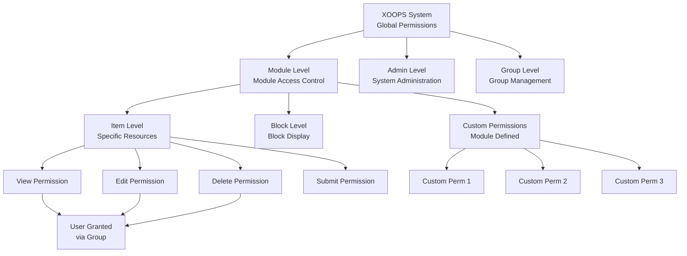
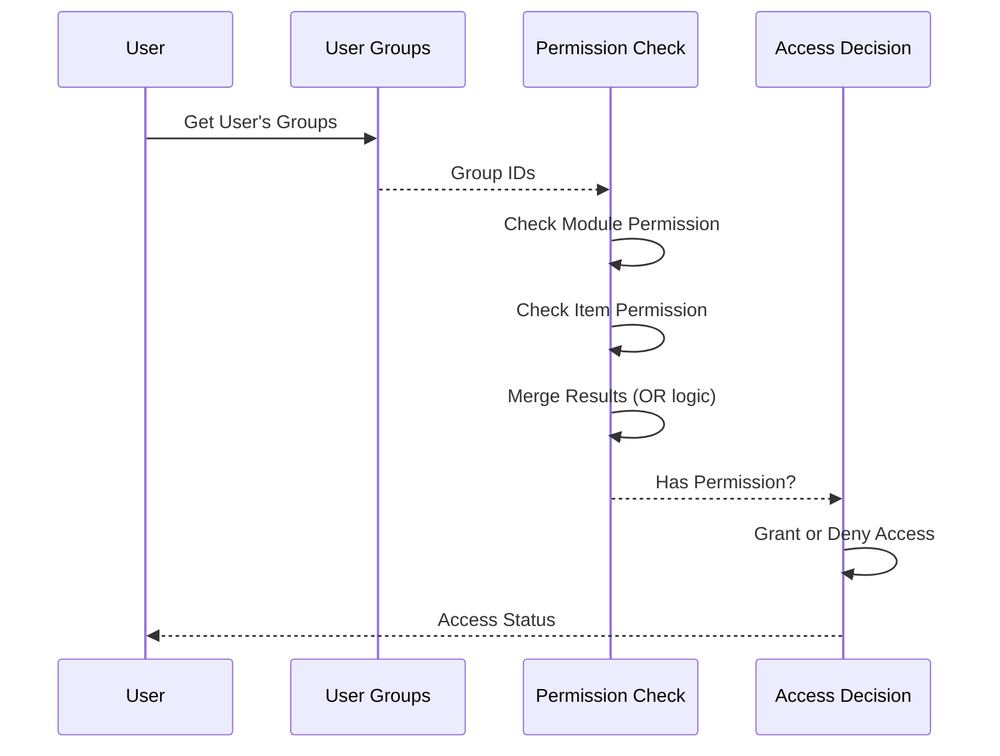

# Sistema di Autorizzazione in XOOPS

Il Sistema di Autorizzazione XOOPS è un framework di controllo di accesso granulare che gestisce chi può eseguire quali azioni su quali risorse. Questo documento copre i tipi di autorizzazione, i meccanismi di controllo, la gerarchia e gli esempi di implementazione.

## Tipi di Autorizzazione

### Autorizzazioni a Livello di Modulo

Le autorizzazioni a livello di modulo controllano l'accesso ai moduli interi o alle funzioni del modulo.

**Nomi di Autorizzazione Comuni:**
- `module_view` - Visualizza il contenuto del modulo
- `module_read` - Leggi le risorse del modulo
- `module_submit` - Invia il contenuto al modulo
- `module_edit` - Modifica il contenuto del modulo
- `module_admin` - Amministra il modulo

```php
<?php
/**
 * Esempio di autorizzazione del modulo
 */

$permissionHandler = xoops_getHandler('groupperm');
$userGroups = $xoopsUser->getGroups();
$moduleId = 2; // Modulo articoli

// Verifica se l'utente può visualizzare il modulo
$canView = false;
foreach ($userGroups as $groupId) {
    if ($permissionHandler->checkRight('module_view', $groupId, $moduleId)) {
        $canView = true;
        break;
    }
}

if (!$canView) {
    redirect('index.php?error=no_access');
}
```

### Autorizzazioni a Livello di Elemento

Le autorizzazioni a livello di elemento controllano l'accesso a risorse specifiche all'interno di un modulo.

**Esempi:**
- ID Articolo: Il gruppo può visualizzare/modificare articoli specifici?
- ID Categoria: Il gruppo può accedere alla categoria?
- ID Pagina: Il gruppo può visualizzare/modificare pagine specifiche?

```php
<?php
/**
 * Esempio di autorizzazione dell'elemento
 */

$permissionHandler = xoops_getHandler('groupperm');
$userGroups = $xoopsUser->getGroups();
$moduleId = 2;      // Modulo articoli
$articleId = 42;    // Articolo specifico

// Verifica se l'utente può modificare l'articolo specifico
$canEdit = false;
foreach ($userGroups as $groupId) {
    if ($permissionHandler->checkRight(
        'item_edit',
        $groupId,
        $moduleId,
        $articleId
    )) {
        $canEdit = true;
        break;
    }
}
```

### Autorizzazioni dei Blocchi

Le autorizzazioni dei blocchi controllano la visibilità e l'interazione con i blocchi visualizzati sulle pagine.

```php
<?php
/**
 * Esempio di autorizzazione del blocco
 */

$permissionHandler = xoops_getHandler('groupperm');
$userGroups = $xoopsUser->getGroups();

// Verifica se l'utente può visualizzare il blocco
$blockId = 5;
$canViewBlock = false;

foreach ($userGroups as $groupId) {
    if ($permissionHandler->checkRight('block_view', $groupId, 1, $blockId)) {
        $canViewBlock = true;
        break;
    }
}
```

### Autorizzazioni di Gruppo

Autorizzazioni che controllano la gestione e l'amministrazione del gruppo.

```php
<?php
/**
 * Esempio di autorizzazione di gestione del gruppo
 */

$permissionHandler = xoops_getHandler('groupperm');
$userGroups = $xoopsUser->getGroups();

// Verifica se l'utente può gestire i gruppi
$canManageGroups = false;
foreach ($userGroups as $groupId) {
    if ($permissionHandler->checkRight('group_admin', $groupId, 1)) {
        $canManageGroups = true;
        break;
    }
}
```

## Gerarchia di Autorizzazione

### Diagramma della Struttura di Autorizzazione



### Catena di Ereditarietà delle Autorizzazioni



## Controllo delle Autorizzazioni

### XoopsGroupPermHandler

La classe `XoopsGroupPermHandler` fornisce metodi per il controllo e la gestione delle autorizzazioni.

```php
<?php
/**
 * Metodi di XoopsGroupPermHandler
 */

class XoopsGroupPermHandler
{
    /**
     * Verifica se il gruppo ha l'autorizzazione
     *
     * @param string $gperm_name Nome dell'autorizzazione
     * @param int $gperm_group_id ID del gruppo
     * @param int $gperm_modid ID del modulo
     * @param int $gperm_itemid ID dell'elemento (opzionale)
     * @return bool Stato dell'autorizzazione
     */
    public function checkRight(
        $gperm_name,
        $gperm_group_id,
        $gperm_modid,
        $gperm_itemid = 0
    ) { }

    /**
     * Aggiungi autorizzazione al gruppo
     *
     * @param string $gperm_name Nome dell'autorizzazione
     * @param int $gperm_group_id ID del gruppo
     * @param int $gperm_modid ID del modulo
     * @param int $gperm_itemid ID dell'elemento (opzionale)
     * @return bool Stato di successo
     */
    public function addRight(
        $gperm_name,
        $gperm_group_id,
        $gperm_modid,
        $gperm_itemid = 0
    ) { }

    /**
     * Rimuovi autorizzazione dal gruppo
     *
     * @param string $gperm_name Nome dell'autorizzazione
     * @param int $gperm_group_id ID del gruppo
     * @param int $gperm_modid ID del modulo
     * @param int $gperm_itemid ID dell'elemento (opzionale)
     * @return bool Stato di successo
     */
    public function deleteRight(
        $gperm_name,
        $gperm_group_id,
        $gperm_modid,
        $gperm_itemid = 0
    ) { }

    /**
     * Ottieni tutte le autorizzazioni per il gruppo nel modulo
     *
     * @param int $groupId ID del gruppo
     * @param int $modId ID del modulo
     * @return array Elenco delle autorizzazioni
     */
    public function getGroupPermissions($groupId, $modId) { }

    /**
     * Ottieni gli ID degli elementi consentiti per il gruppo
     *
     * @param string $permName Nome dell'autorizzazione
     * @param int $groupId ID del gruppo
     * @param int $modId ID del modulo
     * @return array ID degli elementi
     */
    public function getPermittedItemIds(
        $permName,
        $groupId,
        $modId
    ) { }
}
```

## Implementazione del Controllo delle Autorizzazioni

### Controllo dell'Autorizzazione di un Singolo Utente

```php
<?php
/**
 * Utilità di controllo dell'autorizzazione
 */
class PermissionChecker
{
    private $permissionHandler;
    private $user;

    public function __construct(XoopsUser $user = null)
    {
        $this->permissionHandler = xoops_getHandler('groupperm');
        $this->user = $user ?? $GLOBALS['xoopsUser'] ?? null;
    }

    /**
     * Verifica se l'utente ha l'autorizzazione
     *
     * @param string $permissionName Nome dell'autorizzazione
     * @param int $moduleId ID del modulo
     * @param int $itemId ID dell'elemento (opzionale)
     * @return bool Stato dell'autorizzazione
     */
    public function hasPermission(
        string $permissionName,
        int $moduleId,
        int $itemId = 0
    ): bool
    {
        if (!$this->user instanceof XoopsUser) {
            return false;
        }

        $userGroups = $this->user->getGroups();

        foreach ($userGroups as $groupId) {
            if ($this->permissionHandler->checkRight(
                $permissionName,
                $groupId,
                $moduleId,
                $itemId
            )) {
                return true;
            }
        }

        return false;
    }

    /**
     * Richiedi autorizzazione o nega l'accesso
     *
     * @param string $permissionName Nome dell'autorizzazione
     * @param int $moduleId ID del modulo
     * @param int $itemId ID dell'elemento (opzionale)
     * @throws Exception Se l'autorizzazione è negata
     */
    public function requirePermission(
        string $permissionName,
        int $moduleId,
        int $itemId = 0
    ): void
    {
        if (!$this->hasPermission($permissionName, $moduleId, $itemId)) {
            throw new Exception('Permission denied');
        }
    }

    /**
     * Ottieni gli ID degli elementi consentiti
     *
     * @param string $permissionName Nome dell'autorizzazione
     * @param int $moduleId ID del modulo
     * @return array ID degli elementi a cui l'utente può accedere
     */
    public function getPermittedItems(
        string $permissionName,
        int $moduleId
    ): array
    {
        if (!$this->user instanceof XoopsUser) {
            return [];
        }

        $permitted = [];
        $userGroups = $this->user->getGroups();

        foreach ($userGroups as $groupId) {
            $items = $this->permissionHandler->getPermittedItemIds(
                $permissionName,
                $groupId,
                $moduleId
            );
            $permitted = array_merge($permitted, $items);
        }

        return array_unique($permitted);
    }

    /**
     * Verifica più autorizzazioni (logica AND)
     *
     * @param array $permissions Nomi delle autorizzazioni
     * @param int $moduleId ID del modulo
     * @param int $itemId ID dell'elemento (opzionale)
     * @return bool Tutte le autorizzazioni concesse
     */
    public function hasAllPermissions(
        array $permissions,
        int $moduleId,
        int $itemId = 0
    ): bool
    {
        foreach ($permissions as $perm) {
            if (!$this->hasPermission($perm, $moduleId, $itemId)) {
                return false;
            }
        }
        return true;
    }

    /**
     * Verifica più autorizzazioni (logica OR)
     *
     * @param array $permissions Nomi delle autorizzazioni
     * @param int $moduleId ID del modulo
     * @param int $itemId ID dell'elemento (opzionale)
     * @return bool Qualsiasi autorizzazione concessa
     */
    public function hasAnyPermission(
        array $permissions,
        int $moduleId,
        int $itemId = 0
    ): bool
    {
        foreach ($permissions as $perm) {
            if ($this->hasPermission($perm, $moduleId, $itemId)) {
                return true;
            }
        }
        return false;
    }
}
```

## Esempi di Implementazione Pratica

### Controllo di Accesso del Modulo

```php
<?php
/**
 * Esempio di controllo di accesso del modulo
 */

// Ottieni il modulo corrente
$moduleId = $GLOBALS['xoopsModule']->getVar('mid');
$moduleDir = $GLOBALS['xoopsModule']->getVar('dirname');

// Crea il verificatore di autorizzazione
$checker = new PermissionChecker();

// Verifica l'autorizzazione di visualizzazione del modulo
if (!$checker->hasPermission('module_view', $moduleId)) {
    redirect('index.php?error=access_denied');
}

// Ottieni gli elementi a cui l'utente può accedere
$permittedItems = $checker->getPermittedItems('item_view', $moduleId);

// Costruisci la query per mostrare solo gli elementi consentiti
$sql = 'SELECT * FROM articles WHERE id IN (' . implode(',', $permittedItems) . ')';
```

### Esempio di Gestione del Contenuto

```php
<?php
/**
 * Gestione di articoli con autorizzazioni
 */

class ArticleManager
{
    private $permissionChecker;
    private $moduleId = 2;

    public function __construct(PermissionChecker $checker)
    {
        $this->permissionChecker = $checker;
    }

    /**
     * Ottieni gli articoli che l'utente può visualizzare
     *
     * @return array Elenco di articoli
     */
    public function getViewableArticles(): array
    {
        $this->permissionChecker->requirePermission(
            'module_view',
            $this->moduleId
        );

        $permittedIds = $this->permissionChecker->getPermittedItems(
            'article_view',
            $this->moduleId
        );

        if (empty($permittedIds)) {
            return [];
        }

        $db = XoopsDatabaseFactory::getDatabaseConnection();
        $result = $db->query(
            'SELECT * FROM articles WHERE id IN (' .
            implode(',', $permittedIds) .
            ') AND published = 1'
        );

        $articles = [];
        while ($row = $db->fetchArray($result)) {
            $articles[] = $row;
        }

        return $articles;
    }

    /**
     * Crea articolo con controllo dell'autorizzazione
     *
     * @param array $data Dati dell'articolo
     * @return int ID dell'articolo
     */
    public function createArticle(array $data): int
    {
        $this->permissionChecker->requirePermission(
            'article_create',
            $this->moduleId
        );

        $db = XoopsDatabaseFactory::getDatabaseConnection();
        $db->query(
            'INSERT INTO articles (title, content, author_id, created) VALUES (?, ?, ?, ?)',
            array($data['title'], $data['content'], $_SESSION['xoopsUserId'], time())
        );

        return $db->getInsertId();
    }

    /**
     * Aggiorna l'articolo con controllo dell'autorizzazione
     *
     * @param int $articleId ID dell'articolo
     * @param array $data Dati di aggiornamento
     * @return bool Successo
     */
    public function updateArticle(int $articleId, array $data): bool
    {
        $this->permissionChecker->requirePermission(
            'article_edit',
            $this->moduleId,
            $articleId
        );

        $db = XoopsDatabaseFactory::getDatabaseConnection();
        return (bool)$db->query(
            'UPDATE articles SET title = ?, content = ? WHERE id = ?',
            array($data['title'], $data['content'], $articleId)
        );
    }

    /**
     * Elimina l'articolo con controllo dell'autorizzazione
     *
     * @param int $articleId ID dell'articolo
     * @return bool Successo
     */
    public function deleteArticle(int $articleId): bool
    {
        $this->permissionChecker->requirePermission(
            'article_delete',
            $this->moduleId,
            $articleId
        );

        $db = XoopsDatabaseFactory::getDatabaseConnection();
        return (bool)$db->query(
            'DELETE FROM articles WHERE id = ?',
            array($articleId)
        );
    }
}
```

## Best Practice di Sicurezza

### Regole di Assegnazione dell'Autorizzazione

1. **Principio del Minimo Privilegio**: Assegna solo le autorizzazioni necessarie
2. **Accesso Basato su Ruoli**: Usa i gruppi per le autorizzazioni basate su ruoli
3. **Audit Regolari**: Rivedi periodicamente le autorizzazioni
4. **Separazione dei Compiti**: Separa l'amministrazione dall'accesso utente
5. **Negazione Esplicita**: Approccio nega per impostazione predefinita, consenti esplicitamente

### Validazione dell'Autorizzazione

```php
<?php
/**
 * Best practice di validazione dell'autorizzazione
 */

// Verifica sempre l'autorizzazione prima dell'azione
$moduleId = 2;
$articleId = 42;

try {
    $checker = new PermissionChecker();

    // Controllo di autorizzazione esplicita
    if (!$checker->hasPermission('article_edit', $moduleId, $articleId)) {
        throw new Exception('Insufficient permissions');
    }

    // Esegui l'azione solo dopo la verifica dell'autorizzazione
    updateArticle($articleId);

} catch (Exception $e) {
    // Registra l'evento di sicurezza
    error_log('Permission denied: ' . $e->getMessage());
    // Mostra un errore amichevole per l'utente
    die('You do not have permission to perform this action');
}
```

## Link Correlati

- User Management.md
- Group System.md
- Authentication.md
- ../../Security/Security-Guidelines.md

## Tag

#permissions #access-control #security #authorization #acl #permission-checking
