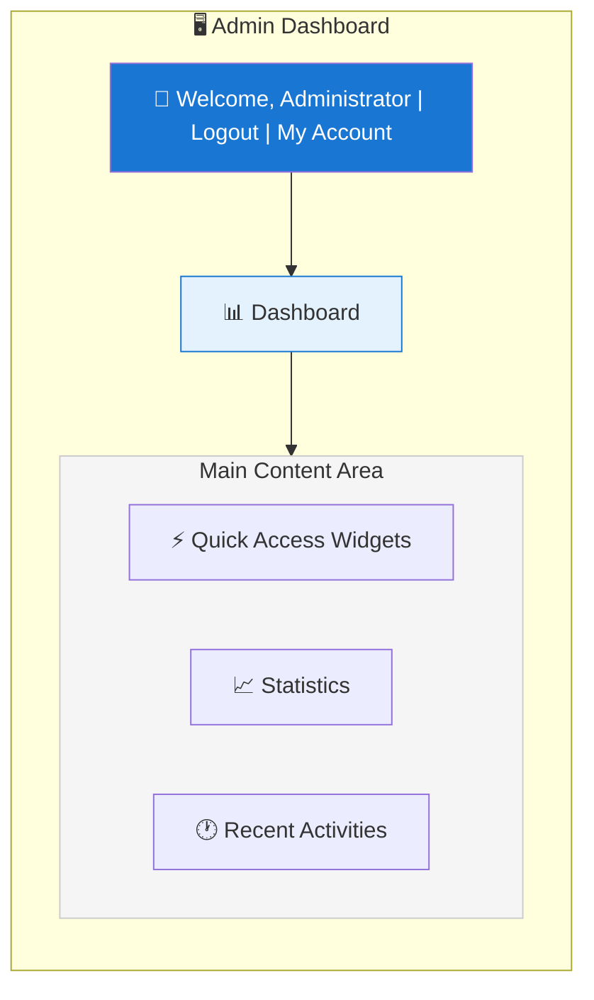
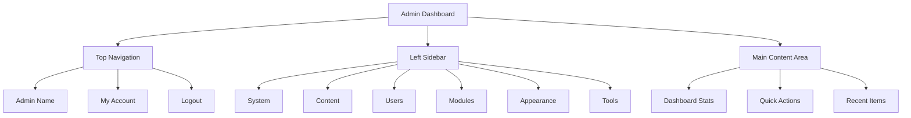

# Panoramica del Pannello Admin XOOPS

Guida completa per navigare e utilizzare la dashboard dell'amministratore XOOPS.

## Accesso al Pannello Admin

### Login Amministratore

Apri il tuo browser e naviga verso:

```
http://your-domain.com/xoops/admin/
```

O se XOOPS è nella root:

```
http://your-domain.com/admin/
```

Inserisci le tue credenziali di amministratore:

```
Username: [Your admin username]
Password: [Your admin password]
```

### Dopo il Login

Vedrai la dashboard amministrativa principale:



## Layout del Pannello Admin



## Componenti della Dashboard

### Barra Superiore

La barra superiore contiene i controlli essenziali:

| Elemento | Scopo |
|---|---|
| **Logo Admin** | Clicca per tornare alla dashboard |
| **Messaggio di Benvenuto** | Mostra il nome dell'admin connesso |
| **Il Mio Account** | Modifica il profilo e la password dell'admin |
| **Aiuto** | Accedi alla documentazione |
| **Logout** | Esci dal pannello admin |

### Barra di Navigazione Sinistra

Menu principale organizzato per funzione:

```
├── System
│   ├── Dashboard
│   ├── Preferences
│   ├── Admin Users
│   ├── Groups
│   ├── Permissions
│   ├── Modules
│   └── Tools
├── Content
│   ├── Pages
│   ├── Categories
│   ├── Comments
│   └── Media Manager
├── Users
│   ├── Users
│   ├── User Requests
│   ├── Online Users
│   └── User Groups
├── Modules
│   ├── Modules
│   ├── Module Settings
│   └── Module Updates
├── Appearance
│   ├── Themes
│   ├── Templates
│   ├── Blocks
│   └── Images
└── Tools
    ├── Maintenance
    ├── Email
    ├── Statistics
    ├── Logs
    └── Backups
```

### Area Contenuto Principale

Mostra informazioni e controlli per la sezione selezionata:

- Moduli per la configurazione
- Tabelle dati con elenchi
- Grafici e statistiche
- Pulsanti di azione rapida
- Testo di aiuto e tooltip

### Widget Dashboard

Accesso rapido alle informazioni chiave:

- **Informazioni di Sistema:** Versione PHP, versione MySQL, versione XOOPS
- **Statistiche Rapide:** Conteggio utenti, post totali, moduli installati
- **Attività Recente:** Ultimi login, cambiamenti di contenuto, errori
- **Stato Server:** CPU, memoria, utilizzo disco
- **Notifiche:** Avvisi di sistema, aggiornamenti in sospeso

## Funzioni Admin Principali

### Gestione del Sistema

**Posizione:** System > [Varie Opzioni]

#### Preferences

Configura le impostazioni di base del sistema:

```
System > Preferences > [Settings Category]
```

Categorie:
- Impostazioni Generali (nome sito, fuso orario)
- Impostazioni Utente (registrazione, profili)
- Impostazioni Email (configurazione SMTP)
- Impostazioni Cache (opzioni di caching)
- Impostazioni URL (URL amichevoli)
- Meta Tag (impostazioni SEO)

Vedi Configurazione di Base e Impostazioni di Sistema.

#### Admin Users

Gestisci account amministratore:

```
System > Admin Users
```

Funzioni:
- Aggiungi nuovi amministratori
- Modifica profili admin
- Cambia password admin
- Elimina account admin
- Imposta permessi admin

### Gestione Contenuto

**Posizione:** Content > [Varie Opzioni]

#### Pagine/Articoli

Gestisci il contenuto del sito:

```
Content > Pages (or your module)
```

Funzioni:
- Crea nuove pagine
- Modifica contenuto esistente
- Elimina pagine
- Pubblica/annulla pubblicazione
- Imposta categorie
- Gestisci revisioni

#### Categorie

Organizza il contenuto:

```
Content > Categories
```

Funzioni:
- Crea gerarchia categorie
- Modifica categorie
- Elimina categorie
- Assegna a pagine

#### Commenti

Modera i commenti degli utenti:

```
Content > Comments
```

Funzioni:
- Visualizza tutti i commenti
- Approva commenti
- Modifica commenti
- Elimina spam
- Blocca commentatori

### Gestione Utenti

**Posizione:** Users > [Varie Opzioni]

#### Utenti

Gestisci gli account utente:

```
Users > Users
```

Funzioni:
- Visualizza tutti gli utenti
- Crea nuovi utenti
- Modifica profili utente
- Elimina account
- Reimposta password
- Cambia stato utente
- Assegna a gruppi

#### Utenti Online

Monitora gli utenti attivi:

```
Users > Online Users
```

Mostra:
- Utenti attualmente online
- Ora dell'ultima attività
- Indirizzo IP
- Ubicazione utente (se configurata)

#### Gruppi Utenti

Gestisci ruoli utente e permessi:

```
Users > Groups
```

Funzioni:
- Crea gruppi personalizzati
- Imposta permessi gruppo
- Assegna utenti a gruppi
- Elimina gruppi

### Gestione Moduli

**Posizione:** Modules > [Varie Opzioni]

#### Moduli

Installa e configura moduli:

```
Modules > Modules
```

Funzioni:
- Visualizza moduli installati
- Abilita/disabilita moduli
- Aggiorna moduli
- Configura impostazioni modulo
- Installa nuovi moduli
- Visualizza dettagli modulo

#### Verifica Aggiornamenti

```
Modules > Modules > Check for Updates
```

Mostra:
- Aggiornamenti modulo disponibili
- Changelog
- Opzioni di download e installazione

### Gestione Apparenza

**Posizione:** Appearance > [Varie Opzioni]

#### Temi

Gestisci i temi del sito:

```
Appearance > Themes
```

Funzioni:
- Visualizza temi installati
- Imposta tema predefinito
- Carica nuovi temi
- Elimina temi
- Anteprima tema
- Configurazione tema

#### Blocchi

Gestisci blocchi di contenuto:

```
Appearance > Blocks
```

Funzioni:
- Crea blocchi personalizzati
- Modifica contenuto blocco
- Disponi blocchi sulla pagina
- Imposta visibilità blocco
- Elimina blocchi
- Configura caching blocco

#### Template

Gestisci template (avanzato):

```
Appearance > Templates
```

Per utenti avanzati e sviluppatori.

### Strumenti di Sistema

**Posizione:** System > Tools

#### Modalità Manutenzione

Impedisci l'accesso degli utenti durante la manutenzione:

```
System > Maintenance Mode
```

Configura:
- Abilita/disabilita manutenzione
- Messaggio di manutenzione personalizzato
- Indirizzi IP consentiti (per test)

#### Gestione Database

```
System > Database
```

Funzioni:
- Verifica coerenza database
- Esegui aggiornamenti database
- Ripara tabelle
- Ottimizza database
- Esporta struttura database

#### Log Attività

```
System > Logs
```

Monitora:
- Attività utenti
- Azioni amministrative
- Eventi di sistema
- Log errori

## Azioni Rapide

Compiti comuni accessibili dalla dashboard:

```
Quick Links:
├── Create New Page
├── Add New User
├── Create Content Block
├── Upload Image
├── Send Mass Email
├── Update All Modules
└── Clear Cache
```

## Scorciatoie da Tastiera Pannello Admin

Navigazione rapida:

| Scorciatoia | Azione |
|---|---|
| `Ctrl+H` | Vai a aiuto |
| `Ctrl+D` | Vai a dashboard |
| `Ctrl+Q` | Ricerca rapida |
| `Ctrl+L` | Logout |

## Gestione Account Utente

### Il Mio Account

Accedi al tuo profilo amministratore:

1. Clicca "My Account" in alto a destra
2. Modifica informazioni profilo:
   - Indirizzo email
   - Nome reale
   - Informazioni utente
   - Avatar

### Cambia Password

Cambia la tua password admin:

1. Vai a **My Account**
2. Clicca "Change Password"
3. Inserisci password corrente
4. Inserisci nuova password (due volte)
5. Clicca "Save"

**Suggerimenti di Sicurezza:**
- Usa password forti (16+ caratteri)
- Includi maiuscole, minuscole, numeri, simboli
- Cambia password ogni 90 giorni
- Non condividere mai credenziali admin

### Logout

Esci dal pannello admin:

1. Clicca "Logout" in alto a destra
2. Verrai reindirizzato alla pagina di login

## Statistiche Pannello Admin

### Statistiche Dashboard

Panoramica rapida delle metriche del sito:

| Metrica | Valore |
|--------|-------|
| Utenti Online | 12 |
| Utenti Totali | 256 |
| Post Totali | 1.234 |
| Commenti Totali | 5.678 |
| Moduli Totali | 8 |

### Stato di Sistema

Informazioni su server e prestazioni:

| Componente | Versione/Valore |
|-----------|---------------|
| Versione XOOPS | 2.5.11 |
| Versione PHP | 8.2.x |
| Versione MySQL | 8.0.x |
| Carico Server | 0.45, 0.42 |
| Uptime | 45 giorni |

### Attività Recente

Sequenza temporale degli eventi recenti:

```
12:45 - Admin login
12:30 - New user registered
12:15 - Page published
12:00 - Comment posted
11:45 - Module updated
```

## Sistema di Notificazione

### Avvisi Admin

Ricevi notifiche per:

- Nuove registrazioni utenti
- Commenti in attesa di moderazione
- Tentativi di login falliti
- Errori di sistema
- Aggiornamenti moduli disponibili
- Problemi database
- Avvisi di spazio disco

Configura avvisi:

**System > Preferences > Email Settings**

```
Notify Admin on Registration: Yes
Notify Admin on Comments: Yes
Notify Admin on Errors: Yes
Alert Email: admin@your-domain.com
```

## Compiti Admin Comuni

### Crea una Nuova Pagina

1. Vai a **Content > Pages** (o modulo rilevante)
2. Clicca "Add New Page"
3. Compila:
   - Titolo
   - Contenuto
   - Descrizione
   - Categoria
   - Metadati
4. Clicca "Publish"

### Gestisci Utenti

1. Vai a **Users > Users**
2. Visualizza elenco utenti con:
   - Username
   - Email
   - Data registrazione
   - Ultimo login
   - Stato

3. Clicca su username per:
   - Modifica profilo
   - Cambia password
   - Modifica gruppi
   - Blocca/sblocca utente

### Configura Modulo

1. Vai a **Modules > Modules**
2. Trova modulo in elenco
3. Clicca sul nome del modulo
4. Clicca "Preferences" o "Settings"
5. Configura opzioni modulo
6. Salva modifiche

### Crea un Nuovo Blocco

1. Vai a **Appearance > Blocks**
2. Clicca "Add New Block"
3. Inserisci:
   - Titolo blocco
   - Contenuto blocco (HTML consentito)
   - Posizione sulla pagina
   - Visibilità (tutte le pagine o specifica)
   - Modulo (se applicabile)
4. Clicca "Submit"

## Aiuto Pannello Admin

### Documentazione Integrata

Accedi alla guida dal pannello admin:

1. Clicca pulsante "Help" nella barra superiore
2. Aiuto sensibile al contesto per la pagina corrente
3. Link a documentazione
4. Domande frequenti

### Risorse Esterne

- Sito Ufficiale XOOPS: https://xoops.org/
- Forum Comunità: https://xoops.org/modules/newbb/
- Repository Moduli: https://xoops.org/modules/repository/
- Bug/Problemi: https://github.com/XOOPS/XoopsCore/issues

## Personalizzazione Pannello Admin

### Tema Admin

Scegli il tema dell'interfaccia admin:

**System > Preferences > General Settings**

```
Admin Theme: [Select theme]
```

Temi disponibili:
- Predefinito (chiaro)
- Modalità scura
- Temi personalizzati

### Personalizzazione Dashboard

Scegli quali widget appaiono:

**Dashboard > Customize**

Seleziona:
- Informazioni di sistema
- Statistiche
- Attività recente
- Link rapidi
- Widget personalizzati

## Permessi Pannello Admin

Diversi livelli admin hanno permessi diversi:

| Ruolo | Capacità |
|---|---|
| **Webmaster** | Accesso completo a tutte le funzioni admin |
| **Admin** | Funzioni admin limitate |
| **Moderatore** | Solo moderazione contenuto |
| **Editor** | Creazione e modifica contenuto |

Gestisci permessi:

**System > Permissions**

## Migliori Pratiche di Sicurezza per Pannello Admin

1. **Password Forte:** Usa password di 16+ caratteri
2. **Cambi Regolari:** Cambia password ogni 90 giorni
3. **Monitora Accesso:** Controlla i log "Admin Users" regolarmente
4. **Limita Accesso:** Rinomina cartella admin per sicurezza aggiuntiva
5. **Usa HTTPS:** Accedi sempre ad admin via HTTPS
6. **Whitelist IP:** Limita accesso admin a IP specifici
7. **Logout Regolare:** Esci al termine
8. **Sicurezza Browser:** Svuota cache browser regolarmente

Vedi Configurazione Sicurezza.

## Risoluzione Problemi Pannello Admin

### Impossibile Accedere al Pannello Admin

**Soluzione:**
1. Verifica credenziali di login
2. Svuota cache e cookie del browser
3. Prova browser diverso
4. Verifica che il percorso della cartella admin sia corretto
5. Verifica i permessi dei file nella cartella admin
6. Verifica la connessione al database in mainfile.php

### Pagina Admin Vuota

**Soluzione:**
```bash
# Controlla errori PHP
tail -f /var/log/apache2/error.log

# Abilita modalità debug temporaneamente
sed -i "s/define('XOOPS_DEBUG', 0)/define('XOOPS_DEBUG', 1)/" /var/www/html/xoops/mainfile.php

# Verifica permessi file
ls -la /var/www/html/xoops/admin/
```

### Pannello Admin Lento

**Soluzione:**
1. Svuota cache: **System > Tools > Clear Cache**
2. Ottimizza database: **System > Database > Optimize**
3. Controlla risorse server: `htop`
4. Revisione query lente in MySQL

### Modulo Non Appare

**Soluzione:**
1. Verifica modulo installato: **Modules > Modules**
2. Verifica modulo abilitato
3. Verifica permessi assegnati
4. Verifica file modulo esistono
5. Revisione log errori

## Prossimi Passi

Dopo aver familiarizzato con il pannello admin:

1. Crea la tua prima pagina
2. Configura gruppi utenti
3. Installa moduli aggiuntivi
4. Configura impostazioni di base
5. Implementa sicurezza

---

**Tag:** #admin-panel #dashboard #navigation #getting-started

**Articoli Correlati:**
- ../Configuration/Basic-Configuration
- ../Configuration/System-Settings
- Creating-Your-First-Page
- Managing-Users
- Installing-Modules
