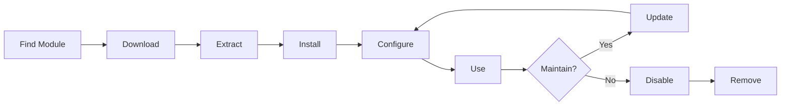

# Installazione e Gestione dei Moduli XOOPS

Impara come estendere la funzionalità di XOOPS installando e configurando moduli.

## Comprensione dei Moduli XOOPS

### Cosa Sono i Moduli?

I moduli sono estensioni che aggiungono funzionalità a XOOPS:

| Tipo | Scopo | Esempi |
|---|---|---|
| **Content** | Gestisci tipi di contenuto specifici | News, Blog, Ticket |
| **Community** | Interazione utenti | Forum, Commenti, Recensioni |
| **eCommerce** | Vendita prodotti | Shop, Carrello, Pagamenti |
| **Media** | Gestisci file/immagini | Galleria, Download, Video |
| **Utility** | Strumenti e helper | Email, Backup, Analytics |

### Moduli Core vs. Opzionali

| Modulo | Tipo | Incluso | Rimovibile |
|---|---|---|---|
| **System** | Core | Sì | No |
| **User** | Core | Sì | No |
| **Profile** | Consigliato | Sì | Sì |
| **PM (Private Message)** | Consigliato | Sì | Sì |
| **WF-Channel** | Opzionale | Spesso | Sì |
| **News** | Opzionale | No | Sì |
| **Forum** | Opzionale | No | Sì |

## Ciclo di Vita dei Moduli



## Reperimento Moduli

### Repository Moduli XOOPS

Repository ufficiale dei moduli XOOPS:

**Visita:** https://xoops.org/modules/repository/

```
Directory > Modules > [Browse Categories]
```

Sfoglia per categoria:
- Content Management
- Community
- eCommerce
- Multimedia
- Development
- Site Administration

### Valutazione dei Moduli

Prima dell'installazione, controlla:

| Criteri | Cosa Cercare |
|---|---|
| **Compatibilità** | Funziona con la tua versione XOOPS |
| **Valutazione** | Buone recensioni e valutazioni degli utenti |
| **Aggiornamenti** | Mantenuto di recente |
| **Download** | Popolare e ampiamente utilizzato |
| **Requisiti** | Compatibile con il tuo server |
| **Licenza** | GPL o simile open source |
| **Supporto** | Sviluppatore e comunità attivi |

### Leggi Informazioni Modulo

Ogni elenco di moduli mostra:

```
Module Name: [Name]
Version: [X.X.X]
Requires: XOOPS [Version]
Author: [Name]
Last Update: [Date]
Downloads: [Number]
Rating: [Stars]
Description: [Brief description]
Compatibility: PHP [Version], MySQL [Version]
```

## Installazione dei Moduli

### Metodo 1: Installazione dal Pannello Admin

**Passo 1: Accedi alla Sezione Moduli**

1. Accedi al pannello admin
2. Naviga verso **Modules > Modules**
3. Clicca **"Install New Module"** o **"Browse Modules"**

**Passo 2: Carica Modulo**

Opzione A - Caricamento Diretto:
1. Clicca **"Choose File"**
2. Seleziona il file .zip del modulo dal tuo computer
3. Clicca **"Upload"**

Opzione B - Caricamento da URL:
1. Incolla l'URL del modulo
2. Clicca **"Download and Install"**

**Passo 3: Revisione Informazioni Modulo**

```
Module Name: [Name shown]
Version: [Version]
Author: [Author info]
Description: [Full description]
Requirements: [PHP/MySQL versions]
```

Revisiona e clicca **"Proceed with Installation"**

**Passo 4: Scegli Tipo di Installazione**

```
☐ Fresh Install (New installation)
☐ Update (Upgrade existing)
☐ Delete Then Install (Replace existing)
```

Seleziona l'opzione appropriata.

**Passo 5: Conferma Installazione**

Revisiona la conferma finale:
```
Module will be installed to: /modules/modulename/
Database: xoops_db
Proceed? [Yes] [No]
```

Clicca **"Yes"** per confermare.

**Passo 6: Installazione Completata**

```
Installation successful!

Module: [Module Name]
Version: [Version]
Tables created: [Number]
Files installed: [Number]

[Go to Module Settings]  [Return to Modules]
```

### Metodo 2: Installazione Manuale (Avanzato)

Per l'installazione manuale o la risoluzione dei problemi:

**Passo 1: Scarica Modulo**

1. Scarica il modulo .zip dal repository
2. Estrai in `/var/www/html/xoops/modules/modulename/`

```bash
# Extract module
unzip module_name.zip
cp -r module_name /var/www/html/xoops/modules/

# Set permissions
chmod -R 755 /var/www/html/xoops/modules/module_name
```

**Passo 2: Esegui Script di Installazione**

```
Visit: http://your-domain.com/xoops/modules/module_name/admin/index.php?op=install
```

O tramite il pannello admin (System > Modules > Update DB).

**Passo 3: Verifica Installazione**

1. Vai a **Modules > Modules** in admin
2. Cerca il tuo modulo nell'elenco
3. Verifica che mostri come "Active"

## Configurazione del Modulo

### Accedi Impostazioni Modulo

1. Vai a **Modules > Modules**
2. Trova il tuo modulo
3. Clicca sul nome del modulo
4. Clicca **"Preferences"** o **"Settings"**

### Impostazioni Modulo Comuni

La maggior parte dei moduli offre:

```
Module Status: [Enabled/Disabled]
Display in Menu: [Yes/No]
Module Weight: [1-999] (display order)
Visible To Groups: [Checkboxes for user groups]
```

### Opzioni Specifiche del Modulo

Ogni modulo ha impostazioni uniche. Esempi:

**News Module:**
```
Items Per Page: 10
Show Author: Yes
Allow Comments: Yes
Moderation Required: Yes
```

**Forum Module:**
```
Topics Per Page: 20
Posts Per Page: 15
Maximum Attachment Size: 5MB
Enable Signatures: Yes
```

**Gallery Module:**
```
Images Per Page: 12
Thumbnail Size: 150x150
Maximum Upload: 10MB
Watermark: Yes/No
```

Rivedi la documentazione del tuo modulo per le opzioni specifiche.

### Salva Configurazione

Dopo aver regolato le impostazioni:

1. Clicca **"Submit"** o **"Save"**
2. Vedrai la conferma:
   ```
   Settings saved successfully!
   ```

## Gestione dei Blocchi del Modulo

Molti moduli creano "blocchi" - aree di contenuto simili a widget.

### Visualizza Blocchi Modulo

1. Vai a **Appearance > Blocks**
2. Cerca blocchi dal tuo modulo
3. La maggior parte dei moduli mostra "[Module Name] - [Block Description]"

### Configura Blocchi

1. Clicca sul nome del blocco
2. Regola:
   - Titolo blocco
   - Visibilità (tutte le pagine o specifica)
   - Posizione sulla pagina (sinistra, centro, destra)
   - Gruppi utenti che possono vedere
3. Clicca **"Submit"**

### Visualizza Blocco sulla Homepage

1. Vai a **Appearance > Blocks**
2. Trova il blocco che desideri
3. Clicca **"Edit"**
4. Imposta:
   - **Visible to:** Seleziona gruppi
   - **Position:** Scegli colonna (sinistra/centro/destra)
   - **Pages:** Homepage o tutte le pagine
5. Clicca **"Submit"**

## Installazione di Moduli Specifici Esempi

### Installazione Modulo News

**Perfetto per:** Post di blog, annunci

1. Scarica il modulo News dal repository
2. Carica tramite **Modules > Modules > Install**
3. Configura in **Modules > News > Preferences**:
   - Stories per page: 10
   - Allow comments: Yes
   - Approve before publishing: Yes
4. Crea blocchi per le ultime notizie
5. Inizia a pubblicare storie!

### Installazione Modulo Forum

**Perfetto per:** Discussione della comunità

1. Scarica il modulo Forum
2. Installa tramite il pannello admin
3. Crea categorie forum nel modulo
4. Configura impostazioni:
   - Topics/page: 20
   - Posts/page: 15
   - Enable moderation: Yes
5. Assegna permessi dei gruppi utenti
6. Crea blocchi per i topic più recenti

### Installazione Modulo Galleria

**Perfetto per:** Showcase di immagini

1. Scarica il modulo Galleria
2. Installa e configura
3. Crea album fotografici
4. Carica immagini
5. Imposta i permessi per la visualizzazione/caricamento
6. Visualizza la galleria sul sito web

## Aggiornamento dei Moduli

### Verifica Aggiornamenti

```
Admin Panel > Modules > Modules > Check for Updates
```

Mostra:
- Aggiornamenti modulo disponibili
- Versione corrente vs. nuova
- Changelog/note di rilascio

### Aggiorna un Modulo

1. Vai a **Modules > Modules**
2. Clicca il modulo con aggiornamento disponibile
3. Clicca il pulsante **"Update"**
4. Seleziona **"Update"** da Tipo di Installazione
5. Segui la procedura guidata di installazione
6. Modulo aggiornato!

### Note Importanti su Aggiornamenti

Prima dell'aggiornamento:

- [ ] Backup del database
- [ ] Backup dei file modulo
- [ ] Revisione changelog
- [ ] Test su server di staging prima
- [ ] Nota eventuali modifiche personalizzate

Dopo l'aggiornamento:
- [ ] Verifica funzionalità
- [ ] Controlla impostazioni del modulo
- [ ] Controlla avvisi/errori
- [ ] Svuota cache

## Permessi Modulo

### Assegna Accesso Gruppo Utenti

Controlla quali gruppi di utenti possono accedere ai moduli:

**Posizione:** System > Permissions

Per ogni modulo, configura:

```
Module: [Module Name]

Admin Access: [Select groups]
User Access: [Select groups]
Read Permission: [Groups allowed to view]
Write Permission: [Groups allowed to post]
Delete Permission: [Administrators only]
```

### Livelli di Permessi Comuni

```
Public Content (News, Pages):
├── Admin Access: Webmaster
├── User Access: All logged-in users
└── Read Permission: Everyone

Community Features (Forum, Comments):
├── Admin Access: Webmaster, Moderators
├── User Access: All logged-in users
└── Write Permission: All logged-in users

Admin Tools:
├── Admin Access: Webmaster only
└── User Access: Disabled
```

## Disabilitazione e Rimozione di Moduli

### Disabilita Modulo (Mantieni File)

Mantieni il modulo ma nascondilo dal sito:

1. Vai a **Modules > Modules**
2. Trova il modulo
3. Clicca sul nome del modulo
4. Clicca **"Disable"** o imposta lo stato su Inattivo
5. Modulo nascosto ma dati preservati

Riabilita in qualsiasi momento:
1. Clicca il modulo
2. Clicca **"Enable"**

### Rimuovi Modulo Completamente

Elimina il modulo e i suoi dati:

1. Vai a **Modules > Modules**
2. Trova il modulo
3. Clicca **"Uninstall"** o **"Delete"**
4. Conferma: "Delete module and all data?"
5. Clicca **"Yes"** per confermare

**Avviso:** La disinstallazione elimina tutti i dati del modulo!

### Reinstallazione Dopo Disinstallazione

Se disinstalli un modulo:
- File modulo eliminati
- Tabelle database eliminate
- Tutti i dati persi
- Deve essere reinstallato per usare di nuovo
- Può essere ripristinato da backup

## Risoluzione Problemi Installazione Modulo

### Modulo Non Appare Dopo Installazione

**Sintomo:** Modulo elencato ma non visibile sul sito

**Soluzione:**
```
1. Controlla che il modulo sia "Active" (Modules > Modules)
2. Abilita blocchi modulo (Appearance > Blocks)
3. Verifica permessi utenti (System > Permissions)
4. Svuota cache (System > Tools > Clear Cache)
5. Controlla che .htaccess non blocchi il modulo
```

### Errore Installazione: "Table Already Exists"

**Sintomo:** Errore durante l'installazione del modulo

**Soluzione:**
```
1. Modulo parzialmente installato prima
2. Prova l'opzione "Delete then Install"
3. O disinstalla prima, poi installa da zero
4. Controlla il database per tabelle esistenti:
   mysql> SHOW TABLES LIKE 'xoops_module%';
```

### Modulo Manca Dipendenze

**Sintomo:** Il modulo non si installa - richiede un altro modulo

**Soluzione:**
```
1. Nota i moduli richiesti dal messaggio di errore
2. Installa i moduli richiesti prima
3. Poi installa il modulo
4. Installa nell'ordine corretto
```

### Pagina Vuota Quando Accedi a Modulo

**Sintomo:** Il modulo si carica ma non mostra nulla

**Soluzione:**
```
1. Abilita modalità debug in mainfile.php:
   define('XOOPS_DEBUG', 1);

2. Controlla il log errori PHP:
   tail -f /var/log/php_errors.log

3. Verifica i permessi dei file:
   chmod -R 755 /var/www/html/xoops/modules/modulename

4. Controlla la connessione al database nella configurazione del modulo

5. Disabilita il modulo e reinstalla
```

### Modulo Interrompe Sito

**Sintomo:** L'installazione del modulo interrompe il sito web

**Soluzione:**
```
1. Disabilita immediatamente il modulo problematico:
   Admin > Modules > [Module] > Disable

2. Svuota cache:
   rm -rf /var/www/html/xoops/cache/*
   rm -rf /var/www/html/xoops/templates_c/*

3. Ripristina da backup se necessario

4. Controlla i log errori per la causa principale

5. Contatta lo sviluppatore del modulo
```

## Considerazioni di Sicurezza del Modulo

### Installa Solo da Fonti Affidabili

```
✓ Official XOOPS Repository
✓ GitHub official XOOPS modules
✓ Trusted module developers
✗ Unknown websites
✗ Unverified sources
```

### Controlla Permessi Modulo

Dopo l'installazione:

1. Revisiona il codice del modulo per attività sospetta
2. Controlla le tabelle del database per anomalie
3. Monitora i cambiamenti dei file
4. Mantieni i moduli aggiornati
5. Rimuovi i moduli non utilizzati

### Migliore Pratica per Permessi

```
Module directory: 755 (readable, not writable by web server)
Module files: 644 (readable only)
Module data: Protected by database
```

## Risorse di Sviluppo Moduli

### Impara lo Sviluppo Moduli

- Documentazione Ufficiale: https://xoops.org/
- Repository GitHub: https://github.com/XOOPS/
- Forum Comunità: https://xoops.org/modules/newbb/
- Guida per Sviluppatori: Disponibile nella cartella docs

## Migliori Pratiche per Moduli

1. **Installa Uno per Volta:** Monitora i conflitti
2. **Test Dopo Installazione:** Verifica la funzionalità
3. **Documenta Configurazione Personalizzata:** Nota le tue impostazioni
4. **Mantieni Aggiornato:** Installa gli aggiornamenti dei moduli prontamente
5. **Rimuovi Non Utilizzati:** Elimina i moduli non necessari
6. **Backup Prima:** Esegui sempre il backup prima dell'installazione
7. **Leggi Documentazione:** Controlla le istruzioni del modulo
8. **Unisciti alla Comunità:** Chiedi aiuto se necessario

## Lista di Controllo Installazione Modulo

Per ogni installazione di modulo:

- [ ] Ricerca e leggi le recensioni
- [ ] Verifica la compatibilità della versione XOOPS
- [ ] Backup del database e dei file
- [ ] Scarica la versione più recente
- [ ] Installa tramite il pannello admin
- [ ] Configura impostazioni
- [ ] Crea/posiziona blocchi
- [ ] Imposta i permessi utente
- [ ] Test funzionalità
- [ ] Documenta la configurazione
- [ ] Pianifica per aggiornamenti

## Prossimi Passi

Dopo l'installazione dei moduli:

1. Crea contenuto per i moduli
2. Configura gruppi utenti
3. Esplora le funzioni admin
4. Ottimizza le prestazioni
5. Installa moduli aggiuntivi secondo le esigenze

---

**Tag:** #modules #installation #extension #management

**Articoli Correlati:**
- Admin-Panel-Overview
- Managing-Users
- Creating-Your-First-Page
- ../Configuration/System-Settings
