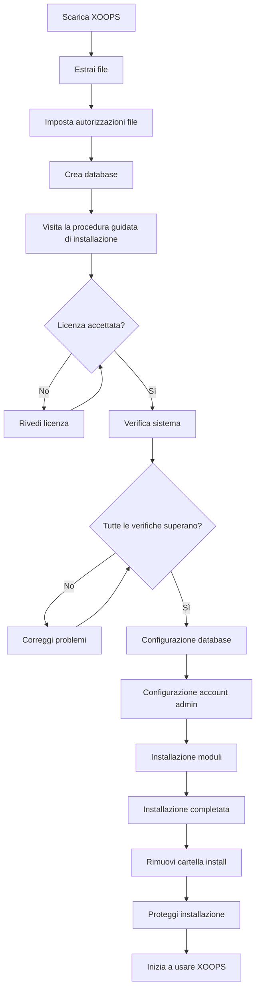

# Guida completa all'installazione di XOOPS

Questa guida fornisce una descrizione completa dell'installazione di XOOPS da zero utilizzando la procedura guidata di installazione.

## Prerequisiti

Prima di avviare l'installazione, assicurati di avere:

- Accesso al tuo server web tramite FTP o SSH
- Accesso amministratore al tuo server di database
- Un nome di dominio registrato
- Requisiti del server verificati
- Strumenti di backup disponibili

## Processo di installazione



## Installazione passo-dopo-passo

### Passaggio 1: Scarica XOOPS

Scarica l'ultima versione da [https://xoops.org/](https://xoops.org/):

```bash
# Usando wget
wget https://xoops.org/download/xoops-2.5.8.zip

# Usando curl
curl -O https://xoops.org/download/xoops-2.5.8.zip
```

### Passaggio 2: Estrai file

Estrai l'archivio XOOPS nella tua radice web:

```bash
# Naviga verso la radice web
cd /var/www/html

# Estrai XOOPS
unzip xoops-2.5.8.zip

# Rinomina cartella (opzionale, ma consigliato)
mv xoops-2.5.8 xoops
cd xoops
```

### Passaggio 3: Imposta autorizzazioni file

Imposta le autorizzazioni appropriate per le directory XOOPS:

```bash
# Rendi le directory scrivibili (755 per directory, 644 per file)
find . -type d -exec chmod 755 {} \;
find . -type f -exec chmod 644 {} \;

# Rendi le directory specifiche scrivibili dal server web
chmod 777 uploads/
chmod 777 templates_c/
chmod 777 var/
chmod 777 cache/

# Proteggi mainfile.php dopo l'installazione
chmod 644 mainfile.php
```

### Passaggio 4: Crea database

Crea un nuovo database per XOOPS usando MySQL:

```sql
-- Crea database
CREATE DATABASE xoops_db CHARACTER SET utf8mb4 COLLATE utf8mb4_unicode_ci;

-- Crea utente
CREATE USER 'xoops_user'@'localhost' IDENTIFIED BY 'secure_password_here';

-- Concedi privilegi
GRANT ALL PRIVILEGES ON xoops_db.* TO 'xoops_user'@'localhost';
FLUSH PRIVILEGES;
```

Oppure usando phpMyAdmin:

1. Accedi a phpMyAdmin
2. Fai clic sulla scheda "Database"
3. Inserisci nome database: `xoops_db`
4. Seleziona collation "utf8mb4_unicode_ci"
5. Fai clic su "Crea"
6. Crea un utente con lo stesso nome del database
7. Concedi tutti i privilegi

### Passaggio 5: Esegui la procedura guidata di installazione

Apri il tuo browser e naviga verso:

```
http://your-domain.com/xoops/install/
```

#### Fase di verifica del sistema

La procedura guidata verifica la configurazione del tuo server:

- Versione PHP >= 5.6.0
- MySQL/MariaDB disponibile
- Estensioni PHP richieste (GD, PDO, ecc.)
- Autorizzazioni directory
- Connettività database

**Se le verifiche non superano:**

Vedi la sezione #Problemi-di-installazione-comuni per le soluzioni.

#### Configurazione database

Inserisci le tue credenziali di database:

```
Host database: localhost
Nome database: xoops_db
Utente database: xoops_user
Password database: [your_secure_password]
Prefisso tabelle: xoops_
```

**Note importanti:**
- Se l'host del tuo database differisce da localhost (ad es. server remoto), inserisci il nome host corretto
- Il prefisso della tabella aiuta se esegui più istanze XOOPS in un database
- Usa una password forte con maiuscole, numeri e simboli

#### Configurazione account admin

Crea il tuo account amministratore:

```
Nome utente admin: admin (o scegli uno personalizzato)
Email admin: admin@your-domain.com
Password admin: [strong_unique_password]
Conferma password: [repeat_password]
```

**Best practice:**
- Usa un nome utente univoco, non "admin"
- Usa una password con 16+ caratteri
- Conserva le credenziali in un gestore password sicuro
- Non condividere mai le credenziali admin

#### Installazione moduli

Scegli i moduli predefiniti da installare:

- **Sistema modulo** (obbligatorio) - Funzionalità XOOPS core
- **Modulo utente** (obbligatorio) - Gestione utenti
- **Modulo profilo** (consigliato) - Profili utente
- **Modulo PM (Messaggio privato)** (consigliato) - Messaggistica interna
- **Modulo WF-Channel** (opzionale) - Gestione contenuti

Seleziona tutti i moduli consigliati per un'installazione completa.

### Passaggio 6: Completa l'installazione

Dopo tutti i passaggi, vedrai una schermata di conferma:

```
Installazione completata!

La tua installazione XOOPS è pronta per l'uso.
Pannello admin: http://your-domain.com/xoops/admin/
Pannello utente: http://your-domain.com/xoops/
```

### Passaggio 7: Proteggi la tua installazione

#### Rimuovi cartella di installazione

```bash
# Rimuovi la directory di installazione (CRITICO per la sicurezza)
rm -rf /var/www/html/xoops/install/

# Oppure rinominala
mv /var/www/html/xoops/install/ /var/www/html/xoops/install.bak
```

**AVVERTENZA:** Non lasciare mai la cartella install accessibile in produzione!

#### Proteggi mainfile.php

```bash
# Rendi mainfile.php di sola lettura
chmod 644 /var/www/html/xoops/mainfile.php

# Imposta proprietà
chown www-data:www-data /var/www/html/xoops/mainfile.php
```

#### Imposta autorizzazioni file appropriate

```bash
# Autorizzazioni di produzione consigliate
find . -type f -name "*.php" -exec chmod 644 {} \;
find . -type d -exec chmod 755 {} \;

# Directory scrivibili per server web
chmod 777 uploads/ var/ cache/ templates_c/
```

#### Abilita HTTPS/SSL

Configura SSL nel tuo server web (nginx o Apache).

**Per Apache:**
```apache
<VirtualHost *:443>
    ServerName your-domain.com
    DocumentRoot /var/www/html/xoops

    SSLEngine on
    SSLCertificateFile /etc/ssl/certs/your-cert.crt
    SSLCertificateKeyFile /etc/ssl/private/your-key.key

    # Forzare reindirizzamento HTTPS
    <IfModule mod_rewrite.c>
        RewriteEngine On
        RewriteCond %{HTTPS} off
        RewriteRule ^(.*)$ https://%{HTTP_HOST}%{REQUEST_URI} [L,R=301]
    </IfModule>
</VirtualHost>
```

## Configurazione post-installazione

### 1. Accedi al pannello admin

Naviga verso:
```
http://your-domain.com/xoops/admin/
```

Accedi con le tue credenziali admin.

### 2. Configura le impostazioni di base

Configura quanto segue:

- Nome sito e descrizione
- Indirizzo email amministratore
- Fuso orario e formato data
- Ottimizzazione motore di ricerca

### 3. Test installazione

- [ ] Visita homepage
- [ ] Verifica che i moduli si carichino
- [ ] Verifica che la registrazione utente funzioni
- [ ] Test funzioni pannello admin
- [ ] Conferma che SSL/HTTPS funziona

### 4. Pianifica backup

Imposta backup automatici:

```bash
# Crea script di backup (backup.sh)
#!/bin/bash
DATE=$(date +%Y%m%d_%H%M%S)
BACKUP_DIR="/backups/xoops"
XOOPS_DIR="/var/www/html/xoops"

# Backup database
mysqldump -u xoops_user -p[password] xoops_db > $BACKUP_DIR/db_$DATE.sql

# Backup file
tar -czf $BACKUP_DIR/files_$DATE.tar.gz $XOOPS_DIR

echo "Backup completato: $DATE"
```

Pianifica con cron:
```bash
# Backup giornaliero alle 2 AM
0 2 * * * /usr/local/bin/backup.sh
```

## Problemi di installazione comuni

### Problema: Errori di permesso negato

**Sintomo:** "Permesso negato" durante il caricamento o la creazione di file

**Soluzione:**
```bash
# Verifica utente server web
ps aux | grep apache  # Per Apache
ps aux | grep nginx   # Per Nginx

# Correggi autorizzazioni (sostituisci www-data con il tuo utente server web)
chown -R www-data:www-data /var/www/html/xoops
chmod -R 755 /var/www/html/xoops
chmod 777 uploads/ var/ cache/ templates_c/
```

### Problema: Connessione database non riuscita

**Sintomo:** "Impossibile connettersi al server database"

**Soluzione:**
1. Verifica le credenziali del database nella procedura guidata di installazione
2. Verifica che MySQL/MariaDB sia in esecuzione:
   ```bash
   service mysql status  # o mariadb
   ```
3. Verifica che il database esista:
   ```sql
   SHOW DATABASES;
   ```
4. Test della connessione da riga di comando:
   ```bash
   mysql -h localhost -u xoops_user -p xoops_db
   ```

### Problema: Schermata bianca vuota

**Sintomo:** Visitare XOOPS mostra una pagina vuota

**Soluzione:**
1. Verifica i registri degli errori PHP:
   ```bash
   tail -f /var/log/apache2/error.log
   ```
2. Abilita modalità debug in mainfile.php:
   ```php
   define('XOOPS_DEBUG', 1);
   ```
3. Verifica autorizzazioni file su mainfile.php e file di configurazione
4. Verifica che l'estensione PHP-MySQL sia installata

### Problema: Impossibile scrivere nella directory caricamenti

**Sintomo:** Il caricamento non riesce, "Impossibile scrivere in uploads/"

**Soluzione:**
```bash
# Verifica autorizzazioni correnti
ls -la uploads/

# Correggi autorizzazioni
chmod 777 uploads/
chown www-data:www-data uploads/

# Per file specifici
chmod 644 uploads/*
```

### Problema: Estensioni PHP mancanti

**Sintomo:** Verifica sistema non riesce con estensioni mancanti (GD, MySQL, ecc.)

**Soluzione (Ubuntu/Debian):**
```bash
# Installa libreria PHP GD
apt-get install php-gd

# Installa supporto PHP MySQL
apt-get install php-mysql

# Riavvia server web
systemctl restart apache2  # o nginx
```

**Soluzione (CentOS/RHEL):**
```bash
# Installa libreria PHP GD
yum install php-gd

# Installa supporto PHP MySQL
yum install php-mysql

# Riavvia server web
systemctl restart httpd
```

### Problema: Processo di installazione lento

**Sintomo:** Procedura guidata di installazione si blocca o è molto lenta

**Soluzione:**
1. Aumenta timeout PHP in php.ini:
   ```ini
   max_execution_time = 300  # 5 minuti
   ```
2. Aumenta max_allowed_packet MySQL:
   ```sql
   SET GLOBAL max_allowed_packet = 256M;
   ```
3. Verifica risorse server:
   ```bash
   free -h  # Verifica RAM
   df -h    # Verifica spazio disco
   ```

### Problema: Pannello admin non accessibile

**Sintomo:** Impossibile accedere al pannello admin dopo l'installazione

**Soluzione:**
1. Verifica che l'utente admin esista nel database:
   ```sql
   SELECT * FROM xoops_users WHERE uid = 1;
   ```
2. Cancella cache browser e cookie
3. Verifica se la cartella sessioni è scrivibile:
   ```bash
   chmod 777 var/
   ```
4. Verifica che le regole htaccess non blocchino l'accesso admin

## Lista di verifica di verifica

Dopo l'installazione, verifica:

- [x] Homepage XOOPS si carica correttamente
- [x] Pannello admin è accessibile su /xoops/admin/
- [x] SSL/HTTPS funziona
- [x] Cartella install è rimossa o non accessibile
- [x] Autorizzazioni file sono sicure (644 per file, 755 per directory)
- [x] Backup database sono programmati
- [x] Moduli si caricano senza errori
- [x] Sistema di registrazione utente funziona
- [x] Funzionalità caricamento file funziona
- [x] Notifiche email vengono inviate correttamente

## Passi successivi

Dopo aver completato l'installazione:

1. Leggi la guida di configurazione di base
2. Proteggi la tua installazione
3. Esplora il pannello admin
4. Installa moduli aggiuntivi
5. Imposta gruppi utente e autorizzazioni

---

**Tag:** #installazione #setup #guida-introduttiva #risoluzione-problemi

**Articoli correlati:**
- Requisiti-server
- Aggiornamento-XOOPS
- ../Configurazione/Configurazione-sicurezza
