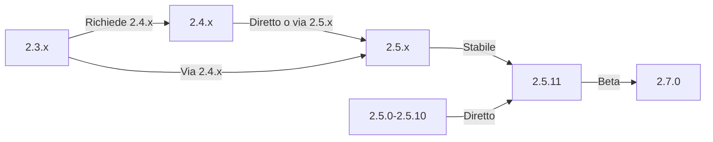

Questa guida copre l'aggiornamento di XOOPS da versioni precedenti all'ultima release, preservando i tuoi dati e personalizzazioni.

> **Informazioni sulla versione**
> - **Stabile:** XOOPS 2.5.11
> - **Beta:** XOOPS 2.7.0 (test)
> - **Futuro:** XOOPS 4.0 (in sviluppo - vedi roadmap)

## Lista di controllo pre-aggiornamento

Prima di iniziare l'aggiornamento, verifica:

- [ ] Versione XOOPS corrente documentata
- [ ] Versione XOOPS di destinazione identificata
- [ ] Backup completo del sistema completato
- [ ] Backup database verificato
- [ ] Elenco moduli installati registrato
- [ ] Modifiche personalizzate documentate
- [ ] Ambiente di prova disponibile
- [ ] Percorso di aggiornamento controllato (alcune versioni saltano versioni intermedie)
- [ ] Risorse server verificate (spazio disco sufficiente, memoria)
- [ ] Modalità manutenzione abilitata

## Guida percorso di aggiornamento

Diversi percorsi di aggiornamento a seconda della versione corrente:



**Importante:** Non saltare mai versioni principali. Se stai aggiornando da 2.3.x, prima aggiorna a 2.4.x, quindi a 2.5.x.

## Passaggio 1: Backup completo del sistema

### Backup database

Usa mysqldump per eseguire il backup del database:

```bash
# Backup database completo
mysqldump -u xoops_user -p xoops_db > /backups/xoops_db_backup_$(date +%Y%m%d_%H%M%S).sql

# Backup compresso
mysqldump -u xoops_user -p xoops_db | gzip > /backups/xoops_db_backup_$(date +%Y%m%d_%H%M%S).sql.gz
```

Oppure usando phpMyAdmin:

1. Seleziona il tuo database XOOPS
2. Fai clic sulla scheda "Esporta"
3. Scegli il formato "SQL"
4. Seleziona "Salva come file"
5. Fai clic su "Vai"

Verifica il file di backup:

```bash
# Controlla la dimensione del backup
ls -lh /backups/xoops_db_backup*.sql

# Verifica l'integrità del backup (non compresso)
head -20 /backups/xoops_db_backup_*.sql

# Verifica il backup compresso
zcat /backups/xoops_db_backup_*.sql.gz | head -20
```

### Backup file system

Esegui il backup di tutti i file XOOPS:

```bash
# Backup file compresso
tar -czf /backups/xoops_files_$(date +%Y%m%d_%H%M%S).tar.gz /var/www/html/xoops

# Non compresso (più veloce, richiede più spazio disco)
tar -cf /backups/xoops_files_$(date +%Y%m%d_%H%M%S).tar /var/www/html/xoops

# Mostra l'avanzamento del backup
tar -czf /backups/xoops_files_$(date +%Y%m%d_%H%M%S).tar.gz --verbose /var/www/html/xoops | tail
```

Archivia i backup in modo sicuro:

```bash
# Archiviazione backup sicura
chmod 600 /backups/xoops_*
ls -lah /backups/

# Opzionale: copia in archiviazione remota
scp /backups/xoops_* user@backup-server:/secure/backups/
```

### Test di ripristino del backup

**CRITICO:** Verifica sempre che il tuo backup funzioni:

```bash
# Verifica il contenuto dell'archivio tar
tar -tzf /backups/xoops_files_*.tar.gz | head -20

# Estrai in posizione di prova
mkdir /tmp/restore_test
cd /tmp/restore_test
tar -xzf /backups/xoops_files_*.tar.gz

# Verifica che i file chiave esistano
ls -la xoops/mainfile.php
ls -la xoops/install/
```

## Passaggio 2: Abilita modalità manutenzione

Impedisci agli utenti di accedere al sito durante l'aggiornamento:

### Opzione 1: Pannello admin XOOPS

1. Accedi al pannello di amministrazione
2. Vai a Sistema > Manutenzione
3. Abilita "Modalità manutenzione sito"
4. Imposta messaggio di manutenzione
5. Salva

### Opzione 2: Modalità manutenzione manuale

Crea un file di manutenzione nella radice web:

```html
<!-- /var/www/html/maintenance.html -->
<!DOCTYPE html>
<html>
<head>
    <title>Sotto manutenzione</title>
    <style>
        body { font-family: Arial; text-align: center; padding: 50px; }
        h1 { color: #333; }
        p { color: #666; margin: 20px 0; }
    </style>
</head>
<body>
    <h1>Sito in manutenzione</h1>
    <p>Stiamo attualmente aggiornando il nostro sito.</p>
    <p>Tempo previsto: circa 30 minuti.</p>
    <p>Grazie per la tua pazienza!</p>
</body>
</html>
```

Configura Apache per mostrare la pagina di manutenzione:

```apache
# In .htaccess o config vhost
ErrorDocument 503 /maintenance.html

# Reindirizza tutto il traffico alla pagina di manutenzione
<IfModule mod_rewrite.c>
    RewriteEngine On
    RewriteCond %{REMOTE_ADDR} !^192\.168\.1\.100$  # Il tuo IP
    RewriteRule ^(.*)$ - [R=503,L]
</IfModule>
```

## Passaggio 3: Scarica una nuova versione

Scarica XOOPS dal sito ufficiale:

```bash
# Scarica l'ultima versione
cd /tmp
wget https://xoops.org/download/xoops-2.5.8.zip

# Verifica checksum (se fornito)
sha256sum xoops-2.5.8.zip
# Confronta con l'hash SHA256 ufficiale

# Estrai in posizione temporanea
unzip xoops-2.5.8.zip
cd xoops-2.5.8
```

## Passaggio 4: Preparazione file pre-aggiornamento

### Identifica modifiche personalizzate

Verifica i file core personalizzati:

```bash
# Cerca file modificati (file con mtime più recente)
find /var/www/html/xoops -type f -newer /var/www/html/xoops/install.php

# Controlla i temi personalizzati
ls /var/www/html/xoops/themes/
# Nota i temi personalizzati

# Controlla i moduli personalizzati
ls /var/www/html/xoops/modules/
# Nota i moduli personalizzati da te
```

### Documenta lo stato attuale

Crea un rapporto di aggiornamento:

```bash
cat > /tmp/upgrade_report.txt << EOF
=== Rapporto di aggiornamento XOOPS ===
Data: $(date)
Versione corrente: 2.5.6
Versione di destinazione: 2.5.8

=== Moduli installati ===
$(ls /var/www/html/xoops/modules/)

=== Modifiche personalizzate ===
[Documenta qualsiasi modifica tema personalizzato o modulo]

=== Temi ===
$(ls /var/www/html/xoops/themes/)

=== Stato plugin ===
[Elenca eventuali modifiche di codice personalizzato]

EOF
```

## Passaggio 5: Unisci nuovi file con l'installazione corrente

### Strategia: Preserva file personalizzati

Sostituisci i file core XOOPS ma preserva:
- `mainfile.php` (la configurazione del tuo database)
- Temi personalizzati in `themes/`
- Moduli personalizzati in `modules/`
- Caricamenti utente in `uploads/`
- Dati sito in `var/`

### Processo di unione manuale

```bash
# Imposta variabili
XOOPS_OLD="/var/www/html/xoops"
XOOPS_NEW="/tmp/xoops-2.5.8"
BACKUP="/backups/pre-upgrade"

# Crea backup pre-aggiornamento in posizione
mkdir -p $BACKUP
cp -r $XOOPS_OLD/* $BACKUP/

# Copia nuovi file (ma preserva file sensibili)
# Copia tutto tranne directory protette
rsync -av --exclude='mainfile.php' \
    --exclude='modules/custom*' \
    --exclude='themes/custom*' \
    --exclude='uploads' \
    --exclude='var' \
    --exclude='cache' \
    --exclude='templates_c' \
    $XOOPS_NEW/ $XOOPS_OLD/

# Verifica che i file critici siano preservati
ls -la $XOOPS_OLD/mainfile.php
```

### Usando upgrade.php (se disponibile)

Alcune versioni XOOPS includono script di aggiornamento automatizzato:

```bash
# Copia nuovi file con programma di installazione
cp -r /tmp/xoops-2.5.8/* /var/www/html/xoops/

# Esegui procedura guidata di aggiornamento
# Visita: http://your-domain.com/xoops/upgrade/
```

### Autorizzazioni file dopo l'unione

Ripristina le autorizzazioni corrette:

```bash
# Imposta proprietà
chown -R www-data:www-data /var/www/html/xoops

# Imposta autorizzazioni directory
find /var/www/html/xoops -type d -exec chmod 755 {} \;

# Imposta autorizzazioni file
find /var/www/html/xoops -type f -exec chmod 644 {} \;

# Rendi scrivibili le directory
chmod 777 /var/www/html/xoops/cache
chmod 777 /var/www/html/xoops/templates_c
chmod 777 /var/www/html/xoops/uploads
chmod 777 /var/www/html/xoops/var

# Proteggi mainfile.php
chmod 644 /var/www/html/xoops/mainfile.php
```

## Passaggio 6: Migrazione database

### Rivedi modifiche database

Controlla le note sulla versione di XOOPS per le modifiche alla struttura del database:

```bash
# Estrai e rivedi i file di migrazione SQL
find /tmp/xoops-2.5.8 -name "*.sql" -type f
# Documenta tutti i file .sql trovati
```

### Esegui aggiornamenti database

### Opzione 1: Aggiornamento automatizzato (se disponibile)

Usa il pannello admin:

1. Accedi a admin
2. Vai a **Sistema > Database**
3. Fai clic su "Controlla aggiornamenti"
4. Rivedi le modifiche in sospeso
5. Fai clic su "Applica aggiornamenti"

### Opzione 2: Aggiornamenti database manuale

Esegui i file SQL di migrazione:

```bash
# Connetti al database
mysql -u xoops_user -p xoops_db

# Visualizza le modifiche in sospeso (varia per versione)
SELECT * FROM xoops_config WHERE conf_name LIKE '%version%';

# Esegui script di migrazione manualmente se necessario
SOURCE /tmp/xoops-2.5.8/migrate_2.5.6_to_2.5.8.sql;
```

### Verifica database

Verifica l'integrità del database dopo l'aggiornamento:

```sql
-- Verifica la coerenza del database
REPAIR TABLE xoops_users;
OPTIMIZE TABLE xoops_users;

-- Verifica che le tabelle chiave esistano
SHOW TABLES LIKE 'xoops_%';

-- Controlla i conteggi delle righe (dovrebbe aumentare o rimanere uguale)
SELECT COUNT(*) FROM xoops_users;
SELECT COUNT(*) FROM xoops_posts;
```

## Passaggio 7: Verifica aggiornamento

### Verifica homepage

Visita la tua homepage XOOPS:

```
http://your-domain.com/xoops/
```

Previsto: La pagina si carica senza errori, viene visualizzata correttamente

### Verifica pannello admin

Accedi a admin:

```
http://your-domain.com/xoops/admin/
```

Verifica:
- [ ] Pannello admin si carica
- [ ] La navigazione funziona
- [ ] Dashboard viene visualizzato correttamente
- [ ] Nessun errore di database nei log

### Verifica modulo

Controlla i moduli installati:

1. Vai a **Moduli > Moduli** in admin
2. Verifica che tutti i moduli siano ancora installati
3. Controlla eventuali messaggi di errore
4. Abilita i moduli che erano disabilitati

### Verifica file di log

Rivedi i log di sistema per gli errori:

```bash
# Controlla il log degli errori del server web
tail -50 /var/log/apache2/error.log

# Controlla il log degli errori PHP
tail -50 /var/log/php_errors.log

# Controlla il log di sistema XOOPS (se disponibile)
# In pannello admin: Sistema > Log
```

### Funzioni core di prova

- [ ] L'accesso/logout dell'utente funziona
- [ ] La registrazione dell'utente funziona
- [ ] Funzioni di caricamento file
- [ ] Le notifiche email vengono inviate
- [ ] La funzionalità di ricerca funziona
- [ ] Funzioni admin operative
- [ ] Funzionalità modulo intatta

## Passaggio 8: Pulizia post-aggiornamento

### Rimuovi file temporanei

```bash
# Rimuovi directory di estrazione
rm -rf /tmp/xoops-2.5.8

# Cancella la cache del modello (sicuro da eliminare)
rm -rf /var/www/html/xoops/templates_c/*

# Cancella la cache del sito
rm -rf /var/www/html/xoops/cache/*
```

### Rimuovi modalità manutenzione

Abilita di nuovo l'accesso al sito normale:

```apache
# Rimuovi il reindirizzamento della modalità manutenzione da .htaccess
# Oppure elimina il file maintenance.html
rm /var/www/html/maintenance.html
```

### Aggiorna documentazione

Aggiorna le tue note di aggiornamento:

```bash
# Documenta aggiornamento riuscito
cat >> /tmp/upgrade_report.txt << EOF

=== Risultati aggiornamento ===
Stato: SUCCESSO
Data aggiornamento: $(date)
Nuova versione: 2.5.8
Durata: [time in minutes]

Test post-aggiornamento:
- [x] La homepage si carica
- [x] Pannello admin accessibile
- [x] Moduli funzionali
- [x] Registrazione utente funziona
- [x] Database ottimizzato

EOF
```

## Risoluzione dei problemi di aggiornamento

### Problema: Schermata bianca vuota dopo l'aggiornamento

**Sintomo:** La homepage non mostra nulla

**Soluzione:**
```bash
# Controlla gli errori PHP
tail -f /var/log/apache2/error.log

# Abilita modalità debug temporaneamente
echo "define('XOOPS_DEBUG', 1);" >> /var/www/html/xoops/mainfile.php

# Controlla le autorizzazioni dei file
ls -la /var/www/html/xoops/mainfile.php

# Ripristina dal backup se necessario
cp /backups/xoops_files_*.tar.gz /tmp/
cd /tmp && tar -xzf xoops_files_*.tar.gz
```

### Problema: Errore di connessione database

**Sintomo:** Messaggio "Impossibile connettersi al database"

**Soluzione:**
```bash
# Verifica le credenziali del database in mainfile.php
grep -i "database\|host\|user" /var/www/html/xoops/mainfile.php

# Test della connessione
mysql -h localhost -u xoops_user -p xoops_db -e "SELECT 1"

# Verifica lo stato di MySQL
systemctl status mysql

# Verifica che il database esista ancora
mysql -u xoops_user -p -e "SHOW DATABASES" | grep xoops
```

### Problema: Pannello admin non accessibile

**Sintomo:** Impossibile accedere a /xoops/admin/

**Soluzione:**
```bash
# Controlla le regole .htaccess
cat /var/www/html/xoops/.htaccess

# Verifica che i file admin esistano
ls -la /var/www/html/xoops/admin/

# Verifica che mod_rewrite sia abilitato
apache2ctl -M | grep rewrite

# Riavvia il server web
systemctl restart apache2
```

### Problema: Moduli non caricati

**Sintomo:** I moduli mostrano errori o sono disabilitati

**Soluzione:**
```bash
# Verifica che i file del modulo esistano
ls /var/www/html/xoops/modules/

# Controlla le autorizzazioni del modulo
ls -la /var/www/html/xoops/modules/*/

# Verifica la configurazione del modulo nel database
mysql -u xoops_user -p xoops_db -e "SELECT * FROM xoops_modules WHERE module_status = 0"

# Riattiva i moduli nel pannello admin
# Sistema > Moduli > Fai clic su modulo > Aggiorna stato
```

### Problema: Errori di permesso negato

**Sintomo:** "Permesso negato" durante il caricamento o il salvataggio

**Soluzione:**
```bash
# Controlla la proprietà del file
ls -la /var/www/html/xoops/ | head -20

# Correggi la proprietà
chown -R www-data:www-data /var/www/html/xoops

# Correggi le autorizzazioni della directory
find /var/www/html/xoops -type d -exec chmod 755 {} \;

# Rendi scrivibili cache/uploads
chmod 777 /var/www/html/xoops/cache
chmod 777 /var/www/html/xoops/templates_c
chmod 777 /var/www/html/xoops/uploads
chmod 777 /var/www/html/xoops/var
```

### Problema: Caricamento lento della pagina

**Sintomo:** Le pagine si caricano molto lentamente dopo l'aggiornamento

**Soluzione:**
```bash
# Cancella tutte le cache
rm -rf /var/www/html/xoops/cache/*
rm -rf /var/www/html/xoops/templates_c/*

# Ottimizza il database
mysql -u xoops_user -p xoops_db << EOF
OPTIMIZE TABLE xoops_users;
OPTIMIZE TABLE xoops_posts;
OPTIMIZE TABLE xoops_config;
ANALYZE TABLE xoops_users;
EOF

# Controlla il log degli errori PHP per gli avvisi
grep -i "deprecated\|warning" /var/log/php_errors.log | tail -20

# Aumenta il tempo di esecuzione/memoria PHP temporaneamente
# Modifica php.ini:
memory_limit = 256M
max_execution_time = 300
```

## Procedura di rollback

Se l'aggiornamento non riesce criticamente, ripristina dal backup:

### Ripristina database

```bash
# Ripristina dal backup
mysql -u xoops_user -p xoops_db < /backups/xoops_db_backup_YYYYMMDD_HHMMSS.sql

# O dal backup compresso
gunzip < /backups/xoops_db_backup_YYYYMMDD_HHMMSS.sql.gz | mysql -u xoops_user -p xoops_db

# Verifica il ripristino
mysql -u xoops_user -p xoops_db -e "SELECT COUNT(*) FROM xoops_users"
```

### Ripristina il file system

```bash
# Ferma il server web
systemctl stop apache2

# Rimuovi l'installazione corrente
rm -rf /var/www/html/xoops/*

# Estrai il backup
cd /var/www/html
tar -xzf /backups/xoops_files_YYYYMMDD_HHMMSS.tar.gz

# Correggi le autorizzazioni
chown -R www-data:www-data xoops/
find xoops -type d -exec chmod 755 {} \;
find xoops -type f -exec chmod 644 {} \;
chmod 777 xoops/cache xoops/templates_c xoops/uploads xoops/var

# Avvia il server web
systemctl start apache2

# Verifica il ripristino
# Visita http://your-domain.com/xoops/
```

## Lista di verifica di verifica dell'aggiornamento

Dopo il completamento dell'aggiornamento, verifica:

- [ ] Versione XOOPS aggiornata (verifica admin > Info sistema)
- [ ] La homepage si carica senza errori
- [ ] Tutti i moduli funzionali
- [ ] L'accesso dell'utente funziona
- [ ] Pannello admin accessibile
- [ ] I caricamenti di file funzionano
- [ ] Notifiche email funzionali
- [ ] Integrità database verificata
- [ ] Autorizzazioni file corrette
- [ ] Modalità manutenzione rimossa
- [ ] Backup protetti e testati
- [ ] Prestazioni accettabili
- [ ] SSL/HTTPS funzionante
- [ ] Nessun messaggio di errore nei log

## Passi successivi

Dopo l'aggiornamento riuscito:

1. Aggiorna i moduli personalizzati alle ultime versioni
2. Rivedi le note sulla versione per le funzionalità deprecate
3. Considera l'ottimizzazione delle prestazioni
4. Aggiorna le impostazioni di sicurezza
5. Testa a fondo tutte le funzionalità
6. Mantieni i file di backup sicuri

---

**Tag:** #aggiornamento #manutenzione #backup #migrazione-database

**Articoli correlati:**
- ../../06-Publisher-Module/User-Guide/Installation
- Requisiti-server
- ../Configurazione/Configurazione-base
- ../Configurazione/Configurazione-sicurezza
