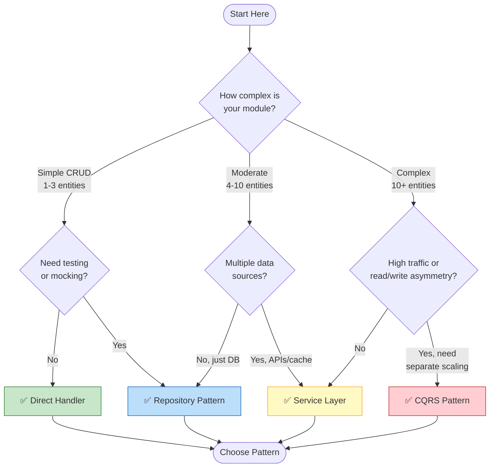
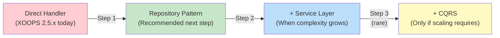

<span class="version-badge version-25x">2.5.x ✅</span> <span class="version-badge version-40x">4.0.x ✅</span>

> **Quale modello dovrei usare?** Questo albero decisionale ti aiuta a scegliere tra handler diretti, Repository Pattern, Service Layer e CQRS.

---

## Albero delle Decisioni Veloce



---

## Confronto tra i Modelli

| Criterio | Direct Handler | Repository | Service Layer | CQRS |
|----------|---------------|------------|---------------|------|
| **Complessità** | ⭐ | ⭐⭐ | ⭐⭐⭐ | ⭐⭐⭐⭐⭐ |
| **Testabilità** | ❌ Difficile | ✅ Buona | ✅ Ottima | ✅ Ottima |
| **Flessibilità** | ❌ Bassa | ✅ Media | ✅ Alta | ✅ Molto Alta |
| **XOOPS 2.5.x** | ✅ Nativa | ✅ Funziona | ✅ Funziona | ⚠️ Complessa |
| **XOOPS 4.0** | ⚠️ Deprecata | ✅ Consigliata | ✅ Consigliata | ✅ Per la scalabilità |
| **Dimensione del Team** | 1 dev | 1-3 dev | 2-5 dev | 5+ dev |
| **Manutenzione** | ❌ Più alta | ✅ Moderata | ✅ Più bassa | ⚠️ Richiede esperienza |

---

## Quando Usare Ogni Modello

### ✅ Direct Handler (`XoopsPersistableObjectHandler`)

**Migliore per:** Moduli semplici, prototipi rapidi, imparare XOOPS

```php
// Simple and direct - good for small modules
$handler = xoops_getModuleHandler('article', 'news');
$articles = $handler->getObjects(new Criteria('status', 1));
```

**Scegli questo quando:**
- Stai costruendo un modulo semplice con 1-3 tabelle di database
- Stai creando un prototipo veloce
- Sei l'unico sviluppatore e non hai bisogno di test
- Il modulo non crescerà significativamente

**Limitazioni:**
- Difficile fare unit test (dipendenza globale)
- Accoppiamento stretto al livello database XOOPS
- La logica di business tende a fuoriuscire nei controller

---

### ✅ Repository Pattern

**Migliore per:** La maggior parte dei moduli, team che desiderano testabilità

```php
// Abstraction allows mocking for tests
interface ArticleRepositoryInterface {
    public function findPublished(): array;
    public function save(Article $article): void;
}

class XoopsArticleRepository implements ArticleRepositoryInterface {
    private $handler;

    public function __construct() {
        $this->handler = xoops_getModuleHandler('article', 'news');
    }

    public function findPublished(): array {
        return $this->handler->getObjects(new Criteria('status', 1));
    }
}
```

**Scegli questo quando:**
- Vuoi scrivere unit test
- Potresti cambiare le fonti di dati in seguito (DB → API)
- Stai lavorando con 2+ sviluppatori
- Stai costruendo moduli per la distribuzione

**Percorso di aggiornamento:** Questo è il modello consigliato per la preparazione a XOOPS 4.0.

---

### ✅ Service Layer

**Migliore per:** Moduli con logica di business complessa

```php
// Service coordinates multiple repositories and contains business rules
class ArticlePublicationService {
    public function __construct(
        private ArticleRepositoryInterface $articles,
        private NotificationServiceInterface $notifications,
        private CacheInterface $cache
    ) {}

    public function publish(int $articleId): void {
        $article = $this->articles->find($articleId);
        $article->setStatus('published');
        $article->setPublishedAt(new DateTime());

        $this->articles->save($article);
        $this->notifications->notifySubscribers($article);
        $this->cache->invalidate("article:{$articleId}");
    }
}
```

**Scegli questo quando:**
- Le operazioni si estendono su più fonti di dati
- Le regole di business sono complesse
- Hai bisogno di gestione delle transazioni
- Più parti dell'app fanno la stessa cosa

**Percorso di aggiornamento:** Combinalo con Repository per un'architettura robusta.

---

### ⚠️ CQRS (Command Query Responsibility Segregation)

**Migliore per:** Moduli ad alta scalabilità con asimmetria lettura/scrittura

```php
// Commands modify state
class PublishArticleCommand {
    public function __construct(
        public readonly int $articleId,
        public readonly int $publisherId
    ) {}
}

// Queries read state (can use denormalized read models)
class GetPublishedArticlesQuery {
    public function __construct(
        public readonly int $limit = 10
    ) {}
}
```

**Scegli questo quando:**
- Le letture superano di gran lunga le scritture (100:1 o più)
- Hai bisogno di una diversa scalabilità per letture vs scritture
- Requisiti di reporting/analytics complessi
- Event sourcing avvantaggerebbe il tuo dominio

**Avvertenza:** CQRS aggiunge una complessità significativa. La maggior parte dei moduli XOOPS non ne ha bisogno.

---

## Percorso di Aggiornamento Consigliato



### Step 1: Incapsulare gli Handler nei Repository (2-4 ore)

1. Crea un'interfaccia per le tue esigenze di accesso ai dati
2. Implementala utilizzando l'handler esistente
3. Inietta il repository invece di chiamare direttamente `xoops_getModuleHandler()`

### Step 2: Aggiungi Service Layer Quando Necessario (1-2 giorni)

1. Quando la logica di business appare nei controller, estrai in un Service
2. Service usa repository, non handler direttamente
3. I controller diventano sottili (route → service → response)

### Step 3: Considera CQRS Solo Se (raro)

1. Hai milioni di letture al giorno
2. I modelli di lettura e scrittura sono significativamente diversi
3. Hai bisogno di event sourcing per i trail di audit
4. Hai un team esperto con CQRS

---

## Scheda di Riferimento Veloce

| Domanda | Risposta |
|----------|--------|
| **"Ho solo bisogno di salvare/caricare dati"** | Direct Handler |
| **"Voglio scrivere test"** | Repository Pattern |
| **"Ho regole di business complesse"** | Service Layer |
| **"Ho bisogno di scalare le letture separatamente"** | CQRS |
| **"Sto preparando per XOOPS 4.0"** | Repository + Service Layer |

---

## Documentazione Correlata

- [Repository Pattern Guide](Patterns/Repository-Pattern.md)
- [Service Layer Pattern Guide](Patterns/Service-Layer-Pattern.md)
- [CQRS Pattern Guide](../07-XOOPS-4.0/Implementation-Guides/CQRS-Pattern-Guide.md) *(advanced)*
- [Hybrid Mode Contract](../07-XOOPS-4.0/Specifications/Hybrid-Mode-Contract.md)

---

#patterns #data-access #decision-tree #best-practices #xoops
