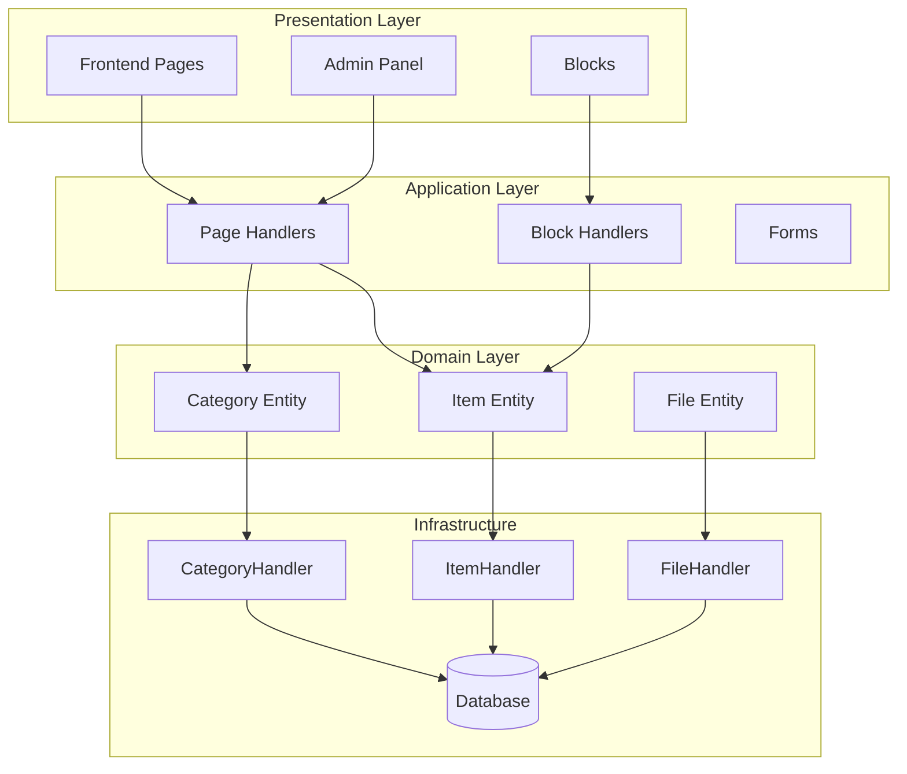
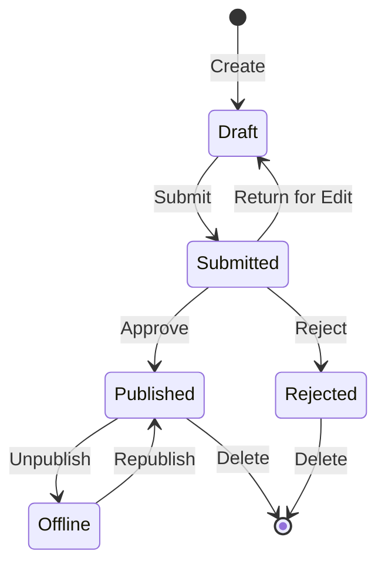

## Panoramica

Questo documento fornisce un'analisi tecnica dell'architettura del modulo Publisher, degli schemi e dei dettagli di implementazione. Usa questo come riferimento per comprendere come è strutturato un modulo XOOPS di qualità produttiva.

## Panoramica dell'architettura



## Struttura delle directory

```
publisher/
├── admin/
│   ├── index.php           # Dashboard admin
│   ├── item.php            # Gestione articoli
│   ├── category.php        # Gestione categorie
│   ├── permission.php      # Autorizzazioni
│   ├── file.php            # Gestore file
│   └── menu.php            # Menu admin
├── assets/
│   ├── css/
│   ├── js/
│   └── images/
├── class/
│   ├── Category.php        # Entità categoria
│   ├── CategoryHandler.php # Accesso dati categoria
│   ├── Item.php            # Entità articolo
│   ├── ItemHandler.php     # Accesso dati articolo
│   ├── File.php            # Allegato file
│   ├── FileHandler.php     # Accesso dati file
│   ├── Form/               # Classi form
│   ├── Common/             # Utility
│   └── Helper.php          # Helper modulo
├── include/
│   ├── common.php          # Inizializzazione
│   ├── functions.php       # Funzioni utility
│   ├── oninstall.php       # Hook installazione
│   ├── onupdate.php        # Hook aggiornamento
│   └── search.php          # Integrazione ricerca
├── language/
├── templates/
├── sql/
└── xoops_version.php
```

## Analisi entità

### Entità Item (Articolo)

```php
class Item extends \XoopsObject
{
    // Campi
    public function initVar(): void
    {
        $this->initVar('itemid', XOBJ_DTYPE_INT, null, false);
        $this->initVar('categoryid', XOBJ_DTYPE_INT, 0, false);
        $this->initVar('title', XOBJ_DTYPE_TXTBOX, '', true);
        $this->initVar('subtitle', XOBJ_DTYPE_TXTBOX, '');
        $this->initVar('summary', XOBJ_DTYPE_TXTAREA, '');
        $this->initVar('body', XOBJ_DTYPE_TXTAREA, '', true);
        $this->initVar('uid', XOBJ_DTYPE_INT, 0);
        $this->initVar('status', XOBJ_DTYPE_INT, 0);
        $this->initVar('datesub', XOBJ_DTYPE_INT, time());
        // ... altri campi
    }

    // Metodi business
    public function isPublished(): bool
    {
        return $this->getVar('status') == _PUBLISHER_STATUS_PUBLISHED;
    }

    public function canEdit(int $userId): bool
    {
        return $this->getVar('uid') == $userId
            || $this->isAdmin($userId);
    }
}
```

### Modello Handler

```php
class ItemHandler extends \XoopsPersistableObjectHandler
{
    public function __construct(\XoopsDatabase $db)
    {
        parent::__construct(
            $db,
            'publisher_items',
            Item::class,
            'itemid',
            'title'
        );
    }

    public function getPublishedItems(int $limit = 10): array
    {
        $criteria = new \CriteriaCompo();
        $criteria->add(new \Criteria('status', _PUBLISHER_STATUS_PUBLISHED));
        $criteria->setSort('datesub');
        $criteria->setOrder('DESC');
        $criteria->setLimit($limit);

        return $this->getObjects($criteria);
    }
}
```

## Sistema autorizzazioni

### Tipi di autorizzazione

| Autorizzazione | Descrizione |
|------------|-------------|
| `publisher_view` | Visualizza categoria/articoli |
| `publisher_submit` | Invia nuovi articoli |
| `publisher_approve` | Auto-approva invii |
| `publisher_moderate` | Revisione articoli in sospeso |
| `publisher_global` | Autorizzazioni modulo globali |

### Controllo autorizzazione

```php
class PermissionHandler
{
    public function isGranted(string $permission, int $categoryId): bool
    {
        $userId = $GLOBALS['xoopsUser']?->uid() ?? 0;
        $groups = $this->getUserGroups($userId);

        return $this->grouppermHandler->checkRight(
            $permission,
            $categoryId,
            $groups,
            $this->helper->getModule()->mid()
        );
    }
}
```

## Stati del flusso di lavoro



## Struttura template

### Template frontend

| Template | Scopo |
|----------|---------|
| `publisher_index.tpl` | Homepage modulo |
| `publisher_item.tpl` | Articolo singolo |
| `publisher_category.tpl` | Elenco categoria |
| `publisher_submit.tpl` | Form invio |
| `publisher_search.tpl` | Risultati ricerca |

### Template blocchi

| Template | Scopo |
|----------|---------|
| `publisher_block_latest.tpl` | Articoli recenti |
| `publisher_block_spotlight.tpl` | Articolo in primo piano |
| `publisher_block_category.tpl` | Menu categoria |

## Schemi chiave utilizzati

1. **Modello Handler** - Incapsulamento accesso dati
2. **Value Object** - Costanti di stato
3. **Template Method** - Generazione form
4. **Strategy** - Diverse modalità visualizzazione
5. **Observer** - Notifiche su eventi

## Lezioni per lo sviluppo di moduli

1. Usa XoopsPersistableObjectHandler per CRUD
2. Implementa autorizzazioni granulari
3. Separa presentazione dalla logica
4. Usa Criteria per le query
5. Supporta più stati contenuto
6. Integra con il sistema di notifica XOOPS

## Documentazione correlata

- Creating-Articles - Gestione articoli
- Managing-Categories - Sistema categoria
- Permissions-Setup - Configurazione autorizzazioni
- Developer-Guide/Hooks-and-Events - Punti estensione
