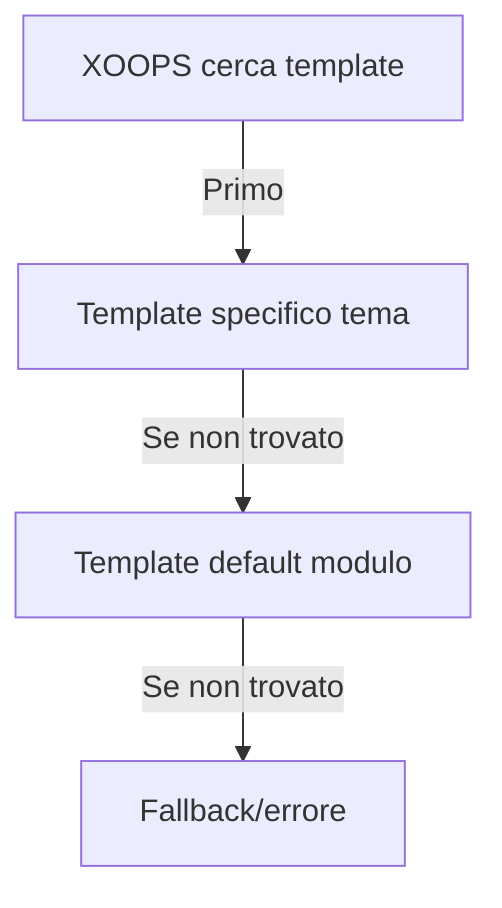

# Template Personalizzati in Publisher

> Guida alla creazione e personalizzazione dei template di Publisher usando Smarty, CSS e override HTML.

---

## Panoramica Sistema Template

### Cosa Sono i Template?

I template controllano come Publisher visualizza il contenuto:

```
I template rendono:
  ├── Visualizzazione articoli
  ├── Elenchi categorie
  ├── Pagine archivi
  ├── Elenchi articoli
  ├── Sezioni commenti
  ├── Risultati ricerca
  ├── Blocchi
  └── Pagine admin
```

### Tipi di Template

```
Template Base:
  ├── publisher_index.tpl (home modulo)
  ├── publisher_item.tpl (articolo singolo)
  ├── publisher_category.tpl (pagina categoria)
  └── publisher_archive.tpl (vista archivi)

Template Blocchi:
  ├── publisher_block_latest.tpl
  ├── publisher_block_categories.tpl
  ├── publisher_block_archives.tpl
  └── publisher_block_top.tpl

Template Admin:
  ├── admin_articles.tpl
  ├── admin_categories.tpl
  └── admin_*
```

---

## Directory Template

### Struttura File Template

```
Installazione XOOPS:
├── modules/publisher/
│   └── templates/
│       ├── Publisher/ (template base)
│       │   ├── publisher_index.tpl
│       │   ├── publisher_item.tpl
│       │   ├── publisher_category.tpl
│       │   ├── blocks/
│       │   │   ├── publisher_block_latest.tpl
│       │   │   └── publisher_block_categories.tpl
│       │   └── css/
│       │       └── publisher.css
│       └── Themes/ (specifico tema)
│           ├── Classic/
│           ├── Modern/
│           └── Dark/

themes/yourtheme/
└── modules/
    └── publisher/
        ├── templates/
        │   └── publisher_custom.tpl
        ├── css/
        │   └── custom.css
        └── images/
            └── icons/
```

### Gerarchia Template



---

## Creazione Template Personalizzati

### Copia Template nel Tema

**Metodo 1: Tramite Gestore File**

```
1. Naviga a /themes/yourtheme/modules/publisher/
2. Crea directory se non esiste:
   - templates/
   - css/
   - js/ (opzionale)
3. Copia file template modulo:
   modules/publisher/templates/Publisher/publisher_item.tpl
   → themes/yourtheme/modules/publisher/templates/publisher_item.tpl
4. Modifica copia tema (non copia modulo!)
```

**Metodo 2: Via FTP/SSH**

```bash
# Crea directory override tema
mkdir -p /path/to/xoops/themes/yourtheme/modules/publisher/templates

# Copia file template
cp /path/to/xoops/modules/publisher/templates/Publisher/*.tpl \
   /path/to/xoops/themes/yourtheme/modules/publisher/templates/

# Verifica file copiati
ls /path/to/xoops/themes/yourtheme/modules/publisher/templates/
```

### Modifica Template Personalizzato

Apri copia tema in editor di testo:

```
File: /themes/yourtheme/modules/publisher/templates/publisher_item.tpl

Modifica:
  1. Mantieni variabili Smarty intatte
  2. Modifica struttura HTML
  3. Aggiungi classi CSS personalizzate
  4. Regola logica visualizzazione
```

---

## Nozioni di Base Smarty Template

### Variabili Smarty

Publisher fornisce variabili ai template:

#### Variabili Articolo

```smarty
{* Variabili Articolo Singolo *}
<h1>{$item->title()}</h1>
<p>{$item->description()}</p>
<p>{$item->body()}</p>
<p>Di {$item->uname()} il {$item->date('l, F j, Y')}</p>
<p>Categoria: {$item->category}</p>
<p>Visualizzazioni: {$item->views()}</p>
```

#### Variabili Categoria

```smarty
{* Variabili Categoria *}
<h2>{$category->name()}</h2>
<p>{$category->description()}</p>
image()}" alt="{$category->name()}">
<p>Articoli: {$category->itemCount()}</p>
```

#### Variabili Blocco

```smarty
{* Blocco Ultimi Articoli *}
{foreach from=$items item=item}
  <div class="article">
    <h3>{$item->title()}</h3>
    <p>{$item->summary()}</p>
  </div>
{/foreach}
```

### Sintassi Smarty Comune

```smarty
{* Variabile *}
{$variable}
{$array.key}
{$object->method()}

{* Condizionale *}
{if $condition}
  <p>Contenuto mostrato se vero</p>
{else}
  <p>Contenuto mostrato se falso</p>
{/if}

{* Loop *}
{foreach from=$array item=item}
  <li>{$item}</li>
{/foreach}

{* Funzioni *}
{$variable|truncate:100:"..."}
{$date|date_format:"%Y-%m-%d"}
{$text|htmlspecialchars}

{* Commenti *}
{* Questo è un commento Smarty, non visualizzato *}
```

---

## Esempi Template

### Template Articolo Singolo

**File: publisher_item.tpl**

```smarty
<!-- Vista Dettagli Articolo -->
<div class="publisher-item">

  <!-- Sezione Intestazione -->
  <div class="article-header">
    <h1>{$item->title()}</h1>

    {if $item->subtitle()}
      <h2 class="article-subtitle">{$item->subtitle()}</h2>
    {/if}

    <div class="article-meta">
      <span class="author">
        Di <a href="{$item->authorUrl()}">{$item->uname()}</a>
      </span>
      <span class="date">
        {$item->date('l, F j, Y')}
      </span>
      <span class="category">
        <a href="{$item->categoryUrl()}">
          {$item->category}
        </a>
      </span>
      <span class="views">
        {$item->views()} visualizzazioni
      </span>
    </div>
  </div>

  <!-- Immagine In Evidenza -->
  {if $item->image()}
    <div class="article-featured-image">
      image()}"
           alt="{$item->title()}"
           class="img-fluid">
    </div>
  {/if}

  <!-- Corpo Articolo -->
  <div class="article-content">
    {$item->body()}
  </div>

  <!-- Tag -->
  {if $item->tags()}
    <div class="article-tags">
      <strong>Tag:</strong>
      {foreach from=$item->tags() item=tag}
        <span class="tag">
          <a href="{$tag->url()}">{$tag->name()}</a>
        </span>
      {/foreach}
    </div>
  {/if}

  <!-- Sezione Piè di Pagina -->
  <div class="article-footer">
    <div class="article-actions">
      {if $canEdit}
        <a href="{$editUrl}" class="btn btn-primary">Modifica</a>
      {/if}
      {if $canDelete}
        <a href="{$deleteUrl}" class="btn btn-danger">Elimina</a>
      {/if}
    </div>

    {if $allowRatings}
      <div class="article-rating">
        <!-- Componente valutazione -->
      </div>
    {/if}
  </div>

</div>

<!-- Sezione Commenti -->
{if $allowComments}
  <div class="article-comments">
    <h3>Commenti</h3>
    {include file="publisher_comments.tpl"}
  </div>
{/if}
```

### Template Elenco Categoria

**File: publisher_category.tpl**

```smarty
<!-- Pagina Categoria -->
<div class="publisher-category">

  <!-- Intestazione Categoria -->
  <div class="category-header">
    <h1>{$category->name()}</h1>

    {if $category->image()}
      image()}"
           alt="{$category->name()}"
           class="category-image">
    {/if}

    {if $category->description()}
      <p class="category-description">
        {$category->description()}
      </p>
    {/if}
  </div>

  <!-- Sottocategorie -->
  {if $subcategories}
    <div class="subcategories">
      <h3>Sottocategorie</h3>
      <ul>
        {foreach from=$subcategories item=sub}
          <li>
            <a href="{$sub->url()}">{$sub->name()}</a>
            ({$sub->itemCount()} articoli)
          </li>
        {/foreach}
      </ul>
    </div>
  {/if}

  <!-- Elenco Articoli -->
  <div class="articles-list">
    <h2>Articoli</h2>

    {if count($items) > 0}
      {foreach from=$items item=item}
        <article class="article-preview">
          {if $item->image()}
            <div class="article-image">
              <a href="{$item->url()}">
                image()}" alt="{$item->title()}">
              </a>
            </div>
          {/if}

          <div class="article-content">
            <h3>
              <a href="{$item->url()}">{$item->title()}</a>
            </h3>

            <div class="article-meta">
              <span class="date">{$item->date('M d, Y')}</span>
              <span class="author">di {$item->uname()}</span>
            </div>

            <p class="article-excerpt">
              {$item->description()|truncate:200:"..."}
            </p>

            <a href="{$item->url()}" class="read-more">
              Leggi Di Più →
            </a>
          </div>
        </article>
      {/foreach}

      <!-- Paginazione -->
      {if $pagination}
        <nav class="pagination">
          {$pagination}
        </nav>
      {/if}
    {else}
      <p class="no-articles">
        Nessun articolo in questa categoria ancora.
      </p>
    {/if}
  </div>

</div>
```

### Template Blocco Ultimi Articoli

**File: publisher_block_latest.tpl**

```smarty
<!-- Blocco Ultimi Articoli -->
<div class="publisher-block-latest">
  <h3>{$block_title|default:"Ultimi Articoli"}</h3>

  {if count($items) > 0}
    <ul class="article-list">
      {foreach from=$items item=item name=articles}
        <li class="article-item">
          <a href="{$item->url()}" title="{$item->title()}">
            {$item->title()}
          </a>
          <span class="date">
            {$item->date('M d, Y')}
          </span>

          {if $show_summary && $item->description()}
            <p class="summary">
              {$item->description()|truncate:80:"..."}
            </p>
          {/if}
        </li>
      {/foreach}
    </ul>
  {else}
    <p>Nessun articolo disponibile.</p>
  {/if}
</div>
```

---

## Stile con CSS

### File CSS Personalizzati

Crea CSS personalizzato nel tema:

```
/themes/yourtheme/modules/publisher/css/custom.css
```

### Struttura Template Base

Comprendi la struttura HTML:

```html
<!-- Modulo Publisher -->
<div class="publisher-module">

  <!-- Vista Elemento -->
  <div class="publisher-item">
    <div class="article-header">...</div>
    <div class="article-featured-image">...</div>
    <div class="article-content">...</div>
    <div class="article-footer">...</div>
  </div>

  <!-- Vista Categoria -->
  <div class="publisher-category">
    <div class="category-header">...</div>
    <div class="articles-list">...</div>
  </div>

  <!-- Blocco -->
  <div class="publisher-block-latest">
    <ul class="article-list">...</ul>
  </div>

</div>
```

### Esempi CSS

```css
/* Contenitore Articolo */
.publisher-item {
  background: #fff;
  border: 1px solid #ddd;
  border-radius: 4px;
  padding: 20px;
  margin-bottom: 20px;
}

/* Intestazione Articolo */
.article-header {
  border-bottom: 2px solid #f0f0f0;
  padding-bottom: 15px;
  margin-bottom: 20px;
}

.article-header h1 {
  font-size: 2.5em;
  margin: 0 0 10px 0;
  color: #333;
}

.article-subtitle {
  font-size: 1.3em;
  color: #666;
  font-style: italic;
  margin: 0;
}

/* Informazioni Meta Articolo */
.article-meta {
  font-size: 0.9em;
  color: #999;
}

.article-meta span {
  margin-right: 20px;
}

.article-meta a {
  color: #0066cc;
  text-decoration: none;
}

.article-meta a:hover {
  text-decoration: underline;
}

/* Immagine In Evidenza Articolo */
.article-featured-image {
  margin: 20px 0;
  text-align: center;
}

.article-featured-image img {
  max-width: 100%;
  height: auto;
  border-radius: 4px;
}

/* Contenuto Articolo */
.article-content {
  font-size: 1.1em;
  line-height: 1.8;
  color: #333;
}

.article-content h2 {
  font-size: 1.8em;
  margin: 30px 0 15px 0;
  color: #222;
}

.article-content h3 {
  font-size: 1.4em;
  margin: 20px 0 10px 0;
  color: #444;
}

.article-content p {
  margin-bottom: 15px;
}

.article-content ul,
.article-content ol {
  margin: 15px 0 15px 30px;
}

.article-content li {
  margin-bottom: 8px;
}

/* Tag Articolo */
.article-tags {
  margin-top: 20px;
  padding-top: 20px;
  border-top: 1px solid #f0f0f0;
}

.tag {
  display: inline-block;
  background: #f0f0f0;
  padding: 5px 10px;
  margin: 5px 5px 5px 0;
  border-radius: 3px;
  font-size: 0.9em;
}

.tag a {
  color: #0066cc;
  text-decoration: none;
}

.tag a:hover {
  text-decoration: underline;
}

/* Elenco Articoli Categoria */
.publisher-category .articles-list {
  margin-top: 30px;
}

.article-preview {
  display: flex;
  margin-bottom: 30px;
  padding-bottom: 30px;
  border-bottom: 1px solid #f0f0f0;
}

.article-preview:last-child {
  border-bottom: none;
}

.article-image {
  flex: 0 0 200px;
  margin-right: 20px;
}

.article-image img {
  width: 100%;
  height: 150px;
  object-fit: cover;
  border-radius: 4px;
}

.article-content {
  flex: 1;
}

/* Responsive */
@media (max-width: 768px) {
  .article-preview {
    flex-direction: column;
  }

  .article-image {
    flex: 1;
    margin: 0 0 15px 0;
  }

  .article-header h1 {
    font-size: 1.8em;
  }
}
```

---

## Riferimento Variabili Template

### Oggetto Elemento (Articolo)

```smarty
{* Proprietà Articolo *}
{$item->id()}              {* ID articolo *}
{$item->title()}           {* Titolo articolo *}
{$item->description()}     {* Breve descrizione *}
{$item->body()}            {* Contenuto completo *}
{$item->subtitle()}        {* Sottotitolo *}
{$item->uname()}           {* Nome utente autore *}
{$item->authorId()}        {* ID utente autore *}
{$item->date()}            {* Data pubblicazione *}
{$item->modified()}        {* Ultima modifica *}
{$item->image()}           {* URL immagine in evidenza *}
{$item->views()}           {* Conteggio visualizzazioni *}
{$item->categoryId()}      {* ID categoria *}
{$item->category()}        {* Nome categoria *}
{$item->categoryUrl()}     {* URL categoria *}
{$item->url()}             {* URL articolo *}
{$item->status()}          {* Stato articolo *}
{$item->rating()}          {* Valutazione media *}
{$item->comments()}        {* Conteggio commenti *}
{$item->tags()}            {* Array tag articolo *}

{* Metodi Formattati *}
{$item->date('Y-m-d')}               {* Data formattata *}
{$item->description()|truncate:100}  {* Tronco *}
```

### Oggetto Categoria

```smarty
{* Proprietà Categoria *}
{$category->id()}          {* ID categoria *}
{$category->name()}        {* Nome categoria *}
{$category->description()} {* Descrizione *}
{$category->image()}       {* URL immagine *}
{$category->parentId()}    {* ID categoria genitore *}
{$category->itemCount()}   {* Conteggio articoli *}
{$category->url()}         {* URL categoria *}
{$category->status()}      {* Stato *}
```

### Variabili Blocco

```smarty
{$items}           {* Array elementi *}
{$categories}      {* Array categorie *}
{$pagination}      {* HTML paginazione *}
{$total}           {* Conteggio totale *}
{$limit}           {* Elementi per pagina *}
{$page}            {* Pagina corrente *}
```

---

## Condizionali Template

### Controlli Condizionali Comuni

```smarty
{* Controlla se variabile esiste e non è vuota *}
{if $variable}
  <p>{$variable}</p>
{/if}

{* Controlla se array ha elementi *}
{if count($items) > 0}
  {foreach from=$items item=item}
    <li>{$item->title()}</li>
  {/foreach}
{else}
  <p>Nessun elemento disponibile.</p>
{/if}

{* Controlla autorizzazioni utente *}
{if $canEdit}
  <a href="edit.php?id={$item->id()}">Modifica</a>
{/if}

{if $isAdmin}
  <a href="delete.php?id={$item->id()}">Elimina</a>
{/if}

{* Controlla impostazioni modulo *}
{if $allowComments}
  {include file="publisher_comments.tpl"}
{/if}

{* Controlla stato *}
{if $item->status() == 1}
  <span class="published">Pubblicato</span>
{elseif $item->status() == 0}
  <span class="draft">Bozza</span>
{/if}
```

---

## Tecniche Template Avanzate

### Includi Altri Template

```smarty
{* Includi un altro template *}
{include file="publisher_comments.tpl"}

{* Includi con variabili *}
{include file="publisher_article_preview.tpl" item=$item}

{* Includi se esiste *}
{include file="custom_header.tpl"|default:"header.tpl"}
```

### Assegna Variabili in Template

```smarty
{* Assegna variabile per uso successivo *}
{assign var="articleTitle" value=$item->title()}

{* Usa variabile assegnata *}
<h1>{$articleTitle}</h1>

{* Assegna valori complessi *}
{assign var="count" value=$items|count}
{if $count > 0}
  <p>Trovati {$count} articoli</p>
{/if}
```

### Filtri Template

```smarty
{* Filtri testo *}
{$text|htmlspecialchars}        {* Sfuggi HTML *}
{$text|strip_tags}              {* Rimuovi tag HTML *}
{$text|truncate:100:"..."}     {* Tronca testo *}
{$text|upper}                   {* MAIUSCOLE *}
{$text|lower}                   {* minuscole *}

{* Filtri data *}
{$date|date_format:"%Y-%m-%d"}  {* Formatta data *}
{$date|date_format:"%l, %F %j, %Y"} {* Formato completo *}

{* Filtri numero *}
{$number|string_format:"%.2f"}  {* Formatta numero *}
{$number|number_format}         {* Aggiungi separatori *}

{* Filtri array *}
{$array|implode:", "}           {* Unisci array *}
{$array|count}                  {* Conta elementi *}
```

---

## Debug Template

### Visualizza Variabili Smarty

Per debug (rimuovi in produzione):

```smarty
{* Mostra valore variabile *}
<pre>{$variable|print_r}</pre>

{* Mostra tutte le variabili disponibili *}
<pre>{$smarty.all|print_r}</pre>

{* Controlla se variabile esiste *}
{if isset($variable)}
  Variabile esiste
{/if}

{* Visualizza info debug *}
{if $debug}
  Elemento: {$item->id()}<br>
  Titolo: {$item->title()}<br>
  Categoria: {$item->categoryId()}<br>
{/if}
```

### Abilita Modalità Debug

In `/modules/publisher/xoops_version.php` o impostazioni admin:

```php
// Abilita debug
define('PUBLISHER_DEBUG', true);
```

---

## Migrazione Template

### Da Versione Publisher Precedente

Se aggiorni da versione precedente:

1. Confronta file template vecchi e nuovi
2. Unisci modifiche personalizzate
3. Usa nuovi nomi variabili
4. Test approfondito
5. Backup template vecchi

### Percorso Aggiornamento

```
Template vecchio          Template nuovo          Azione
publisher_item.tpl → publisher_item.tpl   Unisci personalizzazioni
publisher_cat.tpl  → publisher_category.tpl Rinomina, unisci
block_latest.tpl   → publisher_block_latest.tpl Rinomina, controlla
```

---

## Best Practice

### Linee Guida Template

```
✓ Mantieni logica business in PHP, logica visualizzazione in template
✓ Usa nomi classe CSS significativi
✓ Commenta sezioni complesse
✓ Testa design responsivo
✓ Valida output HTML
✓ Sfuggi dati utente
✓ Usa HTML semantico
✓ Mantieni template DRY (Non Ripeterti)
```

### Suggerimenti Prestazioni

```
✓ Minimizza query database in template
✓ Cache template compilati
✓ Lazy load immagini
✓ Minifica CSS/JavaScript
✓ Usa CDN per asset
✓ Ottimizza immagini
✗ Evita logica Smarty complessa
```

---

## Documentazione Correlata

- Riferimento API
- Hook e Eventi
- Configurazione
- Creazione Articoli

---

## Risorse

- [Documentazione Smarty](https://www.smarty.net/documentation)
- [Publisher GitHub](https://github.com/XoopsModules25x/publisher)
- [Guida Template XOOPS](../../02-Core-Concepts/Templates/Smarty-Basics.md)

---

#publisher #templates #smarty #customization #themeing #xoops
