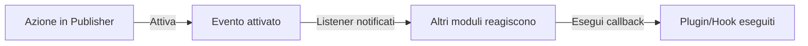

# Hook e Eventi di Publisher

> Guida completa all'estensione della funzionalità Publisher usando eventi, hook e plugin.

---

## Panoramica Sistema Eventi

### Cosa Sono gli Eventi?

Gli eventi permettono ad altri moduli di reagire alle azioni di Publisher:

```
Azione Publisher → Attiva Evento → Altri moduli ascoltano/reagiscono

Esempi:
  - Articolo creato → Invia email notifica
  - Articolo pubblicato → Aggiorna social media
  - Commento pubblicato → Notifica autore
  - Categoria creata → Aggiorna indice ricerca
```

### Flusso Evento



---

## Eventi Disponibili

### Eventi Elemento (Articolo)

#### publisher.item.created

Attivato quando viene creato un nuovo articolo.

```php
// Punto di attivazione in Publisher
xoops_events()->trigger('publisher.item.created', array(
    'item' => $item,
    'itemid' => $item->getVar('itemid'),
    'title' => $item->getVar('title'),
    'uid' => $item->getVar('uid')
));
```

**Listener di Esempio:**

```php
// Ascolta creazione articolo
xoops_events()->attach('publisher.item.created', 'onArticleCreated');

function onArticleCreated($item) {
    $itemId = $item['itemid'];
    $title = $item['title'];
    $uid = $item['uid'];

    // Invia notifica email
    sendEmailNotification($uid, "Nuovo articolo: $title");

    // Registra attività
    logActivity('Articolo creato', $itemId);

    // Aggiorna indice ricerca
    updateSearchIndex($itemId);
}
```

#### publisher.item.updated

Attivato quando viene aggiornato un articolo.

```php
xoops_events()->trigger('publisher.item.updated', array(
    'item' => $item,
    'itemid' => $itemId,
    'changes' => $changes
));
```

#### publisher.item.deleted

Attivato quando viene eliminato un articolo.

```php
xoops_events()->trigger('publisher.item.deleted', array(
    'itemid' => $itemId,
    'title' => $title,
    'categoryid' => $categoryId
));
```

#### publisher.item.published

Attivato quando lo stato articolo cambia a pubblicato.

```php
xoops_events()->trigger('publisher.item.published', array(
    'item' => $item,
    'itemid' => $itemId
));
```

#### publisher.item.approved

Attivato quando articolo in sospeso viene approvato.

```php
xoops_events()->trigger('publisher.item.approved', array(
    'item' => $item,
    'itemid' => $itemId,
    'uid' => $uid
));
```

#### publisher.item.rejected

Attivato quando articolo viene rifiutato.

```php
xoops_events()->trigger('publisher.item.rejected', array(
    'item' => $item,
    'itemid' => $itemId,
    'reason' => $reason
));
```

### Eventi Categoria

#### publisher.category.created

Attivato quando viene creata una categoria.

```php
xoops_events()->trigger('publisher.category.created', array(
    'category' => $category,
    'categoryid' => $categoryId,
    'name' => $name
));
```

#### publisher.category.updated

Attivato quando viene aggiornata una categoria.

```php
xoops_events()->trigger('publisher.category.updated', array(
    'category' => $category,
    'categoryid' => $categoryId
));
```

#### publisher.category.deleted

Attivato quando viene eliminata una categoria.

```php
xoops_events()->trigger('publisher.category.deleted', array(
    'categoryid' => $categoryId,
    'name' => $name,
    'itemCount' => $itemCount
));
```

### Eventi Commento

#### publisher.comment.created

Attivato quando viene pubblicato un commento.

```php
xoops_events()->trigger('publisher.comment.created', array(
    'comment' => $comment,
    'commentid' => $commentId,
    'itemid' => $itemId
));
```

#### publisher.comment.approved

Attivato quando viene approvato un commento.

```php
xoops_events()->trigger('publisher.comment.approved', array(
    'comment' => $comment,
    'commentid' => $commentId
));
```

#### publisher.comment.deleted

Attivato quando viene eliminato un commento.

```php
xoops_events()->trigger('publisher.comment.deleted', array(
    'commentid' => $commentId,
    'itemid' => $itemId
));
```

---

## Ascolto Eventi

### Registra Listener Evento

Nel tuo modulo o plugin:

```php
<?php
// Registra listener in xoops_version.php o file inizializzazione
xoops_events()->attach(
    'publisher.item.created',
    array('MyModuleListener', 'onPublisherItemCreated')
);

// O usa nome funzione
xoops_events()->attach(
    'publisher.item.created',
    'my_module_on_item_created'
);
?>
```

### Metodo Classe Listener

```php
<?php
class MyModuleListener {
    public static function onPublisherItemCreated($data) {
        $itemId = $data['itemid'];
        $title = $data['title'];

        // Esegui azione
        self::notifySubscribers($itemId, $title);
    }

    protected static function notifySubscribers($itemId, $title) {
        // Implementazione
    }
}
?>
```

### Funzione Listener

```php
<?php
function my_module_on_item_created($data) {
    $itemId = $data['itemid'];
    $title = $data['title'];
    $uid = $data['uid'];

    // Invia notifica
    notifyUser($uid, "Articolo creato: $title");
}
?>
```

---

## Esempi Eventi

### Esempio 1: Invia Email su Creazione Articolo

```php
<?php
// Ascolta creazione articolo
xoops_events()->attach(
    'publisher.item.created',
    'send_article_notification_email'
);

function send_article_notification_email($data) {
    $itemId = $data['itemid'];
    $title = $data['title'];
    $uid = $data['uid'];

    // Ottieni oggetto utente
    $userHandler = xoops_getHandler('user');
    $user = $userHandler->get($uid);

    if (!$user) {
        return;
    }

    // Ottieni email amministratori
    $config = xoops_getModuleConfig();
    $adminEmails = $config['admin_emails'];

    // Prepara email
    $subject = "Nuovo Articolo: $title";
    $message = "Un nuovo articolo è stato creato:\n\n";
    $message .= "Titolo: $title\n";
    $message .= "Autore: " . $user->getVar('uname') . "\n";
    $message .= "Data: " . date('Y-m-d H:i:s') . "\n";
    $message .= "ID: $itemId\n\n";
    $message .= "Link: " . XOOPS_URL . "/modules/publisher/?op=showitem&itemid=$itemId\n";

    // Invia agli admin
    foreach (explode(',', $adminEmails) as $email) {
        xoops_mail($email, $subject, $message);
    }
}
?>
```

### Esempio 2: Aggiorna Indice Ricerca

```php
<?php
// Ascolta evento articolo pubblicato
xoops_events()->attach(
    'publisher.item.published',
    'update_search_index'
);

function update_search_index($data) {
    $itemId = $data['itemid'];
    $item = $data['item'];

    // Aggiorna indice ricerca
    $searchHandler = xoops_getModuleHandler('Search');
    $searchHandler->indexArticle($itemId, array(
        'title' => $item->getVar('title'),
        'content' => $item->getVar('body'),
        'author' => $item->getVar('uname'),
        'date' => $item->getVar('datesub')
    ));
}
?>
```

### Esempio 3: Pubblica Automaticamente su Social Media

```php
<?php
// Ascolta pubblicazione articolo
xoops_events()->attach(
    'publisher.item.published',
    'post_to_social_media'
);

function post_to_social_media($data) {
    $item = $data['item'];
    $itemId = $data['itemid'];

    // Ottieni configurazione
    $config = xoops_getModuleConfig();

    if ($config['post_to_twitter']) {
        postToTwitter(
            $item->getVar('title'),
            XOOPS_URL . '/modules/publisher/?op=showitem&itemid=' . $itemId
        );
    }

    if ($config['post_to_facebook']) {
        postToFacebook(
            $item->getVar('title'),
            $item->getVar('description')
        );
    }
}

function postToTwitter($text, $url) {
    // Integrazione API Twitter
    // Usa libreria Twitter OAuth
}

function postToFacebook($title, $description) {
    // Integrazione API Facebook
}
?>
```

### Esempio 4: Sincronizza con Sistema Esterno

```php
<?php
// Ascolta creazione e aggiornamento articolo
xoops_events()->attach(
    'publisher.item.created',
    'sync_external_system'
);

xoops_events()->attach(
    'publisher.item.updated',
    'sync_external_system'
);

function sync_external_system($data) {
    $item = $data['item'];
    $itemId = $data['itemid'];

    // Ottieni configurazione API esterna
    $config = xoops_getModuleConfig();
    $apiUrl = $config['external_api_url'];
    $apiKey = $config['external_api_key'];

    // Prepara payload
    $payload = json_encode(array(
        'id' => $itemId,
        'title' => $item->getVar('title'),
        'content' => $item->getVar('body'),
        'date' => date('c', $item->getVar('datesub'))
    ));

    // Invia a sistema esterno
    $ch = curl_init($apiUrl);
    curl_setopt($ch, CURLOPT_POST, true);
    curl_setopt($ch, CURLOPT_POSTFIELDS, $payload);
    curl_setopt($ch, CURLOPT_HTTPHEADER, array(
        'Content-Type: application/json',
        'Authorization: Bearer ' . $apiKey
    ));
    curl_exec($ch);
    curl_close($ch);
}
?>
```

---

## Sistema Hook

### Hook Publisher

Gli hook permettono modifiche al comportamento di Publisher:

#### publisher.view.article.start

Chiamato prima che l'articolo sia renderizzato.

```php
xoops_events()->attach(
    'publisher.view.article.start',
    'modify_article_before_display'
);

function modify_article_before_display(&$item) {
    // Modifica elemento prima della visualizzazione
    $title = $item->getVar('title');
    $item->setVar('title', '[IN EVIDENZA] ' . $title);
}
```

#### publisher.view.article.end

Chiamato dopo che l'articolo è stato renderizzato.

```php
xoops_events()->attach(
    'publisher.view.article.end',
    'append_to_article'
);

function append_to_article(&$article) {
    // Aggiungi contenuto dopo articolo
    $article .= '<div class="related-articles">';
    $article .= '<!-- Contenuto articoli correlati -->';
    $article .= '</div>';
}
```

#### publisher.permission.check

Chiamato quando si controllano le autorizzazioni.

```php
xoops_events()->attach(
    'publisher.permission.check',
    'custom_permission_logic'
);

function custom_permission_logic(&$allowed, $permission, $itemId) {
    // Logica autorizzazione personalizzata
    if (custom_rule_applies($itemId)) {
        $allowed = true;
    }
}
```

---

## Sistema Plugin

### Crea Plugin

I plugin estendono la funzionalità di Publisher:

**Struttura File:**

```
modules/publisher/plugins/
├── myplugin/
│   ├── plugin.php (file principale)
│   ├── language/
│   │   └── english.php
│   ├── templates/
│   └── css/
```

**plugin.php:**

```php
<?php
// Informazioni plugin
define('MYPLUGIN_NAME', 'Mio Plugin Publisher');
define('MYPLUGIN_VERSION', '1.0.0');
define('MYPLUGIN_DESCRIPTION', 'Estende Publisher con funzionalità personalizzate');

// Registra hook/eventi
xoops_events()->attach(
    'publisher.item.created',
    'myplugin_on_item_created'
);

xoops_events()->attach(
    'publisher.view.article.end',
    'myplugin_append_content'
);

// Funzioni plugin
function myplugin_on_item_created($data) {
    // Gestisci creazione elemento
}

function myplugin_append_content(&$content) {
    // Aggiungi contenuto all'articolo
    $content .= '<div class="myplugin-content">Contenuto personalizzato</div>';
}

// API Plugin
class MyPublisherPlugin {
    public static function getArticles($limit = 10) {
        $itemHandler = xoops_getModuleHandler('Item', 'publisher');
        return $itemHandler->getRecent($limit);
    }

    public static function getCategoryTree() {
        $catHandler = xoops_getModuleHandler('Category', 'publisher');
        return $catHandler->getRoots();
    }
}
?>
```

### Carica Plugin

Nell'inizializzazione Publisher:

```php
<?php
// Carica plugin
$pluginPath = XOOPS_ROOT_PATH . '/modules/publisher/plugins/myplugin/plugin.php';
if (file_exists($pluginPath)) {
    include_once $pluginPath;
}
?>
```

---

## Filtri

### Filtri Contenuto

I filtri modificano i dati prima/dopo l'elaborazione:

```php
<?php
// Filtra titolo articolo
$title = apply_filters('publisher_item_title', $title, $itemId);

// Filtra corpo articolo
$body = apply_filters('publisher_item_body', $body, $itemId);

// Filtra visualizzazione articolo
$display = apply_filters('publisher_item_display', $display, $item);
?>
```

### Registra Filtro

```php
<?php
// Aggiungi filtro
add_filter('publisher_item_title', 'my_title_filter');

function my_title_filter($title, $itemId) {
    // Modifica titolo
    return strtoupper($title);
}

// Aggiungi filtro con priorità
add_filter(
    'publisher_item_body',
    'my_body_filter',
    10,  // priorità (inferiore = prima)
    2    // numero di argomenti
);

function my_body_filter($body, $itemId) {
    // Aggiungi filigrana al corpo
    return $body . '<p class="watermark">© ' . date('Y') . '</p>';
}
?>
```

---

## Hook Azione

### Azioni Personalizzate

Esegui codice in punti specifici:

```php
<?php
// Esegui azione
do_action('publisher_article_saved', $itemId, $item);

// Esegui azione con argomenti
do_action('publisher_comment_approved', $commentId, $comment);

// Ascolta azione
add_action('publisher_article_saved', 'my_action_handler');

function my_action_handler($itemId, $item) {
    // Esegui codice
    log_article_save($itemId);
    update_statistics();
}
?>
```

---

## Estensione con Plugin

### Plugin Esempio: Articoli Correlati

```php
<?php
// File: modules/publisher/plugins/related-articles/plugin.php

class RelatedArticlesPlugin {
    public static function init() {
        xoops_events()->attach(
            'publisher.view.article.end',
            array(__CLASS__, 'displayRelated')
        );
    }

    public static function displayRelated(&$content) {
        // Ottieni articoli correlati
        $related = self::getRelatedArticles();

        if (count($related) > 0) {
            $html = '<div class="related-articles">';
            $html .= '<h3>Articoli Correlati</h3>';
            $html .= '<ul>';

            foreach ($related as $article) {
                $html .= '<li>';
                $html .= '<a href="' . $article->url() . '">';
                $html .= $article->title();
                $html .= '</a>';
                $html .= '</li>';
            }

            $html .= '</ul>';
            $html .= '</div>';

            $content .= $html;
        }
    }

    protected static function getRelatedArticles() {
        // Ottieni articolo corrente
        global $itemId;

        $itemHandler = xoops_getModuleHandler('Item', 'publisher');
        $item = $itemHandler->get($itemId);

        if (!$item) {
            return array();
        }

        // Ottieni articoli nella stessa categoria
        $related = $itemHandler->getByCategory(
            $item->getVar('categoryid'),
            $limit = 5
        );

        // Rimuovi articolo corrente
        $related = array_filter($related, function($article) {
            global $itemId;
            return $article->getVar('itemid') != $itemId;
        });

        return array_slice($related, 0, 3);
    }
}

// Inizializza plugin
RelatedArticlesPlugin::init();
?>
```

---

## Best Practice

### Linee Guida Listener Evento

```php
✓ Mantieni listener performanti
  - Non eseguire elaborazione pesante negli eventi
  - Cache risultati quando possibile

✓ Gestisci errori elegantemente
  - Usa try/catch
  - Registra errori
  - Non interrompere flusso principale

✓ Usa nomi significativi
  - my_module_on_publisher_item_created
  - Invece di: process_event_1

✓ Documenta i tuoi eventi
  - Commenta quale è il punto di attivazione
  - Elenca dati attesi
  - Mostra esempi di utilizzo

✓ Scarica listener correttamente
  - Pulisci su disinstallazione modulo
  - Rimuovi hook quando non più necessari
```

### Suggerimenti Prestazioni

```
✗ Evita query database nei listener
✗ Non bloccare esecuzione con operazioni lente
✗ Evita modifiche dati non necessarie

✓ Metti in coda attività di lunga esecuzione
✓ Cache chiamate API esterne
✓ Usa lazy loading per dipendenze
✓ Batch operazioni database
```

---

## Debug Eventi

### Abilita Modalità Debug

```php
<?php
// Nell'inizializzazione modulo
if (defined('XOOPS_DEBUG')) {
    xoops_events()->attach(
        'publisher.item.created',
        'publisher_debug_event'
    );
}

function publisher_debug_event($data) {
    error_log('Evento Publisher: ' . print_r($data, true));
}
?>
```

### Registra Eventi

```php
<?php
// Registra dati evento
xoops_events()->attach(
    'publisher.item.created',
    'log_publisher_events'
);

function log_publisher_events($data) {
    $log = XOOPS_ROOT_PATH . '/var/log/publisher.log';
    $entry = date('Y-m-d H:i:s') . ' - ';
    $entry .= 'Evento: publisher.item.created' . "\n";
    $entry .= 'Dati: ' . json_encode($data) . "\n\n";
    file_put_contents($log, $entry, FILE_APPEND);
}
?>
```

---

## Documentazione Correlata

- Riferimento API
- Template Personalizzati
- Creazione Articoli

---

## Risorse

- [Publisher GitHub](https://github.com/XoopsModules25x/publisher)
- [Sistema Eventi XOOPS](../../03-Module-Development/Module-Development.md)
- [Sviluppo Plugin](../../03-Module-Development/Module-Development.md)

---

#publisher #hooks #events #plugins #extensions #customization #xoops
