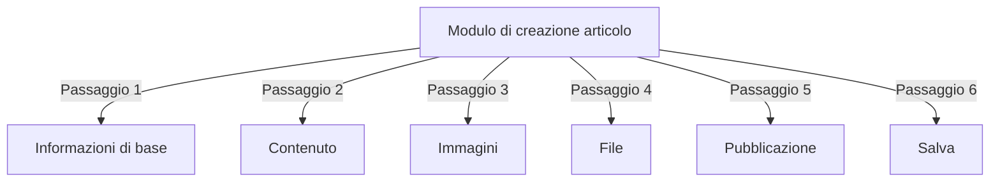
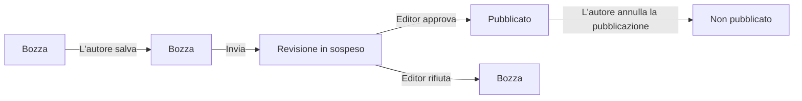
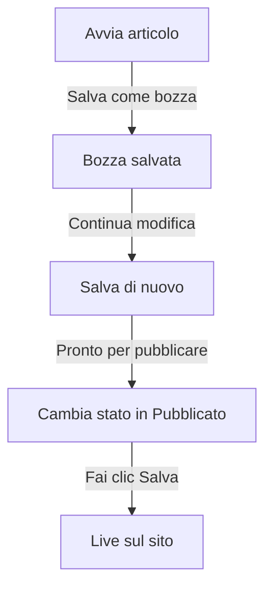

# Creazione di articoli in Publisher

> Guida passo-passo per creare, modificare, formattare e pubblicare articoli nel modulo Publisher.

---

## Accedi alla gestione degli articoli

### Navigazione del pannello amministrativo

```
Pannello amministrativo
└── Moduli
    └── Publisher
        └── Articoli
            ├── Crea nuovo
            ├── Modifica
            ├── Elimina
            └── Pubblica
```

### Percorso più veloce

1. Accedi come **Amministratore**
2. Fai clic su **Moduli** nella barra di amministrazione
3. Trova **Publisher**
4. Fai clic sul collegamento **Admin**
5. Fai clic su **Articoli** nel menu sinistro
6. Fai clic sul pulsante **Aggiungi articolo**

---

## Modulo di creazione dell'articolo

### Informazioni di base

Quando si crea un nuovo articolo, compila le seguenti sezioni:



---

## Passaggio 1: Informazioni di base

### Campi obbligatori

#### Titolo dell'articolo

```
Campo: Titolo
Tipo: Input di testo (obbligatorio)
Lunghezza massima: 255 caratteri
Esempio: "I 5 migliori suggerimenti per una fotografia migliore"
```

**Linee guida:**
- Descrittivo e specifico
- Includi parole chiave per SEO
- Evita MAIUSCOLE
- Mantieni sotto 60 caratteri per la migliore visualizzazione

#### Seleziona categoria

```
Campo: Categoria
Tipo: Elenco a discesa (obbligatorio)
Opzioni: Elenco di categorie create
Esempio: Fotografia > Tutorial
```

**Suggerimenti:**
- Categorie genitore e sottocategorie disponibili
- Scegli la categoria più pertinente
- Solo una categoria per articolo
- Può essere cambiata in seguito

#### Sottotitolo dell'articolo (facoltativo)

```
Campo: Sottotitolo
Tipo: Input di testo (facoltativo)
Lunghezza massima: 255 caratteri
Esempio: "Impara i fondamenti della fotografia in 5 semplici passi"
```

**Usare per:**
- Titolo di riepilogo
- Testo teaser
- Titolo esteso

### Descrizione dell'articolo

#### Breve descrizione

```
Campo: Breve descrizione
Tipo: Textarea (facoltativo)
Lunghezza massima: 500 caratteri
```

**Scopo:**
- Testo di anteprima dell'articolo
- Visualizzato nell'elenco categorie
- Utilizzato nei risultati di ricerca
- Descrizione meta per SEO

**Esempio:**
```
"Scopri tecniche fotografiche essenziali che trasformeranno le tue foto
da ordinarie a straordinarie. Questa guida completa copre composizione,
illuminazione e impostazioni di esposizione."
```

#### Contenuto completo

```
Campo: Corpo dell'articolo
Tipo: Editor WYSIWYG (obbligatorio)
Lunghezza massima: Illimitata
Formato: HTML
```

L'area principale del contenuto dell'articolo con editing rich text.

---

## Passaggio 2: Formattazione del contenuto

### Utilizzo dell'editor WYSIWYG

#### Formattazione del testo

```
Grassetto:           Ctrl+B oppure fai clic sul pulsante [B]
Corsivo:             Ctrl+I oppure fai clic sul pulsante [I]
Sottolineato:        Ctrl+U oppure fai clic sul pulsante [U]
Barrato:             Alt+Maiusc+D oppure fai clic sul pulsante [S]
Pedice:              Ctrl+, (virgola)
Apice:               Ctrl+. (punto)
```

#### Struttura dei titoli

Crea una gerarchia di documenti corretta:

```html
<h1>Titolo dell'articolo</h1>      <!-- Usa una volta in alto -->
<h2>Sezione principale</h2>         <!-- Per sezioni importanti -->
<h3>Sottosezione</h3>               <!-- Per sottotopic -->
<h4>Sottosottosezione</h4>          <!-- Per dettagli -->
```

**Nell'editor:**
- Fai clic sul menu a discesa **Formato**
- Seleziona il livello di intestazione (H1-H6)
- Digita la tua intestazione

#### Elenchi

**Elenco puntato (Bullet):**

```markdown
• Primo punto
• Secondo punto
• Terzo punto
```

Passaggi nell'editor:
1. Fai clic sul pulsante [≡] Elenco puntato
2. Digita ogni punto
3. Premi Invio per il prossimo elemento
4. Premi Backspace due volte per terminare l'elenco

**Elenco numerato (Numerato):**

```markdown
1. Primo passaggio
2. Secondo passaggio
3. Terzo passaggio
```

Passaggi nell'editor:
1. Fai clic sul pulsante [1.] Elenco numerato
2. Digita ogni elemento
3. Premi Invio per il prossimo
4. Premi Backspace due volte per terminare

**Elenchi nidificati:**

```markdown
1. Punto principale
   a. Sottopunto
   b. Sottopunto
2. Prossimo punto
```

Passaggi:
1. Crea il primo elenco
2. Premi Tab per indentare
3. Crea elementi nidificati
4. Premi Maiusc+Tab per dedentare

#### Collegamenti

**Aggiungi collegamento ipertestuale:**

1. Seleziona testo da collegare
2. Fai clic sul pulsante **[🔗] Collegamento**
3. Inserisci URL: `https://example.com`
4. Facoltativo: Aggiungi titolo/target
5. Fai clic su **Inserisci collegamento**

**Rimuovi collegamento:**

1. Fai clic all'interno del testo collegato
2. Fai clic sul pulsante **[🔗] Rimuovi collegamento**

#### Codice e citazioni

**Citazione in blocco:**

```
"Questa è un'importante citazione di un esperto"
- Attribuzione
```

Passaggi:
1. Digita il testo della citazione
2. Fai clic sul pulsante **[❝] Citazione in blocco**
3. Il testo è rientrato e stilizzato

**Blocco di codice:**

```python
def hello_world():
    print("Hello, World!")
```

Passaggi:
1. Fai clic su **Formato → Codice**
2. Incolla il codice
3. Seleziona il linguaggio (facoltativo)
4. Il codice viene visualizzato con evidenziazione della sintassi

---

## Passaggio 3: Aggiunta di immagini

### Immagine in primo piano (Hero Image)

```
Campo: Immagine in primo piano / Immagine principale
Tipo: Caricamento immagine
Formato: JPG, PNG, GIF, WebP
Dimensione massima: 5 MB
Consigliato: 600x400 px
```

**Per caricare:**

1. Fai clic sul pulsante **Carica immagine**
2. Seleziona l'immagine dal computer
3. Ritaglia/ridimensiona se necessario
4. Fai clic su **Usa questa immagine**

**Posizionamento dell'immagine:**
- Visualizzato in cima all'articolo
- Utilizzato negli elenchi categorie
- Mostrato nell'archivio
- Utilizzato per la condivisione social

### Immagini inline

Inserisci immagini all'interno del testo dell'articolo:

1. Posiziona il cursore nell'editor dove deve andare l'immagine
2. Fai clic sul pulsante **[🖼️] Immagine** nella barra degli strumenti
3. Scegli l'opzione di caricamento:
   - Carica nuova immagine
   - Seleziona dalla galleria
   - Inserisci URL immagine
4. Configura:
   ```
   Dimensione immagine:
   - Larghezza: 300-600 px
   - Altezza: Automatica (mantiene proporzione)
   - Allineamento: Sinistra/Centro/Destra
   ```
5. Fai clic su **Inserisci immagine**

**Avvolgi testo attorno all'immagine:**

Nell'editor dopo l'inserimento:

```html
<!-- L'immagine galleggia a sinistra, il testo si avvolge intorno -->

```

### Galleria di immagini

Crea una galleria multi-immagine:

1. Fai clic sul pulsante **Galleria** (se disponibile)
2. Carica più immagini:
   - Clic singolo: Aggiungi uno
   - Trascinamento: Aggiungi più
3. Organizza l'ordine trascinando
4. Imposta didascalie per ogni immagine
5. Fai clic su **Crea galleria**

---

## Passaggio 4: Allegato di file

### Aggiungi allegati di file

```
Campo: Allegati di file
Tipo: Caricamento file (più consentiti)
Supportato: PDF, DOC, XLS, ZIP, ecc.
Max per file: 10 MB
Max per articolo: 5 file
```

**Per allegare:**

1. Fai clic sul pulsante **Aggiungi file**
2. Seleziona il file dal computer
3. Facoltativo: Aggiungi descrizione del file
4. Fai clic su **Allega file**
5. Ripeti per più file

**Esempi di file:**
- Guide PDF
- Fogli di calcolo Excel
- Documenti Word
- Archivi ZIP
- Codice sorgente

### Gestisci file allegati

**Modifica file:**

1. Fai clic sul nome del file
2. Modifica la descrizione
3. Fai clic su **Salva**

**Elimina file:**

1. Trova il file nell'elenco
2. Fai clic sull'icona **[×] Elimina**
3. Conferma l'eliminazione

---

## Passaggio 5: Pubblicazione e stato

### Stato dell'articolo

```
Campo: Stato
Tipo: Elenco a discesa
Opzioni:
  - Bozza: Non pubblicato, solo l'autore vede
  - In sospeso: In attesa di approvazione
  - Pubblicato: Live sul sito
  - Archiviato: Contenuto vecchio
  - Non pubblicato: Era pubblicato, ora nascosto
```

**Flusso di stato del lavoro:**



### Opzioni di pubblicazione

#### Pubblica immediatamente

```
Stato: Pubblicato
Data inizio: Oggi (compilato automaticamente)
Data fine: (lascia vuoto per nessuna scadenza)
```

#### Programma per dopo

```
Stato: Programmato
Data inizio: Data/ora futura
Esempio: 15 febbraio 2024 alle 9:00 AM
```

L'articolo sarà pubblicato automaticamente all'ora specificata.

#### Imposta scadenza

```
Abilita scadenza: Sì
Data di scadenza: Data futura
Azione: Archivio/Nascondi/Elimina
Esempio: 1° aprile 2024 (articolo si archivia automaticamente)
```

### Opzioni di visibilità

```yaml
Mostra articolo:
  - Visualizza in prima pagina: Sì/No
  - Mostra in categoria: Sì/No
  - Includi in ricerca: Sì/No
  - Includi in articoli recenti: Sì/No

Articolo in primo piano:
  - Contrassegna come in primo piano: Sì/No
  - Posizione sezione in primo piano: (numero)
```

---

## Passaggio 6: SEO e metadati

### Impostazioni SEO

```
Campo: Impostazioni SEO (Espandi sezione)
```

#### Meta descrizione

```
Campo: Meta descrizione
Tipo: Testo (160 caratteri consigliati)
Utilizzato da: Motori di ricerca, social media

Esempio:
"Impara i fondamenti della fotografia in 5 semplici passi.
Scopri tecniche di composizione, illuminazione e esposizione."
```

#### Parole chiave meta

```
Campo: Parole chiave meta
Tipo: Elenco separato da virgole
Max: 5-10 parole chiave

Esempio: Fotografia, Tutorial, Composizione, Illuminazione, Esposizione
```

#### Slug URL

```
Campo: Slug URL (generato automaticamente dal titolo)
Tipo: Testo
Formato: minuscolo, trattini, senza spazi

Automatico: "i-5-migliori-suggerimenti-per-una-fotografia-migliore"
Modifica: Cambia prima di pubblicare
```

#### Tag Open Graph

Generati automaticamente dalle informazioni dell'articolo:
- Titolo
- Descrizione
- Immagine in primo piano
- URL articolo
- Data di pubblicazione

Utilizzati da Facebook, LinkedIn, WhatsApp, ecc.

---

## Passaggio 7: Commenti e interazione

### Impostazioni dei commenti

```yaml
Consenti commenti:
  - Abilita: Sì/No
  - Predefinito: Eredita da preferenze
  - Sovrascrivi: Specifico per questo articolo

Modera commenti:
  - Richiedi approvazione: Sì/No
  - Predefinito: Eredita da preferenze
```

### Impostazioni valutazione

```yaml
Consenti valutazioni:
  - Abilita: Sì/No
  - Scala: 5 stelle (predefinito)
  - Mostra media: Sì/No
  - Mostra conteggio: Sì/No
```

---

## Passaggio 8: Opzioni avanzate

### Autore e byline

```
Campo: Autore
Tipo: Elenco a discesa
Predefinito: Utente corrente
Opzioni: Tutti gli utenti con autorizzazione autore

Visualizza:
  - Mostra nome autore: Sì/No
  - Mostra biografia autore: Sì/No
  - Mostra avatar autore: Sì/No
```

### Blocco di modifica

```
Campo: Blocco di modifica
Scopo: Previeni modifiche accidentali

Articolo di blocco:
  - Bloccato: Sì/No
  - Motivo blocco: "Versione finale"
  - Data sblocco: (facoltativo)
```

### Cronologia revisioni

Versioni salvate automaticamente dell'articolo:

```
Visualizza revisioni:
  - Fai clic su "Cronologia revisioni"
  - Mostra tutte le versioni salvate
  - Confronta versioni
  - Ripristina versione precedente
```

---

## Salvataggio e pubblicazione

### Flusso di lavoro Salva



### Salva articolo

**Salvataggio automatico:**
- Attivato ogni 60 secondi
- Salva automaticamente come bozza
- Mostra "Ultimo salvataggio: 2 minuti fa"

**Salvataggio manuale:**
- Fai clic su **Salva e continua** per continuare a modificare
- Fai clic su **Salva e visualizza** per vedere la versione pubblicata
- Fai clic su **Salva** per salvare e chiudere

### Pubblica articolo

1. Imposta **Stato**: Pubblicato
2. Imposta **Data inizio**: Adesso (o data futura)
3. Fai clic su **Salva** o **Pubblica**
4. Viene visualizzato il messaggio di conferma
5. L'articolo è live (o programmato)

---

## Modifica di articoli esistenti

### Accedi all'editor dell'articolo

1. Vai a **Admin → Publisher → Articoli**
2. Trova l'articolo nell'elenco
3. Fai clic sull'icona/pulsante **Modifica**
4. Apporta modifiche
5. Fai clic su **Salva**

### Modifica in blocco

Modifica più articoli contemporaneamente:

```
1. Vai all'elenco Articoli
2. Seleziona articoli (caselle di controllo)
3. Scegli "Modifica in blocco" dal menu a discesa
4. Modifica il campo selezionato
5. Fai clic su "Aggiorna tutto"

Disponibile per:
  - Stato
  - Categoria
  - In primo piano (Sì/No)
  - Autore
```

### Articolo di anteprima

Prima di pubblicare:

1. Fai clic sul pulsante **Anteprima**
2. Visualizza come i lettori vedranno
3. Controlla la formattazione
4. Prova i collegamenti
5. Torna all'editor per regolare

---

## Gestione articoli

### Visualizza tutti gli articoli

**Vista elenco articoli:**

```
Admin → Publisher → Articoli

Colonne:
  - Titolo
  - Categoria
  - Autore
  - Stato
  - Data creazione
  - Data modifica
  - Azioni (Modifica, Elimina, Anteprima)

Ordinamento:
  - Per titolo (A-Z)
  - Per data (più nuovo/più vecchio)
  - Per stato (Pubblicato/Bozza)
  - Per categoria
```

### Filtra articoli

```
Opzioni filtro:
  - Per categoria
  - Per stato
  - Per autore
  - Per intervallo di date
  - Ricerca per titolo

Esempio: Mostra tutti gli articoli "Bozza" di "Giovanni" nella categoria "News"
```

### Elimina articolo

**Soft Delete (consigliato):**

1. Cambia **Stato**: Non pubblicato
2. Fai clic su **Salva**
3. L'articolo è nascosto ma non eliminato
4. Può essere ripristinato in seguito

**Hard Delete:**

1. Seleziona articolo nell'elenco
2. Fai clic sul pulsante **Elimina**
3. Conferma l'eliminazione
4. L'articolo viene rimosso permanentemente

---

## Best practice sui contenuti

### Scrittura di articoli di qualità

```
Struttura:
  ✓ Titolo accattivante
  ✓ Sottotitolo/descrizione chiara
  ✓ Paragrafo di apertura accattivante
  ✓ Sezioni logiche con intestazioni
  ✓ Supporto visivo
  ✓ Conclusione/riepilogo
  ✓ Invito all'azione

Lunghezza:
  - Post di blog: 500-2000 parole
  - Notizie: 300-800 parole
  - Guide: 2000-5000 parole
  - Minimo: 300 parole
```

### Ottimizzazione SEO

```
Ottimizzazione titolo:
  ✓ Includi parola chiave primaria
  ✓ Mantieni sotto 60 caratteri
  ✓ Metti parola chiave all'inizio
  ✓ Sii descrittivo e specifico

Ottimizzazione contenuto:
  ✓ Usa intestazioni (H1, H2, H3)
  ✓ Includi parola chiave in intestazione
  ✓ Usa grassetto per termini importanti
  ✓ Aggiungi collegamenti descrittivi
  ✓ Includi immagini con alt text

Meta descrizione:
  ✓ Includi parola chiave primaria
  ✓ 155-160 caratteri
  ✓ Orientato all'azione
  ✓ Univoco per articolo
```

### Suggerimenti di formattazione

```
Leggibilità:
  ✓ Paragrafi brevi (2-4 frasi)
  ✓ Elenchi puntati per elenchi
  ✓ Sottointestazioni ogni 300 parole
  ✓ Spazio bianco generoso
  ✓ Interruzioni di riga tra sezioni

Appeal visivo:
  ✓ Immagine in primo piano in cima
  ✓ Immagini inline nel contenuto
  ✓ Alt text su tutte le immagini
  ✓ Blocchi di codice per contenuti tecnici
  ✓ Citazioni in blocco per enfasi
```

---

## Scorciatoie da tastiera

### Scorciatoie dell'editor

```
Grassetto:               Ctrl+B
Corsivo:                 Ctrl+I
Sottolineato:            Ctrl+U
Collegamento:            Ctrl+K
Salva bozza:             Ctrl+S
```

### Scorciatoie di testo

```
-- →  (trattino a em dash)
... → … (tre punti a ellissi)
(c) → © (copyright)
(r) → ® (registrato)
(tm) → ™ (marchio registrato)
```

---

## Attività comuni

### Copia articolo

1. Apri articolo
2. Fai clic sul pulsante **Duplica** o **Clona**
3. L'articolo è copiato come bozza
4. Modifica titolo e contenuto
5. Pubblica

### Articolo programmato

1. Crea articolo
2. Imposta **Data inizio**: Data/ora futura
3. Imposta **Stato**: Pubblicato
4. Fai clic su **Salva**
5. L'articolo si pubblica automaticamente

### Pubblicazione in lotto

1. Crea articoli come bozze
2. Imposta date di pubblicazione
3. Gli articoli si pubblicano automaticamente all'ora programmata
4. Monitorare dalla visualizzazione "Programmati"

### Sposta tra categorie

1. Modifica articolo
2. Cambia il menu a discesa **Categoria**
3. Fai clic su **Salva**
4. L'articolo appare nella nuova categoria

---

## Risoluzione dei problemi

### Problema: Non riesci a salvare l'articolo

**Soluzione:**
```
1. Controlla il modulo per i campi obbligatori
2. Verifica che la categoria sia selezionata
3. Controlla il limite di memoria PHP
4. Prova a salvare prima come bozza
5. Cancella la cache del browser
```

### Problema: Le immagini non vengono visualizzate

**Soluzione:**
```
1. Verifica che il caricamento dell'immagine sia riuscito
2. Controlla il formato del file immagine (JPG, PNG)
3. Verifica il percorso dell'immagine nel database
4. Controlla i permessi della directory di caricamento
5. Prova a ricaricare l'immagine
```

### Problema: Barra degli strumenti dell'editor non visualizzata

**Soluzione:**
```
1. Cancella la cache del browser
2. Prova un browser diverso
3. Disabilita le estensioni del browser
4. Controlla la console JavaScript per errori
5. Verifica che il plug-in editor sia installato
```

### Problema: L'articolo non sta pubblicando

**Soluzione:**
```
1. Verifica Stato = "Pubblicato"
2. Controlla che la data di inizio sia oggi o prima
3. Verifica che i permessi consentano la pubblicazione
4. Controlla che la categoria sia pubblicata
5. Cancella la cache del modulo
```

---

## Guide correlate

- Guida di configurazione
- Gestione categorie
- Configurazione dei permessi
- Personalizzazione modelli

---

## Passi successivi

- Crea il tuo primo articolo
- Imposta categorie
- Configura permessi
- Rivedi personalizzazione modelli

---

#publisher #articles #content #creation #formatting #editing #xoops
