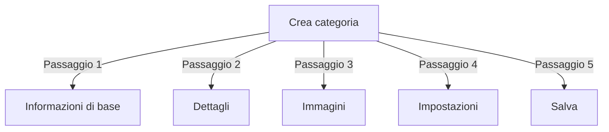

# Gestione delle categorie in Publisher

> Guida completa alla creazione, organizzazione di gerarchie e gestione delle categorie nel modulo Publisher.

---

## Nozioni di base sulle categorie

### Cosa sono le categorie?

Le categorie organizzano gli articoli in gruppi logici:

```
Struttura di esempio:

  Notizie (Categoria principale)
    ├── Tecnologia
    ├── Sport
    └── Intrattenimento

  Tutorial (Categoria principale)
    ├── Fotografia
    │   ├── Basi
    │   └── Avanzate
    └── Scrittura
        └── Blog
```

### Vantaggi di una buona struttura di categorie

```
✓ Migliore navigazione dell'utente
✓ Contenuto organizzato
✓ Miglioramento SEO
✓ Gestione dei contenuti più facile
✓ Miglior flusso di lavoro editoriale
```

---

## Accedi alla gestione delle categorie

### Navigazione del pannello amministrativo

```
Pannello amministrativo
└── Moduli
    └── Publisher
        └── Categorie
            ├── Crea nuovo
            ├── Modifica
            ├── Elimina
            ├── Autorizzazioni
            └── Organizza
```

### Accesso rapido

1. Accedi come **Amministratore**
2. Vai a **Admin → Moduli**
3. Fai clic su **Publisher → Admin**
4. Fai clic su **Categorie** nel menu sinistro

---

## Creazione di categorie

### Modulo di creazione della categoria



### Passaggio 1: Informazioni di base

#### Nome della categoria

```
Campo: Nome della categoria
Tipo: Input di testo (obbligatorio)
Lunghezza massima: 100 caratteri
Unicità: Dovrebbe essere unico
Esempio: "Fotografia"
```

**Linee guida:**
- Descrittivo e singolare o plurale coerente
- Capitalizzazione adeguata
- Evita caratteri speciali
- Mantieni ragionevolmente breve

#### Descrizione della categoria

```
Campo: Descrizione
Tipo: Textarea (facoltativo)
Lunghezza massima: 500 caratteri
Utilizzato in: Pagine di elenco categorie, blocchi categorie
```

**Scopo:**
- Spiega il contenuto della categoria
- Appare sopra gli articoli della categoria
- Aiuta gli utenti a comprendere l'ambito
- Utilizzato per descrizione meta SEO

**Esempio:**
```
"Suggerimenti di fotografia, tutorial e ispirazione per
tutti i livelli di abilità. Dalle basi della composizione ai
tecniche avanzate di illuminazione, padroneggia il tuo mestiere."
```

### Passaggio 2: Categoria principale

#### Crea gerarchia

```
Campo: Categoria principale
Tipo: Elenco a discesa
Opzioni: Nessuno (radice) o categorie esistenti
```

**Esempi di gerarchia:**

```
Struttura piatta:
  Notizie
  Tutorial
  Recensioni

Struttura nidificata:
  Notizie
    Tecnologia
    Business
    Sport
  Tutorial
    Fotografia
      Basi
      Avanzate
    Scrittura
```

**Crea sottocategoria:**

1. Fai clic sul menu a discesa **Categoria principale**
2. Seleziona genitore (es. "Notizie")
3. Compila nome categoria
4. Salva
5. La nuova categoria appare come figlio

### Passaggio 3: Immagine della categoria

#### Carica immagine della categoria

```
Campo: Immagine della categoria
Tipo: Caricamento immagine (facoltativo)
Formato: JPG, PNG, GIF, WebP
Dimensione massima: 5 MB
Consigliato: 300x200 px (o dimensione del tuo tema)
```

**Per caricare:**

1. Fai clic sul pulsante **Carica immagine**
2. Seleziona l'immagine dal computer
3. Ritaglia/ridimensiona se necessario
4. Fai clic su **Usa questa immagine**

**Dove viene utilizzata:**
- Pagina di elenco categorie
- Intestazione blocco categoria
- Breadcrumb (alcuni temi)
- Condivisione social media

### Passaggio 4: Impostazioni della categoria

#### Impostazioni di visualizzazione

```yaml
Stato:
  - Abilitato: Sì/No
  - Nascosto: Sì/No (nascosto dai menu, ancora accessibile)

Opzioni di visualizzazione:
  - Mostra descrizione: Sì/No
  - Mostra immagine: Sì/No
  - Mostra conteggio articoli: Sì/No
  - Mostra sottocategorie: Sì/No

Layout:
  - Articoli per pagina: 10-50
  - Ordine di visualizzazione: Data/Titolo/Autore
  - Direzione di visualizzazione: Ascendente/Discendente
```

#### Autorizzazioni della categoria

```yaml
Chi può visualizzare:
  - Anonimo: Sì/No
  - Registrato: Sì/No
  - Gruppi specifici: Configura per gruppo

Chi può inviare:
  - Registrato: Sì/No
  - Gruppi specifici: Configura per gruppo
  - L'autore deve avere: autorizzazione "invia articoli"
```

### Passaggio 5: Impostazioni SEO

#### Meta tag

```
Campo: Meta descrizione
Tipo: Testo (160 caratteri)
Scopo: Descrizione motore di ricerca

Campo: Parole chiave meta
Tipo: Elenco separato da virgole
Esempio: fotografia, tutorial, suggerimenti, tecniche
```

#### Configurazione URL

```
Campo: URL Slug
Tipo: Testo
Generato automaticamente dal nome della categoria
Esempio: "fotografia" da "Fotografia"
Può essere personalizzato prima del salvataggio
```

### Salva categoria

1. Compila tutti i campi obbligatori:
   - Nome della categoria ✓
   - Descrizione (consigliata)
2. Facoltativo: Carica immagine, imposta SEO
3. Fai clic su **Salva categoria**
4. Viene visualizzato il messaggio di conferma
5. La categoria è ora disponibile

---

## Gerarchia di categorie

### Crea struttura nidificata

```
Esempio passo-passo: Crea Notizie → sottocategoria Tecnologia

1. Vai all'admin Categorie
2. Fai clic su "Aggiungi categoria"
3. Nome: "Notizie"
4. Genitore: (lascia vuoto - questo è radice)
5. Salva
6. Fai clic su "Aggiungi categoria" di nuovo
7. Nome: "Tecnologia"
8. Genitore: "Notizie" (seleziona dal menu a discesa)
9. Salva
```

### Visualizza albero di gerarchia

```
La vista Categorie mostra la struttura ad albero:

📁 Notizie
  📄 Tecnologia
  📄 Sport
  📄 Intrattenimento
📁 Tutorial
  📄 Fotografia
    📄 Basi
    📄 Avanzate
  📄 Scrittura
```

Fai clic sui frecce di espansione per mostrare/nascondere sottocategorie.

### Riorganizza categorie

#### Sposta categoria

1. Vai all'elenco Categorie
2. Fai clic su **Modifica** sulla categoria
3. Cambia **Categoria principale**
4. Fai clic su **Salva**
5. La categoria si sposta nella nuova posizione

#### Riordina categorie

Se disponibile, usa il trascinamento:

1. Vai all'elenco Categorie
2. Fai clic e trascina la categoria
3. Rilascia nella nuova posizione
4. L'ordine si salva automaticamente

#### Elimina categoria

**Opzione 1: Soft Delete (Nascondi)**

1. Modifica categoria
2. Imposta **Stato**: Disabilitato
3. Fai clic su **Salva**
4. La categoria è nascosta ma non eliminata

**Opzione 2: Hard Delete**

1. Vai all'elenco Categorie
2. Fai clic su **Elimina** sulla categoria
3. Scegli azione per articoli:
   ```
   ☐ Sposta articoli nella categoria principale
   ☐ Sposta articoli nella radice (Notizie)
   ☐ Elimina tutti gli articoli nella categoria
   ```
4. Conferma l'eliminazione

---

## Operazioni sulle categorie

### Modifica categoria

1. Vai a **Admin → Publisher → Categorie**
2. Fai clic su **Modifica** sulla categoria
3. Modifica i campi:
   - Nome
   - Descrizione
   - Categoria principale
   - Immagine
   - Impostazioni
4. Fai clic su **Salva**

### Modifica autorizzazioni della categoria

1. Vai a Categorie
2. Fai clic su **Autorizzazioni** sulla categoria (o fai clic sulla categoria, poi su Autorizzazioni)
3. Configura i gruppi:

```
Per ogni gruppo:
  ☐ Visualizza articoli in questa categoria
  ☐ Invia articoli a questa categoria
  ☐ Modifica i tuoi articoli
  ☐ Modifica tutti gli articoli
  ☐ Approva/Modera articoli
  ☐ Gestisci categoria
```

4. Fai clic su **Salva autorizzazioni**

### Imposta immagine della categoria

**Carica nuova immagine:**

1. Modifica categoria
2. Fai clic su **Cambia immagine**
3. Carica o seleziona immagine
4. Ritaglia/ridimensiona
5. Fai clic su **Usa immagine**
6. Fai clic su **Salva categoria**

**Rimuovi immagine:**

1. Modifica categoria
2. Fai clic su **Rimuovi immagine** (se disponibile)
3. Fai clic su **Salva categoria**

---

## Autorizzazioni delle categorie

### Matrice di autorizzazioni

```
                 Anonimo  Registrato  Editor  Admin
Visualizza categoria    ✓      ✓        ✓      ✓
Invia articolo          ✗      ✓        ✓      ✓
Modifica articolo proprio ✗     ✓        ✓      ✓
Modifica tutti gli articoli ✗   ✗        ✓      ✓
Moderazione articoli     ✗      ✗        ✓      ✓
Gestisci categoria       ✗      ✗        ✗      ✓
```

### Imposta autorizzazioni a livello di categoria

#### Controllo accesso per categoria

1. Vai all'elenco **Categorie**
2. Seleziona una categoria
3. Fai clic su **Autorizzazioni**
4. Per ogni gruppo, seleziona autorizzazioni:

```
Esempio: Categoria Notizie
  Anonimo:   Solo visualizzazione
  Registrato: Invia articoli
  Editor:     Approva articoli
  Admin:      Controllo completo
```

5. Fai clic su **Salva**

#### Autorizzazioni a livello di campo

Controlla quali campi del modulo gli utenti possono vedere/modificare:

```
Esempio: Limita visibilità dei campi per utenti registrati

Gli utenti registrati possono vedere/modificare:
  ✓ Titolo
  ✓ Descrizione
  ✓ Contenuto
  ✗ Autore (impostato automaticamente all'utente corrente)
  ✗ Data programmata (solo editor)
  ✗ In primo piano (solo admin)
```

**Configura in:**
- Autorizzazioni categoria
- Cerca sezione "Visibilità campo"

---

## Best practice per categorie

### Struttura della categoria

```
✓ Mantieni gerarchia 2-3 livelli di profondità
✗ Non creare troppe categorie di primo livello
✗ Non creare categorie con un articolo

✓ Usa denominazione coerente (plurale o singolare)
✗ Non usare nomi vaghi ("Stuff", "Altro")

✓ Crea categorie per articoli che esistono
✗ Non creare categorie vuote in anticipo
```

### Linee guida di denominazione

```
Buoni nomi:
  "Fotografia"
  "Sviluppo web"
  "Suggerimenti di viaggio"
  "Notizie commerciali"

Evita:
  "Articoli" (troppo vago)
  "Contenuto" (ridondante)
  "Notizie&Aggiornamenti" (incoerente)
  "FOTOGRAFIA STUFF" (formattazione)
```

### Suggerimenti per l'organizzazione

```
Per argomento:
  Notizie
    Tecnologia
    Sport
    Intrattenimento

Per tipo:
  Tutorial
    Video
    Testo
    Interattivo

Per pubblico:
  Per principianti
  Per esperti
  Case study

Geografico:
  Nord America
    Stati Uniti
    Canada
  Europa
```

---

## Blocchi di categorie

### Blocco categorie Publisher

Visualizza elenchi di categorie sul tuo sito:

1. Vai a **Admin → Blocchi**
2. Trova **Publisher - Categorie**
3. Fai clic su **Modifica**
4. Configura:

```
Titolo blocco: "Categorie di notizie"
Mostra sottocategorie: Sì/No
Mostra conteggio articoli: Sì/No
Altezza: (pixel o auto)
```

5. Fai clic su **Salva**

### Blocco articoli della categoria

Mostra articoli recenti da una categoria specifica:

1. Vai a **Admin → Blocchi**
2. Trova **Publisher - Articoli della categoria**
3. Fai clic su **Modifica**
4. Seleziona:

```
Categoria: Notizie (o categoria specifica)
Numero di articoli: 5
Mostra immagini: Sì/No
Mostra descrizione: Sì/No
```

5. Fai clic su **Salva**

---

## Analitiche delle categorie

### Visualizza statistiche della categoria

Dall'admin Categorie:

```
Ogni categoria mostra:
  - Articoli totali: 45
  - Pubblicato: 42
  - Bozza: 2
  - In attesa di approvazione: 1
  - Visualizzazioni totali: 5.234
  - Ultimo articolo: 2 ore fa
```

### Visualizza traffico della categoria

Se analitiche abilitate:

1. Fai clic sul nome della categoria
2. Fai clic sulla scheda **Statistiche**
3. Visualizza:
   - Visualizzazioni pagina
   - Articoli popolari
   - Tendenze di traffico
   - Termini di ricerca utilizzati

---

## Modelli di categorie

### Personalizza visualizzazione della categoria

Se si utilizza modelli personalizzati, ogni categoria può eseguire l'override:

```
publisher_category.tpl
  ├── Intestazione categoria
  ├── Descrizione categoria
  ├── Immagine categoria
  ├── Elenco articoli
  └── Impaginazione
```

**Per personalizzare:**

1. Copia file modello
2. Modifica HTML/CSS
3. Assegna a categoria in admin
4. La categoria utilizza modello personalizzato

---

## Attività comuni

### Crea gerarchia di notizie

```
Admin → Publisher → Categorie
1. Crea "Notizie" (principale)
2. Crea "Tecnologia" (principale: Notizie)
3. Crea "Sport" (principale: Notizie)
4. Crea "Intrattenimento" (principale: Notizie)
```

### Sposta articoli tra categorie

1. Vai all'admin **Articoli**
2. Seleziona articoli (caselle di controllo)
3. Seleziona **"Cambia categoria"** dal menu a discesa azioni in blocco
4. Scegli nuova categoria
5. Fai clic su **Aggiorna tutto**

### Nascondi categoria senza eliminarla

1. Modifica categoria
2. Imposta **Stato**: Disabilitato/Nascosto
3. Salva
4. La categoria non è mostrata nei menu (ancora accessibile tramite URL)

### Crea categoria per bozze

```
Best practice:

Crea categoria "In revisione"
  ├── Scopo: Articoli in attesa di approvazione
  ├── Autorizzazioni: Nascosto dal pubblico
  ├── Solo admin/editor possono vedere
  ├── Sposta articoli qui fino all'approvazione
  └── Sposta in "Notizie" quando pubblicato
```

---

## Importa/Esporta categorie

### Esporta categorie

Se disponibile:

1. Vai all'admin **Categorie**
2. Fai clic su **Esporta**
3. Seleziona formato: CSV/JSON/XML
4. Scarica file
5. Backup salvato

### Importa categorie

Se disponibile:

1. Prepara file con categorie
2. Vai all'admin **Categorie**
3. Fai clic su **Importa**
4. Carica file
5. Scegli strategia di aggiornamento:
   - Crea solo nuove
   - Aggiorna esistenti
   - Sostituisci tutto
6. Fai clic su **Importa**

---

## Risoluzione dei problemi delle categorie

### Problema: Le sottocategorie non vengono visualizzate

**Soluzione:**
```
1. Verifica che lo stato della categoria principale sia "Abilitato"
2. Controlla le autorizzazioni consentono la visualizzazione
3. Verifica che le sottocategorie abbiano stato "Abilitato"
4. Cancella la cache: Admin → Strumenti → Cancella cache
5. Controlla il tema mostra le sottocategorie
```

### Problema: Non riesci a eliminare la categoria

**Soluzione:**
```
1. La categoria deve non avere articoli
2. Sposta o elimina prima gli articoli:
   Admin → Articoli
   Seleziona articoli nella categoria
   Cambia categoria in un'altra
3. Quindi elimina la categoria vuota
4. O scegli l'opzione "sposta articoli" quando elimini
```

### Problema: L'immagine della categoria non viene visualizzata

**Soluzione:**
```
1. Verifica che l'immagine sia stata caricata correttamente
2. Controlla il formato del file immagine (JPG, PNG)
3. Verifica i permessi della directory di caricamento
4. Controlla che il tema visualizzi le immagini della categoria
5. Prova a ricaricare l'immagine
6. Cancella la cache del browser
```

### Problema: Le autorizzazioni non hanno effetto

**Soluzione:**
```
1. Controlla le autorizzazioni del gruppo nella categoria
2. Controlla le autorizzazioni globali di Publisher
3. Controlla che l'utente appartenga al gruppo configurato
4. Cancella la cache della sessione
5. Esci e accedi di nuovo
6. Controlla che i moduli di autorizzazione siano installati
```

---

## Checklist best practice per categorie

Prima di distribuire le categorie:

- [ ] La gerarchia ha 2-3 livelli di profondità
- [ ] Ogni categoria ha 5+ articoli
- [ ] I nomi delle categorie sono coerenti
- [ ] Le autorizzazioni sono appropriate
- [ ] Le immagini della categoria sono ottimizzate
- [ ] Le descrizioni sono complete
- [ ] I metadati SEO sono compilati
- [ ] Gli URL sono amichevoli
- [ ] Le categorie sono testate nel front-end
- [ ] La documentazione è aggiornata

---

## Guide correlate

- Creazione di articoli
- Gestione permessi
- Configurazione moduli
- Guida all'installazione

---

## Passi successivi

- Crea articoli nelle categorie
- Configura permessi
- Personalizza con modelli personalizzati

---

#publisher #categories #organization #hierarchy #management #xoops
