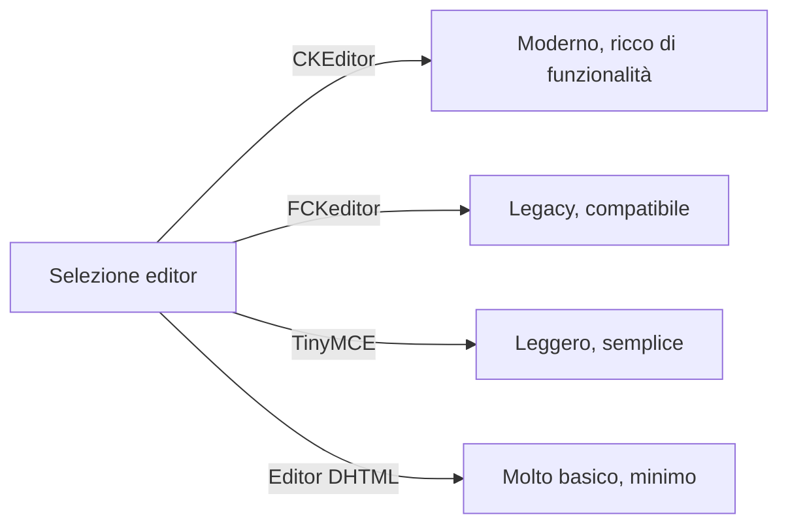
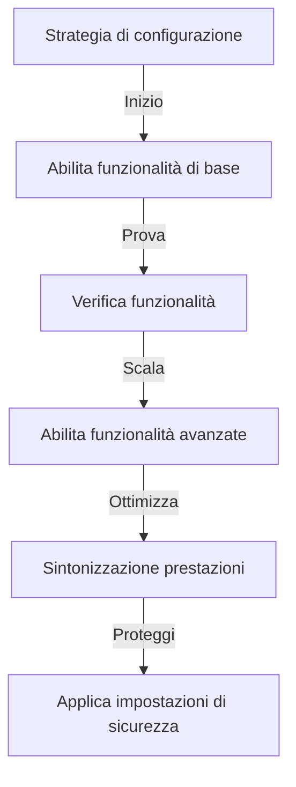

# Configurazione di base di Publisher

> Configura le impostazioni del modulo Publisher, le preferenze e le opzioni generali per la tua installazione XOOPS.

---

## Accesso alla configurazione

### Navigazione del pannello amministrativo

```
Pannello amministrativo XOOPS
└── Moduli
    └── Publisher
        ├── Preferenze
        ├── Impostazioni
        └── Configurazione
```

1. Accedi come **Amministratore**
2. Vai a **Pannello amministrativo → Moduli**
3. Trova il modulo **Publisher**
4. Fai clic su **Preferenze** o collegamento **Admin**

---

## Impostazioni generali

### Accesso configurazione

```
Pannello amministrativo → Moduli → Publisher
```

Fai clic sull'icona **ingranaggio** o **Impostazioni** per queste opzioni:

#### Opzioni di visualizzazione

| Impostazione | Opzioni | Predefinito | Descrizione |
|---------|---------|---------|-------------|
| **Articoli per pagina** | 5-50 | 10 | Articoli mostrati negli elenchi |
| **Mostra breadcrumb** | Sì/No | Sì | Visualizzazione del percorso di navigazione |
| **Usa impaginazione** | Sì/No | Sì | Impagina elenchi lunghi |
| **Mostra data** | Sì/No | Sì | Visualizza data articolo |
| **Mostra categoria** | Sì/No | Sì | Mostra categoria articolo |
| **Mostra autore** | Sì/No | Sì | Mostra autore articolo |
| **Mostra visualizzazioni** | Sì/No | Sì | Mostra conteggio visualizzazioni articolo |

**Configurazione di esempio:**

```yaml
Articoli per pagina: 15
Mostra breadcrumb: Sì
Usa impaginazione: Sì
Mostra data: Sì
Mostra categoria: Sì
Mostra autore: Sì
Mostra visualizzazioni: Sì
```

#### Opzioni autore

| Impostazione | Predefinito | Descrizione |
|---------|---------|-------------|
| **Mostra nome autore** | Sì | Visualizza nome reale o nome utente |
| **Usa nome utente** | No | Mostra nome utente invece di nome |
| **Mostra email autore** | No | Visualizza email di contatto autore |
| **Mostra avatar autore** | Sì | Visualizza avatar utente |

---

## Configurazione dell'editor

### Seleziona editor WYSIWYG

Publisher supporta più editor:

#### Editor disponibili



### CKEditor (consigliato)

**Migliore per:** La maggior parte degli utenti, browser moderni, funzionalità complete

1. Vai a **Preferenze**
2. Imposta **Editor**: CKEditor
3. Configura opzioni:

```
Editor: CKEditor 4.x
Barra degli strumenti: Completa
Altezza: 400px
Larghezza: 100%
Rimuovi plug-in: []
Aggiungi plug-in: [mathjax, codesnippet]
```

### FCKeditor

**Migliore per:** Compatibilità, sistemi più vecchi

```
Editor: FCKeditor
Barra degli strumenti: Predefinito
Configurazione personalizzata: (facoltativa)
```

### TinyMCE

**Migliore per:** Footprint minimo, editing di base

```
Editor: TinyMCE
Plug-in: [paste, table, link, image]
Barra degli strumenti: minimo
```

---

## Impostazioni file e caricamento

### Configura directory di caricamento

```
Admin → Publisher → Preferenze → Impostazioni di caricamento
```

#### Impostazioni tipo di file

```yaml
Tipi di file consentiti:
  Immagini:
    - jpg
    - jpeg
    - gif
    - png
    - webp
  Documenti:
    - pdf
    - doc
    - docx
    - xls
    - xlsx
    - ppt
    - pptx
  Archivi:
    - zip
    - rar
    - 7z
  Media:
    - mp3
    - mp4
    - webm
    - mov
```

#### Limiti di dimensione file

| Tipo di file | Dimensione massima | Note |
|-----------|----------|-------|
| **Immagini** | 5 MB | Per file immagine |
| **Documenti** | 10 MB | File PDF, Office |
| **Media** | 50 MB | File video/audio |
| **Tutti i file** | 100 MB | Totale per caricamento |

**Configurazione:**

```
Dimensione massima caricamento immagine: 5 MB
Dimensione massima caricamento documento: 10 MB
Dimensione massima caricamento media: 50 MB
Dimensione totale caricamento: 100 MB
File massimi per articolo: 5
```

### Ridimensionamento immagini

Publisher ridimensiona automaticamente le immagini per coerenza:

```yaml
Dimensione anteprima:
  Larghezza: 150
  Altezza: 150
  Modalità: Ritaglia/Ridimensiona

Dimensione immagine categoria:
  Larghezza: 300
  Altezza: 200
  Modalità: Ridimensiona

Immagine in primo piano dell'articolo:
  Larghezza: 600
  Altezza: 400
  Modalità: Ridimensiona
```

---

## Impostazioni commenti e interazione

### Configurazione commenti

```
Preferenze → Sezione Commenti
```

#### Opzioni commento

```yaml
Consenti commenti:
  - Abilitato: Sì/No
  - Predefinito: Sì
  - Sovrascrivi per articolo: Sì

Moderazione commenti:
  - Modera commenti: Sì/No
  - Modera solo commenti ospiti: Sì/No
  - Filtro spam: Abilitato
  - Max commenti al giorno: (illimitato)

Visualizzazione commenti:
  - Formato di visualizzazione: Con threading/Piatto
  - Commenti per pagina: 10
  - Formato data: Data completa/Tempo fa
  - Mostra conteggio commenti: Sì/No
```

### Configurazione valutazioni

```yaml
Consenti valutazioni:
  - Abilitato: Sì/No
  - Predefinito: Sì
  - Sovrascrivi per articolo: Sì

Opzioni valutazione:
  - Scala di valutazione: 5 stelle (predefinito)
  - Consenti valutazione propria: No
  - Mostra valutazione media: Sì
  - Mostra conteggio valutazioni: Sì
```

---

## Impostazioni SEO e URL

### Ottimizzazione motore di ricerca

```
Preferenze → Impostazioni SEO
```

#### Configurazione URL

```yaml
URL SEO:
  - Abilitato: No (imposta a Sì per URL SEO)
  - Riscrittura URL: Nessuno/Apache mod_rewrite/IIS rewrite

Formato URL:
  - Categoria: /category/news
  - Articolo: /article/welcome-to-site
  - Archivio: /archive/2024/01

Meta descrizione:
  - Auto-genera: Sì
  - Lunghezza massima: 160 caratteri

Parole chiave meta:
  - Auto-genera: Sì
  - Da: Tag articolo, titolo
```

### Abilita URL SEO (Avanzate)

**Prerequisiti:**
- Apache con `mod_rewrite` abilitato
- Supporto `.htaccess` abilitato

**Passaggi di configurazione:**

1. Vai a **Preferenze → Impostazioni SEO**
2. Imposta **URL SEO**: Sì
3. Imposta **Riscrittura URL**: Apache mod_rewrite
4. Verifica che il file `.htaccess` esista nella cartella Publisher

**Configurazione .htaccess:**

```apache
<IfModule mod_rewrite.c>
    RewriteEngine On
    RewriteBase /modules/publisher/

    # Riscritture categoria
    RewriteRule ^category/([0-9]+)-(.*)\.html$ index.php?op=showcategory&categoryid=$1 [L,QSA]

    # Riscritture articolo
    RewriteRule ^article/([0-9]+)-(.*)\.html$ index.php?op=showitem&itemid=$1 [L,QSA]

    # Riscritture archivio
    RewriteRule ^archive/([0-9]+)/([0-9]+)/$ index.php?op=archive&year=$1&month=$2 [L,QSA]
</IfModule>
```

---

## Cache e prestazioni

### Configurazione cache

```
Preferenze → Impostazioni cache
```

```yaml
Abilita cache:
  - Abilitato: Sì
  - Tipo di cache: File (o Memcache)

Durata cache:
  - Elenchi categorie: 3600 secondi (1 ora)
  - Elenchi articoli: 1800 secondi (30 minuti)
  - Articolo singolo: 7200 secondi (2 ore)
  - Blocco articoli recenti: 900 secondi (15 minuti)

Cancella cache:
  - Cancella manuale: Disponibile in admin
  - Cancella automaticamente al salvataggio articolo: Sì
  - Cancella al cambio categoria: Sì
```

### Cancella cache

**Cancella cache manuale:**

1. Vai a **Admin → Publisher → Strumenti**
2. Fai clic su **Cancella cache**
3. Seleziona tipi di cache da cancellare:
   - [ ] Cache categoria
   - [ ] Cache articolo
   - [ ] Cache blocco
   - [ ] Tutta la cache
4. Fai clic su **Cancella selezionati**

**Riga di comando:**

```bash
# Cancella tutta la cache Publisher
php /path/to/xoops/admin/cache_manage.php publisher

# O elimina direttamente i file di cache
rm -rf /path/to/xoops/var/cache/publisher/*
```

---

## Notifica e flusso di lavoro

### Notifiche email

```
Preferenze → Notifiche
```

```yaml
Notifica Admin su nuovo articolo:
  - Abilitato: Sì
  - Destinatario: Email amministratore
  - Includi riepilogo: Sì

Notifica moderatori:
  - Abilitato: Sì
  - Su nuovo invio: Sì
  - Su articoli in sospeso: Sì

Notifica autore:
  - All'approvazione: Sì
  - Al rifiuto: Sì
  - Su commento: No (facoltativo)
```

### Flusso di lavoro di invio

```yaml
Richiedi approvazione:
  - Abilitato: Sì
  - Approvazione editor: Sì
  - Approvazione admin: No

Salva bozza:
  - Intervallo salvataggio automatico: 60 secondi
  - Salva versioni locali: Sì
  - Cronologia revisioni: Ultimi 5 versioni
```

---

## Impostazioni contenuto

### Valori predefiniti pubblicazione

```
Preferenze → Impostazioni contenuto
```

```yaml
Stato articolo predefinito:
  - Bozza/Pubblicato: Bozza
  - In primo piano per impostazione predefinita: No
  - Ora pubblicazione automatica: Nessuna

Visibilità predefinita:
  - Pubblico/Privato: Pubblico
  - Mostra in prima pagina: Sì
  - Mostra nelle categorie: Sì

Pubblicazione programmata:
  - Abilitato: Sì
  - Consenti per articolo: Sì

Scadenza contenuto:
  - Abilitato: No
  - Archivio automatico vecchio: No
  - Archivio dopo giorni: (illimitato)
```

### Opzioni contenuto WYSIWYG

```yaml
Consenti HTML:
  - Negli articoli: Sì
  - Nei commenti: No

Consenti media incorporati:
  - Video (iframe): Sì
  - Immagini: Sì
  - Plug-in: No

Filtraggio contenuto:
  - Rimuovi tag: No
  - Filtro XSS: Sì (consigliato)
```

---

## Impostazioni motore di ricerca

### Configura integrazione ricerca

```
Preferenze → Impostazioni ricerca
```

```yaml
Abilita indicizzazione articoli:
  - Includi in ricerca sito: Sì
  - Tipo indice: Full text/Solo titolo

Opzioni ricerca:
  - Ricerca in titoli: Sì
  - Ricerca in contenuto: Sì
  - Ricerca in commenti: Sì

Meta tag:
  - Auto genera: Sì
  - Tag OG (social): Sì
  - Twitter cards: Sì
```

---

## Impostazioni avanzate

### Modalità debug (Solo sviluppo)

```
Preferenze → Avanzate
```

```yaml
Modalità debug:
  - Abilitata: No (solo per sviluppo!)

Funzionalità di sviluppo:
  - Mostra query SQL: No
  - Log errori: Sì
  - Email errore: admin@example.com
```

### Ottimizzazione database

```
Admin → Strumenti → Ottimizza database
```

```bash
# Ottimizzazione manuale
mysql> OPTIMIZE TABLE publisher_items;
mysql> OPTIMIZE TABLE publisher_categories;
mysql> OPTIMIZE TABLE publisher_comments;
```

---

## Personalizzazione del modulo

### Modelli tema

```
Preferenze → Visualizzazione → Modelli
```

Seleziona set di modelli:
- Predefinito
- Classico
- Moderno
- Scuro
- Personalizzato

Ogni modello controlla:
- Layout articolo
- Elenco categorie
- Visualizzazione archivio
- Visualizzazione commenti

---

## Suggerimenti di configurazione

### Best practice



1. **Inizia semplice** - Abilita prima le funzionalità principali
2. **Prova ogni modifica** - Verifica prima di procedere
3. **Abilita cache** - Migliora le prestazioni
4. **Esegui il backup prima** - Esporta impostazioni prima di modifiche importanti
5. **Monitora log** - Controlla regolarmente i log di errore

### Ottimizzazione prestazioni

```yaml
Per migliori prestazioni:
  - Abilita cache: Sì
  - Durata cache: 3600 secondi
  - Limita articoli per pagina: 10-15
  - Comprimi immagini: Sì
  - Minifica CSS/JS: Sì (se disponibile)
```

### Indurimento della sicurezza

```yaml
Per migliore sicurezza:
  - Modera commenti: Sì
  - Disabilita HTML nei commenti: Sì
  - Filtraggio XSS: Sì
  - Whitelist tipo file: Rigoroso
  - Limite dimensione caricamento: Ragionevole
```

---

## Impostazioni di esportazione/importazione

### Configurazione di backup

```
Admin → Strumenti → Esporta impostazioni
```

**Per eseguire il backup della configurazione corrente:**

1. Fai clic su **Esporta configurazione**
2. Salva il file `.cfg` scaricato
3. Memorizza in luogo sicuro

**Per ripristinare:**

1. Fai clic su **Importa configurazione**
2. Seleziona file `.cfg`
3. Fai clic su **Ripristina**

---

## Guide di configurazione correlate

- Gestione categorie
- Creazione articoli
- Configurazione autorizzazioni
- Guida all'installazione

---

## Risoluzione dei problemi della configurazione

### Le impostazioni non vengono salvate

**Soluzione:**
1. Controlla i permessi della directory su `/var/config/`
2. Verifica l'accesso in scrittura PHP
3. Controlla il log degli errori PHP per problemi
4. Cancella la cache del browser e riprova

### L'editor non appare

**Soluzione:**
1. Verifica che il plug-in dell'editor sia installato
2. Controlla la configurazione dell'editor XOOPS
3. Prova un'opzione di editor diversa
4. Controlla la console del browser per errori JavaScript

### Problemi di prestazioni

**Soluzione:**
1. Abilita cache
2. Riduci articoli per pagina
3. Comprimi immagini
4. Controlla l'ottimizzazione del database
5. Esamina il log di query lento

---

## Passi successivi

- Configura autorizzazioni di gruppo
- Crea il tuo primo articolo
- Imposta categorie
- Rivedi modelli personalizzati

---

#publisher #configuration #preferences #settings #xoops
