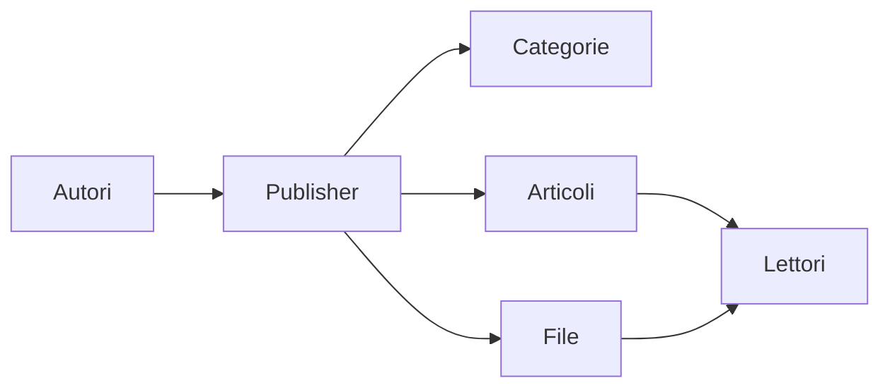
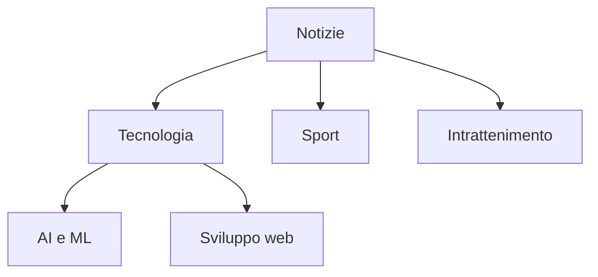
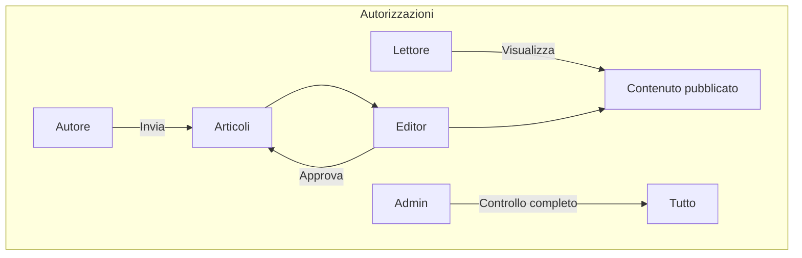
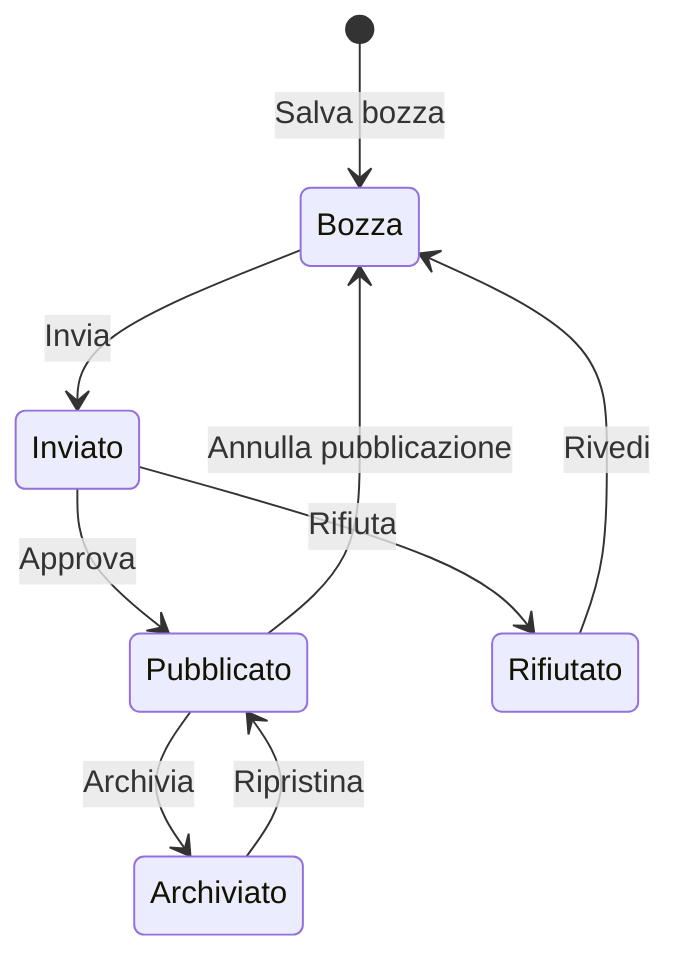

# Guida introduttiva di Publisher

> Una guida passo-passo per configurare e utilizzare il modulo di news/blog Publisher.

---

## Cos'è Publisher?

Publisher è il premier modulo di gestione dei contenuti per XOOPS, progettato per:

- **Siti di notizie** - Pubblica articoli con categorie
- **Blog** - Blogging personale o multi-autore
- **Documentazione** - Basi di conoscenza organizzate
- **Portali di contenuti** - Contenuti multimediali misti



---

## Configurazione rapida

### Passaggio 1: Installa Publisher

1. Scarica da [GitHub](https://github.com/XoopsModules25x/publisher)
2. Carica in `modules/publisher/`
3. Vai a Admin → Moduli → Installa

### Passaggio 2: Crea categorie



1. Admin → Publisher → Categorie
2. Fai clic su "Aggiungi categoria"
3. Compila:
   - **Nome**: Nome categoria
   - **Descrizione**: Cosa contiene questa categoria
   - **Immagine**: Immagine categoria facoltativa
4. Imposta permessi (chi può inviare/visualizzare)
5. Salva

### Passaggio 3: Configura impostazioni

1. Admin → Publisher → Preferenze
2. Impostazioni chiave da configurare:

| Impostazione | Consigliato | Descrizione |
|---------|-------------|-------------|
| Articoli per pagina | 10-20 | Articoli nell'indice |
| Editor | TinyMCE/CKEditor | Editor rich text |
| Consenti valutazioni | Sì | Feedback del lettore |
| Consenti commenti | Sì | Discussioni |
| Approvazione automatica | No | Controllo editoriale |

### Passaggio 4: Crea il tuo primo articolo

1. Menu principale → Publisher → Invia articolo
2. Compila il modulo:
   - **Titolo**: Titolo dell'articolo
   - **Categoria**: Dove appartiene
   - **Riepilogo**: Breve descrizione
   - **Corpo**: Contenuto completo dell'articolo
3. Aggiungi elementi facoltativi:
   - Immagine in primo piano
   - Allegati di file
   - Impostazioni SEO
4. Invia per revisione o pubblica

---

## Ruoli degli utenti



### Lettore
- Visualizza articoli pubblicati
- Valuta e commenta
- Cerca contenuto

### Autore
- Invia nuovi articoli
- Modifica i propri articoli
- Allega file

### Editor
- Approva/rifiuta invii
- Modifica qualsiasi articolo
- Gestisci categorie

### Amministratore
- Controllo completo del modulo
- Configura impostazioni
- Gestisci autorizzazioni

---

## Scrittura di articoli

### Editor articoli

```
┌─────────────────────────────────────────────────────┐
│ Titolo: [Il titolo del tuo articolo            ] │
├─────────────────────────────────────────────────────┤
│ Categoria: [Seleziona categoria      ▼]              │
├─────────────────────────────────────────────────────┤
│ Riepilogo:                                            │
│ ┌─────────────────────────────────────────────────┐ │
│ │ Descrizione breve mostrata negli elenchi...    │ │
│ └─────────────────────────────────────────────────┘ │
├─────────────────────────────────────────────────────┤
│ Corpo:                                               │
│ ┌─────────────────────────────────────────────────┐ │
│ │ [B] [I] [U] [Link] [Immagine] [Codice]         │ │
│ ├─────────────────────────────────────────────────┤ │
│ │                                                  │ │
│ │ Il contenuto articolo completo va qui...        │ │
│ │                                                  │ │
│ └─────────────────────────────────────────────────┘ │
├─────────────────────────────────────────────────────┤
│ [Invia] [Anteprima] [Salva bozza]                   │
└─────────────────────────────────────────────────────┘
```

### Best practice

1. **Titoli accattivanti** - Titoli chiari e coinvolgenti
2. **Buoni riepiloghi** - Invita i lettori a fare clic
3. **Contenuto strutturato** - Usa intestazioni, elenchi, immagini
4. **Categorizzazione adeguata** - Aiuta i lettori a trovare il contenuto
5. **Ottimizzazione SEO** - Parole chiave nel titolo e nel contenuto

---

## Gestione contenuti

### Flusso di stato dell'articolo



### Descrizioni dello stato

| Stato | Descrizione |
|--------|-------------|
| Bozza | Lavoro in corso |
| Inviato | In attesa di revisione |
| Pubblicato | Live sul sito |
| Scaduto | Oltre la data di scadenza |
| Rifiutato | Necessita revisione |
| Archiviato | Rimosso dagli elenchi |

---

## Navigazione

### Accedi a Publisher

- **Menu principale** → Publisher
- **URL diretto**: `yoursite.com/modules/publisher/`

### Pagine chiave

| Pagina | URL | Scopo |
|------|-----|---------|
| Indice | `/modules/publisher/` | Elenchi articoli |
| Categoria | `/modules/publisher/category.php?id=X` | Articoli categoria |
| Articolo | `/modules/publisher/item.php?itemid=X` | Articolo singolo |
| Invia | `/modules/publisher/submit.php` | Nuovo articolo |
| Ricerca | `/modules/publisher/search.php` | Trova articoli |

---

## Blocchi

Publisher fornisce diversi blocchi per il tuo sito:

### Articoli recenti
Visualizza articoli pubblicati di recente

### Menu categoria
Navigazione per categoria

### Articoli popolari
Contenuto più visualizzato

### Articolo casuale
Mostra contenuto casuale

### Spotlight
Articoli in primo piano

---

## Documentazione correlata

- Creazione e modifica di articoli
- Gestione delle categorie
- Estensione di Publisher

---

#xoops #publisher #user-guide #getting-started #cms
