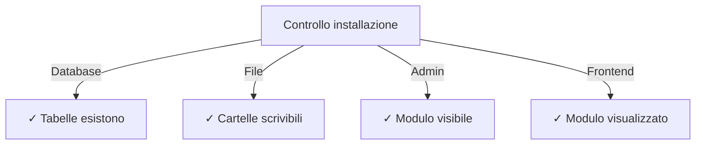

# Guida all'installazione di Publisher

> Istruzioni complete per l'installazione e la configurazione del modulo Publisher per XOOPS CMS.

---

## Requisiti di sistema

### Requisiti minimi

| Requisito | Versione | Note |
|-------------|---------|-------|
| XOOPS | 2.5.10+ | Piattaforma CMS core |
| PHP | 7.1+ | PHP 8.x consigliato |
| MySQL | 5.7+ | Server database |
| Server web | Apache/Nginx | Con supporto riscrittura |

### Estensioni PHP

```
- PDO (PHP Data Objects)
- pdo_mysql o mysqli
- mb_string (stringhe multibyte)
- curl (per contenuto esterno)
- json
- gd (elaborazione immagini)
```

### Spazio disco

- **File modulo**: ~5 MB
- **Directory cache**: 50+ MB consigliato
- **Directory caricamento**: Come necessario per contenuto

---

## Checklist pre-installazione

Prima di installare Publisher, verifica:

- [ ] XOOPS core è installato e in esecuzione
- [ ] L'account admin ha permessi di gestione moduli
- [ ] Backup del database creato
- [ ] I permessi dei file consentono l'accesso in scrittura a `/modules/`
- [ ] Il limite di memoria PHP è almeno 128 MB
- [ ] I limiti di dimensione del caricamento di file sono appropriati (min 10 MB)

---

## Passaggi di installazione

### Passaggio 1: Scarica Publisher

#### Opzione A: Da GitHub (consigliato)

```bash
# Naviga nella directory moduli
cd /path/to/xoops/htdocs/modules/

# Clona il repository
git clone https://github.com/XoopsModules25x/publisher.git

# Verifica il download
ls -la publisher/
```

#### Opzione B: Download manuale

1. Visita [Versioni GitHub Publisher](https://github.com/XoopsModules25x/publisher/releases)
2. Scarica il file `.zip` più recente
3. Estrai in `modules/publisher/`

### Passaggio 2: Imposta i permessi dei file

```bash
# Imposta proprietà corretta
chown -R www-data:www-data /path/to/xoops/htdocs/modules/publisher

# Imposta permessi directory (755)
find publisher -type d -exec chmod 755 {} \;

# Imposta permessi file (644)
find publisher -type f -exec chmod 644 {} \;

# Rendi gli script eseguibili
chmod 755 publisher/admin/index.php
chmod 755 publisher/index.php
```

### Passaggio 3: Installa tramite Admin XOOPS

1. Accedi a **Pannello admin XOOPS** come amministratore
2. Naviga a **Sistema → Moduli**
3. Fai clic su **Installa modulo**
4. Trova **Publisher** nell'elenco
5. Fai clic sul pulsante **Installa**
6. Attendi che l'installazione si completi

```
Progresso dell'installazione:
✓ Tabelle create
✓ Configurazione inizializzata
✓ Permessi impostati
✓ Cache cancellata
Installazione completata!
```

---

## Configurazione iniziale

### Passaggio 1: Accedi ad admin Publisher

1. Vai a **Pannello admin → Moduli**
2. Trova il modulo **Publisher**
3. Fai clic sul collegamento **Admin**
4. Sei ora in Amministrazione Publisher

### Passaggio 2: Configura preferenze del modulo

1. Fai clic su **Preferenze** nel menu sinistro
2. Configura impostazioni di base:

```
Impostazioni generali:
- Editor: Seleziona il tuo editor WYSIWYG
- Articoli per pagina: 10
- Mostra breadcrumb: Sì
- Consenti commenti: Sì
- Consenti valutazioni: Sì

Impostazioni SEO:
- URL SEO: No (abilita dopo se necessario)
- Riscrittura URL: Nessuno

Impostazioni caricamento:
- Dimensione caricamento massima: 5 MB
- Tipi di file consentiti: jpg, png, gif, pdf, doc, docx
```

3. Fai clic su **Salva impostazioni**

### Passaggio 3: Crea prima categoria

1. Fai clic su **Categorie** nel menu sinistro
2. Fai clic su **Aggiungi categoria**
3. Compila il modulo:

```
Nome categoria: Notizie
Descrizione: Ultimi news e aggiornamenti
Immagine: (facoltativa) Carica immagine categoria
Categoria principale: (lascia vuoto per livello superiore)
Stato: Abilitato
```

4. Fai clic su **Salva categoria**

### Passaggio 4: Verifica installazione

Controlla questi indicatori:



#### Controllo database

```bash
mysql -u xoops_user -p xoops_database
mysql> SHOW TABLES LIKE 'publisher%';

# Dovrebbe mostrare tabelle:
# - publisher_categories
# - publisher_items
# - publisher_comments
# - publisher_files
```

#### Controllo front-end

1. Visita la tua homepage XOOPS
2. Cerca il blocco **Publisher** o **News**
3. Dovrebbe visualizzare articoli recenti

---

## Configurazione dopo l'installazione

### Selezione editor

Publisher supporta più editor WYSIWYG:

| Editor | Pro | Contro |
|--------|------|------|
| FCKeditor | Ricco di funzionalità | Più vecchio, più grande |
| CKEditor | Standard moderno | Complessità configurazione |
| TinyMCE | Leggero | Funzionalità limitate |
| Editor DHTML | Basico | Molto basico |

**Per cambiare editor:**

1. Vai a **Preferenze**
2. Scorri all'impostazione **Editor**
3. Seleziona dal menu a discesa
4. Salva e prova

### Configurazione directory caricamento

```bash
# Crea directory di caricamento
mkdir -p /path/to/xoops/uploads/publisher/
mkdir -p /path/to/xoops/uploads/publisher/categories/
mkdir -p /path/to/xoops/uploads/publisher/images/
mkdir -p /path/to/xoops/uploads/publisher/files/

# Imposta permessi
chmod 755 /path/to/xoops/uploads/publisher/
chmod 755 /path/to/xoops/uploads/publisher/*
```

### Configura dimensioni immagini

In Preferenze, imposta dimensioni miniature:

```
Dimensione immagine categoria: 300 x 200 px
Dimensione immagine articolo: 600 x 400 px
Dimensione miniatura: 150 x 100 px
```

---

## Passaggi post-installazione

### 1. Imposta autorizzazioni di gruppo

1. Vai a **Autorizzazioni** in menu admin
2. Configura accesso per i gruppi:
   - Anonimo: Solo visualizzazione
   - Utenti registrati: Invia articoli
   - Editor: Approva/modifica articoli
   - Admin: Accesso completo

### 2. Configura visibilità modulo

1. Vai a **Blocchi** in admin XOOPS
2. Trova blocchi Publisher:
   - Publisher - Articoli ultimi
   - Publisher - Categorie
   - Publisher - Archivi
3. Configura visibilità blocco per pagina

### 3. Importa contenuto test (facoltativo)

Per il testing, importa articoli di esempio:

1. Vai a **Publisher Admin → Importa**
2. Seleziona **Contenuto di esempio**
3. Fai clic su **Importa**

### 4. Abilita URL SEO (facoltativo)

Per URL facili da trovare:

1. Vai a **Preferenze**
2. Imposta **URL SEO**: Sì
3. Abilita riscrittura **.htaccess**
4. Verifica che il file `.htaccess` esista nella cartella Publisher

```apache
# Esempio .htaccess
<IfModule mod_rewrite.c>
    RewriteEngine On
    RewriteBase /modules/publisher/
    RewriteRule ^category/([0-9]+)-(.*)\.html$ index.php?op=showcategory&categoryid=$1 [L]
    RewriteRule ^article/([0-9]+)-(.*)\.html$ index.php?op=showitem&itemid=$1 [L]
</IfModule>
```

---

## Risoluzione dei problemi dell'installazione

### Problema: Il modulo non appare in admin

**Soluzione:**
```bash
# Controlla i permessi dei file
ls -la /path/to/xoops/modules/publisher/

# Controlla che xoops_version.php esista
ls /path/to/xoops/modules/publisher/xoops_version.php

# Verifica la sintassi PHP
php -l /path/to/xoops/modules/publisher/xoops_version.php
```

### Problema: Le tabelle del database non vengono create

**Soluzione:**
1. Controlla che l'utente MySQL abbia il privilegio CREATE TABLE
2. Controlla il log degli errori del database:
   ```bash
   mysql> SHOW WARNINGS;
   ```
3. Importa manualmente SQL:
   ```bash
   mysql -u user -p database < modules/publisher/sql/mysql.sql
   ```

### Problema: Caricamento file non riuscito

**Soluzione:**
```bash
# Controlla che la directory esista e sia scrivibile
stat /path/to/xoops/uploads/publisher/

# Correggi i permessi
chmod 777 /path/to/xoops/uploads/publisher/

# Verifica impostazioni PHP
php -i | grep upload_max_filesize
```

### Problema: Errori "Pagina non trovata"

**Soluzione:**
1. Controlla che il file `.htaccess` sia presente
2. Verifica che Apache `mod_rewrite` sia abilitato:
   ```bash
   a2enmod rewrite
   systemctl restart apache2
   ```
3. Controlla `AllowOverride All` nella configurazione Apache

---

## Aggiornamento da versioni precedenti

### Da Publisher 1.x a 2.x

1. **Esegui il backup dell'installazione corrente:**
   ```bash
   cp -r modules/publisher/ modules/publisher-backup/
   mysqldump -u user -p database > publisher-backup.sql
   ```

2. **Scarica Publisher 2.x**

3. **Sovrascrivi i file:**
   ```bash
   rm -rf modules/publisher/
   unzip publisher-2.0.zip -d modules/
   ```

4. **Esegui l'aggiornamento:**
   - Vai a **Admin → Publisher → Aggiornamento**
   - Fai clic su **Aggiorna database**
   - Attendi il completamento

5. **Verifica:**
   - Controlla che tutti gli articoli vengano visualizzati correttamente
   - Verifica che i permessi siano intatti
   - Prova i caricamenti di file

---

## Considerazioni sulla sicurezza

### Permessi dei file

```
- File core: 644 (leggibile da web server)
- Directory: 755 (navigabile da web server)
- Directory di caricamento: 755 o 777
- File di configurazione: 600 (non leggibile dal web)
```

### Disabilita accesso diretto a file sensibili

Crea `.htaccess` nelle directory di caricamento:

```apache
<FilesMatch "\.(php|phtml|php3|php4|php5|phtml)$">
    Deny from all
</FilesMatch>
```

### Sicurezza database

```bash
# Usa una password forte
ALTER USER 'publisher_user'@'localhost' IDENTIFIED BY 'strong_password_here';

# Concedi permessi minimi
GRANT SELECT, INSERT, UPDATE, DELETE ON publisher_db.* TO 'publisher_user'@'localhost';
FLUSH PRIVILEGES;
```

---

## Checklist di verifica

Dopo l'installazione, verifica:

- [ ] Il modulo appare nell'elenco moduli admin
- [ ] Puoi accedere alla sezione admin Publisher
- [ ] Puoi creare categorie
- [ ] Puoi creare articoli
- [ ] Gli articoli vengono visualizzati nel front-end
- [ ] I caricamenti di file funzionano
- [ ] Le immagini vengono visualizzate correttamente
- [ ] I permessi sono applicati correttamente
- [ ] Le tabelle del database vengono create
- [ ] La directory di cache è scrivibile

---

## Passi successivi

Dopo l'installazione riuscita:

1. Leggi Guida di configurazione di base
2. Crea il tuo primo articolo
3. Imposta autorizzazioni di gruppo
4. Rivedi gestione categorie

---

## Supporto e risorse

- **GitHub Issues**: [Publisher Issues](https://github.com/XoopsModules25x/publisher/issues)
- **Forum XOOPS**: [Supporto community](https://www.xoops.org/modules/newbb/)
- **GitHub Wiki**: [Aiuto installazione](https://github.com/XoopsModules25x/publisher/wiki)

---

#publisher #installation #setup #xoops #module #configuration
