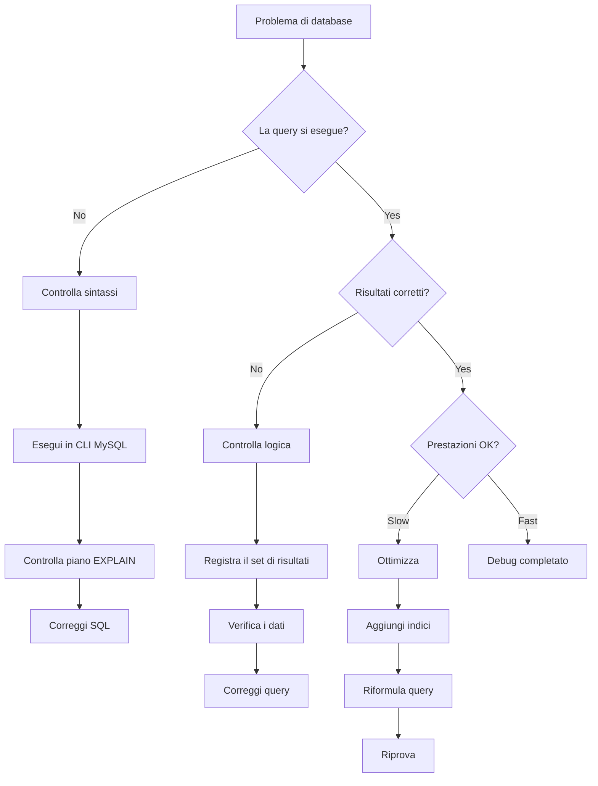
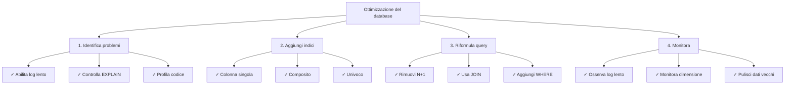

# Tecniche di debug del database

> Metodi e strumenti per il debug di query SQL e problemi del database nelle applicazioni XOOPS.

---

## Diagramma di flusso diagnostico



---

## Abilita registrazione query

### Metodo 1: Modalità debug XOOPS

```php
<?php
// In mainfile.php
define('XOOPS_DEBUG_LEVEL', 2);

// Ora tutte le query appaiono nella tabella xoops_log
// O nei file: xoops_data/logs/
?>
```

Controlla i risultati:
```bash
# Visualizza log
tail -100 xoops_data/logs/*.log

# O interroga il database
SELECT * FROM xoops_log ORDER BY created DESC LIMIT 20;
```

---

### Metodo 2: Registro query lente MySQL

Abilita in `/etc/mysql/my.cnf`:

```ini
[mysqld]
# Abilita registrazione query lente
slow_query_log = 1
slow_query_log_file = /var/log/mysql/slow.log
long_query_time = 1          # Log query > 1 secondo
log_queries_not_using_indexes = 1
```

Riavvia MySQL:
```bash
sudo systemctl restart mysql
# o
sudo systemctl restart mariadb
```

Visualizza log:
```bash
tail -100 /var/log/mysql/slow.log

# O analizza con mysqldumpslow
mysqldumpslow -s t -t 10 /var/log/mysql/slow.log
```

---

### Metodo 3: Registro query generale

Abilita per tutte le query (attenzione: file di log di grandi dimensioni):

```sql
-- Abilita
SET GLOBAL general_log = 'ON';
SET GLOBAL log_output = 'FILE';
SET GLOBAL general_log_file = '/var/log/mysql/general.log';

-- Disabilita
SET GLOBAL general_log = 'OFF';

-- Visualizza
SHOW VARIABLES LIKE 'general_log%';
```

---

## Debug SQL nel codice

### Registra esecuzione query

```php
<?php
require_once 'mainfile.php';

$ray = ray();  // Se usi Ray debugger

// Esegui query
$query = "SELECT u.uid, u.uname, COUNT(a.id) as total_articles
          FROM xoops_users u
          LEFT JOIN xoops_articles a ON u.uid = a.author_id
          GROUP BY u.uid
          ORDER BY total_articles DESC";

$ray->label('Query')->info($query);

$result = $GLOBALS['xoopsDB']->query($query);

if (!$result) {
    $ray->error("SQL Error: " . $GLOBALS['xoopsDB']->error);
    exit;
}

// Registra risultati
$data = [];
while ($row = $result->fetch_assoc()) {
    $data[] = $row;
}

$ray->label('Results')->dump($data);
$ray->info("Found " . count($data) . " rows");
?>
```

---

### Misura prestazioni query

```php
<?php
$db = $GLOBALS['xoopsDB'];
$ray = ray();

// Misura il tempo di esecuzione
$start = microtime(true);

$query = "SELECT * FROM xoops_articles LIMIT 1000";
$result = $db->query($query);

$exec_time = (microtime(true) - $start) * 1000;  // millisecondi

$ray->info("Query executed in: {$exec_time}ms");

// Registra query lente
if ($exec_time > 100) {  // Avviso se > 100ms
    $ray->warning("Slow query detected: {$exec_time}ms");
    $ray->info($query);
}
?>
```

---

### Verifica risultati query

```php
<?php
$db = $GLOBALS['xoopsDB'];
$ray = ray();

$query = "SELECT * FROM xoops_articles WHERE author_id = 5";
$result = $db->query($query);

// Controlla se la query ha avuto successo
if (!$result) {
    $ray->error("Query failed: " . $db->error);
    exit;
}

// Ottieni conteggio righe
$count = $result->num_rows;
$ray->info("Query returned: $count rows");

// Recupera risultati
$articles = [];
while ($row = $result->fetch_assoc()) {
    $articles[] = $row;
}

// Verifica dati
if (empty($articles)) {
    $ray->warning("No articles found for author 5");
} else {
    $ray->success("Found " . count($articles) . " articles");
    $ray->dump($articles);
}
?>
```

---

## Analizza prestazioni query

### Comando EXPLAIN

Usa EXPLAIN per analizzare l'esecuzione della query:

```sql
-- Analizza una query
EXPLAIN SELECT * FROM xoops_articles WHERE author_id = 5;

-- Con informazioni estese
EXPLAIN EXTENDED SELECT * FROM xoops_articles WHERE author_id = 5;

-- Formato JSON (mostra più dettagli)
EXPLAIN FORMAT=JSON SELECT * FROM xoops_articles WHERE author_id = 5\G
```

**Campi chiave da controllare:**

```
type: ALL           (cattivo) - Scansione tabella completa
      INDEX         (ok) - Scansione indice
      ref/const     (buono) - Ricerca indice diretta
      range         (ok) - Scansione intervallo usando indice

possible_keys:      Indici disponibili
key:                Indice effettivamente utilizzato
key_len:            Lunghezza dell'indice utilizzato
rows:               Righe stimate esaminate
Extra:              Informazioni aggiuntive (Using where, Using index, ecc.)
```

### Analisi di esempio

```sql
-- Query lenta senza indice
EXPLAIN SELECT * FROM xoops_articles WHERE author_id = 5;

+----+-------------+----------+------+---------------+------+---------+------+-------+-------------+
| id | select_type | table    | type | possible_keys | key  | key_len | rows | Extra |
+----+-------------+----------+------+---------------+------+---------+------+-------+-------------+
|  1 | SIMPLE      | articles | ALL  | NULL          | NULL | NULL    | 1000 | Using where |
+----+-------------+----------+------+---------------+------+---------+------+-------+-------------+
                                      ↑
                          Nessun indice disponibile!

-- Dopo l'aggiunta di un indice
ALTER TABLE xoops_articles ADD INDEX (author_id);

EXPLAIN SELECT * FROM xoops_articles WHERE author_id = 5;

+----+-------------+----------+------+---------------+-----------+---------+-------+------+
| id | select_type | table    | type | possible_keys | key       | key_len | rows  | Extra|
+----+-------------+----------+------+---------------+-----------+---------+-------+------+
|  1 | SIMPLE      | articles | ref  | author_id     | author_id | 4       | 10    |
+----+-------------+----------+------+---------------+-----------+---------+-------+------+
                                                              ↑
                                      Utilizzo indice - molto più veloce!
```

---

## Problemi SQL comuni

### 1. Problema N+1 Query

**Problema:**
```php
<?php
// SBAGLIATO: Query multiple nel ciclo
$authors = $db->query("SELECT uid FROM xoops_users LIMIT 100");
while ($author = $authors->fetch_assoc()) {
    // Questo si esegue 100 volte!
    $articles = $db->query(
        "SELECT COUNT(*) FROM xoops_articles WHERE author_id = " . $author['uid']
    );
    echo $articles->fetch_row()[0];
}
?>
```

**Soluzione: Usa JOIN**
```php
<?php
// CORRETTO: Una query
$result = $db->query("
    SELECT u.uid, u.uname, COUNT(a.id) as total
    FROM xoops_users u
    LEFT JOIN xoops_articles a ON u.uid = a.author_id
    GROUP BY u.uid
    LIMIT 100
");

while ($row = $result->fetch_assoc()) {
    echo $row['total'];
}
?>
```

---

### 2. Indici mancanti

**Identifica:**
```sql
-- Trova le query che scansionano tutte le righe
SELECT * FROM xoops_log
WHERE info LIKE '%type: ALL%'
ORDER BY created DESC;
```

**Aggiungi indici:**
```sql
-- Indice colonna singola
ALTER TABLE xoops_articles ADD INDEX (author_id);
ALTER TABLE xoops_articles ADD INDEX (created);

-- Indice composito
ALTER TABLE xoops_articles ADD INDEX (author_id, created);

-- Indice univoco
ALTER TABLE xoops_articles ADD UNIQUE INDEX (slug);
```

---

### 3. Condizioni WHERE inefficienti

**Problema:**
```sql
-- Sbagliato: Le funzioni impediscono l'uso dell'indice
SELECT * FROM xoops_articles
WHERE YEAR(created) = 2024;

-- Sbagliato: OR con colonne diverse
SELECT * FROM xoops_articles
WHERE category = 'tech' OR author_id = 5;
```

**Soluzione:**
```sql
-- Corretto: Usa intervallo
SELECT * FROM xoops_articles
WHERE created >= '2024-01-01' AND created < '2025-01-01';

-- Corretto: Usa UNION per colonne diverse
SELECT * FROM xoops_articles WHERE category = 'tech'
UNION
SELECT * FROM xoops_articles WHERE author_id = 5;
```

---

## Debug di problemi specifici

### Problema: Query restituisce risultati errati

```php
<?php
$ray = ray();

// Prova con dati di esempio
$author_id = 5;
$ray->info("Searching for author_id = $author_id");

$query = "SELECT * FROM xoops_articles WHERE author_id = ?";
$stmt = $db->prepare($query);
$stmt->bind_param("i", $author_id);
$stmt->execute();

$result = $stmt->get_result();
$count = $result->num_rows;

$ray->info("Found: $count articles");

// Verifica se la query parametrizzata aiuta
if ($count == 0) {
    // Prova senza parametro per debug
    $debug_query = "SELECT * FROM xoops_articles WHERE author_id = $author_id";
    $ray->warning("Debug query: $debug_query");
}

// Esegui dump del primo risultato
if ($row = $result->fetch_assoc()) {
    $ray->label('First Result')->dump($row);
}
?>
```

---

### Problema: Query JOIN lenta

```php
<?php
$ray = ray();

$query = "
    SELECT a.id, a.title, u.uname, u.email
    FROM xoops_articles a
    LEFT JOIN xoops_users u ON a.author_id = u.uid
    WHERE a.status = 1
    ORDER BY a.created DESC
    LIMIT 50
";

$ray->info("Running join query");
$ray->measure(function() use ($query) {
    $result = $GLOBALS['xoopsDB']->query($query);
    return $result;
});

// Analizza con EXPLAIN
$ray->label('Query Analysis')->info($query);
?>
```

Esegui EXPLAIN:
```sql
EXPLAIN SELECT a.id, a.title, u.uname, u.email
FROM xoops_articles a
LEFT JOIN xoops_users u ON a.author_id = u.uid
WHERE a.status = 1
ORDER BY a.created DESC
LIMIT 50\G

-- Cerca:
-- - type: ALL (necessario indice)
-- - Extra: Using temporary; Using filesort (inefficiente)
-- Correzione: Aggiungi indice composito
ALTER TABLE xoops_articles ADD INDEX (status, created);
```

---

## Crea registro query di debug

```php
<?php
// Crea modules/yourmodule/QueryLogger.php

class QueryLogger {
    private static $queries = [];
    private static $times = [];

    public static function log($query) {
        self::$queries[] = $query;
        self::$times[] = microtime(true);
    }

    public static function execute($query) {
        $start = microtime(true);
        $result = $GLOBALS['xoopsDB']->query($query);
        $time = (microtime(true) - $start) * 1000;

        self::log($query);
        self::$times[count(self::$times) - 1] = $time;

        return $result;
    }

    public static function report() {
        echo "<h1>Query Report</h1>";
        echo "<table>";
        echo "<tr><th>Query</th><th>Time (ms)</th></tr>";

        foreach (self::$queries as $i => $query) {
            $time = self::$times[$i] ?? 0;
            echo "<tr>";
            echo "<td><pre>" . htmlspecialchars(substr($query, 0, 100)) . "</pre></td>";
            echo "<td>" . number_format($time, 2) . "</td>";
            echo "</tr>";
        }

        echo "</table>";
    }

    public static function getTotalQueries() {
        return count(self::$queries);
    }

    public static function getTotalTime() {
        return array_sum(self::$times);
    }
}
?>
```

Utilizzo:
```php
<?php
require_once 'QueryLogger.php';

$result = QueryLogger::execute("SELECT * FROM xoops_articles");

// Dopo...
echo "Total queries: " . QueryLogger::getTotalQueries();
echo "Total time: " . QueryLogger::getTotalTime() . "ms";
QueryLogger::report();
?>
```

---

## Elenco di controllo ottimizzazione database



---

## Query MySQL utili

```sql
-- Trova tabelle lente
SELECT * FROM xoops_log
WHERE info LIKE '%type: ALL%'
ORDER BY created DESC LIMIT 20;

-- Elenca tutti gli indici
SHOW INDEX FROM xoops_articles;

-- Trova indici duplicati
SELECT a.table_name, a.index_name, a.seq_in_index, a.column_name
FROM information_schema.statistics a
JOIN information_schema.statistics b
  ON a.table_name = b.table_name
  AND a.seq_in_index = b.seq_in_index
  AND a.column_name = b.column_name
  AND a.index_name != b.index_name
WHERE a.table_name LIKE 'xoops_%';

-- Dimensioni tabella
SELECT table_name,
       ROUND(((data_length + index_length) / 1024 / 1024), 2) AS size_mb
FROM information_schema.tables
WHERE table_schema = 'xoops_db'
ORDER BY size_mb DESC;

-- Trova indici non utilizzati
SELECT * FROM performance_schema.table_io_waits_summary_by_index_usage
WHERE object_schema != 'mysql'
AND count_star = 0
ORDER BY object_name;
```

---

## Documentazione correlata

- Abilita modalità debug
- Utilizzo Ray Debugger
- FAQ prestazioni
- Fondamenti del database

---

#xoops #database #debugging #sql #optimization #mysql
