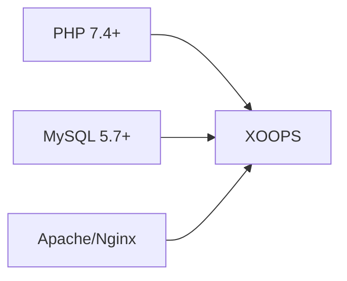
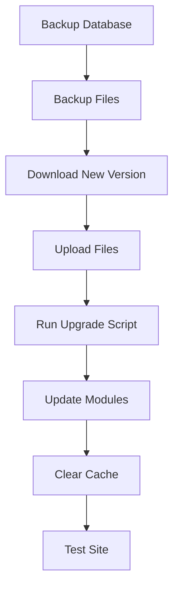

> Domande e risposte comuni sull'installazione di XOOPS.

---

## Pre-installazione

### D: Quali sono i requisiti minimi del server?

**R:** XOOPS 2.5.x richiede:
- PHP 7.4 o superiore (PHP 8.x consigliato)
- MySQL 5.7+ o MariaDB 10.3+
- Apache con mod_rewrite o Nginx
- Almeno 64MB di limite di memoria PHP (128MB+ consigliato)



### D: Posso installare XOOPS su hosting condiviso?

**R:** Sì, XOOPS funziona bene sulla maggior parte dell'hosting condiviso che soddisfa i requisiti. Verifica che il tuo host fornisca:
- PHP con le estensioni richieste (mysqli, gd, curl, json, mbstring)
- Accesso al database MySQL
- Capacità di caricamento di file
- Supporto .htaccess (per Apache)

### D: Quali estensioni PHP sono richieste?

**R:** Estensioni richieste:
- `mysqli` - Connettività del database
- `gd` - Elaborazione delle immagini
- `json` - Gestione JSON
- `mbstring` - Supporto di stringhe multibyte

Consigliate:
- `curl` - Chiamate API esterne
- `zip` - Installazione del modulo
- `intl` - Internazionalizzazione

---

## Processo di installazione

### D: La procedura guidata di installazione mostra una pagina vuota

**R:** In genere è un errore PHP. Prova:

1. Abilita la visualizzazione degli errori temporaneamente:
```php
// Add to htdocs/install/index.php at the top
error_reporting(E_ALL);
ini_set('display_errors', 1);
```

2. Controlla il registro degli errori PHP
3. Verifica la compatibilità della versione PHP
4. Assicurati che tutte le estensioni richieste siano caricate

### D: Ricevo "Impossibile scrivere in mainfile.php"

**R:** Imposta le autorizzazioni di scrittura prima dell'installazione:

```bash
chmod 666 mainfile.php
# After installation, secure it:
chmod 444 mainfile.php
```

### D: Le tabelle del database non vengono create

**R:** Controlla:

1. L'utente MySQL ha i privilegi CREATE TABLE:
```sql
GRANT ALL PRIVILEGES ON xoopsdb.* TO 'xoopsuser'@'localhost';
FLUSH PRIVILEGES;
```

2. Il database esiste:
```sql
CREATE DATABASE xoopsdb CHARACTER SET utf8mb4 COLLATE utf8mb4_unicode_ci;
```

3. Le credenziali nella procedura guidata corrispondono alle impostazioni del database

### D: L'installazione viene completata ma il sito mostra errori

**R:** Correzioni comuni post-installazione:

1. Rimuovi o rinomina la directory di installazione:
```bash
mv htdocs/install htdocs/install.bak
```

2. Imposta le autorizzazioni corrette:
```bash
chmod -R 755 htdocs/
chmod -R 777 xoops_data/
chmod 444 mainfile.php
```

3. Cancella la cache:
```bash
rm -rf xoops_data/caches/smarty_cache/*
rm -rf xoops_data/caches/smarty_compile/*
```

---

## Configurazione

### D: Dov'è il file di configurazione?

**R:** La configurazione principale si trova in `mainfile.php` nella radice di XOOPS. Impostazioni chiave:

```php
define('XOOPS_ROOT_PATH', '/path/to/htdocs');
define('XOOPS_VAR_PATH', '/path/to/xoops_data');
define('XOOPS_URL', 'https://yoursite.com');
define('XOOPS_DB_HOST', 'localhost');
define('XOOPS_DB_USER', 'username');
define('XOOPS_DB_PASS', 'password');
define('XOOPS_DB_NAME', 'database');
define('XOOPS_DB_PREFIX', 'xoops');
```

### D: Come cambio l'URL del sito?

**R:** Modifica `mainfile.php`:

```php
define('XOOPS_URL', 'https://newdomain.com');
```

Quindi cancella la cache e aggiorna tutti gli URL hardcoded nel database.

### D: Come sposto XOOPS in una directory diversa?

**R:**

1. Sposta i file nella nuova posizione
2. Aggiorna i percorsi in `mainfile.php`:
```php
define('XOOPS_ROOT_PATH', '/new/path/to/htdocs');
define('XOOPS_VAR_PATH', '/new/path/to/xoops_data');
```
3. Aggiorna il database se necessario
4. Cancella tutte le cache

---

## Aggiornamenti

### D: Come aggiorno XOOPS?

**R:**



1. **Esegui il backup di tutto** (database + file)
2. Scarica la nuova versione di XOOPS
3. Carica i file (non sovrascrivere `mainfile.php`)
4. Esegui `htdocs/upgrade/` se fornito
5. Aggiorna i moduli tramite il pannello di amministrazione
6. Cancella tutte le cache
7. Esegui test completi

### D: Posso saltare le versioni durante l'aggiornamento?

**R:** In genere no. Aggiorna sequenzialmente attraverso le versioni principali per garantire che le migrazioni del database vengano eseguite correttamente. Consulta le note di rilascio per indicazioni specifiche.

### D: I miei moduli hanno smesso di funzionare dopo l'aggiornamento

**R:**

1. Controlla la compatibilità del modulo con la nuova versione di XOOPS
2. Aggiorna i moduli alle versioni più recenti
3. Rigenera i template: Admin → System → Maintenance → Templates
4. Cancella tutte le cache
5. Controlla i registri degli errori PHP per errori specifici

---

## Risoluzione dei problemi

### D: Ho dimenticato la password di amministrazione

**R:** Ripristina tramite il database:

```sql
-- Generate new password hash
UPDATE xoops_users
SET pass = MD5('newpassword')
WHERE uname = 'admin';
```

Oppure usa la funzione di ripristino della password se l'email è configurata.

### D: Il sito è molto lento dopo l'installazione

**R:**

1. Abilita la cache in Admin → System → Preferences
2. Ottimizza il database:
```sql
OPTIMIZE TABLE xoops_session;
OPTIMIZE TABLE xoops_online;
```
3. Controlla le query lente in modalità debug
4. Abilita PHP OpCache

### D: Le immagini/CSS non vengono caricate

**R:**

1. Controlla le autorizzazioni dei file (644 per i file, 755 per le directory)
2. Verifica che `XOOPS_URL` sia corretto in `mainfile.php`
3. Controlla .htaccess per conflitti di riscrittura
4. Ispeziona la console del browser per errori 404

---

## Documentazione correlata

- Guida all'installazione
- Configurazione di base
- Schermata bianca della morte

---

#xoops #faq #installation #troubleshooting
