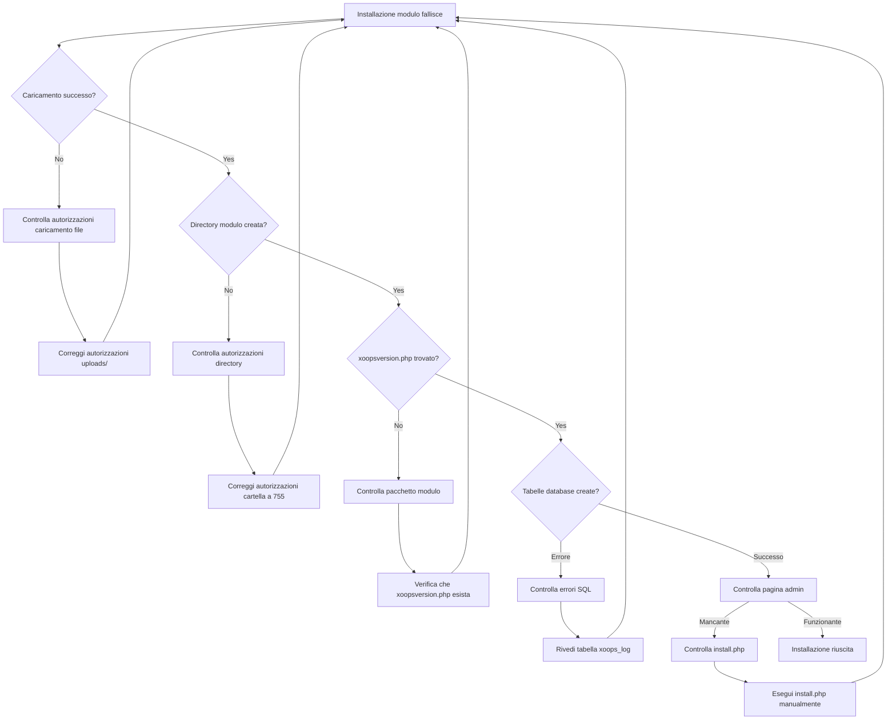
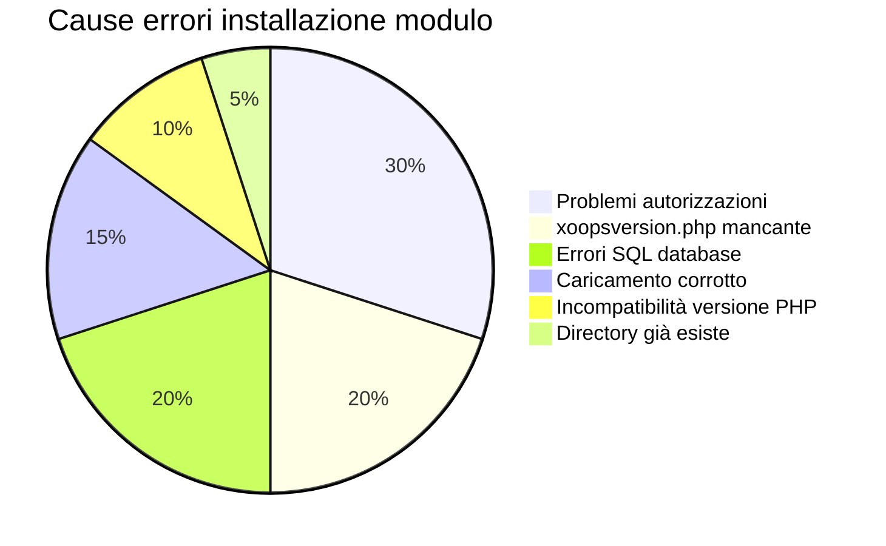

> Problemi comuni e soluzioni per risolvere i problemi di installazione modulo in XOOPS.

---

## Diagramma flusso diagnostico



---

## Cause comuni e soluzioni



---

## 1. Caricamento file accesso negato

**Sintomi:**
- Caricamento fallisce con "Permission denied"
- Cartella modulo non creata
- Impossibile scrivere in directory moduli

**Messaggi errore:**
```
Avviso: move_uploaded_file(): Impossibile spostare file
Permission denied (13)
```

**Soluzioni:**

```bash
# Controlla autorizzazioni correnti
ls -ld /path/to/xoops/modules
ls -ld /path/to/xoops/uploads

# Correggi autorizzazioni directory modulo
chmod 755 /path/to/xoops/modules

# Correggi directory caricamento temporaneo
chmod 777 /path/to/xoops/uploads
chmod 777 /tmp  # se necessario

# Correggi proprietà (se eseguito come utente diverso)
chown -R www-data:www-data /path/to/xoops/modules
chown -R www-data:www-data /path/to/xoops/uploads
```

---

## 2. xoopsversion.php mancante

**Sintomi:**
- Modulo appare in elenco ma non si attiva
- Installazione inizia poi si ferma
- Nessuna pagina admin creata

**Errore in xoops_log:**
```
Module xoopsversion.php not found
```

**Soluzioni:**

Verifica la struttura del pacchetto modulo:

```bash
# Estrai e controlla contenuti modulo
unzip module.zip
ls -la mymodule/

# Deve contenere:
# - xoopsversion.php
# - language/
# - sql/
# - admin/ (opzionale ma consigliato)
```

**Struttura xoopsversion.php valida:**

```php
<?php
$modversion['name'] = 'My Module';
$modversion['version'] = '1.0.0';
$modversion['description'] = 'Module description';
$modversion['author'] = 'Author Name';
$modversion['author_mail'] = 'author@example.com';
$modversion['author_website_url'] = 'https://example.com';
$modversion['credits'] = 'Credits';
$modversion['license'] = 'GPL 2.0 or later';
$modversion['official'] = 0;
$modversion['image'] = 'images/icon.png';
$modversion['dirname'] = basename(__DIR__);
$modversion['modpath'] = __DIR__;

// Core module info
$modversion['hasMain'] = 1;
$modversion['hasAdmin'] = 1;
$modversion['hasSearch'] = 0;
$modversion['hasNotification'] = 0;

// Database tables
$modversion['sqlfile']['mysql'] = 'sql/mysql.sql';
$modversion['tables'] = ['table_name'];
```

---

## 3. Errori esecuzione SQL database

**Sintomi:**
- Caricamento riuscito ma tabelle database non create
- Pagina admin non carica
- Errori "Table doesn't exist"

**Messaggi errore:**
```
Errore SQL: Table 'xoops_module_table' already exists
Errore sintassi in istruzione SQL
```

**Soluzioni:**

### Controlla sintassi file SQL

```bash
# Visualizza il file SQL
cat modules/mymodule/sql/mysql.sql

# Controlla problemi sintassi
# Verifica:
# - Tutte le istruzioni CREATE TABLE terminano con ;
# - Backtick appropriati per identificatori
# - Tipi campo validi (INT, VARCHAR, TEXT, ecc.)
```

**Formato SQL corretto:**

```sql
CREATE TABLE `xoops_module_table` (
  `id` INT(11) NOT NULL AUTO_INCREMENT,
  `name` VARCHAR(255) NOT NULL,
  `description` TEXT,
  `created` INT(11) NOT NULL,
  `updated` INT(11) NOT NULL,
  PRIMARY KEY (`id`)
) ENGINE=InnoDB DEFAULT CHARSET=utf8mb4;
```

### Esegui SQL manualmente

```php
<?php
// Crea file: modules/mymodule/test_sql.php
require_once '../../mainfile.php';

$sql_file = __DIR__ . '/sql/mysql.sql';
$sql_content = file_get_contents($sql_file);

// Dividi istruzioni
$statements = array_filter(array_map('trim', explode(';', $sql_content)));

foreach ($statements as $statement) {
    if (empty($statement)) continue;

    try {
        $GLOBALS['xoopsDB']->query($statement);
        echo "✓ Eseguito: " . substr($statement, 0, 50) . "...<br>";
    } catch (Exception $e) {
        echo "✗ Errore: " . $e->getMessage() . "<br>";
        echo "Istruzione: " . substr($statement, 0, 100) . "...<br>";
    }
}
?>
```

---

## 4. Caricamento modulo corrotto

**Sintomi:**
- File caricati parzialmente
- File .php casuali mancanti
- Modulo diventa instabile dopo installazione

**Soluzioni:**

```bash
# Ricaricare copia fresca
rm -rf /path/to/xoops/modules/mymodule

# Verifica checksum se fornito
md5sum -c mymodule.md5

# Verifica integrità archivio prima di estrarre
unzip -t mymodule.zip

# Estrai in temp, verifica, poi sposta
unzip -d /tmp mymodule.zip
find /tmp/mymodule -name "*.php" | wc -l
# Dovrebbe mostrare numero file previsto
```

---

## 5. Incompatibilità versione PHP

**Sintomi:**
- Installazione fallisce immediatamente
- Errori parse in xoopsversion.php
- Errori "Unexpected token"

**Messaggi errore:**
```
Parse error: syntax error, unexpected 'fn' (T_FN)
```

**Soluzioni:**

```bash
# Controlla versione PHP supportata XOOPS
grep -r "php_require" /path/to/xoops/

# Controlla requisiti modulo
grep -i "php\|version" modules/mymodule/xoopsversion.php

# Controlla versione PHP su server
php --version
```

**Test compatibilità modulo:**

```php
<?php
// Crea modules/mymodule/check_compat.php
$required_php = '7.4.0';
$current_php = PHP_VERSION;

echo "PHP richiesto: $required_php<br>";
echo "PHP corrente: $current_php<br>";

if (version_compare(PHP_VERSION, $required_php, '<')) {
    echo "✗ Versione PHP troppo vecchia<br>";
} else {
    echo "✓ Versione PHP compatibile<br>";
}

// Controlla estensioni richieste
$required_ext = ['mysqli', 'json', 'mb_string'];
foreach ($required_ext as $ext) {
    echo extension_loaded($ext) ? "✓" : "✗";
    echo " $ext<br>";
}
?>
```

---

## 6. Directory modulo già esiste

**Sintomi:**
- Installazione fallisce quando directory modulo esiste
- Impossibile reinstallare o aggiornare modulo
- Errore "Directory exists"

**Messaggi errore:**
```
La directory specificata esiste già
```

**Soluzioni:**

```bash
# Backup modulo esistente
cp -r modules/mymodule modules/mymodule.backup

# Rimuovi installazione vecchia completamente
rm -rf modules/mymodule

# Cancella qualsiasi cache relato al modulo
rm -rf xoops_data/caches/*

# Ora riprova installazione tramite pannello admin
```

---

## 7. Generazione pagina admin fallita

**Sintomi:**
- Modulo si installa ma pagina admin mancante
- Pannello admin non mostra modulo
- Impossibile accedere alle impostazioni modulo

**Soluzioni:**

```php
<?php
// Crea modules/mymodule/admin/index.php
<?php
/**
 * Indice amministrazione modulo
 */

include_once XOOPS_ROOT_PATH . '/kernel/module.php';

if (!is_object($xoopsModule) || !is_object($xoopsUser) || !$xoopsUser->isAdmin($xoopsModule->mid())) {
    exit("Accesso negato");
}

// Includi intestazione admin
xoops_cp_header();

// Aggiungi contenuto admin
echo "<h1>Amministrazione modulo</h1>";
echo "<p>Benvenuto in amministrazione modulo</p>";

// Includi piè di pagina admin
xoops_cp_footer();
?>
```

---

## 8. File lingua mancanti

**Sintomi:**
- Modulo visualizzato con nomi variabili al posto di testo
- Pagine admin mostrano testo stile "[LANG_CONSTANT]"
- Installazione completa ma interfaccia rotta

**Soluzioni:**

```bash
# Verifica struttura file lingua
ls -la modules/mymodule/language/

# Dovrebbe contenere:
# english/ (minimo)
#   admin.php
#   index.php
#   modinfo.php
```

**Crea file lingua:**

```php
<?php
// modules/mymodule/language/english/index.php
<?php
define('_AM_MYMODULE_INSTALLED', 'Modulo installato con successo');
define('_AM_MYMODULE_UPDATED', 'Modulo aggiornato con successo');
define('_AM_MYMODULE_ERROR', 'Si è verificato un errore');
?>
```

---

## Checklist installazione

```mermaid
graph TD
    A[Checklist installazione] --> B["1. Verifica struttura modulo"]
    A --> C["2. Controlla autorizzazioni"]
    A --> D["3. Test file SQL"]
    A --> E["4. Verifica xoopsversion.php"]
    A --> F["5. Controlla file lingua"]
    A --> G["6. Test installazione"]
    A --> H["7. Verifica in admin"]

    B --> B1["✓ Contiene xoopsversion.php"]
    B --> B2["✓ File SQL presenti"]
    B --> B3["✓ File lingua presenti"]

    C --> C1["✓ modules/ è 755"]
    C --> C2["✓ uploads/ è 777"]
    C --> C3["✓ Server web può scrivere"]

    D --> D1["✓ Sintassi SQL valida"]
    D --> D2["✓ Nessuna tabella duplicata"]

    E --> E1["✓ Sintassi PHP valida"]
    E --> E2["✓ Campi richiesti presenti"]

    F --> F1["✓ Cartella english/ esiste"]
    F --> F2["✓ File .php presenti"]

    G --> G1["✓ Caricamento riuscito"]
    G --> G2["✓ Database crea"]

    H --> H1["✓ Visibile in elenco moduli"]
    H --> H2["✓ Pagina admin accessibile"]
```



---

## Script debug

Crea `modules/mymodule/debug_install.php`:

```php
<?php
/**
 * Debug installazione modulo
 * Elimina dopo troubleshooting!
 */

require_once '../../mainfile.php';

echo "<h1>Debug installazione modulo</h1>";

// 1. Controlla struttura file
echo "<h2>1. Struttura file</h2>";
$required_files = [
    'xoopsversion.php',
    'language/english/modinfo.php',
    'language/english/index.php',
    'language/english/admin.php'
];

foreach ($required_files as $file) {
    $path = __DIR__ . '/' . $file;
    echo file_exists($path) ? "✓" : "✗";
    echo " $file<br>";
}

// 2. Controlla xoopsversion.php
echo "<h2>2. Contenuto xoopsversion.php</h2>";
$version_file = __DIR__ . '/xoopsversion.php';
if (file_exists($version_file)) {
    $modversion = [];
    include $version_file;
    echo "<pre>";
    echo "Nome: " . ($modversion['name'] ?? 'NOT SET') . "\n";
    echo "Versione: " . ($modversion['version'] ?? 'NOT SET') . "\n";
    echo "Dirname: " . ($modversion['dirname'] ?? 'NOT SET') . "\n";
    echo "Ha SQL: " . (isset($modversion['sqlfile']) ? "SÌ" : "NO") . "\n";
    echo "Ha tabelle: " . (isset($modversion['tables']) ? count($modversion['tables']) : 0) . "\n";
    echo "</pre>";
}

// 3. Controlla file SQL
echo "<h2>3. File SQL</h2>";
$sql_file = __DIR__ . '/sql/mysql.sql';
if (file_exists($sql_file)) {
    $content = file_get_contents($sql_file);
    $tables = substr_count($content, 'CREATE TABLE');
    echo "✓ File SQL esiste<br>";
    echo "✓ Contiene $tables istruzioni CREATE TABLE<br>";
    echo "<pre>" . htmlspecialchars(substr($content, 0, 300)) . "...</pre>";
} else {
    echo "✗ File SQL non trovato<br>";
}

// 4. Controlla file lingua
echo "<h2>4. File lingua</h2>";
$lang_files = [
    'language/english/modinfo.php',
    'language/english/index.php',
    'language/english/admin.php'
];

foreach ($lang_files as $file) {
    $path = __DIR__ . '/' . $file;
    if (file_exists($path)) {
        $size = filesize($path);
        echo "✓ $file ($size byte)<br>";
    } else {
        echo "✗ $file MANCANTE<br>";
    }
}

// 5. Controlla autorizzazioni
echo "<h2>5. Autorizzazioni directory</h2>";
echo "Directory modulo: " . substr(sprintf('%o', fileperms(__DIR__)), -4) . "<br>";

// 6. Test connessione database
echo "<h2>6. Connessione database</h2>";
if (is_object($GLOBALS['xoopsDB'])) {
    echo "✓ Database connesso<br>";

    // Prova a creare tabella test
    $test_sql = "CREATE TEMPORARY TABLE test_install (id INT PRIMARY KEY)";
    if ($GLOBALS['xoopsDB']->query($test_sql)) {
        echo "✓ Può creare tabelle<br>";
    } else {
        echo "✗ Impossibile creare tabelle: " . $GLOBALS['xoopsDB']->error . "<br>";
    }
} else {
    echo "✗ Database non connesso<br>";
}

echo "<p><strong>Elimina questo file dopo il test!</strong></p>";
?>
```

---

## Prevenzione e migliori pratiche

1. **Sempre backup** prima di installare nuovi moduli
2. **Test localmente** prima di distribuire in produzione
3. **Verifica struttura modulo** prima di caricare
4. **Controlla autorizzazioni** immediatamente dopo caricamento
5. **Rivedi tabella xoops_log** per errori installazione
6. **Mantieni backup** di versioni modulo funzionanti

---

## Documentazione correlata

- Abilita modalità debug
- Domande frequenti moduli
- Struttura modulo
- Errori connessione database

---

#xoops #troubleshooting #modules #installation #debugging
