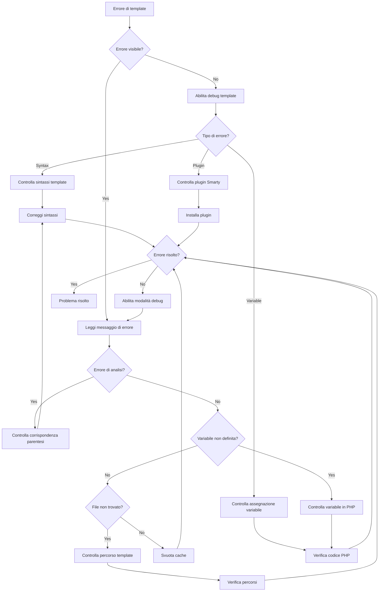
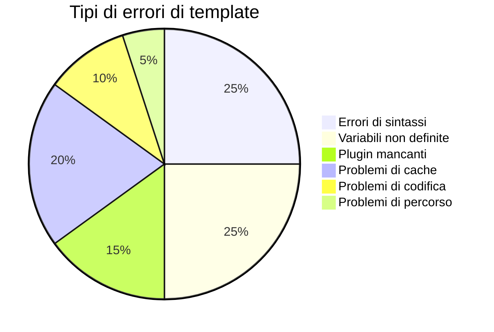

# Errori di template (Debug Smarty)

> Problemi comuni di template Smarty e tecniche di debug per temi e moduli XOOPS.

---

## Diagramma di flusso diagnostico



---

## Errori di template Smarty comuni



---

## 1. Errori di sintassi

**Sintomi:**
- Messaggi "Errore di sintassi Smarty"
- I template non si compilano
- Pagina vuota senza output

**Messaggi di errore:**
```
Syntax error: unrecognized tag 'myfunction'
Unexpected "}" near end of template
```

### Problemi comuni di sintassi

**Tag di chiusura mancante:**
```smarty
{* SBAGLIATO *}
{if $user}
User: {$user.name}
{* Manca {/if} *}

{* CORRETTO *}
{if $user}
User: {$user.name}
{/if}
```

**Sintassi variabile scorretta:**
```smarty
{* SBAGLIATO *}
{$user->name}          {* Usa . non -> *}
{$array[key]}          {* Usa chiavi tra virgolette *}
{$func()}              {* Non puoi chiamare funzioni direttamente *}

{* CORRETTO *}
{$user.name}
{$array.key}
{$array['key']}
{$user|@function}      {* Usa modificatori invece *}
```

**Virgolette non corrispondenti:**
```smarty
{* SBAGLIATO *}
{if $name == 'John}     {* Virgolette non corrispondenti *}
{assign var="user' value="John"}

{* CORRETTO *}
{if $name == 'John'}
{assign var="user" value="John"}
```

**Soluzioni:**

```smarty
{* Bilancia sempre le parentesi *}
{if condition}
  ...
{elseif condition}
  ...
{else}
  ...
{/if}

{* Verifica formato tag *}
{foreach $items as $item}
  ...
{/foreach}

{* Controlla che tutte le variabili siano definite *}
{if isset($variable)}
  {$variable}
{/if}
```

---

## 2. Errori di variabili non definite

**Sintomi:**
- Avvisi "Variabile non definita"
- La variabile si visualizza come vuota
- Avviso PHP nel registro degli errori

**Messaggi di errore:**
```
Notice: Undefined variable: myvar
Smarty notice: variable "$user" not available
```

**Script di debug:**

```php
<?php
// Nel tuo file template o codice PHP
// Crea modules/yourmodule/debug_template.php

require_once '../../mainfile.php';

// Ottieni motore template
$tpl = new XoopsTpl();

// Controlla quali variabili sono assegnate
echo "<h1>Variabili di template</h1>";
echo "<pre>";
print_r($tpl->get_template_vars());
echo "</pre>";

// O esegui dump oggetto Smarty
echo "<h1>Debug di Smarty</h1>";
echo "<pre>";
$tpl->debug_vars();
echo "</pre>";
?>
```

**Correzione in PHP:**

```php
<?php
// Assicurati che le variabili siano assegnate prima del rendering
$xoopsTpl = new XoopsTpl();

// SBAGLIATO - variabile non assegnata
$xoopsTpl->display('file:templates/page.html');

// CORRETTO - assegna variabili prima
$user = [
    'name' => 'John',
    'email' => 'john@example.com'
];
$xoopsTpl->assign('user', $user);
$xoopsTpl->display('file:templates/page.html');
?>
```

**Correzione nel template:**

```smarty
{* Controlla se la variabile esiste prima di usarla *}
{if isset($user)}
    <p>User: {$user.name}</p>
{else}
    <p>Nessun dato utente</p>
{/if}

{* Usa valori predefiniti *}
<p>Name: {$user.name|default:"No name"}</p>

{* Controlla se la chiave dell'array esiste *}
{if isset($array.key)}
    {$array.key}
{/if}
```

---

## 3. Modificatori mancanti o scorretti

**Sintomi:**
- I dati non si formattano correttamente
- Il testo si visualizza come HTML
- Caso/codifica non corretti

**Messaggi di errore:**
```
Warning: undefined modifier 'stripslashes'
```

**Modificatori comuni:**

```smarty
{* Operazioni di stringa *}
{$text|upper}                    {* Maiuscole *}
{$text|lower}                    {* Minuscole *}
{$text|capitalize}               {* Prima lettera maiuscola *}
{$text|truncate:20:"..."}        {* Tronca a 20 caratteri *}
{$text|strip_tags}               {* Rimuovi tag HTML *}

{* HTML/Formattazione *}
{$html|escape}                   {* Escape HTML *}
{$html|escape:'html'}
{$url|escape:'url'}              {* Escape URL *}
{$text|nl2br}                    {* Newline a <br> *}

{* Array *}
{$array|@count}                  {* Conteggio array *}
{$array|@implode:', '}           {* Unisci array *}

{* Valori predefiniti *}
{$var|default:"No value"}

{* Formattazione data *}
{$date|date_format:"%Y-%m-%d"}   {* Formatta data *}

{* Operazioni matematiche *}
{$number|math:'+':10}            {* Operazioni matematiche *}
```

**Registra modificatore personalizzato:**

```php
<?php
// Registra nel tuo modulo
$xoopsTpl = new XoopsTpl();
$xoopsTpl->register_modifier('mymodifier', 'my_modifier_function');

function my_modifier_function($string) {
    return strtoupper($string);
}
?>
```

---

## 4. Problemi di cache

**Sintomi:**
- Le modifiche al template non appaiono
- Il vecchio contenuto è ancora visibile
- Include o risorse stantie

**Soluzioni:**

```bash
# Cancella directory cache di Smarty
rm -rf /path/to/xoops/xoops_data/caches/smarty_cache/*
rm -rf /path/to/xoops/xoops_data/caches/smarty_compile/*

# Cancella cache modulo specifico
rm -rf /path/to/xoops/xoops_data/caches/smarty_cache/modules/*
```

**Cancella cache nel codice:**

```php
<?php
// Cancella tutte le cache di Smarty
$xoopsTpl = new XoopsTpl();
$xoopsTpl->clear_cache();
$xoopsTpl->clear_compiled_tpl();

// Cancella cache template specifico
$xoopsTpl->clear_cache('file:templates/page.html');

// Cancella tutti i file memorizzati nella cache
require_once XOOPS_ROOT_PATH . '/class/xoopsfile.php';
$dh = opendir(XOOPS_CACHE_PATH . '/smarty_cache');
while (($file = readdir($dh)) !== false) {
    if (is_file(XOOPS_CACHE_PATH . '/smarty_cache/' . $file)) {
        unlink(XOOPS_CACHE_PATH . '/smarty_cache/' . $file);
    }
}
closedir($dh);
?>
```

---

## 5. Errori plugin non trovato

**Sintomi:**
- Errori "Modificatore sconosciuto" o "Plugin sconosciuto"
- Le funzioni personalizzate non funzionano
- Errori di compilazione con plugin

**Messaggi di errore:**
```
Fatal error: Call to undefined function smarty_modifier_custom
Unknown modifier 'myfunction'
```

**Crea plugin personalizzato:**

```php
<?php
// Crea: modules/yourmodule/plugins/modifier.custom.php

/**
 * Plugin Smarty {$var|custom} modifier
 */
function smarty_modifier_custom($string, $param = '') {
    // Il tuo codice personalizzato
    return strtoupper($string) . $param;
}
?>
```

**Registra plugin:**

```php
<?php
// Nel codice init del tuo modulo
$xoopsTpl = new XoopsTpl();

// Aggiungi directory plugin a Smarty
$xoopsTpl->addPluginDir(
    XOOPS_ROOT_PATH . '/modules/yourmodule/plugins'
);

// O registra manualmente
$xoopsTpl->register_modifier(
    'custom',
    'smarty_modifier_custom'
);
?>
```

**Tipi di plugin:**

```php
<?php
// Plugin Modifier: modifier.name.php
function smarty_modifier_name($string) {
    return $string;
}

// Plugin Block: block.name.php
function smarty_block_name($params, $content, &$smarty, &$repeat) {
    if (!isset($smarty->security_settings['IF_FUNCS'])) {
        $smarty->security_settings['IF_FUNCS'] = [];
    }
    return $content;
}

// Plugin Function: function.name.php
function smarty_function_name($params, &$smarty) {
    return 'output';
}

// Plugin Filter: filter.name.php
function smarty_filter_name($code, &$smarty) {
    return $code;
}
?>
```

---

## 6. Problemi di inclusione/estensione di template

**Sintomi:**
- I template inclusi non vengono caricati
- Template genitore non trovato
- CSS/JS non viene caricato

**Messaggi di errore:**
```
Template file 'file:path/to/template.html' not found
Can't find template file 'header.html'
```

**Sintassi di inclusione corretta:**

```smarty
{* Includi template *}
{include file="file:templates/header.html"}

{* Includi con variabili *}
{include file="file:templates/header.html" title="My Page"}

{* Eredità di template *}
{extends file="file:templates/base.html"}

{* Blocchi denominati *}
{block name="content"}
    Contenuto pagina qui
{/block}

{* Risorse statiche *}
<link rel="stylesheet" href="{$xoops_url}/themes/{$xoops_theme}/style.css">
<script src="{$xoops_url}/modules/{$xoops_module_dir}/js/script.js"></script>
```

**Controlla percorso template:**

```bash
# Verifica che il file template esista
ls -la /path/to/xoops/themes/mytheme/templates/
ls -la /path/to/xoops/modules/mymodule/templates/

# Controlla autorizzazioni
stat /path/to/xoops/themes/mytheme/templates/header.html
```

---

## 7. Accesso a variabili array/oggetto

**Sintomi:**
- Non puoi accedere ai valori dell'array
- Le proprietà dell'oggetto non vengono visualizzate
- Fallimento delle variabili complesse

**Messaggi di errore:**
```
Undefined variable: user.profile.name
```

**Sintassi corretta:**

```smarty
{* Accesso array *}
{$array.key}                     {* Usa . per le chiavi *}
{$array['key']}
{$array.0}                       {* Indici numerici *}
{$array.$variable_key}           {* Chiavi dinamiche *}

{* Array annidati *}
{$user.profile.name}
{$data.items.0.title}

{* Proprietà oggetto *}
{$object.property}
{$object.method|escape}          {* Chiamate di metodo *}

{* Accesso sicuro con isset *}
{if isset($array.key)}
    {$array.key}
{/if}

{* Controlla lunghezza *}
{if count($array) > 0}
    Items trovati
{/if}
```

---

## 8. Problemi di codifica dei caratteri

**Sintomi:**
- Testo corrotto nei template
- I caratteri speciali vengono visualizzati in modo errato
- Caratteri UTF-8 rotti

**Soluzioni:**

**Codifica file template:**

```smarty
{* Imposta charset nel meta tag *}
<meta charset="UTF-8">

{* Oppure nell'HTML head *}
<meta http-equiv="Content-Type" content="text/html; charset=utf-8">

{* Dichiarazione PHP corretta *}
header('Content-Type: text/html; charset=utf-8');
```

**Codice PHP:**

```php
<?php
// Imposta codifica output
header('Content-Type: text/html; charset=utf-8');

// Assicura che il database usi UTF-8
$conn = new mysqli('localhost', 'user', 'pass', 'db');
$conn->set_charset('utf8mb4');

// O in SQL
SET NAMES utf8mb4;
SET CHARACTER SET utf8mb4;

// Assegna dati correttamente
$text = mb_convert_encoding($text, 'UTF-8', 'UTF-8');
$xoopsTpl->assign('text', $text);
?>
```

---

## Configurazione modalità debug

**Abilita debug template:**

```php
<?php
// In mainfile.php
define('XOOPS_DEBUG_LEVEL', 2);

// Nella configurazione di Smarty
$xoopsTpl->debugging = true;
$xoopsTpl->debug_tpl = SMARTY_DIR . 'debug.tpl';

// O nel modulo
$tpl = new XoopsTpl();
$tpl->debugging = true;
?>
```

**Output console debug:**

```php
<?php
// Crea modules/yourmodule/debug_smarty.php

require_once '../../mainfile.php';
require_once XOOPS_ROOT_PATH . '/class/smarty/Smarty.class.php';

$smarty = new Smarty();
$smarty->debugging = true;

// Controlla template compilato
$compiled_dir = $smarty->getCompileDir();
echo "<h1>Template compilati</h1>";
$files = glob($compiled_dir . '/*.php');
foreach ($files as $file) {
    echo "<p>" . basename($file) . "</p>";
}

// Visualizza codice compilato
echo "<h1>Codice compilato</h1>";
echo "<pre>";
$latest = max(array_map('filemtime', $files));
foreach ($files as $file) {
    if (filemtime($file) == $latest) {
        echo htmlspecialchars(file_get_contents($file));
        break;
    }
}
echo "</pre>";
?>
```

---

## Elenco di controllo convalida template

```mermaid
graph TD
    A[Convalida template] --> B["1. Controllo sintassi"]
    A --> C["2. Verifica variabile"]
    A --> D["3. Controllo plugin"]
    A --> E["4. Percorsi file"]
    A --> F["5. Codifica"]
    A --> G["6. Cache"]

    B --> B1["✓ Tutte le parentesi corrispondono"]
    B --> B2["✓ Tutti i tag chiusi"]
    B --> B3["✓ Sintassi corretta"]

    C --> C1["✓ Variabili assegnate"]
    C --> C2["✓ Accesso proprietà corretto"]
    C --> C3["✓ Valori predefiniti impostati"]

    D --> D1["✓ Modificatori disponibili"]
    D --> D2["✓ Plugin registrati"]
    D --> D3["✓ Funzioni personalizzate funzionano"]

    E --> E1["✓ Percorsi relativi corretti"]
    E --> E2["✓ File esistono"]
    E --> E3["✓ Autorizzazioni corrette"]

    F --> F1["✓ UTF-8 dichiarato"]
    F --> F2["✓ Charset HTML impostato"]
    F --> F3["✓ Database UTF-8"]

    G --> G1["✓ Cache cancellato"]
    G --> G2["✓ Compilato fresco"]
```



---

## Prevenzione e best practice

1. **Abilita debug** durante lo sviluppo
2. **Convalida template** prima del deploy
3. **Cancella cache** dopo le modifiche
4. **Usa git** per tracciare le modifiche ai template
5. **Prova in più browser** per i problemi di codifica
6. **Documenta plugin personalizzati** e modificatori
7. **Usa eredità template** per coerenza

---

## Documentazione correlata

- Guida debug Smarty
- Template Smarty
- Abilita modalità debug
- FAQ del tema

---

#xoops #troubleshooting #templates #smarty #debugging

