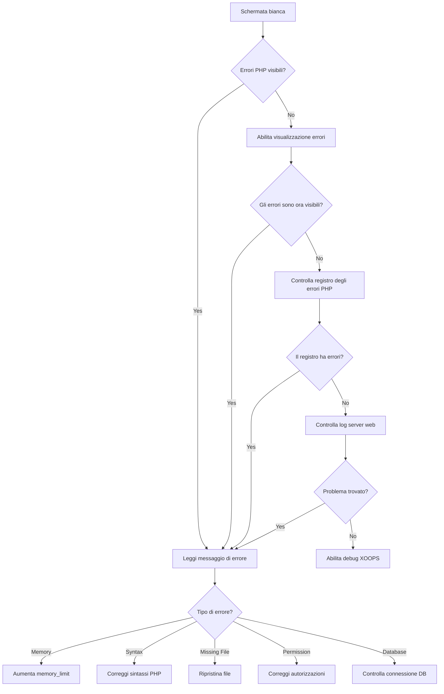
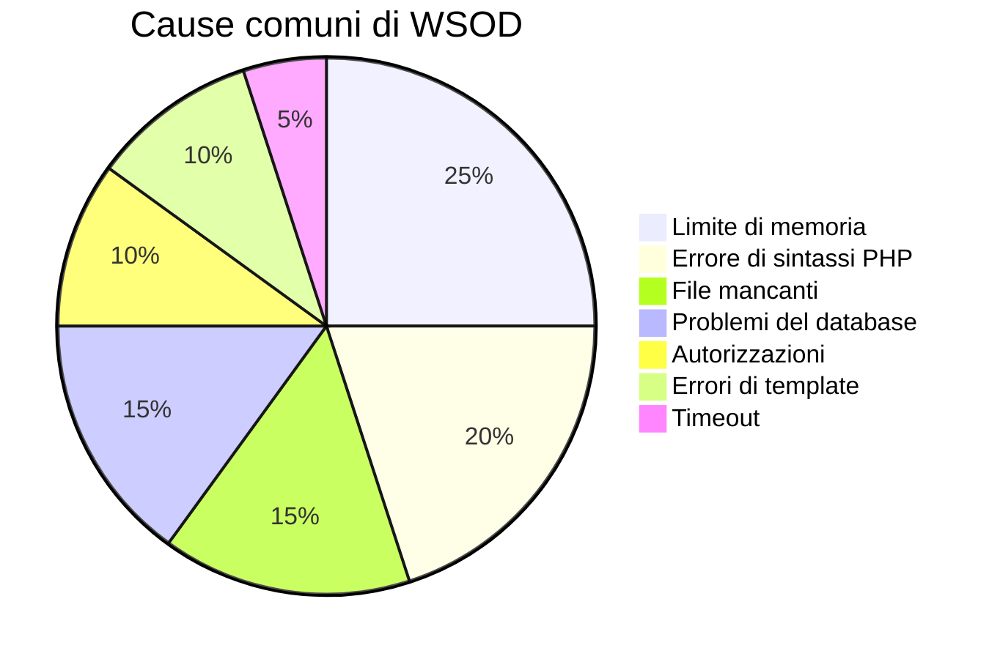
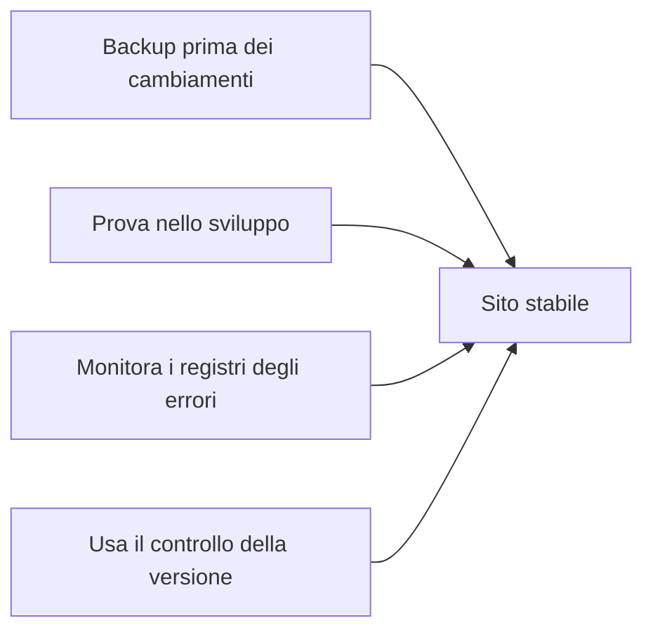

> Come diagnosticare e correggere pagine bianche vuote in XOOPS.

---

## Diagramma di flusso diagnostico



---

## Diagnosi rapida

### Passaggio 1: abilita visualizzazione errori PHP

Aggiungi a `mainfile.php` temporaneamente:

```php
<?php
// Aggiungi in alto, dopo <?php
error_reporting(E_ALL);
ini_set('display_errors', '1');
ini_set('display_startup_errors', '1');
```

### Passaggio 2: controlla registro errori PHP

```bash
# Posizioni comuni dei log
tail -100 /var/log/php/error.log
tail -100 /var/log/apache2/error.log
tail -100 /var/log/nginx/error.log

# O controlla le informazioni PHP per il percorso del log
php -i | grep error_log
```

### Passaggio 3: abilita debug XOOPS

```php
// In mainfile.php
define('XOOPS_DEBUG_LEVEL', 2);
```

---

## Cause e soluzioni comuni



### 1. Limite di memoria superato

**Sintomi:**
- Pagina vuota su operazioni di grandi dimensioni
- Funziona con dati piccoli, fallisce con dati grandi

**Errore:**
```
Fatal error: Allowed memory size of 134217728 bytes exhausted
```

**Soluzioni:**

```php
// In mainfile.php
ini_set('memory_limit', '256M');

// O in .htaccess
php_value memory_limit 256M

// O in php.ini
memory_limit = 256M
```

### 2. Errore di sintassi PHP

**Sintomi:**
- WSOD dopo la modifica di un file PHP
- Una pagina specifica fallisce, le altre funzionano

**Errore:**
```
Parse error: syntax error, unexpected '}' in /path/file.php on line 123
```

**Soluzioni:**

```bash
# Controlla il file per errori di sintassi
php -l /path/to/file.php

# Controlla tutti i file PHP nel modulo
find modules/mymodule -name "*.php" -exec php -l {} \;
```

### 3. File richiesto mancante

**Sintomi:**
- WSOD dopo il caricamento/migrazione
- Pagine casuali falliscono

**Errore:**
```
Fatal error: require_once(): Failed opening required 'class/Helper.php'
```

**Soluzioni:**

```bash
# Ricarica i file mancanti
# Confronta con un'installazione fresca
diff -r /path/to/xoops /path/to/fresh-xoops

# Controlla le autorizzazioni dei file
ls -la class/
```

### 4. Connessione al database non riuscita

**Sintomi:**
- Tutte le pagine mostrano WSOD
- I file statici (immagini, CSS) funzionano

**Errore:**
```
Warning: mysqli_connect(): Access denied for user
```

**Soluzioni:**

```php
// Verifica le credenziali in mainfile.php
define('XOOPS_DB_HOST', 'localhost');
define('XOOPS_DB_USER', 'your_user');
define('XOOPS_DB_PASS', 'your_password');
define('XOOPS_DB_NAME', 'your_database');

// Prova la connessione manualmente
<?php
$conn = new mysqli('localhost', 'user', 'pass', 'database');
if ($conn->connect_error) {
    die("Connection failed: " . $conn->connect_error);
}
echo "Connected successfully";
```

### 5. Problemi di autorizzazione

**Sintomi:**
- WSOD quando si scrivono file
- Errori di cache/compilazione

**Soluzioni:**

```bash
# Correggi le autorizzazioni della directory
chmod -R 755 htdocs/
chmod -R 777 xoops_data/
chmod -R 777 uploads/

# Correggi la proprietà
chown -R www-data:www-data /path/to/xoops
```

### 6. Errore di template Smarty

**Sintomi:**
- WSOD su pagine specifiche
- Funziona dopo la cancellazione della cache

**Soluzioni:**

```bash
# Cancella cache di Smarty
rm -rf xoops_data/caches/smarty_cache/*
rm -rf xoops_data/caches/smarty_compile/*

# Controlla la sintassi del template
```

### 7. Tempo di esecuzione massimo

**Sintomi:**
- WSOD dopo ~30 secondi
- Le operazioni lunghe falliscono

**Errore:**
```
Fatal error: Maximum execution time of 30 seconds exceeded
```

**Soluzioni:**

```php
// In mainfile.php
set_time_limit(300);

// O in .htaccess
php_value max_execution_time 300
```

---

## Script di debug

Crea `debug.php` nella radice XOOPS:

```php
<?php
/**
 * Script di debug XOOPS
 * Elimina dopo la risoluzione dei problemi!
 */

error_reporting(E_ALL);
ini_set('display_errors', '1');

echo "<h1>Debug XOOPS</h1>";

// Controlla versione PHP
echo "<h2>Versione PHP</h2>";
echo "PHP " . PHP_VERSION . "<br>";

// Controlla estensioni richieste
echo "<h2>Estensioni richieste</h2>";
$required = ['mysqli', 'gd', 'curl', 'json', 'mbstring'];
foreach ($required as $ext) {
    $status = extension_loaded($ext) ? '✓' : '✗';
    echo "$status $ext<br>";
}

// Controlla le autorizzazioni della directory
echo "<h2>Autorizzazioni della directory</h2>";
$dirs = [
    'xoops_data' => 'xoops_data',
    'uploads' => 'uploads',
    'cache' => 'xoops_data/caches'
];
foreach ($dirs as $name => $path) {
    $writable = is_writable($path) ? '✓ Scrivibile' : '✗ Non scrivibile';
    echo "$name: $writable<br>";
}

// Prova la connessione al database
echo "<h2>Connessione al database</h2>";
if (file_exists('mainfile.php')) {
    // Estrai le credenziali (regex semplice, non sicura per la produzione)
    $mainfile = file_get_contents('mainfile.php');
    preg_match("/XOOPS_DB_HOST.*'(.+?)'/", $mainfile, $host);
    preg_match("/XOOPS_DB_USER.*'(.+?)'/", $mainfile, $user);
    preg_match("/XOOPS_DB_PASS.*'(.+?)'/", $mainfile, $pass);
    preg_match("/XOOPS_DB_NAME.*'(.+?)'/", $mainfile, $name);

    if (!empty($host[1])) {
        $conn = @new mysqli($host[1], $user[1], $pass[1], $name[1]);
        if ($conn->connect_error) {
            echo "✗ Connessione non riuscita: " . $conn->connect_error;
        } else {
            echo "✓ Connesso al database";
            $conn->close();
        }
    }
} else {
    echo "mainfile.php non trovato";
}

// Informazioni sulla memoria
echo "<h2>Memoria</h2>";
echo "Limite di memoria: " . ini_get('memory_limit') . "<br>";
echo "Utilizzo corrente: " . round(memory_get_usage() / 1024 / 1024, 2) . " MB<br>";

// Controlla il percorso del registro degli errori
echo "<h2>Registro degli errori</h2>";
echo "Posizione: " . ini_get('error_log');
```

---

## Prevenzione



1. **Sempre backup** prima di apportare modifiche
2. **Prova in locale** prima di distribuire
3. **Monitora i registri degli errori** regolarmente
4. **Usa git** per tracciare le modifiche
5. **Mantieni PHP aggiornato** entro le versioni supportate

---

## Documentazione correlata

- Errori di connessione al database
- Errori di autorizzazione negata
- Abilita modalità debug

---

#xoops #troubleshooting #wsod #debugging #errors
