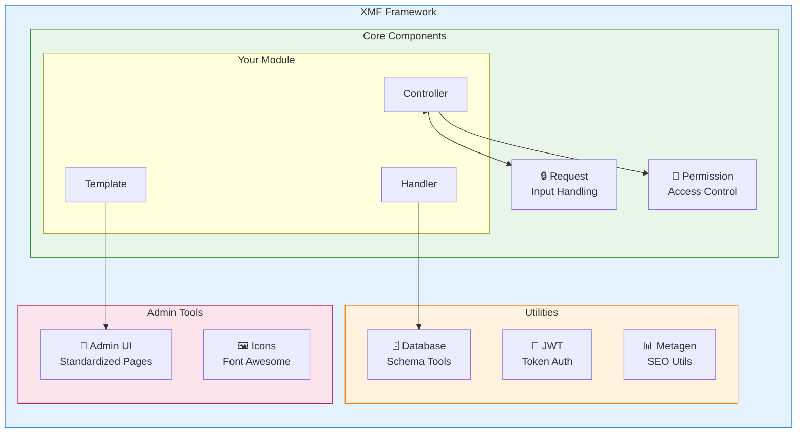
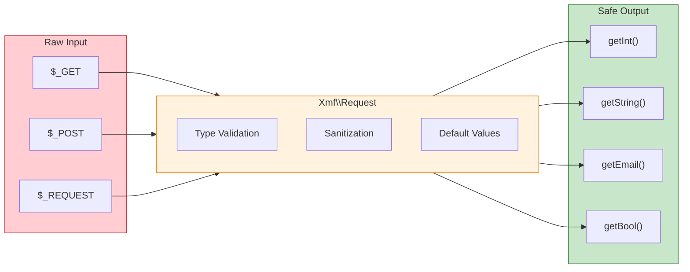

<span class="version-badge version-25x">2.5.x ✅</span> <span class="version-badge version-40x">4.0.x ✅</span>

:::tip[Il Ponte verso XOOPS Moderno]
XMF funziona sia con **XOOPS 2.5.x che XOOPS 4.0.x**. È il modo consigliato per modernizzare i vostri moduli oggi mentre vi preparate per XOOPS 4.0. XMF fornisce autoloading PSR-4, namespace e helper che semplificheranno la transizione.
:::

L'**XOOPS Module Framework (XMF)** è una libreria potente progettata per semplificare e standardizzare lo sviluppo di moduli XOOPS. XMF fornisce pratiche PHP moderne inclusi namespace, autoloading e un set completo di classi helper che riducono il codice boilerplate e migliorano la manutenibilità.

## Cos'è XMF?

XMF è una collezione di classi e utilità che forniscono:

- **Supporto PHP Moderno** - Pieno supporto per namespace con autoloading PSR-4
- **Gestione delle Richieste** - Validazione e sanitizzazione sicure dell'input
- **Module Helper** - Accesso semplificato alle configurazioni e agli oggetti del modulo
- **Sistema di Permessi** - Gestione facile dei permessi
- **Utilità di Database** - Strumenti per migrazioni di schema e gestione delle tabelle
- **Supporto JWT** - Implementazione di JSON Web Token per l'autenticazione sicura
- **Generazione di Metadati** - Utilità per SEO ed estrazione di contenuti
- **Interfaccia Admin** - Pagine di amministrazione standardizzate per i moduli

### Panoramica dei Componenti XMF



## Caratteristiche Principali

### Namespace e Autoloading

Tutte le classi XMF si trovano nello spazio dei nomi `Xmf`. Le classi vengono caricate automaticamente quando referenziate - non sono richiesti include manuali.

```php
use Xmf\Request;
use Xmf\Module\Helper;

// Le classi si caricano automaticamente quando utilizzate
$input = Request::getString('input', '');
$helper = Helper::getHelper('mymodule');
```

### Gestione Sicura delle Richieste

La [classe Request](../05-XMF-Framework/Basics/XMF-Request.md) fornisce accesso type-safe ai dati delle richieste HTTP con sanitizzazione integrata:



```php
use Xmf\Request;

$id = Request::getInt('id', 0);
$name = Request::getString('name', '');
$email = Request::getEmail('email', '');
```

### Sistema Module Helper

L'[Module Helper](../05-XMF-Framework/Basics/XMF-Module-Helper.md) fornisce accesso conveniente alle funzionalità relative al modulo:

```php
$helper = \Xmf\Module\Helper::getHelper('mymodule');

// Accedi alla configurazione del modulo
$configValue = $helper->getConfig('setting_name', 'default');

// Ottieni l'oggetto del modulo
$module = $helper->getModule();

// Accedi agli handler
$handler = $helper->getHandler('items');
```

### Gestione dei Permessi

L'[Permission-Helper](../05-XMF-Framework/Recipes/Permission-Helper.md) semplifica la gestione dei permessi XOOPS:

```php
$permHelper = new \Xmf\Module\Helper\Permission();

// Controlla il permesso dell'utente
if ($permHelper->checkPermission('view', $itemId)) {
    // L'utente ha il permesso
}
```

## Struttura della Documentazione

### Fondamenti

- [Getting-Started-with-XMF](../05-XMF-Framework/Basics/Getting-Started-with-XMF.md) - Installazione e utilizzo di base
- [XMF-Request](../05-XMF-Framework/Basics/XMF-Request.md) - Gestione delle richieste e validazione dell'input
- [XMF-Module-Helper](../05-XMF-Framework/Basics/XMF-Module-Helper.md) - Uso della classe module helper

### Ricette

- [Permission-Helper](../05-XMF-Framework/Recipes/Permission-Helper.md) - Lavoro con i permessi
- [Module-Admin-Pages](../05-XMF-Framework/Recipes/Module-Admin-Pages.md) - Creazione di interfacce di amministrazione standardizzate

### Riferimento

- [JWT](../05-XMF-Framework/Reference/JWT.md) - Implementazione di JSON Web Token
- [Database](../05-XMF-Framework/Reference/Database.md) - Utilità di database e gestione dello schema
- [Metagen](Reference/Metagen.md) - Utilità di metadati e SEO

## Requisiti

- XOOPS 2.5.8 o successivo
- PHP 7.2 o successivo (PHP 8.x consigliato)

## Installazione

XMF è incluso con XOOPS 2.5.8 e versioni successive. Per versioni precedenti o installazione manuale:

1. Scarica il pacchetto XMF dal repository XOOPS
2. Estrai nella cartella `/class/xmf/` di XOOPS
3. L'autoloader gestirà automaticamente il caricamento delle classi

## Esempio di Avvio Rapido

Ecco un esempio completo che mostra i modelli di utilizzo comune di XMF:

```php
<?php
use Xmf\Request;
use Xmf\Module\Helper;
use Xmf\Module\Helper\Permission;

// Ottieni l'helper del modulo
$helper = Helper::getHelper('mymodule');

// Ottieni i valori di configurazione
$itemsPerPage = $helper->getConfig('items_per_page', 10);

// Gestisci l'input della richiesta
$op = Request::getCmd('op', 'list');
$id = Request::getInt('id', 0);

// Controlla i permessi
$permHelper = new Permission();
if (!$permHelper->checkPermission('view', $id)) {
    redirect_header('index.php', 3, 'Access denied');
}

// Elabora in base all'operazione
switch ($op) {
    case 'view':
        $handler = $helper->getHandler('items');
        $item = $handler->get($id);
        // ... visualizza l'elemento
        break;
    case 'list':
    default:
        // ... elenca gli elementi
        break;
}
```

## Risorse

- [Repository GitHub XMF](https://github.com/XOOPS/XMF)
- [Sito Web del Progetto XOOPS](https://xoops.org)

---

#xmf #xoops #framework #php #module-development
