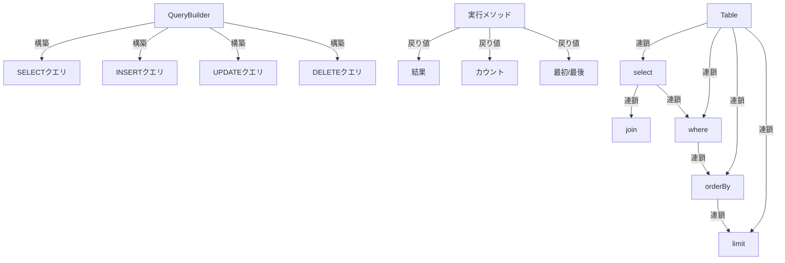

XOOPS Query Builderは、SQLクエリを構築するための最新のフルエントインターフェースを提供します。SQLインジェクションを防ぎ、可読性を向上させ、複数のデータベースシステムのデータベース抽象化を提供します。

## クエリビルダーアーキテクチャ



## QueryBuilderクラス

フルエントインターフェースを備えた主要なクエリビルダークラス。

### クラス概要

```php
namespace Xoops\Database;

class QueryBuilder
{
    protected string $table = '';
    protected string $type = 'SELECT';
    protected array $selects = [];
    protected array $joins = [];
    protected array $wheres = [];
    protected array $orders = [];
    protected int $limit = 0;
    protected int $offset = 0;
    protected array $bindings = [];
}
```

### 静的メソッド

#### table

テーブル用の新しいクエリビルダーを作成します。

```php
public static function table(string $table): QueryBuilder
```

**パラメータ:**

| パラメータ | 型 | 説明 |
|-----------|------|-------------|
| `$table` | string | テーブル名 (プレフィックス付きまたはなし) |

**戻り値:** `QueryBuilder` - クエリビルダーインスタンス

**例:**
```php
$query = QueryBuilder::table('users');
$query = QueryBuilder::table('xoops_users'); // プレフィックス付き
```

## SELECTクエリ

### select

選択するカラムを指定します。

```php
public function select(...$columns): self
```

**パラメータ:**

| パラメータ | 型 | 説明 |
|-----------|------|-------------|
| `...$columns` | array | カラム名または式 |

**戻り値:** `self` - メソッドチェーン用

**例:**
```php
// 単純な選択
QueryBuilder::table('users')
    ->select('id', 'username', 'email')
    ->get();

// エイリアス付き選択
QueryBuilder::table('users')
    ->select('id as user_id', 'username as name')
    ->get();

// すべてのカラムを選択
QueryBuilder::table('users')
    ->select('*')
    ->get();

// 式で選択
QueryBuilder::table('orders')
    ->select('id', 'COUNT(*) as total_items')
    ->groupBy('id')
    ->get();
```

### where

WHERE条件を追加します。

```php
public function where(string $column, string $operator = '=', mixed $value = null): self
```

**パラメータ:**

| パラメータ | 型 | 説明 |
|-----------|------|-------------|
| `$column` | string | カラム名 |
| `$operator` | string | 比較演算子 |
| `$value` | mixed | 比較する値 |

**戻り値:** `self` - メソッドチェーン用

**演算子:**

| 演算子 | 説明 | 例 |
|----------|-------------|---------|
| `=` | 等しい | `->where('status', '=', 'active')` |
| `!=` または `<>` | 等しくない | `->where('status', '!=', 'deleted')` |
| `>` | より大きい | `->where('price', '>', 100)` |
| `<` | より小さい | `->where('price', '<', 100)` |
| `>=` | 以上 | `->where('age', '>=', 18)` |
| `<=` | 以下 | `->where('age', '<=', 65)` |
| `LIKE` | パターンマッチング | `->where('name', 'LIKE', '%john%')` |
| `IN` | リスト内 | `->where('status', 'IN', ['active', 'pending'])` |
| `NOT IN` | リスト外 | `->where('id', 'NOT IN', [1, 2, 3])` |
| `BETWEEN` | 範囲 | `->where('age', 'BETWEEN', [18, 65])` |
| `IS NULL` | Null | `->where('deleted_at', 'IS NULL')` |
| `IS NOT NULL` | Nullではない | `->where('deleted_at', 'IS NOT NULL')` |

**例:**
```php
// 単一の条件
QueryBuilder::table('users')
    ->select('*')
    ->where('status', '=', 'active')
    ->get();

// 複数の条件 (AND)
QueryBuilder::table('users')
    ->select('*')
    ->where('status', '=', 'active')
    ->where('age', '>=', 18)
    ->get();

// IN演算子
QueryBuilder::table('products')
    ->select('*')
    ->where('category_id', 'IN', [1, 2, 3])
    ->get();

// LIKE演算子
QueryBuilder::table('users')
    ->select('*')
    ->where('email', 'LIKE', '%@example.com')
    ->get();

// NULLチェック
QueryBuilder::table('users')
    ->select('*')
    ->where('deleted_at', 'IS NULL')
    ->get();
```

### orWhere

OR条件を追加します。

```php
public function orWhere(string $column, string $operator = '=', mixed $value = null): self
```

**例:**
```php
QueryBuilder::table('users')
    ->select('*')
    ->where('status', '=', 'active')
    ->orWhere('premium', '=', 1)
    ->get();
    // SELECT * FROM users WHERE status = 'active' OR premium = 1
```

### whereIn / whereNotIn

IN/NOT INの便利なメソッド。

```php
public function whereIn(string $column, array $values): self
public function whereNotIn(string $column, array $values): self
```

**例:**
```php
QueryBuilder::table('posts')
    ->select('*')
    ->whereIn('status', ['published', 'scheduled'])
    ->get();

QueryBuilder::table('comments')
    ->select('*')
    ->whereNotIn('spam_score', [8, 9, 10])
    ->get();
```

### whereNull / whereNotNull

NULLチェックの便利なメソッド。

```php
public function whereNull(string $column): self
public function whereNotNull(string $column): self
```

**例:**
```php
QueryBuilder::table('users')
    ->select('*')
    ->whereNotNull('verified_at')
    ->get();
```

### whereBetween

値が2つの値の間にあるかチェック。

```php
public function whereBetween(string $column, array $values): self
```

**例:**
```php
QueryBuilder::table('products')
    ->select('*')
    ->whereBetween('price', [10, 100])
    ->get();

QueryBuilder::table('orders')
    ->select('*')
    ->whereBetween('created_at', ['2024-01-01', '2024-12-31'])
    ->get();
```

### join

INNER JOINを追加します。

```php
public function join(
    string $table,
    string $first,
    string $operator = '=',
    string $second = null
): self
```

**例:**
```php
QueryBuilder::table('posts')
    ->select('posts.*', 'users.username', 'categories.name')
    ->join('users', 'posts.user_id', '=', 'users.id')
    ->join('categories', 'posts.category_id', '=', 'categories.id')
    ->where('posts.published', '=', 1)
    ->get();
```

### leftJoin / rightJoin

代替のjoin型。

```php
public function leftJoin(
    string $table,
    string $first,
    string $operator = '=',
    string $second = null
): self

public function rightJoin(
    string $table,
    string $first,
    string $operator = '=',
    string $second = null
): self
```

**例:**
```php
QueryBuilder::table('users')
    ->select('users.*', 'COUNT(posts.id) as post_count')
    ->leftJoin('posts', 'users.id', '=', 'posts.user_id')
    ->groupBy('users.id')
    ->get();
```

### groupBy

カラムでグループ化。

```php
public function groupBy(...$columns): self
```

**例:**
```php
QueryBuilder::table('orders')
    ->select('user_id', 'COUNT(*) as order_count', 'SUM(total) as total_spent')
    ->groupBy('user_id')
    ->get();

QueryBuilder::table('sales')
    ->select('department', 'region', 'SUM(amount) as total')
    ->groupBy('department', 'region')
    ->get();
```

### having

HAVING条件を追加。

```php
public function having(string $column, string $operator = '=', mixed $value = null): self
```

**例:**
```php
QueryBuilder::table('orders')
    ->select('user_id', 'COUNT(*) as order_count')
    ->groupBy('user_id')
    ->having('order_count', '>', 5)
    ->get();
```

### orderBy

結果を並び替え。

```php
public function orderBy(string $column, string $direction = 'ASC'): self
```

**パラメータ:**

| パラメータ | 型 | 説明 |
|-----------|------|-------------|
| `$column` | string | 並び替えるカラム |
| `$direction` | string | `ASC` または `DESC` |

**例:**
```php
// 単一の並び替え
QueryBuilder::table('users')
    ->select('*')
    ->orderBy('created_at', 'DESC')
    ->get();

// 複数の並び替え
QueryBuilder::table('posts')
    ->select('*')
    ->orderBy('category_id', 'ASC')
    ->orderBy('created_at', 'DESC')
    ->get();

// ランダム並び替え
QueryBuilder::table('quotes')
    ->select('*')
    ->orderBy('RAND()')
    ->get();
```

### limit / offset

結果を制限およびオフセット。

```php
public function limit(int $limit): self
public function offset(int $offset): self
```

**例:**
```php
// 単純な制限
QueryBuilder::table('posts')
    ->select('*')
    ->limit(10)
    ->get();

// ページネーション
$page = 2;
$perPage = 20;
$offset = ($page - 1) * $perPage;

QueryBuilder::table('posts')
    ->select('*')
    ->limit($perPage)
    ->offset($offset)
    ->get();
```

## 実行メソッド

### get

クエリを実行してすべての結果を返します。

```php
public function get(): array
```

**戻り値:** `array` - 結果行の配列

**例:**
```php
$users = QueryBuilder::table('users')
    ->select('id', 'username', 'email')
    ->where('status', '=', 'active')
    ->orderBy('username')
    ->get();

foreach ($users as $user) {
    echo $user['username'] . ' (' . $user['email'] . ')' . "\n";
}
```

### first

最初の結果を取得。

```php
public function first(): ?array
```

**戻り値:** `?array` - 最初の行またはnull

**例:**
```php
$user = QueryBuilder::table('users')
    ->select('*')
    ->where('id', '=', 123)
    ->first();

if ($user) {
    echo 'Found: ' . $user['username'];
}
```

### last

最後の結果を取得。

```php
public function last(): ?array
```

**例:**
```php
$latestPost = QueryBuilder::table('posts')
    ->select('*')
    ->orderBy('created_at', 'DESC')
    ->last();
```

### count

結果のカウントを取得。

```php
public function count(): int
```

**戻り値:** `int` - 行数

**例:**
```php
$activeUsers = QueryBuilder::table('users')
    ->where('status', '=', 'active')
    ->count();

echo "Active users: $activeUsers";
```

### exists

クエリが結果を返すかチェック。

```php
public function exists(): bool
```

**戻り値:** `bool` - 結果が存在する場合true

**例:**
```php
if (QueryBuilder::table('users')->where('email', '=', 'test@example.com')->exists()) {
    echo 'User already exists';
}
```

### aggregate

集計値を取得。

```php
public function aggregate(string $function, string $column): mixed
```

**例:**
```php
$maxPrice = QueryBuilder::table('products')
    ->aggregate('MAX', 'price');

$avgAge = QueryBuilder::table('users')
    ->aggregate('AVG', 'age');

$totalSales = QueryBuilder::table('orders')
    ->aggregate('SUM', 'total');
```

## INSERTクエリ

### insert

行を挿入。

```php
public function insert(array $values): bool
```

**例:**
```php
QueryBuilder::table('users')->insert([
    'username' => 'john',
    'email' => 'john@example.com',
    'password' => password_hash('secret', PASSWORD_BCRYPT),
    'created_at' => date('Y-m-d H:i:s')
]);
```

### insertMany

複数の行を挿入。

```php
public function insertMany(array $rows): bool
```

**例:**
```php
QueryBuilder::table('log_entries')->insertMany([
    ['action' => 'login', 'user_id' => 1, 'timestamp' => time()],
    ['action' => 'logout', 'user_id' => 2, 'timestamp' => time()],
    ['action' => 'update', 'user_id' => 3, 'timestamp' => time()]
]);
```

## UPDATEクエリ

### update

行を更新。

```php
public function update(array $values): int
```

**戻り値:** `int` - 影響を受けた行数

**例:**
```php
// 単一ユーザーを更新
QueryBuilder::table('users')
    ->where('id', '=', 123)
    ->update([
        'email' => 'newemail@example.com',
        'updated_at' => date('Y-m-d H:i:s')
    ]);

// 複数の行を更新
QueryBuilder::table('posts')
    ->where('status', '=', 'draft')
    ->where('created_at', '<', date('Y-m-d', strtotime('-30 days')))
    ->update([
        'status' => 'archived'
    ]);
```

### increment / decrement

カラムをインクリメントまたはデクリメント。

```php
public function increment(string $column, int $amount = 1): int
public function decrement(string $column, int $amount = 1): int
```

**例:**
```php
// ビューカウントをインクリメント
QueryBuilder::table('posts')
    ->where('id', '=', 123)
    ->increment('views');

// 在庫をデクリメント
QueryBuilder::table('products')
    ->where('id', '=', 456)
    ->decrement('stock', 5);
```

## DELETEクエリ

### delete

行を削除。

```php
public function delete(): int
```

**戻り値:** `int` - 削除された行数

**例:**
```php
// 単一レコードを削除
QueryBuilder::table('comments')
    ->where('id', '=', 789)
    ->delete();

// 複数のレコードを削除
QueryBuilder::table('log_entries')
    ->where('created_at', '<', date('Y-m-d', strtotime('-30 days')))
    ->delete();
```

### truncate

テーブルからすべての行を削除。

```php
public function truncate(): bool
```

**例:**
```php
// すべてのセッションをクリア
QueryBuilder::table('sessions')->truncate();
```

## 高度な機能

### 生の式

```php
QueryBuilder::table('products')
    ->select('id', 'name', QueryBuilder::raw('price * quantity as total'))
    ->get();
```

### サブクエリ

```php
$recentPostIds = QueryBuilder::table('posts')
    ->select('id')
    ->where('created_at', '>', date('Y-m-d', strtotime('-7 days')))
    ->toSql();

$comments = QueryBuilder::table('comments')
    ->select('*')
    ->whereIn('post_id', $recentPostIds)
    ->get();
```

### SQLを取得

```php
public function toSql(): string
```

**例:**
```php
$sql = QueryBuilder::table('users')
    ->select('id', 'username')
    ->where('status', '=', 'active')
    ->toSql();

echo $sql;
// SELECT id, username FROM xoops_users WHERE status = ?
```

## 完全な例

### JOINを使用した複雑なSELECT

```php
<?php
/**
 * 著者とカテゴリー情報を含む記事を取得
 */

$posts = QueryBuilder::table('posts')
    ->select(
        'posts.id',
        'posts.title',
        'posts.content',
        'posts.created_at',
        'users.username as author',
        'categories.name as category'
    )
    ->join('users', 'posts.user_id', '=', 'users.id')
    ->join('categories', 'posts.category_id', '=', 'categories.id')
    ->where('posts.published', '=', 1)
    ->orderBy('posts.created_at', 'DESC')
    ->limit(10)
    ->get();

foreach ($posts as $post) {
    echo '<article>';
    echo '<h2>' . htmlspecialchars($post['title']) . '</h2>';
    echo '<p class="meta">By ' . htmlspecialchars($post['author']) . ' in ' . htmlspecialchars($post['category']) . '</p>';
    echo '<p>' . htmlspecialchars($post['content']) . '</p>';
    echo '</article>';
}
```

### QueryBuilderによるページネーション

```php
<?php
/**
 * ページネーション結果
 */

$page = isset($_GET['page']) ? (int)$_GET['page'] : 1;
$perPage = 20;
$offset = ($page - 1) * $perPage;

// 総カウントを取得
$total = QueryBuilder::table('articles')
    ->where('status', '=', 'published')
    ->count();

// ページ結果を取得
$articles = QueryBuilder::table('articles')
    ->select('*')
    ->where('status', '=', 'published')
    ->orderBy('created_at', 'DESC')
    ->limit($perPage)
    ->offset($offset)
    ->get();

// ページネーションを計算
$pages = ceil($total / $perPage);

// 結果を表示
foreach ($articles as $article) {
    echo '<div class="article">' . htmlspecialchars($article['title']) . '</div>';
}

// ページネーションリンクを表示
if ($pages > 1) {
    echo '<nav class="pagination">';
    for ($i = 1; $i <= $pages; $i++) {
        if ($i == $page) {
            echo '<span class="current">' . $i . '</span>';
        } else {
            echo '<a href="?page=' . $i . '">' . $i . '</a>';
        }
    }
    echo '</nav>';
}
```

### 集計を使用したデータ分析

```php
<?php
/**
 * 営業分析
 */

// 地域別の総売上
$regionSales = QueryBuilder::table('orders')
    ->select('region', QueryBuilder::raw('SUM(total) as total_sales'), QueryBuilder::raw('COUNT(*) as order_count'))
    ->groupBy('region')
    ->orderBy('total_sales', 'DESC')
    ->get();

foreach ($regionSales as $region) {
    echo $region['region'] . ': $' . number_format($region['total_sales'], 2) . ' (' . $region['order_count'] . ' orders)' . "\n";
}

// 平均注文金額
$avgOrderValue = QueryBuilder::table('orders')
    ->aggregate('AVG', 'total');

echo 'Average order value: $' . number_format($avgOrderValue, 2);
```

## ベストプラクティス

1. **パラメータ化クエリを使用** - QueryBuilderはパラメータバインディングを自動的に処理
2. **メソッドをチェーン** - フルエントインターフェースを活用して読みやすいコード
3. **SQLの出力をテスト** - toSql()を使用して生成されたクエリを検証
4. **インデックスを使用** - よくクエリされるカラムがインデックスされていることを確認
5. **結果を制限** - 大規模なデータセットの場合は常にlimit()を使用
6. **集計を使用** - PHPではなくデータベースにカウント/合計を処理させる
7. **出力をエスケープ** - 表示されたデータを常にhtmlspecialchars()でエスケープ
8. **パフォーマンスを監視** - 遅いクエリを監視して最適化

## 関連ドキュメンテーション

- XoopsDatabase - データベースレイヤーと接続
- Criteria - レガシーCriteriaベースのクエリシステム
- ../Core/XoopsObject - データオブジェクト永続化
- ../Module/Module-System - モジュールデータベース操作

---

*参照: [XOOPSデータベースAPI](https://github.com/XOOPS/XoopsCore27/tree/master/htdocs/class)*
