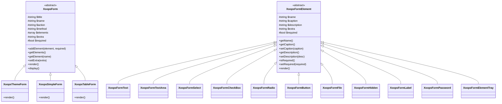
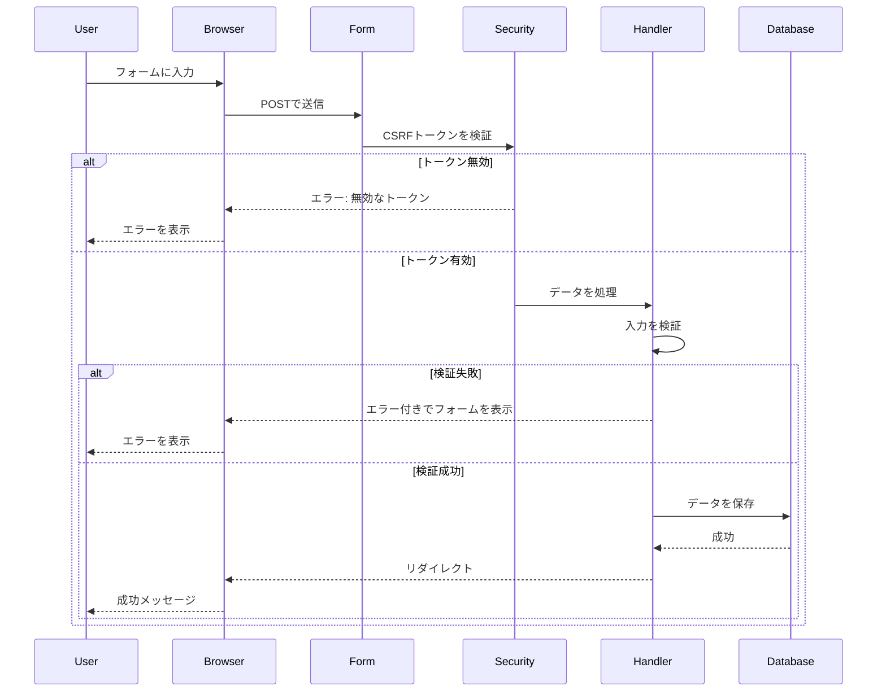

> XOOPS フォーム生成システムの完全なAPIドキュメンテーション

---

## クラス階層



---

## XoopsForm (抽象基底)

### コンストラクタ

```php
public function __construct(
    string $title,      // フォームタイトル
    string $name,       // フォーム名属性
    string $action,     // フォームアクションURL
    string $method = 'post',  // HTTPメソッド
    bool $addToken = false    // CSRFトークンを追加
)
```

### メソッド

| メソッド | パラメータ | 戻り値 | 説明 |
|--------|------------|--------|-------------|
| `addElement` | `XoopsFormElement $element, bool $required = false` | `void` | フォームに要素を追加 |
| `getElements` | - | `array` | すべての要素を取得 |
| `getElement` | `string $name` | `XoopsFormElement|null` | 名前で要素を取得 |
| `setExtra` | `string $extra` | `void` | 追加HTML属性を設定 |
| `getExtra` | - | `string` | 追加属性を取得 |
| `getTitle` | - | `string` | フォームタイトルを取得 |
| `setTitle` | `string $title` | `void` | フォームタイトルを設定 |
| `getName` | - | `string` | フォーム名を取得 |
| `getAction` | - | `string` | アクションURLを取得 |
| `render` | - | `string` | フォームHTMLをレンダリング |
| `display` | - | `void` | レンダリングされたフォームをエコー |
| `insertBreak` | `string $extra = ''` | `void` | 視覚的な区切りを挿入 |
| `setRequired` | `XoopsFormElement $element` | `void` | 要素を必須にマーク |

---

## XoopsThemeForm

最も一般的に使用されるフォームクラス。テーマ対応スタイリングでレンダリング。

### 使用方法

```php
<?php
$form = new XoopsThemeForm(
    'ユーザー登録',
    'registration_form',
    'register.php',
    'post',
    true  // CSRFトークンを含める
);

$form->addElement(new XoopsFormText('ユーザー名', 'uname', 25, 255, ''), true);
$form->addElement(new XoopsFormPassword('パスワード', 'pass', 25, 255), true);
$form->addElement(new XoopsFormButton('', 'submit', _SUBMIT, 'submit'));

echo $form->render();
```

### レンダリングされた出力

```html
<form name="registration_form" action="register.php" method="post"
      enctype="application/x-www-form-urlencoded">
  <table class="outer" cellspacing="1">
    <tr><th colspan="2">ユーザー登録</th></tr>
    <tr class="odd">
      <td class="head">ユーザー名 <span class="required">*</span></td>
      <td class="even">
        <input type="text" name="uname" size="25" maxlength="255" value="">
      </td>
    </tr>
    <!-- ... より多くのフィールド ... -->
  </table>
  <input type="hidden" name="XOOPS_TOKEN_REQUEST" value="...">
</form>
```

---

## フォーム要素

### XoopsFormText

単一行テキスト入力。

```php
$text = new XoopsFormText(
    string $caption,    // ラベルテキスト
    string $name,       // 入力名
    int $size,          // 表示幅
    int $maxlength,     // 最大文字数
    mixed $value = ''   // デフォルト値
);

// メソッド
$text->getValue();
$text->setValue($value);
$text->getSize();
$text->getMaxlength();
```

### XoopsFormTextArea

複数行テキスト入力。

```php
$textarea = new XoopsFormTextArea(
    string $caption,
    string $name,
    mixed $value = '',
    int $rows = 5,
    int $cols = 50
);

// メソッド
$textarea->getRows();
$textarea->getCols();
```

### XoopsFormSelect

ドロップダウンまたは複数選択。

```php
$select = new XoopsFormSelect(
    string $caption,
    string $name,
    mixed $value = null,
    int $size = 1,        // 1 = ドロップダウン、>1 = リストボックス
    bool $multiple = false
);

// メソッド
$select->addOption(mixed $value, string $name = '');
$select->addOptionArray(array $options);
$select->getOptions();
$select->getValue();
$select->isMultiple();
```

### XoopsFormCheckBox

チェックボックスまたはチェックボックスグループ。

```php
$checkbox = new XoopsFormCheckBox(
    string $caption,
    string $name,
    mixed $value = null,
    string $delimeter = '&nbsp;'
);

// メソッド
$checkbox->addOption(mixed $value, string $name = '');
$checkbox->addOptionArray(array $options);
$checkbox->getValue();
```

### XoopsFormRadio

ラジオボタングループ。

```php
$radio = new XoopsFormRadio(
    string $caption,
    string $name,
    mixed $value = null,
    string $delimeter = '&nbsp;'
);

// メソッド
$radio->addOption(mixed $value, string $name = '');
$radio->addOptionArray(array $options);
```

### XoopsFormButton

送信、リセット、またはカスタムボタン。

```php
$button = new XoopsFormButton(
    string $caption,
    string $name,
    string $value = '',
    string $type = 'button'  // 'submit', 'reset', 'button'
);
```

### XoopsFormFile

ファイルアップロード入力。

```php
$file = new XoopsFormFile(
    string $caption,
    string $name,
    int $maxFileSize = 0
);

// メソッド
$file->getMaxFileSize();
$file->setMaxFileSize(int $size);
```

### XoopsFormHidden

非表示の入力フィールド。

```php
$hidden = new XoopsFormHidden(
    string $name,
    mixed $value
);
```

### XoopsFormHiddenToken

CSRF保護トークン。

```php
$token = new XoopsFormHiddenToken(
    string $name = 'XOOPS_TOKEN_REQUEST'
);
```

### XoopsFormLabel

表示のみのラベル (入力ではない)。

```php
$label = new XoopsFormLabel(
    string $caption,
    string $value
);
```

### XoopsFormPassword

パスワード入力フィールド。

```php
$password = new XoopsFormPassword(
    string $caption,
    string $name,
    int $size,
    int $maxlength,
    mixed $value = ''
);
```

### XoopsFormElementTray

複数の要素をグループ化。

```php
$tray = new XoopsFormElementTray(
    string $caption,
    string $delimeter = '&nbsp;'
);

// メソッド
$tray->addElement(XoopsFormElement $element, bool $required = false);
$tray->getElements();
```

---

## フォームフロー図



---

## 完全な例

```php
<?php
require_once __DIR__ . '/mainfile.php';

use Xmf\Request;

$helper = \XoopsModules\MyModule\Helper::getInstance();
$itemHandler = $helper->getHandler('Item');

// フォーム送信を処理
if (Request::hasVar('submit', 'POST')) {
    // CSRFトークンを検証
    if (!$GLOBALS['xoopsSecurity']->check()) {
        redirect_header('form.php', 3, implode('<br>', $GLOBALS['xoopsSecurity']->getErrors()));
    }

    // 検証された入力を取得
    $title = Request::getString('title', '', 'POST');
    $content = Request::getText('content', '', 'POST');
    $categoryId = Request::getInt('category_id', 0, 'POST');
    $status = Request::getString('status', 'draft', 'POST');

    // オブジェクトを作成して入力
    $item = $itemHandler->create();
    $item->setVars([
        'title' => $title,
        'content' => $content,
        'category_id' => $categoryId,
        'status' => $status,
        'created' => time(),
        'uid' => $GLOBALS['xoopsUser']->getVar('uid')
    ]);

    // 保存
    if ($itemHandler->insert($item)) {
        redirect_header('index.php', 2, _MD_MYMODULE_SAVED);
    } else {
        $error = _MD_MYMODULE_ERROR_SAVING;
    }
}

// フォームを構築
$form = new XoopsThemeForm(_MD_MYMODULE_ADD_ITEM, 'itemform', 'form.php', 'post', true);

// タイトルフィールド
$titleElement = new XoopsFormText(_MD_MYMODULE_TITLE, 'title', 50, 255, $title ?? '');
$titleElement->setDescription(_MD_MYMODULE_TITLE_DESC);
$form->addElement($titleElement, true);

// カテゴリドロップダウン
$categoryHandler = $helper->getHandler('Category');
$categories = $categoryHandler->getList();
$categorySelect = new XoopsFormSelect(_MD_MYMODULE_CATEGORY, 'category_id', $categoryId ?? 0);
$categorySelect->addOptionArray($categories);
$form->addElement($categorySelect, true);

// エディター付きコンテンツテキストエリア
$editorConfigs = [
    'name' => 'content',
    'value' => $content ?? '',
    'rows' => 15,
    'cols' => 60,
    'width' => '100%',
    'height' => '400px',
];
$form->addElement(new XoopsFormEditor(_MD_MYMODULE_CONTENT, 'content', $editorConfigs));

// ステータスラジオボタン
$statusRadio = new XoopsFormRadio(_MD_MYMODULE_STATUS, 'status', $status ?? 'draft');
$statusRadio->addOptionArray([
    'draft' => _MD_MYMODULE_DRAFT,
    'published' => _MD_MYMODULE_PUBLISHED,
    'archived' => _MD_MYMODULE_ARCHIVED
]);
$form->addElement($statusRadio);

// 送信ボタン
$buttonTray = new XoopsFormElementTray('', '&nbsp;');
$buttonTray->addElement(new XoopsFormButton('', 'submit', _SUBMIT, 'submit'));
$buttonTray->addElement(new XoopsFormButton('', 'reset', _CANCEL, 'reset'));
$form->addElement($buttonTray);

// 表示
require_once XOOPS_ROOT_PATH . '/header.php';

if (!empty($error)) {
    echo "<div class='errorMsg'>$error</div>";
}

$form->display();

require_once XOOPS_ROOT_PATH . '/footer.php';
```

---

## 関連ドキュメンテーション

- XoopsObject API
- フォームガイド
- CSRF保護

---

#xoops #api #forms #xoopsform #reference
