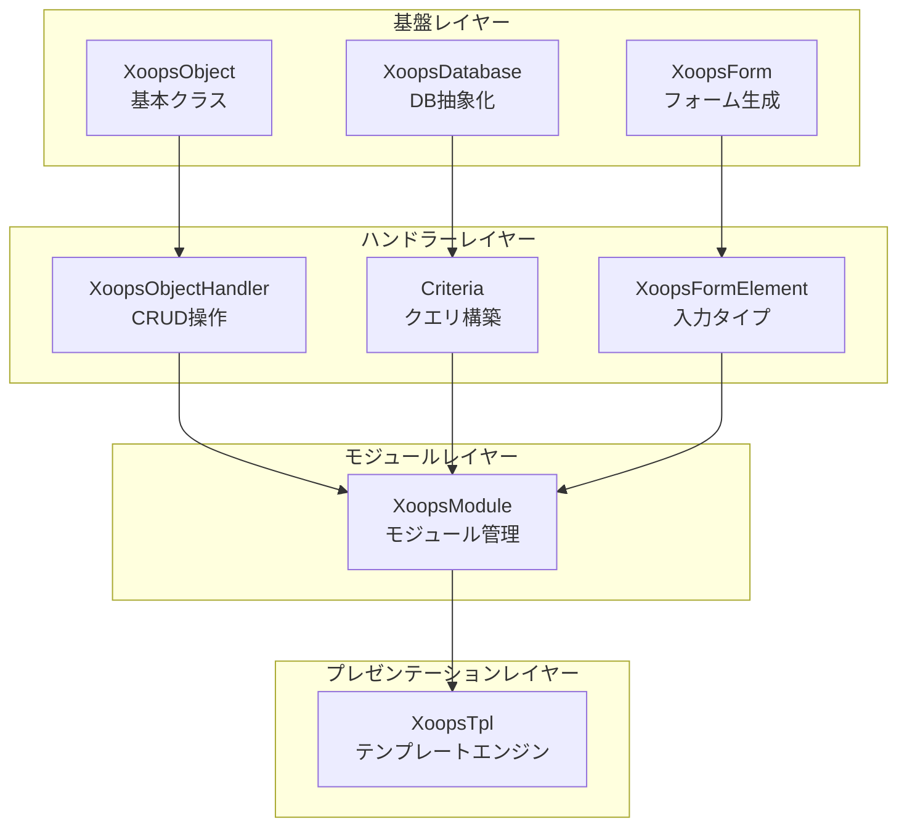
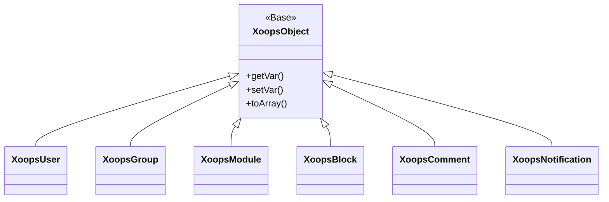
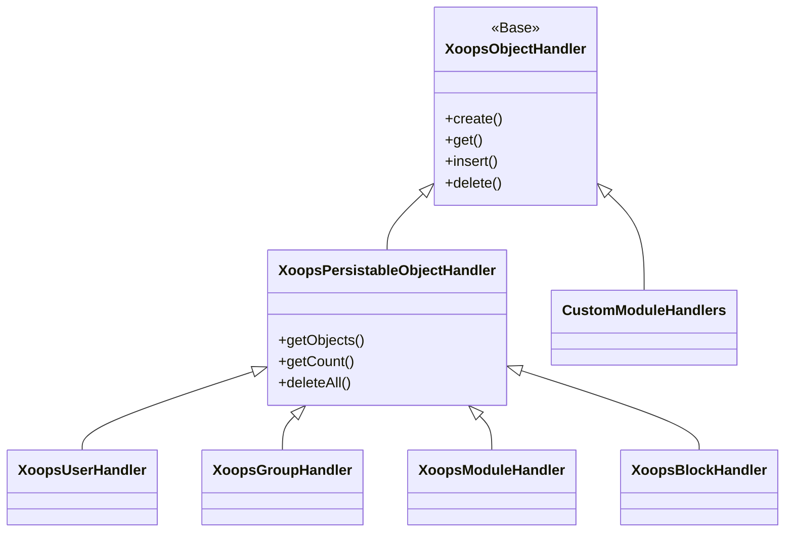
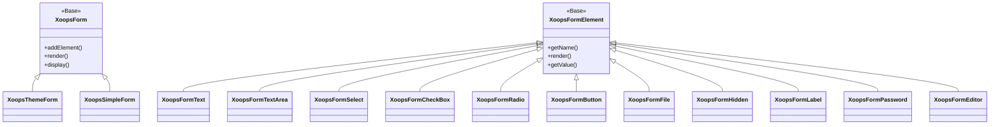

XOOPS APIリファレンスドキュメントへようこそ。このセクションでは、XOOPS Content Management Systemを構成するすべてのコアクラス、メソッド、システムの詳細なドキュメンテーションを提供します。

## 概要

XOOPS APIは、CMSの機能の特定の側面を担当する複数の主要なサブシステムに構成されています。これらのAPIを理解することは、XOOPS用のモジュール、テーマ、拡張機能を開発するために不可欠です。

## APIセクション

### コアクラス

他のすべてのXOOPSコンポーネントが構築される基礎クラス。

| ドキュメンテーション | 説明 |
|--------------|-------------|
| XoopsObject | XOOPS内のすべてのデータオブジェクトの基本クラス |
| XoopsObjectHandler | CRUD操作用のハンドラーパターン |

### データベースレイヤー

データベース抽象化およびクエリ構築ユーティリティ。

| ドキュメンテーション | 説明 |
|--------------|-------------|
| XoopsDatabase | データベース抽象化レイヤー |
| Criteriaシステム | クエリ条件と条件 |
| QueryBuilder | 最新のフルエントクエリ構築 |

### フォームシステム

HTMLフォーム生成と検証。

| ドキュメンテーション | 説明 |
|--------------|-------------|
| XoopsForm | フォームコンテナとレンダリング |
| フォーム要素 | 利用可能なすべてのフォーム要素タイプ |

### カーネルクラス

コアシステムコンポーネントとサービス。

| ドキュメンテーション | 説明 |
|--------------|-------------|
| カーネルクラス | システムカーネルとコアコンポーネント |

### モジュールシステム

モジュール管理とライフサイクル。

| ドキュメンテーション | 説明 |
|--------------|-------------|
| モジュールシステム | モジュールの読み込み、インストール、管理 |

### テンプレートシステム

Smartyテンプレート統合。

| ドキュメンテーション | 説明 |
|--------------|-------------|
| テンプレートシステム | Smarty統合とテンプレート管理 |

### ユーザーシステム

ユーザー管理と認証。

| ドキュメンテーション | 説明 |
|--------------|-------------|
| ユーザーシステム | ユーザーアカウント、グループ、権限 |

## アーキテクチャ概要



## クラス階層

### オブジェクトモデル



### ハンドラーモデル



### フォームモデル



## デザインパターン

XOOPS APIは複数のよく知られたデザインパターンを実装しています：

### シングルトンパターン
データベース接続やコンテナインスタンスなどのグローバルサービスに使用されます。

```php
$db = XoopsDatabase::getInstance();
$container = XoopsContainer::getInstance();
```

### ファクトリーパターン
オブジェクトハンドラーは一貫してドメインオブジェクトを作成します。

```php
$handler = xoops_getHandler('user');
$user = $handler->create();
```

### コンポジットパターン
フォームには複数のフォーム要素が含まれます。条件には条件ネストできます。

```php
$criteria = new CriteriaCompo();
$criteria->add(new Criteria('status', 1));
$criteria->add(new CriteriaCompo(...)); // Nested
```

### オブザーバーパターン
イベントシステムはモジュール間の疎結合を可能にします。

```php
$dispatcher->addListener('module.news.article_published', $callback);
```

## クイックスタート例

### オブジェクトの作成と保存

```php
// ハンドラーを取得
$handler = xoops_getHandler('user');

// 新しいオブジェクトを作成
$user = $handler->create();
$user->setVar('uname', 'newuser');
$user->setVar('email', 'user@example.com');

// データベースに保存
$handler->insert($user);
```

### 条件を使用したクエリ

```php
// 条件を構築
$criteria = new CriteriaCompo();
$criteria->add(new Criteria('level', 0, '>'));
$criteria->setSort('uname');
$criteria->setOrder('ASC');
$criteria->setLimit(10);

// オブジェクトを取得
$handler = xoops_getHandler('user');
$users = $handler->getObjects($criteria);
```

### フォームの作成

```php
$form = new XoopsThemeForm('User Profile', 'userform', 'save.php', 'post', true);
$form->addElement(new XoopsFormText('Username', 'uname', 50, 255, $user->getVar('uname')));
$form->addElement(new XoopsFormTextArea('Bio', 'bio', $user->getVar('bio')));
$form->addElement(new XoopsFormButton('', 'submit', _SUBMIT, 'submit'));
echo $form->render();
```

## API規則

### 命名規則

| タイプ | 規則 | 例 |
|------|-----------|---------|
| クラス | PascalCase | `XoopsUser`, `CriteriaCompo` |
| メソッド | camelCase | `getVar()`, `setVar()` |
| プロパティ | camelCase (保護) | `$_vars`, `$_handler` |
| 定数 | UPPER_SNAKE_CASE | `XOBJ_DTYPE_INT` |
| データベーステーブル | snake_case | `users`, `groups_users_link` |

### データ型

XOOPSはオブジェクト変数の標準データ型を定義します：

| 定数 | 型 | 説明 |
|----------|------|-------------|
| `XOBJ_DTYPE_TXTBOX` | String | テキスト入力 (サニタイズ) |
| `XOBJ_DTYPE_TXTAREA` | String | テキスエリアコンテンツ |
| `XOBJ_DTYPE_INT` | Integer | 数値 |
| `XOBJ_DTYPE_URL` | String | URL検証 |
| `XOBJ_DTYPE_EMAIL` | String | メール検証 |
| `XOBJ_DTYPE_ARRAY` | Array | シリアル化配列 |
| `XOBJ_DTYPE_OTHER` | Mixed | カスタム処理 |
| `XOBJ_DTYPE_SOURCE` | String | ソースコード (最小限のサニタイズ) |
| `XOBJ_DTYPE_STIME` | Integer | 短いタイムスタンプ |
| `XOBJ_DTYPE_MTIME` | Integer | 中程度タイムスタンプ |
| `XOBJ_DTYPE_LTIME` | Integer | 長いタイムスタンプ |

## 認証方法

APIは複数の認証方法をサポートしています：

### APIキー認証
```
X-API-Key: your-api-key
```

### OAuthベアラートークン
```
Authorization: Bearer your-oauth-token
```

### セッションベース認証
ログインしているときに既存のXOOPSセッションを使用します。

## RESTエンドポイント

REST APIが有効な場合：

| エンドポイント | メソッド | 説明 |
|----------|--------|-------------|
| `/api.php/rest/users` | GET | ユーザーの一覧 |
| `/api.php/rest/users/{id}` | GET | IDでユーザーを取得 |
| `/api.php/rest/users` | POST | ユーザーを作成 |
| `/api.php/rest/users/{id}` | PUT | ユーザーを更新 |
| `/api.php/rest/users/{id}` | DELETE | ユーザーを削除 |
| `/api.php/rest/modules` | GET | モジュールの一覧 |

## 関連ドキュメンテーション

- モジュール開発ガイド
- テーマ開発ガイド
- システム構成
- セキュリティベストプラクティス

## バージョン履歴

| バージョン | 変更 |
|---------|---------|
| 2.5.11 | 現在の安定版 |
| 2.5.10 | GraphQL APIサポートを追加 |
| 2.5.9 | Criteriaシステムを強化 |
| 2.5.8 | PSR-4オートローディングサポート |

---

*このドキュメンテーションはXOOPS知識ベースの一部です。最新の更新については、[XOOPS GitHubリポジトリ](https://github.com/XOOPS)にアクセスしてください。*
