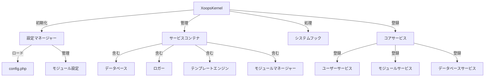

XOOPSカーネルはシステムのブートストラップ、設定の管理、システムイベントの処理、コアユーティリティの提供のための基本的なフレームワークを提供します。これらのクラスはXOOPSアプリケーションのバックボーンを形成します。

## システムアーキテクチャ



## XoopsKernelクラス

XOOPSシステムを初期化および管理するメインカーネルクラス。

### クラス概要

```php
namespace Xoops;

class XoopsKernel
{
    private static ?XoopsKernel $instance = null;
    protected ServiceContainer $services;
    protected ConfigurationManager $config;
    protected array $modules = [];
    protected bool $isLoaded = false;
}
```

### コンストラクタ

```php
private function __construct()
```

プライベートコンストラクタはシングルトンパターンを強制します。

### getInstance

シングルトンカーネルインスタンスを取得します。

```php
public static function getInstance(): XoopsKernel
```

**戻り値:** `XoopsKernel` - シングルトンカーネルインスタンス

**例:**
```php
$kernel = XoopsKernel::getInstance();
```

### ブートプロセス

カーネルブートプロセスは次のステップに従います:

1. **初期化** - エラーハンドラーを設定、定数を定義
2. **設定** - 設定ファイルをロード
3. **サービス登録** - コアサービスを登録
4. **モジュール検出** - アクティブなモジュールをスキャンして特定
5. **データベース初期化** - データベースに接続
6. **クリーンアップ** - リクエスト処理の準備

```php
public function boot(): void
```

**例:**
```php
$kernel = XoopsKernel::getInstance();
$kernel->boot();
```

### サービスコンテナメソッド

#### registerService

サービスコンテナにサービスを登録します。

```php
public function registerService(
    string $name,
    callable|object $definition
): void
```

**パラメータ:**

| パラメータ | 型 | 説明 |
|-----------|------|-------------|
| `$name` | string | サービス識別子 |
| `$definition` | callable\|object | サービスファクトリまたはインスタンス |

**例:**
```php
$kernel->registerService('custom.handler', function($c) {
    return new CustomHandler();
});
```

#### getService

登録されたサービスを取得します。

```php
public function getService(string $name): mixed
```

**パラメータ:**

| パラメータ | 型 | 説明 |
|-----------|------|-------------|
| `$name` | string | サービス識別子 |

**戻り値:** `mixed` - 要求されたサービス

**例:**
```php
$database = $kernel->getService('database');
$logger = $kernel->getService('logger');
```

#### hasService

サービスが登録されているかをチェックします。

```php
public function hasService(string $name): bool
```

**例:**
```php
if ($kernel->hasService('cache')) {
    $cache = $kernel->getService('cache');
}
```

## 設定マネージャー

アプリケーション設定とモジュール設定を管理します。

### クラス概要

```php
namespace Xoops\Core;

class ConfigurationManager
{
    protected array $config = [];
    protected array $defaults = [];
    protected string $configPath;
}
```

### メソッド

#### load

ファイルまたは配列から設定をロード。

```php
public function load(string|array $source): void
```

**パラメータ:**

| パラメータ | 型 | 説明 |
|-----------|------|-------------|
| `$source` | string\|array | 設定ファイルパスまたは配列 |

**例:**
```php
$config = $kernel->getService('config');
$config->load(XOOPS_ROOT_PATH . '/include/config.php');
$config->load(['sitename' => 'My Site', 'admin_email' => 'admin@example.com']);
```

#### get

設定値を取得。

```php
public function get(string $key, mixed $default = null): mixed
```

**パラメータ:**

| パラメータ | 型 | 説明 |
|-----------|------|-------------|
| `$key` | string | 設定キー (ドット表記) |
| `$default` | mixed | 見つからない場合のデフォルト値 |

**戻り値:** `mixed` - 設定値

**例:**
```php
$siteName = $config->get('sitename');
$adminEmail = $config->get('admin.email', 'admin@example.com');
```

#### set

設定値を設定。

```php
public function set(string $key, mixed $value): void
```

**パラメータ:**

| パラメータ | 型 | 説明 |
|-----------|------|-------------|
| `$key` | string | 設定キー |
| `$value` | mixed | 設定値 |

**例:**
```php
$config->set('sitename', 'New Site Name');
$config->set('features.cache_enabled', true);
```

#### getModuleConfig

特定のモジュールの設定を取得。

```php
public function getModuleConfig(
    string $moduleName
): array
```

**パラメータ:**

| パラメータ | 型 | 説明 |
|-----------|------|-------------|
| `$moduleName` | string | モジュールディレクトリ名 |

**戻り値:** `array` - モジュール設定配列

**例:**
```php
$publisherConfig = $config->getModuleConfig('publisher');
```

## システムフック

システムフックはモジュールとプラグインがアプリケーションライフサイクル内の特定のポイントでコードを実行できるようにします。

### HookManagerクラス

```php
namespace Xoops\Core;

class HookManager
{
    protected array $hooks = [];
    protected array $listeners = [];
}
```

### メソッド

#### addHook

フックポイントを登録。

```php
public function addHook(string $name): void
```

**パラメータ:**

| パラメータ | 型 | 説明 |
|-----------|------|-------------|
| `$name` | string | フック識別子 |

**例:**
```php
$hooks = $kernel->getService('hooks');
$hooks->addHook('system.startup');
$hooks->addHook('user.login');
$hooks->addHook('module.install');
```

#### listen

フックにリスナーを添付。

```php
public function listen(
    string $hookName,
    callable $callback,
    int $priority = 10
): void
```

**パラメータ:**

| パラメータ | 型 | 説明 |
|-----------|------|-------------|
| `$hookName` | string | フック識別子 |
| `$callback` | callable | 実行する関数 |
| `$priority` | int | 実行優先度 (高いほど先に実行) |

**例:**
```php
$hooks->listen('user.login', function($user) {
    error_log('ユーザー ' . $user->uname . ' がログインしました');
}, 10);

$hooks->listen('module.install', function($module) {
    // カスタムモジュールインストールロジック
    echo "インストール中 " . $module->getName();
}, 5);
```

#### trigger

フックのすべてのリスナーを実行。

```php
public function trigger(
    string $hookName,
    mixed $arguments = null
): array
```

**パラメータ:**

| パラメータ | 型 | 説明 |
|-----------|------|-------------|
| `$hookName` | string | フック識別子 |
| `$arguments` | mixed | リスナーに渡すデータ |

**戻り値:** `array` - すべてのリスナーからの結果

**例:**
```php
$results = $hooks->trigger('system.startup');
$results = $hooks->trigger('user.created', $newUser);
```

## コアサービス概要

カーネルはブート中にいくつかのコアサービスを登録します:

| サービス | クラス | 目的 |
|---------|-------|---------|
| `database` | XoopsDatabase | データベース抽象化レイヤー |
| `config` | ConfigurationManager | 設定管理 |
| `logger` | Logger | アプリケーションロギング |
| `template` | XoopsTpl | テンプレートエンジン |
| `user` | UserManager | ユーザー管理サービス |
| `module` | ModuleManager | モジュール管理 |
| `cache` | CacheManager | キャッシング層 |
| `hooks` | HookManager | システムイベントフック |

## 完全な使用例

```php
<?php
/**
 * カーネルを利用するカスタムモジュールブートプロセス
 */

// カーネルインスタンスを取得
$kernel = XoopsKernel::getInstance();

// システムをブート
$kernel->boot();

// サービスを取得
$config = $kernel->getService('config');
$database = $kernel->getService('database');
$logger = $kernel->getService('logger');
$hooks = $kernel->getService('hooks');

// 設定にアクセス
$siteName = $config->get('sitename');
$adminEmail = $config->get('admin.email');

// モジュール固有のフックを登録
$hooks->listen('user.login', function($user) {
    // ユーザーログインをログ
    $logger->info('ユーザーログイン: ' . $user->uname);

    // データベースで追跡
    $database->query(
        'INSERT INTO ' . $database->prefix('event_log') .
        ' (type, user_id, message, timestamp) VALUES (?, ?, ?, ?)',
        ['login', $user->uid(), 'User login', time()]
    );
});

$hooks->listen('module.install', function($module) {
    $logger->info('モジュールがインストールされました: ' . $module->getName());
});

// フックをトリガー
$hooks->trigger('system.startup');

// データベースサービスを使用
$result = $database->query(
    'SELECT * FROM ' . $database->prefix('users') .
    ' LIMIT 10'
);

while ($row = $database->fetchArray($result)) {
    echo "ユーザー: " . htmlspecialchars($row['uname']) . "\n";
}

// カスタムサービスを登録
$kernel->registerService('custom.repository', function($c) {
    return new CustomRepository($c->getService('database'));
});

// 後でカスタムサービスにアクセス
$repo = $kernel->getService('custom.repository');
```

## コア定数

カーネルはブート中にいくつかの重要な定数を定義します:

```php
// システムパス
define('XOOPS_ROOT_PATH', '/var/www/xoops');
define('XOOPS_HTDOCS_PATH', XOOPS_ROOT_PATH . '/htdocs');
define('XOOPS_MODULES_PATH', XOOPS_ROOT_PATH . '/htdocs/modules');
define('XOOPS_THEMES_PATH', XOOPS_ROOT_PATH . '/htdocs/themes');

// ウェブパス
define('XOOPS_URL', 'http://example.com');
define('XOOPS_HTDOCS_URL', XOOPS_URL . '/htdocs');

// データベース
define('XOOPS_DB_PREFIX', 'xoops_');
```

## エラー処理

カーネルはブート中にエラーハンドラーをセットアップします:

```php
// カスタムエラーハンドラーをセット
set_error_handler(function($errno, $errstr, $errfile, $errline) {
    $kernel->getService('logger')->error(
        "エラー: $errstr in $errfile:$errline"
    );
});

// 例外ハンドラーをセット
set_exception_handler(function($exception) {
    $kernel->getService('logger')->critical(
        "例外: " . $exception->getMessage()
    );
});
```

## ベストプラクティス

1. **シングルブート** - アプリケーション起動時に`boot()`を一度だけ呼び出す
2. **サービスコンテナを使用** - カーネルを通じてサービスを登録および取得
3. **早期にフックハンドラーを登録** - それらをトリガーする前にリスナーを登録
4. **重要なイベントをログ** - デバッグのためにロガーサービスを使用
5. **設定をキャッシュ** - 一度ロードして再利用
6. **エラー処理をセットアップ** - リクエストを処理する前にエラーハンドラーをセットアップ

## 関連ドキュメンテーション

- ../Module/Module-System - モジュールシステムとライフサイクル
- ../Template/Template-System - テンプレートエンジン統合
- ../User/User-System - ユーザー認証と管理
- ../Database/XoopsDatabase - データベースレイヤー

---

*参照: [XOOPSカーネルソース](https://github.com/XOOPS/XoopsCore27/tree/master/htdocs/class)*
