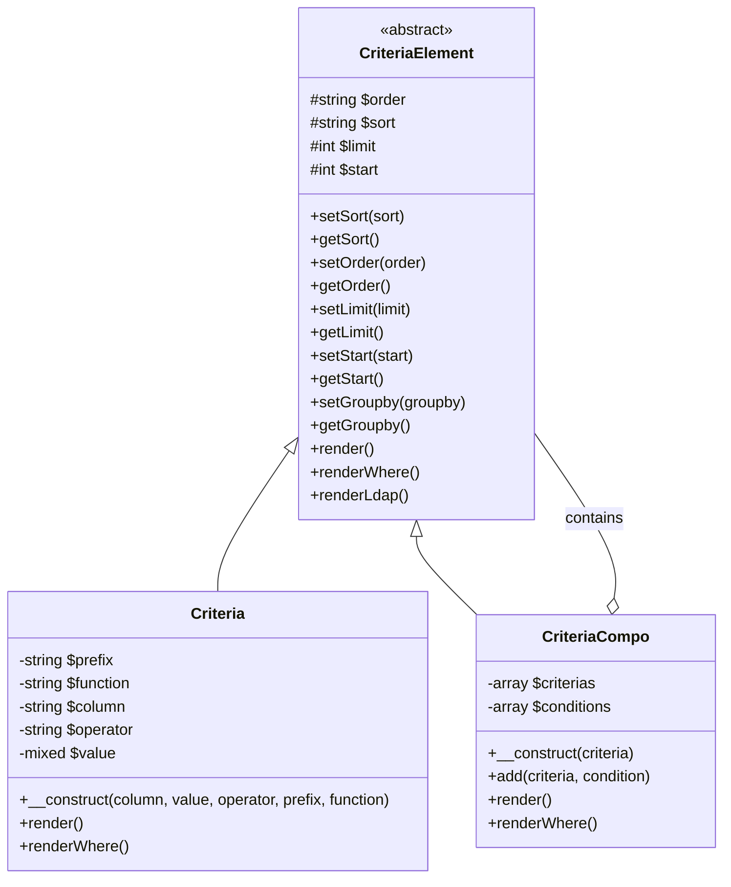
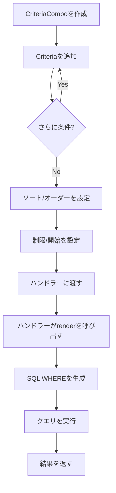
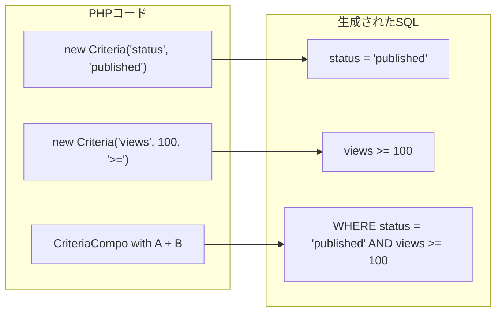
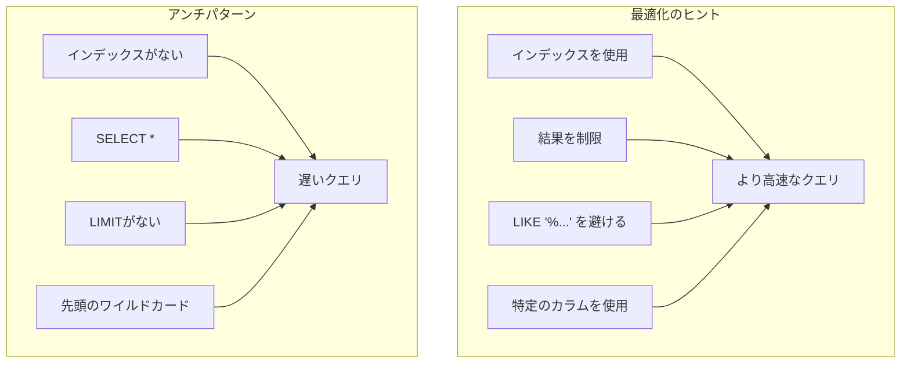

> XOOPS Criteriaクエリ構築システムの完全なAPIドキュメンテーション

---

## Criteriaシステムアーキテクチャ



---

## Criteriaクラス

### コンストラクタ

```php
public function __construct(
    string $column,           // カラム名
    mixed $value = '',        // 比較する値
    string $operator = '=',   // 比較演算子
    string $prefix = '',      // テーブルプレフィックス
    string $function = ''     // SQLファンクションラッパー
)
```

### 演算子

| 演算子 | 例 | SQL出力 |
|----------|---------|------------|
| `=` | `new Criteria('status', 1)` | `status = 1` |
| `!=` | `new Criteria('status', 0, '!=')` | `status != 0` |
| `<>` | `new Criteria('status', 0, '<>')` | `status <> 0` |
| `<` | `new Criteria('age', 18, '<')` | `age < 18` |
| `<=` | `new Criteria('age', 18, '<=')` | `age <= 18` |
| `>` | `new Criteria('age', 18, '>')` | `age > 18` |
| `>=` | `new Criteria('age', 18, '>=')` | `age >= 18` |
| `LIKE` | `new Criteria('title', '%php%', 'LIKE')` | `title LIKE '%php%'` |
| `NOT LIKE` | `new Criteria('title', '%spam%', 'NOT LIKE')` | `title NOT LIKE '%spam%'` |
| `IN` | `new Criteria('id', '(1,2,3)', 'IN')` | `id IN (1,2,3)` |
| `NOT IN` | `new Criteria('id', '(1,2,3)', 'NOT IN')` | `id NOT IN (1,2,3)` |
| `IS NULL` | `new Criteria('deleted', null, 'IS NULL')` | `deleted IS NULL` |
| `IS NOT NULL` | `new Criteria('email', null, 'IS NOT NULL')` | `email IS NOT NULL` |
| `BETWEEN` | `new Criteria('created', '1000 AND 2000', 'BETWEEN')` | `created BETWEEN 1000 AND 2000` |

### 使用例

```php
// シンプルな等価性
$criteria = new Criteria('status', 'published');

// 数値比較
$criteria = new Criteria('views', 100, '>=');

// パターンマッチング
$criteria = new Criteria('title', '%XOOPS%', 'LIKE');

// テーブルプレフィックス付き
$criteria = new Criteria('uid', 1, '=', 'u');
// レンダリング: u.uid = 1

// SQLファンクション付き
$criteria = new Criteria('title', '', '!=', '', 'LOWER');
// レンダリング: LOWER(title) != ''
```

---

## CriteriaCompoクラス

### コンストラクタ とメソッド

```php
// 空のcompoを作成
$criteria = new CriteriaCompo();

// または初期criteriaで
$criteria = new CriteriaCompo(new Criteria('status', 'active'));

// criteriaを追加 (デフォルトはAND)
$criteria->add(new Criteria('views', 10, '>='));

// ORで追加
$criteria->add(new Criteria('featured', 1), 'OR');

// ネスト
$subCriteria = new CriteriaCompo();
$subCriteria->add(new Criteria('author', 1));
$subCriteria->add(new Criteria('author', 2), 'OR');
$criteria->add($subCriteria); // (author = 1 OR author = 2)
```

### ソートとページネーション

```php
$criteria = new CriteriaCompo();
$criteria->add(new Criteria('status', 'published'));

// シングルソート
$criteria->setSort('created');
$criteria->setOrder('DESC');

// 複数ソートカラム
$criteria->setSort('category_id, created');
$criteria->setOrder('ASC, DESC');

// ページネーション
$criteria->setLimit(10);    // 1ページあたりのアイテム数
$criteria->setStart(0);     // オフセット (page * limit)

// GROUP BY
$criteria->setGroupby('category_id');
```

---

## クエリ構築フロー



---

## 複雑なクエリ例

### 複数条件での検索

```php
$criteria = new CriteriaCompo();

// ステータスは公開されている必要がある
$criteria->add(new Criteria('status', 'published'));

// カテゴリは1、2、または3
$criteria->add(new Criteria('category_id', '(1, 2, 3)', 'IN'));

// 過去30日以内に作成
$thirtyDaysAgo = time() - (30 * 24 * 60 * 60);
$criteria->add(new Criteria('created', $thirtyDaysAgo, '>='));

// タイトルまたはコンテンツに検索語を含む
$searchCriteria = new CriteriaCompo();
$searchCriteria->add(new Criteria('title', '%' . $searchTerm . '%', 'LIKE'));
$searchCriteria->add(new Criteria('content', '%' . $searchTerm . '%', 'LIKE'), 'OR');
$criteria->add($searchCriteria);

// ビューの降順でソート
$criteria->setSort('views');
$criteria->setOrder('DESC');

// ページネーション
$criteria->setLimit($perPage);
$criteria->setStart($page * $perPage);

// 実行
$items = $itemHandler->getObjects($criteria);
$total = $itemHandler->getCount($criteria);
```

### 日付範囲クエリ

```php
$criteria = new CriteriaCompo();

// 2つの日付の間
$startDate = strtotime('2024-01-01');
$endDate = strtotime('2024-12-31');

$criteria->add(new Criteria('created', $startDate, '>='));
$criteria->add(new Criteria('created', $endDate, '<='));

// またはBETWEENを使用
$criteria->add(new Criteria('created', "$startDate AND $endDate", 'BETWEEN'));
```

### ユーザー権限フィルター

```php
$criteria = new CriteriaCompo();
$criteria->add(new Criteria('status', 'published'));

// 管理者でない場合、自分のアイテムまたは公開アイテムのみを表示
if (!$xoopsUser || !$xoopsUser->isAdmin()) {
    $permCriteria = new CriteriaCompo();
    $permCriteria->add(new Criteria('visibility', 'public'));

    if (is_object($xoopsUser)) {
        $permCriteria->add(new Criteria('author_id', $xoopsUser->getVar('uid')), 'OR');
    }

    $criteria->add($permCriteria);
}
```

### JOINのようなクエリ

```php
// カテゴリがアクティブなアイテムを取得
// (サブクエリアプローチを使用)
$categoryHandler = xoops_getHandler('category');
$activeCatCriteria = new Criteria('status', 'active');
$activeCategories = $categoryHandler->getIds($activeCatCriteria);

if (!empty($activeCategories)) {
    $criteria->add(new Criteria('category_id', '(' . implode(',', $activeCategories) . ')', 'IN'));
}
```

---

## CriteriaからSQLへの可視化



---

## ハンドラー統合

```php
// Criteriaを受け付ける標準的なハンドラーメソッド

// 複数のオブジェクトを取得
$objects = $handler->getObjects($criteria);
$objects = $handler->getObjects($criteria, true);  // 配列として
$objects = $handler->getObjects($criteria, true, true); // 配列として、IDをキー

// 数をカウント
$count = $handler->getCount($criteria);

// リスト (id => identifier)を取得
$list = $handler->getList($criteria);

// マッチするものを削除
$deleted = $handler->deleteAll($criteria);

// マッチするものを更新
$handler->updateAll('status', 'archived', $criteria);
```

---

## パフォーマンス上の考慮事項



### ベストプラクティス

1. **常にLIMITを設定** - 大きなテーブルには
2. **インデックスを使用** - criteriaで使用されるカラムに
3. **LIKE '%...' を避ける** - 先頭のワイルドカードは遅い
4. **可能な限りPHPで事前フィルター** - 複雑なロジックの場合
5. **COUNTを控えめに使用** - 可能な場合は結果をキャッシュ

---

## 関連ドキュメンテーション

- データベースレイヤー
- XoopsObjectHandler API
- SQLインジェクション対策

---

#xoops #api #criteria #database #query #reference
