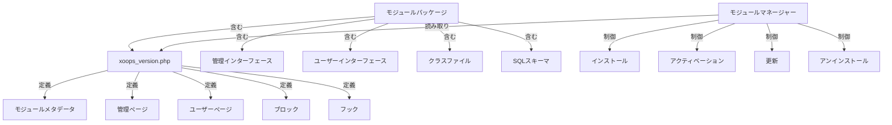

XOOPSモジュールシステムはモジュール機能の開発、インストール、管理、および拡張のための完全なフレームワークを提供します。モジュールはXOOPSに追加機能と能力を追加する自己完結型パッケージです。

## モジュールアーキテクチャ



## モジュール構造

標準的なXOOPSモジュールのディレクトリ構造:

```
mymodule/
├── xoops_version.php          # モジュールマニフェストと設定
├── admin.php                  # 管理メインページ
├── index.php                  # ユーザーメインページ
├── admin/                     # 管理ページディレクトリ
│   ├── main.php
│   ├── manage.php
│   └── settings.php
├── class/                     # モジュールクラス
│   ├── Handler/
│   │   ├── ItemHandler.php
│   │   └── CategoryHandler.php
│   └── Objects/
│       ├── Item.php
│       └── Category.php
├── sql/                       # データベーススキーマ
│   ├── mysql.sql
│   └── postgres.sql
├── include/                   # インクルードファイル
│   ├── common.inc.php
│   └── functions.php
├── templates/                 # モジュールテンプレート
│   ├── admin/
│   │   └── main.tpl
│   └── user/
│       ├── index.tpl
│       └── item.tpl
├── blocks/                    # モジュールブロック
│   └── blocks.php
├── tests/                     # ユニットテスト
├── language/                  # 言語ファイル
│   ├── english/
│   │   └── main.php
│   └── spanish/
│       └── main.php
└── docs/                      # ドキュメンテーション
```

## XoopsModuleクラス

インストールされたXOOPSモジュールを表します。

### クラス概要

```php
namespace Xoops\Core\Module;

class XoopsModule extends XoopsObject
{
    protected int $moduleid = 0;
    protected string $name = '';
    protected string $dirname = '';
    protected string $version = '';
    protected string $description = '';
    protected array $config = [];
    protected array $blocks = [];
    protected array $adminPages = [];
    protected array $userPages = [];
}
```

### プロパティ

| プロパティ | 型 | 説明 |
|----------|------|-------------|
| `$moduleid` | int | ユニークなモジュールID |
| `$name` | string | モジュール表示名 |
| `$dirname` | string | モジュールディレクトリ名 |
| `$version` | string | 現在のモジュールバージョン |
| `$description` | string | モジュール説明 |
| `$config` | array | モジュール設定 |
| `$blocks` | array | モジュールブロック |
| `$adminPages` | array | 管理パネルページ |
| `$userPages` | array | ユーザー向けページ |

### コンストラクタ

```php
public function __construct()
```

新しいモジュールインスタンスを作成して変数を初期化。

### コアメソッド

#### getName

モジュールの表示名を取得。

```php
public function getName(): string
```

**戻り値:** `string` - モジュール表示名

**例:**
```php
$module = new XoopsModule();
$module->setVar('name', 'Publisher');
echo $module->getName(); // "Publisher"
```

#### getDirname

モジュールのディレクトリ名を取得。

```php
public function getDirname(): string
```

**戻り値:** `string` - モジュールディレクトリ名

**例:**
```php
echo $module->getDirname(); // "publisher"
```

#### getVersion

現在のモジュールバージョンを取得。

```php
public function getVersion(): string
```

**戻り値:** `string` - バージョン文字列

**例:**
```php
echo $module->getVersion(); // "2.1.0"
```

#### getDescription

モジュール説明を取得。

```php
public function getDescription(): string
```

**戻り値:** `string` - モジュール説明

**例:**
```php
$desc = $module->getDescription();
```

#### getConfig

モジュール設定を取得。

```php
public function getConfig(string $key = null): mixed
```

**パラメータ:**

| パラメータ | 型 | 説明 |
|-----------|------|-------------|
| `$key` | string | 設定キー (すべての場合はnull) |

**戻り値:** `mixed` - 設定値または配列

**例:**
```php
$config = $module->getConfig();
$itemsPerPage = $module->getConfig('items_per_page');
```

#### setConfig

モジュール設定を設定。

```php
public function setConfig(string $key, mixed $value): void
```

**パラメータ:**

| パラメータ | 型 | 説明 |
|-----------|------|-------------|
| `$key` | string | 設定キー |
| `$value` | mixed | 設定値 |

**例:**
```php
$module->setConfig('items_per_page', 20);
$module->setConfig('enable_cache', true);
```

#### getPath

モジュールへのフルファイルシステムパスを取得。

```php
public function getPath(): string
```

**戻り値:** `string` - 絶対モジュールディレクトリパス

**例:**
```php
$path = $module->getPath(); // "/var/www/xoops/modules/publisher"
$classPath = $module->getPath() . '/class';
```

#### getUrl

モジュールのURLを取得。

```php
public function getUrl(): string
```

**戻り値:** `string` - モジュールURL

**例:**
```php
$url = $module->getUrl(); // "http://example.com/modules/publisher"
```

## モジュールインストールプロセス

### xoops_module_install関数

`xoops_version.php`で定義されたモジュールインストール関数:

```php
function xoops_module_install_modulename($module)
{
    // $moduleはXoopsModuleインスタンス

    // データベーステーブルを作成
    // デフォルト設定を初期化
    // デフォルトフォルダーを作成
    // ファイル権限をセットアップ

    return true; // 成功
}
```

**パラメータ:**

| パラメータ | 型 | 説明 |
|-----------|------|-------------|
| `$module` | XoopsModule | インストール中のモジュール |

**戻り値:** `bool` - 成功時はTrue、失敗時はFalse

**例:**
```php
function xoops_module_install_publisher($module)
{
    // モジュールパスを取得
    $modulePath = $module->getPath();

    // アップロードディレクトリを作成
    $uploadsPath = XOOPS_ROOT_PATH . '/uploads/publisher';
    if (!is_dir($uploadsPath)) {
        mkdir($uploadsPath, 0755, true);
    }

    // データベース接続を取得
    global $xoopsDB;

    // SQLインストールスクリプトを実行
    $sqlFile = $modulePath . '/sql/mysql.sql';
    if (file_exists($sqlFile)) {
        $sqlQueries = file_get_contents($sqlFile);
        // クエリを実行 (簡略化)
        $xoopsDB->queryFromFile($sqlFile);
    }

    // デフォルト設定を設定
    $module->setConfig('items_per_page', 10);
    $module->setConfig('enable_comments', true);

    return true;
}
```

### xoops_module_uninstall関数

モジュールアンインストール関数:

```php
function xoops_module_uninstall_modulename($module)
{
    // データベーステーブルを削除
    // アップロードされたファイルを削除
    // 設定をクリーンアップ

    return true;
}
```

**例:**
```php
function xoops_module_uninstall_publisher($module)
{
    global $xoopsDB;

    // テーブルを削除
    $tables = ['publisher_items', 'publisher_categories', 'publisher_comments'];
    foreach ($tables as $table) {
        $xoopsDB->query('DROP TABLE IF EXISTS ' . $xoopsDB->prefix($table));
    }

    // アップロードフォルダーを削除
    $uploadsPath = XOOPS_ROOT_PATH . '/uploads/publisher';
    if (is_dir($uploadsPath)) {
        // ディレクトリを再帰的に削除
        $this->recursiveRemoveDir($uploadsPath);
    }

    return true;
}
```

## モジュールフック

モジュールフックはモジュールを他のモジュールとシステムに統合できます。

### フック宣言

`xoops_version.php`内:

```php
$modversion['hooks'] = [
    'system.page.footer' => [
        'function' => 'publisher_page_footer'
    ],
    'user.profile.view' => [
        'function' => 'publisher_user_articles'
    ],
];
```

### フック実装

```php
// モジュールファイルで (例: include/hooks.php)

function publisher_page_footer()
{
    // フッターのHTMLを返す
    return '<div class="publisher-footer">Publisher Footer Content</div>';
}

function publisher_user_articles($user_id)
{
    global $xoopsDB;

    // ユーザーの記事を取得
    $result = $xoopsDB->query(
        'SELECT * FROM ' . $xoopsDB->prefix('publisher_articles') .
        ' WHERE author_id = ? ORDER BY published DESC LIMIT 5',
        [$user_id]
    );

    $articles = [];
    while ($row = $xoopsDB->fetchAssoc($result)) {
        $articles[] = $row;
    }

    return $articles;
}
```

### 利用可能なシステムフック

| フック | パラメータ | 説明 |
|------|-----------|-------------|
| `system.page.header` | なし | ページヘッダー出力 |
| `system.page.footer` | なし | ページフッター出力 |
| `user.login.success` | $userオブジェクト | ユーザーログイン後 |
| `user.logout` | $userオブジェクト | ユーザーログアウト後 |
| `user.profile.view` | $user_id | ユーザープロフィール表示時 |
| `module.install` | $moduleオブジェクト | モジュールインストール |
| `module.uninstall` | $moduleオブジェクト | モジュールアンインストール |

## モジュールマネージャーサービス

ModuleManagerサービスはモジュール操作を処理します。

### メソッド

#### getModule

名前でモジュールを取得。

```php
public function getModule(string $dirname): ?XoopsModule
```

**パラメータ:**

| パラメータ | 型 | 説明 |
|-----------|------|-------------|
| `$dirname` | string | モジュールディレクトリ名 |

**戻り値:** `?XoopsModule` - モジュールインスタンスまたはnull

**例:**
```php
$moduleManager = $kernel->getService('module');
$publisher = $moduleManager->getModule('publisher');
if ($publisher) {
    echo $publisher->getName();
}
```

#### getAllModules

インストールされたすべてのモジュールを取得。

```php
public function getAllModules(bool $activeOnly = true): array
```

**パラメータ:**

| パラメータ | 型 | 説明 |
|-----------|------|-------------|
| `$activeOnly` | bool | アクティブなモジュールのみを返す |

**戻り値:** `array` - XoopsModuleオブジェクトの配列

**例:**
```php
$activeModules = $moduleManager->getAllModules(true);
foreach ($activeModules as $module) {
    echo $module->getName() . " - " . $module->getVersion() . "\n";
}
```

#### isModuleActive

モジュールがアクティブかをチェック。

```php
public function isModuleActive(string $dirname): bool
```

**例:**
```php
if ($moduleManager->isModuleActive('publisher')) {
    // Publisherモジュールがアクティブ
}
```

#### activateModule

モジュールをアクティベート。

```php
public function activateModule(string $dirname): bool
```

**例:**
```php
if ($moduleManager->activateModule('publisher')) {
    echo "Publisherがアクティベートされました";
}
```

#### deactivateModule

モジュールをディアクティベート。

```php
public function deactivateModule(string $dirname): bool
```

**例:**
```php
if ($moduleManager->deactivateModule('publisher')) {
    echo "Publisherがディアクティベートされました";
}
```

## モジュール設定 (xoops_version.php)

完全なモジュールマニフェスト例:

```php
<?php
/**
 * Publisherのモジュールマニフェスト
 */

$modversion = [
    'name' => 'Publisher',
    'version' => '2.1.0',
    'description' => 'プロフェッショナルなコンテンツ公開モジュール',
    'author' => 'XOOPS Community',
    'credits' => 'オリジナル作業による...',
    'license' => 'GPL v2',
    'official' => 1,
    'image' => 'images/logo.png',
    'dirname' => 'publisher',
    'onInstall' => 'xoops_module_install_publisher',
    'onUpdate' => 'xoops_module_update_publisher',
    'onUninstall' => 'xoops_module_uninstall_publisher',

    // 管理ページ
    'hasAdmin' => 1,
    'adminindex' => 'admin/main.php',
    'adminmenu' => [
        [
            'title' => 'ダッシュボード',
            'link' => 'admin/main.php',
            'icon' => 'dashboard.png'
        ],
        [
            'title' => 'アイテムを管理',
            'link' => 'admin/items.php',
            'icon' => 'items.png'
        ],
        [
            'title' => '設定',
            'link' => 'admin/settings.php',
            'icon' => 'settings.png'
        ]
    ],

    // ユーザーページ
    'hasMain' => 1,
    'main_file' => 'index.php',

    // ブロック
    'blocks' => [
        [
            'file' => 'blocks/recent.php',
            'name' => '最近の記事',
            'description' => '公開されている最近の記事を表示',
            'show_func' => 'publisher_recent_show',
            'edit_func' => 'publisher_recent_edit',
            'options' => '5|0|0',
            'template' => 'publisher_block_recent.tpl'
        ],
        [
            'file' => 'blocks/featured.php',
            'name' => 'フィーチャー記事',
            'description' => 'フィーチャーされた記事を表示',
            'show_func' => 'publisher_featured_show',
            'edit_func' => 'publisher_featured_edit'
        ]
    ],

    // モジュールフック
    'hooks' => [
        'system.page.footer' => [
            'function' => 'publisher_page_footer'
        ],
        'user.profile.view' => [
            'function' => 'publisher_user_articles'
        ]
    ],

    // 設定アイテム
    'config' => [
        [
            'name' => 'items_per_page',
            'title' => '_MI_PUBLISHER_ITEMS_PER_PAGE',
            'description' => '_MI_PUBLISHER_ITEMS_PER_PAGE_DESC',
            'formtype' => 'text',
            'valuetype' => 'int',
            'default' => '10'
        ],
        [
            'name' => 'enable_comments',
            'title' => '_MI_PUBLISHER_ENABLE_COMMENTS',
            'description' => '_MI_PUBLISHER_ENABLE_COMMENTS_DESC',
            'formtype' => 'yesno',
            'valuetype' => 'int',
            'default' => '1'
        ]
    ]
];

function xoops_module_install_publisher($module)
{
    // インストールロジック
    return true;
}

function xoops_module_update_publisher($module)
{
    // 更新ロジック
    return true;
}

function xoops_module_uninstall_publisher($module)
{
    // アンインストールロジック
    return true;
}
```

## ベストプラクティス

1. **クラスを名前空間化** - モジュール固有の名前空間を使用して競合を避ける

2. **ハンドラーを使用** - データベース操作に常にハンドラークラスを使用

3. **コンテンツを国際化** - ユーザー向けのすべての文字列に言語定数を使用

4. **インストールスクリプトを作成** - データベーステーブル用のSQLスキーマを提供

5. **フックをドキュメント化** - モジュールが提供するフックを明確にドキュメント化

6. **モジュールをバージョン管理** - リリースでバージョン番号を増加させる

7. **インストールをテスト** - インストール/アンインストールプロセスを徹底的にテスト

8. **権限を処理** - アクションを許可する前にユーザー権限をチェック

## 完全なモジュール例

```php
<?php
/**
 * カスタム記事モジュルメインページ
 */

include __DIR__ . '/include/common.inc.php';

// モジュールインスタンスを取得
$module = xoops_getModuleByDirname('mymodule');

// モジュールがアクティブかをチェック
if (!$module) {
    die('モジュールが見つかりません');
}

// モジュール設定を取得
$itemsPerPage = $module->getConfig('items_per_page');

// アイテムハンドラーを取得
$itemHandler = xoops_getModuleHandler('item', 'mymodule');

// ページネーション付きでアイテムを取得
$criteria = new CriteriaCompo();
$criteria->add(new Criteria('status', 1));
$items = $itemHandler->getObjects($criteria, $itemsPerPage);

// テンプレートを準備
$xoopsTpl->assign('items', $items);
$xoopsTpl->assign('module_name', $module->getName());
$xoopsTpl->display($module->getPath() . '/templates/user/index.tpl');
```

## 関連ドキュメンテーション

- ../Kernel/Kernel-Classes - カーネル初期化とコアサービス
- ../Template/Template-System - モジュールテンプレートとテーマ統合
- ../Database/QueryBuilder - データベースクエリ構築
- ../Core/XoopsObject - 基本オブジェクトクラス

---

*参照: [XOOPSモジュール開発ガイド](https://github.com/XOOPS/XoopsCore27/wiki/Module-Development)*
