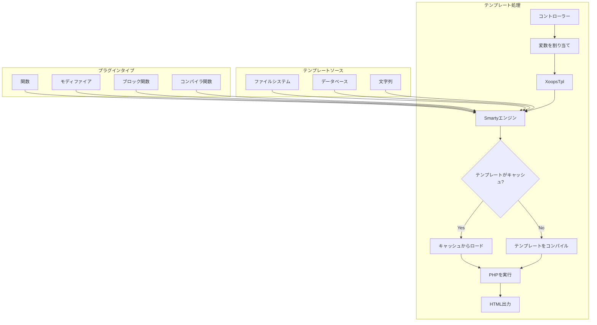
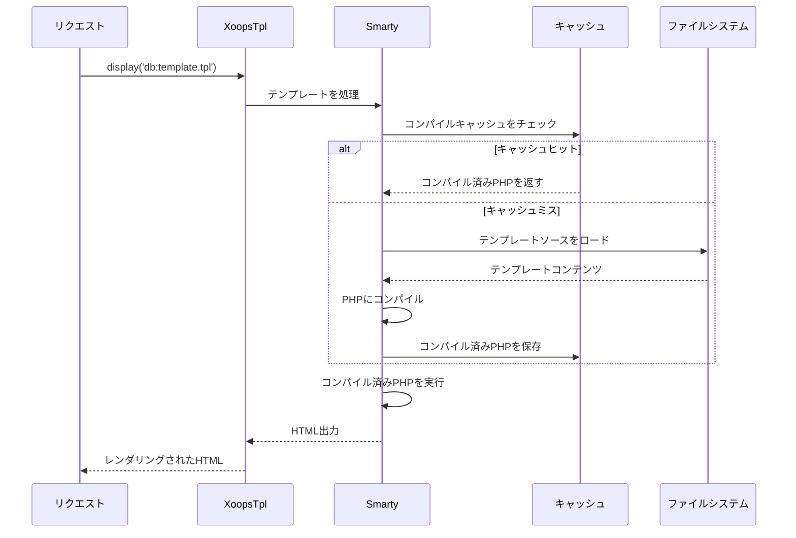
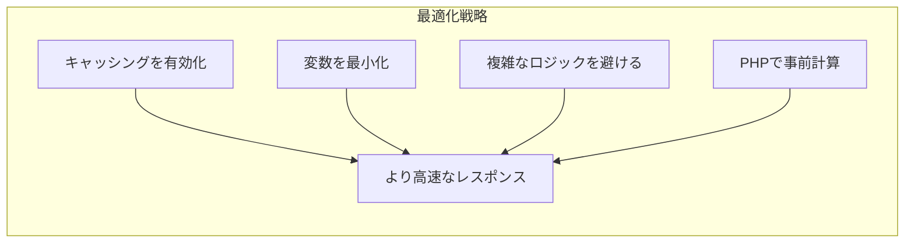

> XOOPSでのSmartyテンプレート処理の完全なAPIドキュメンテーション

---

## テンプレートエンジンアーキテクチャ



---

## XoopsTplクラス

### 初期化

```php
// グローバルテンプレートオブジェクト
global $xoopsTpl;

// または新しいインスタンスを取得
$tpl = new XoopsTpl();

// モジュール内で利用可能
$GLOBALS['xoopsTpl']->assign('myvar', $value);
```

### コアメソッド

| メソッド | パラメータ | 説明 |
|--------|------------|-------------|
| `assign` | `string $name, mixed $value` | テンプレートに変数を割り当て |
| `assignByRef` | `string $name, mixed &$value` | 参照で割り当て |
| `append` | `string $name, mixed $value, bool $merge = false` | 配列変数に追加 |
| `display` | `string $template` | テンプレートをレンダリングして出力 |
| `fetch` | `string $template` | テンプレートをレンダリングして返す |
| `clearAssign` | `string $name` | 割り当てられた変数をクリア |
| `clearAllAssign` | - | すべての変数をクリア |
| `getTemplateVars` | `string $name = null` | 割り当てられた変数を取得 |
| `templateExists` | `string $template` | テンプレートが存在するかをチェック |
| `isCached` | `string $template` | テンプレートがキャッシュされているかをチェック |
| `clearCache` | `string $template = null` | テンプレートキャッシュをクリア |

### 変数割り当て

```php
// シンプルな割り当て
$xoopsTpl->assign('title', 'My Page Title');
$xoopsTpl->assign('count', 42);
$xoopsTpl->assign('is_admin', true);

// 配列割り当て
$xoopsTpl->assign('items', [
    ['id' => 1, 'name' => 'Item 1'],
    ['id' => 2, 'name' => 'Item 2'],
]);

// オブジェクト割り当て
$xoopsTpl->assign('user', $xoopsUser);

// 複数割り当て
$xoopsTpl->assign([
    'title' => 'My Title',
    'content' => 'My Content',
    'author' => 'John Doe'
]);

// 配列に追加
$xoopsTpl->append('items', ['id' => 3, 'name' => 'Item 3']);
```

### テンプレート読み込み

```php
// データベースから (コンパイル済み)
$xoopsTpl->display('db:mymodule_index.tpl');

// ファイルシステムから
$xoopsTpl->display('file:' . XOOPS_ROOT_PATH . '/modules/mymodule/templates/custom.tpl');

// 出力なしで取得
$html = $xoopsTpl->fetch('db:mymodule_item.tpl');

// 文字列から
$template = '<h1>{$title}</h1><p>{$content}</p>';
$html = $xoopsTpl->fetch('string:' . $template);
```

---

## Smarty構文リファレンス

### 変数

```smarty
{* シンプルな変数 *}
<{$title}>

{* 配列アクセス *}
<{$item.name}>
<{$item['name']}>

{* オブジェクトプロパティ *}
<{$user->name}>
<{$user->getVar('uname')}>

{* 設定変数 *}
<{$xoops_sitename}>

{* 定数 *}
<{$smarty.const._MD_MYMODULE_TITLE}>

{* サーバー変数 *}
<{$smarty.server.REQUEST_URI}>
<{$smarty.get.id}>
<{$smarty.post.name}>
```

### モディファイア

```smarty
{* 文字列モディファイア *}
<{$title|upper}>
<{$title|lower}>
<{$title|capitalize}>
<{$title|truncate:50:"..."}>
<{$content|strip_tags}>
<{$content|nl2br}>
<{$text|escape:'html'}>
<{$text|escape:'url'}>

{* 日付フォーマット *}
<{$timestamp|date_format:"%Y-%m-%d"}>
<{$timestamp|date_format:"%B %e, %Y"}>

{* 数値フォーマット *}
<{$price|number_format:2:".":","}>

{* デフォルト値 *}
<{$optional|default:"N/A"}>

{* チェーンされたモディファイア *}
<{$title|strip_tags|truncate:50|escape}>

{* 配列をカウント *}
<{$items|@count}>
```

### 制御構造

```smarty
{* If/else *}
<{if $is_admin}>
    <p>管理者コンテンツ</p>
<{elseif $is_moderator}>
    <p>モデレーターコンテンツ</p>
<{else}>
    <p>ユーザーコンテンツ</p>
<{/if}>

{* Foreachループ *}
<{foreach from=$items item=item key=key}>
    <li><{$key}>: <{$item.name}></li>
<{/foreach}>

{* Foreachとプロパティ *}
<{foreach from=$items item=item name=itemLoop}>
    <{if $smarty.foreach.itemLoop.first}>
        <ul>
    <{/if}>

    <li class="<{if $smarty.foreach.itemLoop.iteration is odd}>odd<{else}>even<{/if}>">
        <{$smarty.foreach.itemLoop.iteration}>. <{$item.name}>
    </li>

    <{if $smarty.foreach.itemLoop.last}>
        </ul>
        <p>合計: <{$smarty.foreach.itemLoop.total}></p>
    <{/if}>
<{/foreach}>

{* Forループ *}
<{for $i=1 to 10}>
    <{$i}>
<{/for}>

{* Whileループ *}
<{while $count < 10}>
    <{$count}>
    <{$count = $count + 1}>
<{/while}>
```

### インクルード

```smarty
{* 別のテンプレートをインクルード *}
<{include file="db:mymodule_header.tpl"}>

{* 変数付きでインクルード *}
<{include file="db:mymodule_item.tpl" item=$currentItem showAuthor=true}>

{* テーマからインクルード *}
<{include file="$theme_template_set/header.tpl"}>
```

### コメント

```smarty
{* これはSmartyコメント - 出力にはレンダリングされない *}

{*
    複数行コメント
    テンプレートを説明する
*}
```

---

## XOOPS固有の関数

### ブロックレンダリング

```smarty
{* IDでブロックをレンダリング *}
<{xoBlock id=5}>

{* 名前でブロックをレンダリング *}
<{xoBlock name="mymodule_recent"}>

{* 位置のすべてのブロックをレンダリング *}
<{foreach item=block from=$xoBlocks.canvas_left}>
    <div class="block">
        <h3><{$block.title}></h3>
        <{$block.content}>
    </div>
<{/foreach}>
```

### 画像とアセット処理

```smarty
{* モジュール画像 *}
/modules/<{$xoops_dirname}>/assets/images/logo.png">

{* テーマ画像 *}
icon.png">

{* アップロードディレクトリ *}
/<{$item.image}>">
```

### URL生成

```smarty
{* モジュールURL *}
<a href="<{$xoops_url}>/modules/<{$xoops_dirname}>/item.php?id=<{$item.id}>">
    <{$item.title}>
</a>

{* SEOフレンドリーURL (有効な場合) *}
<a href="<{$item.url}>"><{$item.title}></a>
```

---

## テンプレートコンパイルフロー



---

## カスタムSmartyプラグイン

### 関数プラグイン

```php
// plugins/function.myfunction.php
function smarty_function_myfunction($params, $smarty)
{
    $name = $params['name'] ?? 'World';
    return "Hello, {$name}!";
}

// テンプレートでの使用:
// <{myfunction name="John"}>
```

### モディファイアプラグイン

```php
// plugins/modifier.timeago.php
function smarty_modifier_timeago($timestamp)
{
    $diff = time() - $timestamp;

    if ($diff < 60) {
        return 'just now';
    } elseif ($diff < 3600) {
        $mins = floor($diff / 60);
        return "{$mins} minute(s) ago";
    } elseif ($diff < 86400) {
        $hours = floor($diff / 3600);
        return "{$hours} hour(s) ago";
    } else {
        $days = floor($diff / 86400);
        return "{$days} day(s) ago";
    }
}

// テンプレートでの使用:
// <{$item.created|timeago}>
```

### ブロックプラグイン

```php
// plugins/block.cache.php
function smarty_block_cache($params, $content, $smarty, &$repeat)
{
    if ($repeat) {
        // 開きタグ
        return '';
    } else {
        // 閉じタグ - コンテンツを処理
        $ttl = $params['ttl'] ?? 3600;
        $key = md5($content);

        // キャッシュをチェック...
        return $content;
    }
}

// テンプレートでの使用:
// <{cache ttl=3600}>
//     ここに高コストコンテンツ
// <{/cache}>
```

---

## パフォーマンスヒント



### ベストプラクティス

1. **テンプレートキャッシングを有効化** - 本番環境で
2. **必要な変数のみを割り当て** - オブジェクト全体を渡さない
3. **モディファイアを控えめに使用** - PHPで事前フォーマット可能な場合
4. **ネストされたループを避ける** - PHPでデータを再構築
5. **複雑なクエリをキャッシュ** - ブロックキャッシングを使用

---

## 関連ドキュメンテーション

- Smarty基本
- テーマ開発
- Smarty 4マイグレーション

---

#xoops #api #smarty #templates #reference
