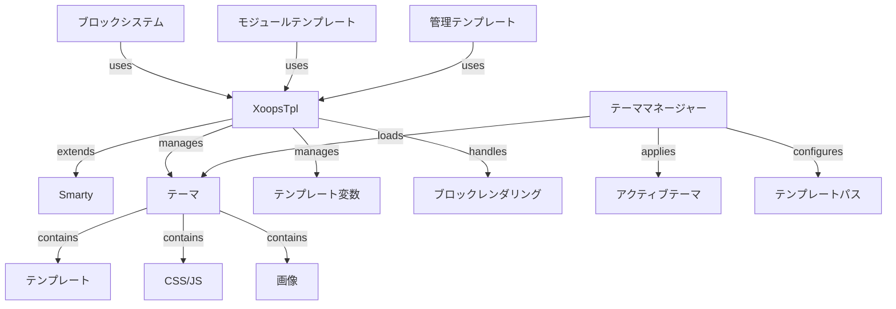

XOOPSテンプレートシステムは強力なSmartyテンプレートエンジンに基づいており、プレゼンテーションロジックとビジネスロジックを分離するための柔軟で拡張可能な方法を提供します。テーマ、テンプレートレンダリング、変数割り当て、動的コンテンツ生成を管理します。

## テンプレートアーキテクチャ



## XoopsTplクラス

メインテンプレートエンジンクラス。Smartyを拡張しています。

### クラス概要

```php
namespace Xoops\Core;

class XoopsTpl extends Smarty
{
    protected array $vars = [];
    protected string $currentTheme = '';
    protected array $blocks = [];
    protected bool $isAdmin = false;
}
```

### Smartyを拡張

```php
use Xoops\Core\XoopsTpl;

class XoopsTpl extends Smarty
{
    private static ?XoopsTpl $instance = null;

    private function __construct()
    {
        parent::__construct();
        $this->configureDirectories();
        $this->registerPlugins();
    }

    public static function getInstance(): XoopsTpl
    {
        if (!isset(self::$instance)) {
            self::$instance = new self();
        }
        return self::$instance;
    }
}
```

### コアメソッド

#### getInstance

シングルトンテンプレートインスタンスを取得。

```php
public static function getInstance(): XoopsTpl
```

**戻り値:** `XoopsTpl` - シングルトンインスタンス

**例:**
```php
$xoopsTpl = XoopsTpl::getInstance();
```

#### assign

テンプレートに変数を割り当て。

```php
public function assign(
    string|array $tplVar,
    mixed $value = null
): void
```

**パラメータ:**

| パラメータ | 型 | 説明 |
|-----------|------|-------------|
| `$tplVar` | string\|array | 変数名または連想配列 |
| `$value` | mixed | 変数値 |

**例:**
```php
$xoopsTpl->assign('page_title', 'Welcome');
$xoopsTpl->assign('user_name', 'John Doe');

// 複数割り当て
$xoopsTpl->assign([
    'items' => $items,
    'total_count' => count($items),
    'show_pagination' => true
]);
```

#### appendAssign

テンプレート配列変数に値を追加。

```php
public function appendAssign(
    string $tplVar,
    mixed $value
): void
```

**パラメータ:**

| パラメータ | 型 | 説明 |
|-----------|------|-------------|
| `$tplVar` | string | 変数名 |
| `$value` | mixed | 追加する値 |

**例:**
```php
$xoopsTpl->assign('breadcrumbs', ['Home']);
$xoopsTpl->appendAssign('breadcrumbs', 'Blog');
$xoopsTpl->appendAssign('breadcrumbs', 'Posts');
// breadcrumbs = ['Home', 'Blog', 'Posts']
```

#### getAssignedVars

割り当てられたすべてのテンプレート変数を取得。

```php
public function getAssignedVars(): array
```

**戻り値:** `array` - 割り当てられた変数

**例:**
```php
$vars = $xoopsTpl->getAssignedVars();
foreach ($vars as $name => $value) {
    echo "$name = " . var_export($value, true) . "\n";
}
```

#### display

テンプレートをレンダリングしてブラウザに出力。

```php
public function display(
    string $resource,
    string|array $cache_id = null,
    string $compile_id = null,
    object $parent = null
): void
```

**パラメータ:**

| パラメータ | 型 | 説明 |
|-----------|------|-------------|
| `$resource` | string | テンプレートファイルパス |
| `$cache_id` | string\|array | キャッシュ識別子 |
| `$compile_id` | string | コンパイル識別子 |
| `$parent` | object | 親テンプレートオブジェクト |

**例:**
```php
$xoopsTpl->assign('page_title', 'Home');
$xoopsTpl->display('user:index.tpl');

// 絶対パス付き
$xoopsTpl->display(XOOPS_ROOT_PATH . '/templates/user/index.tpl');
```

#### fetch

テンプレートをレンダリングして文字列として返す。

```php
public function fetch(
    string $resource,
    string|array $cache_id = null,
    string $compile_id = null,
    object $parent = null
): string
```

**戻り値:** `string` - レンダリングされたテンプレートコンテンツ

**例:**
```php
$xoopsTpl->assign('message', 'Hello World');
$html = $xoopsTpl->fetch('user:message.tpl');
echo $html;

// メールテンプレート用
$emailContent = $xoopsTpl->fetch('mail:notification.tpl');
mail($to, $subject, $emailContent);
```

#### loadTheme

特定のテーマをロード。

```php
public function loadTheme(string $themeName): bool
```

**パラメータ:**

| パラメータ | 型 | 説明 |
|-----------|------|-------------|
| `$themeName` | string | テーマディレクトリ名 |

**戻り値:** `bool` - 成功時はTrue

**例:**
```php
if ($xoopsTpl->loadTheme('bluemoon')) {
    echo "テーマが正常にロードされました";
}
```

#### getCurrentTheme

現在アクティブなテーマの名前を取得。

```php
public function getCurrentTheme(): string
```

**戻り値:** `string` - テーマ名

**例:**
```php
$currentTheme = $xoopsTpl->getCurrentTheme();
echo "アクティブなテーマ: $currentTheme";
```

#### setOutputFilter

テンプレート出力を処理するための出力フィルターを追加。

```php
public function setOutputFilter(string $function): void
```

**パラメータ:**

| パラメータ | 型 | 説明 |
|-----------|------|-------------|
| `$function` | string | フィルター関数名 |

**例:**
```php
// 出力から空白を削除
$xoopsTpl->setOutputFilter('trim');

// カスタムフィルター
function my_output_filter($output) {
    // HTMLを縮小化
    $output = preg_replace('/\s+/', ' ', $output);
    return trim($output);
}
$xoopsTpl->setOutputFilter('my_output_filter');
```

#### registerPlugin

カスタムSmartyプラグインを登録。

```php
public function registerPlugin(
    string $type,
    string $name,
    callable $callback
): void
```

**パラメータ:**

| パラメータ | 型 | 説明 |
|-----------|------|-------------|
| `$type` | string | プラグインタイプ (modifier, block, function) |
| `$name` | string | プラグイン名 |
| `$callback` | callable | コールバック関数 |

**例:**
```php
// カスタムモディファイアを登録
$xoopsTpl->registerPlugin('modifier', 'markdown', function($text) {
    return markdown_parse($text);
});

// テンプレートでの使用: {$content|markdown}

// カスタムブロックタグを登録
$xoopsTpl->registerPlugin('block', 'permission', function($params, $content, $smarty, &$repeat) {
    if ($repeat) return;

    // 権限をチェック
    if (has_permission($params['name'])) {
        return $content;
    }
    return '';
});

// テンプレートでの使用: {permission name="admin"}...{/permission}
```

## テーマシステム

### テーマ構造

標準的なXOOPSテーマディレクトリ構造:

```
bluemoon/
├── style.css              # メインスタイルシート
├── admin.css              # 管理スタイルシート
├── theme.html             # メインページテンプレート
├── admin.html             # 管理ページテンプレート
├── blocks/                # ブロックテンプレート
│   ├── block_left.tpl
│   └── block_right.tpl
├── modules/               # モジュールテンプレート
│   ├── publisher/
│   │   ├── index.tpl
│   │   └── item.tpl
│   └── news/
│       └── index.tpl
├── images/                # テーマ画像
│   ├── logo.png
│   └── banner.png
├── js/                    # テーマJavaScript
│   └── script.js
└── readme.txt             # テーマドキュメンテーション
```

### テーママネージャークラス

```php
namespace Xoops\Core\Theme;

class ThemeManager
{
    protected array $themes = [];
    protected string $activeTheme = '';
    protected string $themeDirectory = '';

    public function getActiveTheme(): string {}
    public function setActiveTheme(string $theme): bool {}
    public function getThemeList(): array {}
    public function themeExists(string $name): bool {}
}
```

## テンプレート変数

### 標準グローバル変数

XOOPSは自動的にいくつかのグローバルテンプレート変数を割り当てます:

| 変数 | 型 | 説明 |
|----------|------|-------------|
| `$xoops_url` | string | XOOPSインストールURL |
| `$xoops_user` | XoopsUser\|null | 現在のユーザーオブジェクト |
| `$xoops_uname` | string | 現在のユーザー名 |
| `$xoops_isadmin` | bool | ユーザーは管理者 |
| `$xoops_banner` | string | バナーHTML |
| `$xoops_notification` | string | 通知マークアップ |
| `$xoops_version` | string | XOOPSバージョン |

### ブロック固有の変数

ブロックをレンダリング時:

| 変数 | 型 | 説明 |
|----------|------|-------------|
| `$block` | array | ブロック情報 |
| `$block.title` | string | ブロックタイトル |
| `$block.content` | string | ブロックコンテンツ |
| `$block.id` | int | ブロックID |
| `$block.module` | string | モジュール名 |

### モジュールテンプレート変数

モジュールは通常以下を割り当てます:

| 変数 | 型 | 説明 |
|----------|------|-------------|
| `$module_name` | string | モジュール表示名 |
| `$module_dir` | string | モジュールディレクトリ |
| `$xoops_module_header` | string | モジュールCSS/JS |

## Smarty設定

### 一般的なSmartyモディファイア

| モディファイア | 説明 | 例 |
|----------|-------------|---------|
| `capitalize` | 最初の文字を大文字化 | `{$title\|capitalize}` |
| `count_characters` | 文字数をカウント | `{$text\|count_characters}` |
| `date_format` | タイムスタンプをフォーマット | `{$timestamp\|date_format:'%Y-%m-%d'}` |
| `escape` | 特殊文字をエスケープ | `{$html\|escape:'html'}` |
| `nl2br` | 改行を`<br>`に変換 | `{$text\|nl2br}` |
| `strip_tags` | HTMLタグを削除 | `{$content\|strip_tags}` |
| `truncate` | 文字列長を制限 | `{$text\|truncate:100}` |
| `upper` | 大文字に変換 | `{$name\|upper}` |
| `lower` | 小文字に変換 | `{$name\|lower}` |

### 制御構造

```smarty
{* If文 *}
{if $user->isAdmin()}
    <p>管理者コンテンツ</p>
{else}
    <p>ユーザーコンテンツ</p>
{/if}

{* Forループ *}
{foreach $items as $item}
    <div class="item">{$item.title}</div>
{/foreach}

{* カウンター付きForループ *}
{foreach $items as $item name=item_loop}
    {$smarty.foreach.item_loop.iteration}: {$item.title}
{/foreach}

{* Whileループ *}
{while $condition}
    <!-- content -->
{/while}

{* Switch文 *}
{switch $status}
    {case 'draft'}<span class="draft">下書き</span>{break}
    {case 'published'}<span class="published">公開</span>{break}
    {default}<span class="unknown">不明</span>
{/switch}
```

## 完全なテンプレート例

### PHPコード

```php
<?php
/**
 * モジュール記事リストページ
 */

include __DIR__ . '/include/common.inc.php';

$xoopsTpl = XoopsTpl::getInstance();

// モジュールがアクティブかをチェック
$module = xoops_getModuleByDirname('articles');
if (!$module) {
    redirect_header(XOOPS_URL, 3, 'モジュルが見つかりません');
}

// アイテムハンドラーを取得
$itemHandler = xoops_getModuleHandler('item', 'articles');

// ページネーションパラメータを取得
$page = !empty($_GET['page']) ? (int)$_GET['page'] : 1;
$perPage = $module->getConfig('items_per_page') ?: 10;
$offset = ($page - 1) * $perPage;

// 条件を構築
$criteria = new CriteriaCompo();
$criteria->add(new Criteria('status', 1));
$criteria->setSort('published', 'DESC');
$criteria->setLimit($perPage);
$criteria->setStart($offset);

// アイテムを取得
$items = $itemHandler->getObjects($criteria);
$total = $itemHandler->getCount(new Criteria('status', 1));

// ページネーションを計算
$pages = ceil($total / $perPage);

// テンプレート変数を割り当て
$xoopsTpl->assign([
    'module_name' => $module->getName(),
    'items' => $items,
    'total_items' => $total,
    'current_page' => $page,
    'total_pages' => $pages,
    'items_per_page' => $perPage,
    'show_pagination' => $pages > 1
]);

// ブレッドクラムを追加
$xoopsTpl->assign('xoops_breadcrumbs', [
    ['url' => XOOPS_URL, 'title' => 'Home'],
    ['url' => $module->getUrl(), 'title' => $module->getName()],
    ['title' => 'Articles']
]);

// テンプレートを表示
$xoopsTpl->display($module->getPath() . '/templates/user/list.tpl');
```

### テンプレートファイル (list.tpl)

```smarty
<div id="articles-list">
    <h1>{$module_name|escape}</h1>

    {if $items}
        <div class="articles-container">
            {foreach $items as $item}
                <article class="article-item">
                    <header>
                        <h2>
                            <a href="{$item.url|escape}">
                                {$item.title|escape}
                            </a>
                        </h2>
                        <div class="meta">
                            <span class="author">By {$item.author|escape}</span>
                            <span class="date">
                                {$item.published|date_format:'%B %d, %Y'}
                            </span>
                        </div>
                    </header>

                    <div class="content">
                        <p>{$item.summary|truncate:150}</p>
                    </div>

                    <footer>
                        <a href="{$item.url|escape}" class="read-more">
                            続きを読む »
                        </a>
                    </footer>
                </article>
            {/foreach}
        </div>

        {* ページネーション *}
        {if $show_pagination}
            <nav class="pagination">
                {if $current_page > 1}
                    <a href="?page=1" class="first">« 最初</a>
                    <a href="?page={$current_page - 1}" class="prev">‹ 前へ</a>
                {/if}

                {for $i=1 to $total_pages}
                    {if $i == $current_page}
                        <span class="current">{$i}</span>
                    {else}
                        <a href="?page={$i}">{$i}</a>
                    {/if}
                {/for}

                {if $current_page < $total_pages}
                    <a href="?page={$current_page + 1}" class="next">次へ ›</a>
                    <a href="?page={$total_pages}" class="last">最後 »</a>
                {/if}
            </nav>
        {/if}
    {else}
        <p class="no-items">記事が見つかりません</p>
    {/if}
</div>
```

## カスタムSmarty関数

### カスタムブロック関数の作成

```php
<?php
/**
 * 権限チェック用のカスタムSmartyブロック関数
 */

function smarty_block_permission($params, $content, $smarty, &$repeat)
{
    if ($repeat) return;

    if (!isset($params['name'])) {
        return '権限名が必要です';
    }

    $permName = $params['name'];
    $user = $GLOBALS['xoopsUser'];

    // ユーザーが権限を持っているかをチェック
    if ($user && $user->isAdmin()) {
        return $content;
    }

    if ($user && check_user_permission($user->uid(), $permName)) {
        return $content;
    }

    return '';
}
```

登録して使用:

```php
$xoopsTpl->registerPlugin('block', 'permission', 'smarty_block_permission');
```

テンプレート:

```smarty
{permission name="edit_articles"}
    <button>記事を編集</button>
{/permission}
```

## ベストプラクティス

1. **ユーザーコンテンツをエスケープ** - ユーザー生成コンテンツに常に`|escape`を使用
2. **テンプレートパスを使用** - テーマに相対的にテンプレートを参照
3. **ロジックとプレゼンテーションを分離** - PHPで複雑なロジックを保持
4. **テンプレートをキャッシュ** - 本番環境でテンプレートキャッシングを有効化
5. **モディファイアを正しく使用** - コンテキストに適切なフィルターを適用
6. **ブロックを整理** - ブロックテンプレートを専用ディレクトリに配置
7. **変数をドキュメント化** - PHPですべてのテンプレート変数をドキュメント化

## 関連ドキュメンテーション

- ../Module/Module-System - モジュールシステムとフック
- ../Kernel/Kernel-Classes - カーネルと設定
- ../Core/XoopsObject - 基本オブジェクトクラス

---

*参照: [Smartyドキュメンテーション](https://www.smarty.net/docs) | [XOOPS Template API](https://github.com/XOOPS/XoopsCore27/tree/master/htdocs/class)*
