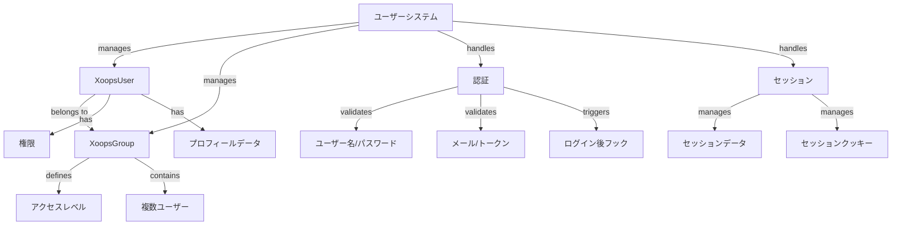

XOOPSユーザーシステムはユーザーアカウント、認証、認可、グループメンバーシップ、セッション管理を管理します。アプリケーションをセキュアにし、ユーザーアクセスを制御するための堅牢なフレームワークを提供します。

## ユーザーシステムアーキテクチャ



## XoopsUserクラス

ユーザーアカウントを表すメインユーザーオブジェクトクラス。

### クラス概要

```php
namespace Xoops\Core\User;

class XoopsUser extends XoopsObject
{
    protected int $uid = 0;
    protected string $uname = '';
    protected string $email = '';
    protected string $pass = '';
    protected int $uregdate = 0;
    protected int $ulevel = 0;
    protected array $groups = [];
    protected array $permissions = [];
}
```

### コンストラクタ

```php
public function __construct(int $uid = null)
```

新しいユーザーオブジェクトを作成。IDで読み込むことは可選。

**パラメータ:**

| パラメータ | 型 | 説明 |
|-----------|------|-------------|
| `$uid` | int | ロードするユーザーID (オプション) |

**例:**
```php
// 新しいユーザーを作成
$user = new XoopsUser();

// 既存ユーザーをロード
$user = new XoopsUser(123);
```

### コアプロパティ

| プロパティ | 型 | 説明 |
|----------|------|-------------|
| `uid` | int | ユーザーID |
| `uname` | string | ユーザー名 |
| `email` | string | メールアドレス |
| `pass` | string | パスワードハッシュ |
| `uregdate` | int | 登録タイムスタンプ |
| `ulevel` | int | ユーザーレベル (9=管理者、1=ユーザー) |
| `groups` | array | グループID |
| `permissions` | array | 権限フラグ |

### コアメソッド

#### getID / getUid

ユーザーのIDを取得。

```php
public function getID(): int
public function getUid(): int  // エイリアス
```

**戻り値:** `int` - ユーザーID

**例:**
```php
$user = new XoopsUser(1);
echo $user->getID(); // 1
echo $user->getUid(); // 1
```

#### getUnameReal

ユーザーの表示名を取得。

```php
public function getUnameReal(): string
```

**戻り値:** `string` - ユーザー実名

**例:**
```php
$realName = $user->getUnameReal();
echo "こんにちは、$realName";
```

#### getEmail

ユーザーのメールアドレスを取得。

```php
public function getEmail(): string
```

**戻り値:** `string` - メールアドレス

**例:**
```php
$email = $user->getEmail();
mail($email, 'ようこそ', 'XOOPSへようこそ');
```

#### getVar / setVar

ユーザー変数を取得または設定。

```php
public function getVar(string $key, string $format = 's'): mixed
public function setVar(string $key, mixed $value, bool $notGpc = false): bool
```

**例:**
```php
// 値を取得
$username = $user->getVar('uname');
$email = $user->getVar('email', 's'); // 表示用にフォーマット

// 値を設定
$user->setVar('uname', 'newusername');
$user->setVar('email', 'user@example.com');
```

#### getGroups

ユーザーのグループメンバーシップを取得。

```php
public function getGroups(): array
```

**戻り値:** `array` - グループIDの配列

**例:**
```php
$groups = $user->getGroups();
echo "メンバー数: " . count($groups) . " グループ";
```

#### isInGroup

ユーザーがグループに属しているかをチェック。

```php
public function isInGroup(int $groupId): bool
```

**パラメータ:**

| パラメータ | 型 | 説明 |
|-----------|------|-------------|
| `$groupId` | int | チェックするグループID |

**戻り値:** `bool` - グループ内の場合はTrue

**例:**
```php
if ($user->isInGroup(1)) { // 1 = Webmasters
    echo 'ユーザーはウェブマスターです';
}
```

#### isAdmin

ユーザーが管理者かをチェック。

```php
public function isAdmin(): bool
```

**戻り値:** `bool` - 管理者の場合はTrue

**例:**
```php
if ($user->isAdmin()) {
    // 管理者コントロールを表示
    echo '<a href="admin/">管理パネル</a>';
}
```

#### getProfile

ユーザープロフィール情報を取得。

```php
public function getProfile(): array
```

**戻り値:** `array` - プロフィールデータ

**例:**
```php
$profile = $user->getProfile();
echo '自己紹介: ' . $profile['bio'];
```

#### isActive

ユーザーアカウントがアクティブかをチェック。

```php
public function isActive(): bool
```

**戻り値:** `bool` - アクティブな場合はTrue

**例:**
```php
if ($user->isActive()) {
    // ユーザーアクセスを許可
} else {
    // アクセスを制限
}
```

#### updateLastLogin

ユーザーの最後のログインタイムスタンプを更新。

```php
public function updateLastLogin(): bool
```

**戻り値:** `bool` - 成功時はTrue

**例:**
```php
if ($user->updateLastLogin()) {
    echo 'ログインが記録されました';
}
```

## XoopsGroupクラス

ユーザーグループと権限を管理。

### クラス概要

```php
namespace Xoops\Core\User;

class XoopsGroup extends XoopsObject
{
    protected int $groupid = 0;
    protected string $name = '';
    protected string $description = '';
    protected int $group_type = 0;
    protected array $users = [];
}
```

### 定数

| 定数 | 値 | 説明 |
|----------|-------|-------------|
| `TYPE_NORMAL` | 0 | 通常のユーザーグループ |
| `TYPE_ADMIN` | 1 | 管理グループ |
| `TYPE_SYSTEM` | 2 | システムグループ |

### メソッド

#### getName

グループ名を取得。

```php
public function getName(): string
```

**戻り値:** `string` - グループ名

**例:**
```php
$group = new XoopsGroup(1);
echo $group->getName(); // "Webmasters"
```

#### getDescription

グループ説明を取得。

```php
public function getDescription(): string
```

**戻り値:** `string` - 説明

**例:**
```php
echo $group->getDescription();
```

#### getUsers

グループメンバーを取得。

```php
public function getUsers(): array
```

**戻り値:** `array` - ユーザーIDの配列

**例:**
```php
$users = $group->getUsers();
echo "グループメンバー数: " . count($users);
```

#### addUser

グループにユーザーを追加。

```php
public function addUser(int $uid): bool
```

**パラメータ:**

| パラメータ | 型 | 説明 |
|-----------|------|-------------|
| `$uid` | int | ユーザーID |

**戻り値:** `bool` - 成功時はTrue

**例:**
```php
$group = new XoopsGroup(2); // エディター
$group->addUser(123);
$groupHandler->insert($group);
```

#### removeUser

グループからユーザーを削除。

```php
public function removeUser(int $uid): bool
```

**例:**
```php
$group->removeUser(123);
```

## ユーザー認証

### ログインプロセス

```php
/**
 * ユーザーログイン
 */
function xoops_user_login(string $uname, string $pass, bool $rememberMe = false): ?XoopsUser
{
    global $xoopsDB;

    // ユーザー名をサニタイズ
    $uname = trim($uname);

    // データベースからユーザーを取得
    $query = $xoopsDB->prepare(
        'SELECT * FROM ' . $xoopsDB->prefix('users') .
        ' WHERE uname = ? AND active = 1'
    );
    $query->bind_param('s', $uname);
    $query->execute();
    $result = $query->get_result();

    if ($result->num_rows === 0) {
        return null; // ユーザーが見つかりません
    }

    $row = $result->fetch_assoc();

    // パスワードを検証
    if (!password_verify($pass, $row['pass'])) {
        return null; // パスワードが無効
    }

    // ユーザーオブジェクトをロード
    $user = new XoopsUser($row['uid']);

    // 最後のログインを更新
    $user->updateLastLogin();

    // "Remember Me"を処理
    if ($rememberMe) {
        // 永続クッキーを設定
        setcookie(
            'xoops_user_remember',
            $user->uid(),
            time() + (30 * 24 * 60 * 60), // 30日
            '/',
            $_SERVER['HTTP_HOST'] ?? ''
        );
    }

    return $user;
}
```

### パスワード管理

```php
/**
 * パスワードを安全にハッシュ化
 */
function xoops_hash_password(string $password): string
{
    return password_hash($password, PASSWORD_BCRYPT, [
        'cost' => 12
    ]);
}

/**
 * パスワードを検証
 */
function xoops_verify_password(string $password, string $hash): bool
{
    return password_verify($password, $hash);
}

/**
 * パスワードが再ハッシュが必要かをチェック
 */
function xoops_password_needs_rehash(string $hash): bool
{
    return password_needs_rehash($hash, PASSWORD_BCRYPT, [
        'cost' => 12
    ]);
}
```

## セッション管理

### セッションクラス

```php
namespace Xoops\Core;

class SessionManager
{
    protected array $data = [];
    protected string $sessionId = '';

    public function start(): void {}
    public function get(string $key): mixed {}
    public function set(string $key, mixed $value): void {}
    public function destroy(): void {}
}
```

### セッションメソッド

#### セッションを開始

```php
<?php
session_start();

// セキュリティ用にセッションIDを再生成
session_regenerate_id(true);

// セッションタイムアウトを設定
ini_set('session.gc_maxlifetime', 3600); // 1時間

// セッションにユーザーを保存
if ($user) {
    $_SESSION['xoops_user'] = $user;
    $_SESSION['xoops_uid'] = $user->getID();
    $_SESSION['xoops_uname'] = $user->getVar('uname');
}
```

#### セッションをチェック

```php
/**
 * セッションから現在のユーザーを取得
 */
function xoops_get_current_user(): ?XoopsUser
{
    if (isset($_SESSION['xoops_user']) && $_SESSION['xoops_user'] instanceof XoopsUser) {
        return $_SESSION['xoops_user'];
    }
    return null;
}

/**
 * ユーザーがログインしているかをチェック
 */
function xoops_is_user_logged_in(): bool
{
    return isset($_SESSION['xoops_uid']) && $_SESSION['xoops_uid'] > 0;
}
```

#### セッションを破棄

```php
/**
 * ユーザーログアウト
 */
function xoops_user_logout()
{
    global $xoopsUser;

    // ログアウトをログ
    if ($xoopsUser) {
        error_log('ユーザー ' . $xoopsUser->getVar('uname') . ' がログアウトしました');
    }

    // セッションデータを破棄
    $_SESSION = [];

    // セッションクッキーを削除
    if (ini_get('session.use_cookies')) {
        $params = session_get_cookie_params();
        setcookie(
            session_name(),
            '',
            time() - 42000,
            $params['path'],
            $params['domain'],
            $params['secure'],
            $params['httponly']
        );
    }

    // セッションを破棄
    session_destroy();
}
```

## 権限システム

### 権限定数

| 定数 | 値 | 説明 |
|----------|-------|-------------|
| `XOOPS_PERMISSION_NONE` | 0 | 権限なし |
| `XOOPS_PERMISSION_VIEW` | 1 | コンテンツ表示 |
| `XOOPS_PERMISSION_SUBMIT` | 2 | コンテンツ送信 |
| `XOOPS_PERMISSION_EDIT` | 4 | コンテンツ編集 |
| `XOOPS_PERMISSION_DELETE` | 8 | コンテンツ削除 |
| `XOOPS_PERMISSION_ADMIN` | 16 | 管理者アクセス |

### 権限チェック

```php
/**
 * ユーザーが権限を持っているかをチェック
 */
function xoops_check_permission($user, $resource, $permission)
{
    if (!$user) {
        return false;
    }

    // 管理者はすべての権限を持つ
    if ($user->isAdmin()) {
        return true;
    }

    // グループ権限をチェック
    $groups = $user->getGroups();
    foreach ($groups as $groupId) {
        if (xoops_group_has_permission($groupId, $resource, $permission)) {
            return true;
        }
    }

    return false;
}
```

## ユーザーハンドラー

UserHandlerはユーザー永続化操作を管理します。

```php
/**
 * ユーザーハンドラーを取得
 */
$userHandler = xoops_getHandler('user');

/**
 * 新しいユーザーを作成
 */
$user = new XoopsUser();
$user->setVar('uname', 'newuser');
$user->setVar('email', 'user@example.com');
$user->setVar('pass', xoops_hash_password('password123'));
$user->setVar('uregdate', time());
$user->setVar('uactive', 1);

if ($userHandler->insert($user)) {
    echo 'ユーザーを作成しました ID: ' . $user->getID();
}

/**
 * ユーザーを更新
 */
$user = $userHandler->get(123);
$user->setVar('email', 'newemail@example.com');
$userHandler->insert($user);

/**
 * 名前でユーザーを取得
 */
$user = $userHandler->findByUsername('john');

/**
 * ユーザーを削除
 */
$userHandler->delete($user);

/**
 * ユーザーを検索
 */
$criteria = new CriteriaCompo();
$criteria->add(new Criteria('uname', '%admin%', 'LIKE'));
$users = $userHandler->getObjects($criteria);
```

## 完全なユーザー管理例

```php
<?php
/**
 * 完全なユーザー認証とプロフィール例
 */

require_once XOOPS_ROOT_PATH . '/include/common.inc.php';

$xoopsUser = $GLOBALS['xoopsUser'];

// ユーザーがログインしているかをチェック
if (!$xoopsUser || !$xoopsUser->isActive()) {
    redirect_header(XOOPS_URL, 3, 'ログインしてください');
}

// ユーザーハンドラーを取得
$userHandler = xoops_getHandler('user');

// 新しいデータで現在のユーザーを取得
$currentUser = $userHandler->get($xoopsUser->getID());

// ユーザープロフィールページ
echo '<h1>プロフィール: ' . htmlspecialchars($currentUser->getVar('uname')) . '</h1>';

echo '<div class="user-profile">';
echo '<p><strong>ユーザー名:</strong> ' . htmlspecialchars($currentUser->getVar('uname')) . '</p>';
echo '<p><strong>メール:</strong> ' . htmlspecialchars($currentUser->getVar('email')) . '</p>';
echo '<p><strong>登録:</strong> ' . date('Y-m-d H:i:s', $currentUser->getVar('uregdate')) . '</p>';
echo '<p><strong>グループ:</strong> ';

$groupHandler = xoops_getHandler('group');
$groups = $currentUser->getGroups();
$groupNames = [];
foreach ($groups as $groupId) {
    $group = $groupHandler->get($groupId);
    if ($group) {
        $groupNames[] = htmlspecialchars($group->getName());
    }
}
echo implode(', ', $groupNames);
echo '</p>';

// 管理者ステータス
if ($currentUser->isAdmin()) {
    echo '<p><strong>ステータス:</strong> 管理者</p>';
}

echo '</div>';

// パスワード変更フォーム
if ($_SERVER['REQUEST_METHOD'] === 'POST' && !empty($_POST['change_password'])) {
    $oldPassword = $_POST['old_password'] ?? '';
    $newPassword = $_POST['new_password'] ?? '';
    $confirmPassword = $_POST['confirm_password'] ?? '';

    // 古いパスワードを検証
    if (!password_verify($oldPassword, $currentUser->getVar('pass'))) {
        echo '<div class="error">現在のパスワードが間違っています</div>';
    } elseif ($newPassword !== $confirmPassword) {
        echo '<div class="error">新しいパスワードが一致しません</div>';
    } elseif (strlen($newPassword) < 6) {
        echo '<div class="error">パスワードは最低6文字必要です</div>';
    } else {
        // パスワードを更新
        $currentUser->setVar('pass', xoops_hash_password($newPassword));
        if ($userHandler->insert($currentUser)) {
            echo '<div class="success">パスワードが変更されました</div>';
        } else {
            echo '<div class="error">パスワード更新に失敗しました</div>';
        }
    }
}

// パスワード変更フォーム
echo '<form method="post">';
echo '<h3>パスワードを変更</h3>';
echo '<div class="form-group">';
echo '<label>現在のパスワード:</label>';
echo '<input type="password" name="old_password" required>';
echo '</div>';
echo '<div class="form-group">';
echo '<label>新しいパスワード:</label>';
echo '<input type="password" name="new_password" required>';
echo '</div>';
echo '<div class="form-group">';
echo '<label>パスワードを確認:</label>';
echo '<input type="password" name="confirm_password" required>';
echo '</div>';
echo '<button type="submit" name="change_password">パスワードを変更</button>';
echo '</form>';
```

## ベストプラクティス

1. **パスワードをハッシュ化** - bcryptまたはargon2を常に使用
2. **入力を検証** - すべてのユーザー入力を検証しサニタイズ
3. **権限をチェック** - アクション前に常にユーザー権限を検証
4. **セッションをセキュアに使用** - ログイン時にセッションIDを再生成
5. **アクティビティをログ** - ログイン、ログアウト、重要なアクションをログ
6. **レート制限を実装** - ログイン試行のレート制限を実装
7. **HTTPSのみ** - 常に認証にHTTPSを使用
8. **グループを管理** - 権限組織にグループを使用

## 関連ドキュメンテーション

- ../Kernel/Kernel-Classes - カーネルサービスとブートストラップ
- ../Database/QueryBuilder - ユーザーデータのデータベースクエリ
- ../Core/XoopsObject - 基本オブジェクトクラス

---

*参照: [XOOPS User API](https://github.com/XOOPS/XoopsCore27/tree/master/htdocs/class) | [PHP Security](https://www.php.net/manual/en/book.password.php)*
