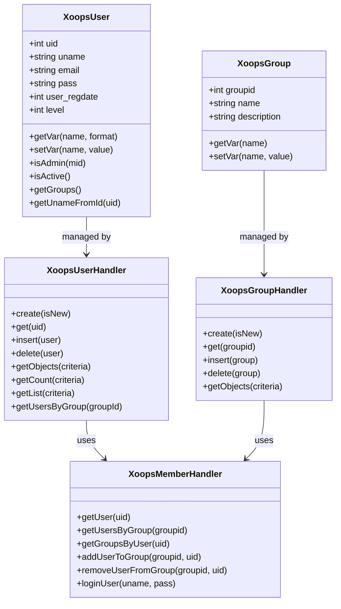
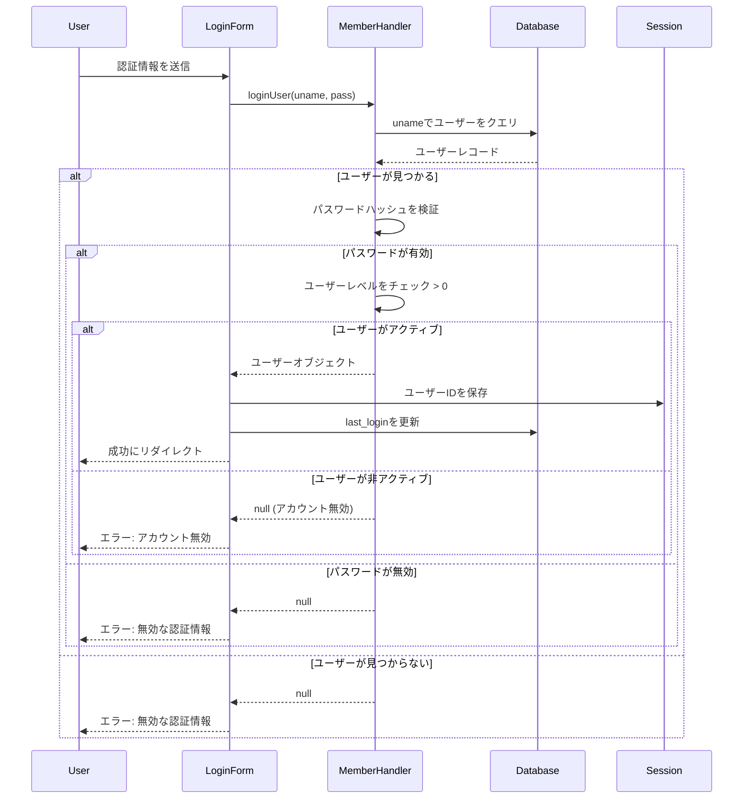
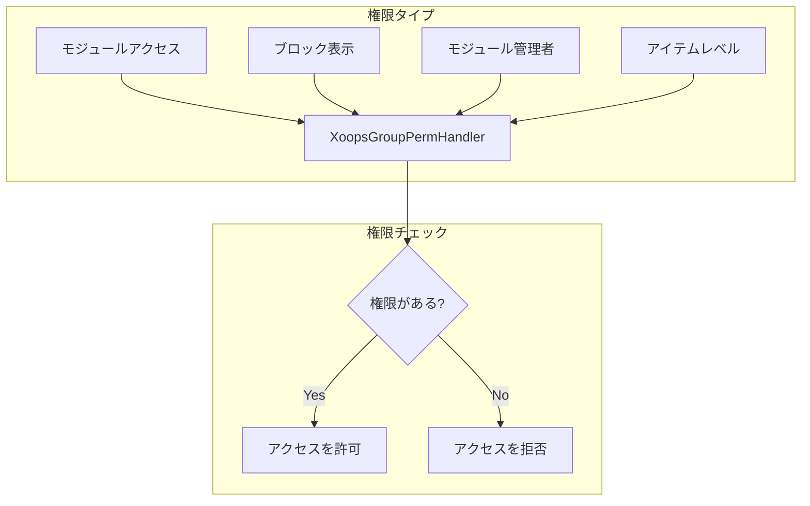
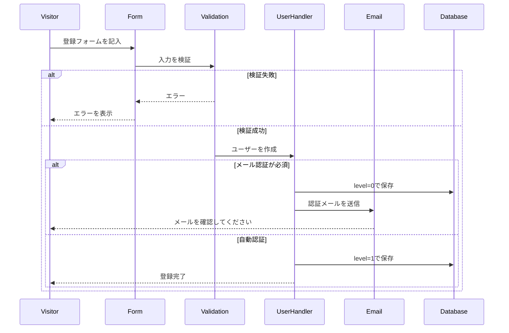

> XOOPSユーザーシステムの完全なAPIドキュメンテーション

---

## ユーザーシステムアーキテクチャ



---

## XoopsUserクラス

### プロパティ

| プロパティ | 型 | 説明 |
|----------|------|-------------|
| `uid` | int | ユーザーID (主キー) |
| `uname` | string | ユーザー名 |
| `name` | string | 実名 |
| `email` | string | メールアドレス |
| `pass` | string | パスワードハッシュ |
| `url` | string | ウェブサイトURL |
| `user_avatar` | string | アバターファイル名 |
| `user_regdate` | int | 登録タイムスタンプ |
| `user_from` | string | 場所 |
| `user_sig` | string | 署名 |
| `user_occ` | string | 職業 |
| `user_intrest` | string | 興味 |
| `bio` | string | 自己紹介 |
| `posts` | int | 投稿数 |
| `rank` | int | ユーザーランク |
| `level` | int | ユーザーレベル (0=非アクティブ、1=アクティブ) |
| `theme` | string | 推奨テーマ |
| `timezone` | float | タイムゾーンオフセット |
| `last_login` | int | 最後のログインタイムスタンプ |

### コアメソッド

```php
// 現在のユーザーを取得
global $xoopsUser;

// ログイン状態をチェック
if (is_object($xoopsUser)) {
    // ユーザーがログインしている
    $uid = $xoopsUser->getVar('uid');
    $username = $xoopsUser->getVar('uname');
}

// フォーマットされた値を取得
$uname = $xoopsUser->getVar('uname');           // 生の値
$unameDisplay = $xoopsUser->getVar('uname', 's'); // 表示用にサニタイズ
$unameEdit = $xoopsUser->getVar('uname', 'e');    // フォーム編集用

// 管理者かをチェック
$isAdmin = $xoopsUser->isAdmin();              // サイト管理者
$isModuleAdmin = $xoopsUser->isAdmin($mid);    // モジュール管理者

// ユーザーグループを取得
$groups = $xoopsUser->getGroups();             // グループIDの配列

// アクティブかをチェック
$isActive = $xoopsUser->isActive();
```

---

## XoopsUserHandler

### ユーザーCRUD操作

```php
// ハンドラーを取得
$userHandler = xoops_getHandler('user');

// 新しいユーザーを作成
$user = $userHandler->create();
$user->setVar('uname', 'newuser');
$user->setVar('email', 'user@example.com');
$user->setVar('pass', password_hash('password123', PASSWORD_DEFAULT));
$user->setVar('user_regdate', time());
$user->setVar('level', 1);

if ($userHandler->insert($user)) {
    $newUid = $user->getVar('uid');
}

// IDでユーザーを取得
$user = $userHandler->get(123);

// ユーザーを更新
$user->setVar('email', 'newemail@example.com');
$userHandler->insert($user);

// ユーザーを削除
$userHandler->delete($user);
```

### ユーザーをクエリ

```php
// すべてのアクティブなユーザーを取得
$criteria = new Criteria('level', 1);
$users = $userHandler->getObjects($criteria);

// 条件でユーザーを取得
$criteria = new CriteriaCompo();
$criteria->add(new Criteria('level', 1));
$criteria->add(new Criteria('posts', 10, '>='));
$criteria->setSort('posts');
$criteria->setOrder('DESC');
$criteria->setLimit(10);
$activePosters = $userHandler->getObjects($criteria);

// ユーザー数を取得
$count = $userHandler->getCount($criteria);

// ユーザーリストを取得 (uid => uname)
$userList = $userHandler->getList($criteria);

// ユーザーを検索
$criteria = new CriteriaCompo();
$criteria->add(new Criteria('uname', '%john%', 'LIKE'));
$criteria->add(new Criteria('email', '%john%', 'LIKE'), 'OR');
$searchResults = $userHandler->getObjects($criteria);
```

---

## XoopsMemberHandler

### グループ管理

```php
$memberHandler = xoops_getHandler('member');

// グループ付きでユーザーを取得
$user = $memberHandler->getUser($uid);
$groups = $memberHandler->getGroupsByUser($uid);

// グループ内のユーザーを取得
$users = $memberHandler->getUsersByGroup($groupId);
$users = $memberHandler->getUsersByGroup($groupId, true); // オブジェクト
$users = $memberHandler->getUsersByGroup($groupId, false); // UIDのみ

// ユーザーをグループに追加
$memberHandler->addUserToGroup($groupId, $uid);

// ユーザーをグループから削除
$memberHandler->removeUserFromGroup($groupId, $uid);
```

### 認証

```php
// ユーザーをログイン
$user = $memberHandler->loginUser($username, $password);

if ($user) {
    // ログイン成功
    $_SESSION['xoopsUserId'] = $user->getVar('uid');
    $user->setVar('last_login', time());
    $userHandler->insert($user);
} else {
    // ログイン失敗
}

// ログアウト
$_SESSION = [];
session_destroy();
redirect_header(XOOPS_URL, 3, 'ログアウトしました');
```

---

## 認証フロー



---

## グループシステム

### デフォルトグループ

| グループID | 名前 | 説明 |
|----------|------|-------------|
| 1 | Webmasters | 完全な管理者アクセス |
| 2 | Registered Users | 標準登録ユーザー |
| 3 | Anonymous | ログインしていない訪問者 |

### グループ権限



### 権限をチェック

```php
$gpermHandler = xoops_getHandler('groupperm');

// モジュールアクセスをチェック
$groups = is_object($xoopsUser) ? $xoopsUser->getGroups() : [XOOPS_GROUP_ANONYMOUS];
$hasAccess = $gpermHandler->checkRight('module_read', $moduleId, $groups);

// モジュール管理者をチェック
$isAdmin = $gpermHandler->checkRight('module_admin', $moduleId, $groups);

// カスタム権限をチェック
$hasPermission = $gpermHandler->checkRight(
    'item_view',      // 権限名
    $itemId,          // アイテムID
    $groups,          // グループID
    $moduleId         // モジュールID
);

// ユーザーがアクセス可能なアイテムを取得
$itemIds = $gpermHandler->getItemIds('item_view', $groups, $moduleId);
```

---

## ユーザー登録フロー



---

## 完全な例

```php
<?php
require_once __DIR__ . '/mainfile.php';

use Xmf\Request;

$memberHandler = xoops_getHandler('member');
$userHandler = xoops_getHandler('user');

// 登録ハンドラー
if (Request::hasVar('register', 'POST')) {
    // CSRFを検証
    if (!$GLOBALS['xoopsSecurity']->check()) {
        redirect_header('register.php', 3, 'セキュリティエラー');
    }

    $uname = Request::getString('uname', '', 'POST');
    $email = Request::getEmail('email', '', 'POST');
    $pass = Request::getString('pass', '', 'POST');
    $passConfirm = Request::getString('pass_confirm', '', 'POST');

    $errors = [];

    // ユーザー名を検証
    if (strlen($uname) < 3 || strlen($uname) > 25) {
        $errors[] = 'ユーザー名は3～25文字である必要があります';
    }

    // ユーザー名が既に存在するかをチェック
    $criteria = new Criteria('uname', $uname);
    if ($userHandler->getCount($criteria) > 0) {
        $errors[] = 'ユーザー名は既に使用されています';
    }

    // メールアドレスを検証
    if (!filter_var($email, FILTER_VALIDATE_EMAIL)) {
        $errors[] = 'メールアドレスが無効です';
    }

    // メールが既に登録されているかをチェック
    $criteria = new Criteria('email', $email);
    if ($userHandler->getCount($criteria) > 0) {
        $errors[] = 'メールアドレスは既に登録されています';
    }

    // パスワードを検証
    if (strlen($pass) < 8) {
        $errors[] = 'パスワードは最低8文字である必要があります';
    }

    if ($pass !== $passConfirm) {
        $errors[] = 'パスワードが一致しません';
    }

    if (empty($errors)) {
        // ユーザーを作成
        $user = $userHandler->create();
        $user->setVar('uname', $uname);
        $user->setVar('email', $email);
        $user->setVar('pass', password_hash($pass, PASSWORD_DEFAULT));
        $user->setVar('user_regdate', time());
        $user->setVar('level', 1); // 自動認証

        if ($userHandler->insert($user)) {
            // Registered Usersグループに追加
            $memberHandler->addUserToGroup(XOOPS_GROUP_USERS, $user->getVar('uid'));

            redirect_header('index.php', 3, '登録が完了しました!');
        } else {
            $errors[] = 'アカウント作成中にエラーが発生しました';
        }
    }
}

// 登録フォームを表示
require_once XOOPS_ROOT_PATH . '/header.php';

if (!empty($errors)) {
    foreach ($errors as $error) {
        echo "<div class='errorMsg'>$error</div>";
    }
}

// 登録フォームをここに...

require_once XOOPS_ROOT_PATH . '/footer.php';
```

---

## 関連ドキュメンテーション

- ユーザー管理ガイド
- 権限システム
- 認証

---

#xoops #api #user #authentication #reference
