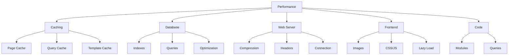

# XOOPSパフォーマンス最適化

最大速度と効率のためのXOOPS最適化の包括的ガイド。

## パフォーマンス最適化概要



## キャッシング設定

キャッシングはパフォーマンスを向上させる最速の方法です。

### ページレベルのキャッシング

XOOPSでフルページキャッシングを有効化:

**管理パネル > システム > 設定 > キャッシュ設定**

```
キャッシングを有効化: はい
キャッシュタイプ: ファイルキャッシュ (またはAPCu/Memcache)
キャッシュ有効期限: 3600秒 (1時間)
モジュールリストをキャッシュ: はい
設定をキャッシュ: はい
検索結果をキャッシュ: はい
```

### ファイルベースキャッシング

キャッシュディレクトリ場所を設定:

```bash
# キャッシュディレクトリをウェブルート外に作成 (より安全)
mkdir -p /var/cache/xoops
chown www-data:www-data /var/cache/xoops
chmod 755 /var/cache/xoops

# mainfile.phpを編集
define('XOOPS_CACHE_PATH', '/var/cache/xoops/');
```

### APCuキャッシング

APCuはインメモリキャッシング (非常に高速):

```bash
# APCuをインストール
apt-get install php-apcu

# インストールを確認
php -m | grep apcu

# php.iniで設定
apc.enabled = 1
apc.memory_size = 128M
apc.ttl = 0
apc.user_ttl = 3600
apc.shm_size = 128
```

XOOPSで有効化:

**管理パネル > システム > 設定 > キャッシュ設定**

```
キャッシュタイプ: APCu
```

### Memcache/Redisキャッシング

トラフィックの多いサイト向けの分散キャッシング:

**Memcacheをインストール:**

```bash
# Memcacheサーバーをインストール
apt-get install memcached

# サービスを開始
systemctl start memcached
systemctl enable memcached

# 実行状況を確認
netstat -tlnp | grep memcached
# ポート11211でリッスンしている状態を表示
```

**XOOPSで設定:**

mainfile.phpを編集:

```php
// Memcache設定
define('XOOPS_CACHE_TYPE', 'memcache');
define('XOOPS_CACHE_HOST', 'localhost');
define('XOOPS_CACHE_PORT', 11211);
define('XOOPS_CACHE_TIMEOUT', 0);
```

または管理パネル:

```
キャッシュタイプ: Memcache
Memcacheホスト: localhost:11211
```

### テンプレートキャッシング

XOOPSテンプレートをコンパイルしキャッシュ:

```bash
# templates_cが書き込み可能であることを確認
chmod 777 /var/www/html/xoops/templates_c/

# 古いキャッシュテンプレートをクリア
rm -rf /var/www/html/xoops/templates_c/*
```

テーマで設定:

```html
<!-- テーマのxoops_version.phpで -->
{smarty.const.XOOPS_VAR_PATH|constant}
<{$xoops_meta}>

<!-- テンプレートはキャッシングを使用 -->
{cache}
    [キャッシュされるコンテンツ]
{/cache}
```

## データベース最適化

### データベースインデックスを追加

適切にインデックスされたデータベースは非常に高速にクエリします。

```sql
-- 現在のインデックスを確認
SHOW INDEXES FROM xoops_users;

-- インデックスを追加
ALTER TABLE xoops_users ADD INDEX idx_uname (uname);
ALTER TABLE xoops_users ADD INDEX idx_email (email);
ALTER TABLE xoops_users ADD INDEX idx_uid_active (uid, user_actkey);

-- 投稿/コンテンツテーブルにインデックスを追加
ALTER TABLE xoops_posts ADD INDEX idx_post_published (post_published);
ALTER TABLE xoops_posts ADD INDEX idx_post_uid (post_uid);
ALTER TABLE xoops_posts ADD INDEX idx_post_created (post_created);

-- インデックスが作成されたことを確認
SHOW INDEXES FROM xoops_users\G
```

### テーブルを最適化

定期的なテーブル最適化でパフォーマンスが向上:

```sql
-- すべてのテーブルを最適化
OPTIMIZE TABLE xoops_users;
OPTIMIZE TABLE xoops_posts;
OPTIMIZE TABLE xoops_config;
OPTIMIZE TABLE xoops_comments;

-- または一度にすべて最適化
REPAIR TABLE xoops_users;
OPTIMIZE TABLE xoops_users;
REPAIR TABLE xoops_posts;
OPTIMIZE TABLE xoops_posts;
```

自動最適化スクリプトを作成:

```bash
#!/bin/bash
# データベース最適化スクリプト

echo "XOOPSデータベースを最適化しています..."

mysql -u xoops_user -p xoops_db << EOF
-- すべてのテーブルを最適化
OPTIMIZE TABLE xoops_users;
OPTIMIZE TABLE xoops_posts;
OPTIMIZE TABLE xoops_config;
OPTIMIZE TABLE xoops_comments;
OPTIMIZE TABLE xoops_users_online;

-- データベースサイズを表示
SELECT table_schema,
       ROUND(SUM(data_length + index_length) / 1024 / 1024, 2) as total_mb
FROM information_schema.tables
WHERE table_schema = 'xoops_db'
GROUP BY table_schema;
EOF

echo "データベース最適化が完了しました!"
```

cronでスケジュール:

```bash
# 最適化スケジュール
crontab -e
# 追加: 0 3 * * 0 /usr/local/bin/optimize-xoops-db.sh
```

### クエリ最適化

遅いクエリを確認:

```sql
-- 遅いクエリログを有効化
SET GLOBAL slow_query_log = 'ON';
SET GLOBAL long_query_time = 2;

-- 遅いクエリを表示
SELECT * FROM mysql.slow_log;

-- またはログファイルを確認
tail -100 /var/log/mysql/slow.log
```

一般的な最適化テクニック:

```php
// 低速 - ループ内で不要なクエリを避ける
foreach ($users as $user) {
    $profile = getUserProfile($user['uid']);  // ループ内のクエリ!
    echo $profile['name'];
}

// 高速 - すべてのデータを一度に取得
$profiles = getAllUserProfiles($user_ids);
foreach ($users as $user) {
    echo $profiles[$user['uid']]['name'];
}
```

### バッファプールを増加

MySQLをキャッシング向けに設定:

`/etc/mysql/mysql.conf.d/mysqld.cnf`を編集:

```ini
# InnoDB Buffer Pool (システムRAMの50-80%)
innodb_buffer_pool_size = 1G

# クエリキャッシュ (オプション、MySQL 5.7+では無効にできる)
query_cache_size = 64M
query_cache_type = 1

# 最大接続数
max_connections = 500

# 最大許可パケット
max_allowed_packet = 256M

# 接続タイムアウト
connect_timeout = 10
```

MySQLを再起動:

```bash
systemctl restart mysql
```

## Webサーバー最適化

### Gzip圧縮を有効化

レスポンスを圧縮してバンド幅を削減:

**Apache設定:**

```apache
<IfModule mod_deflate.c>
    AddOutputFilterByType DEFLATE text/html text/plain text/xml text/css text/javascript application/javascript application/json

    # 画像と既に圧縮されたファイルを圧縮しない
    SetEnvIfNoCase Request_URI \.(jpg|jpeg|png|gif|zip|gzip)$ no-gzip dont-vary

    # 圧縮されたレスポンスをログ
    DeflateBufferSize 8096
</IfModule>
```

**Nginx設定:**

```nginx
gzip on;
gzip_types text/html text/plain text/css text/javascript application/javascript application/json;
gzip_min_length 1000;
gzip_vary on;
gzip_comp_level 6;

# 既に圧縮されたフォーマットを圧縮しない
gzip_disable "msie6";
```

圧縮を確認:

```bash
# レスポンスがgzipされているか確認
curl -I -H "Accept-Encoding: gzip" http://your-domain.com/xoops/

# 表示:
# Content-Encoding: gzip
```

### ブラウザキャッシングヘッダー

静的アセットのキャッシュ有効期限を設定:

**Apache:**

```apache
<IfModule mod_expires.c>
    ExpiresActive On

    # 画像を30日間キャッシュ
    ExpiresByType image/jpeg "access plus 30 days"
    ExpiresByType image/gif "access plus 30 days"
    ExpiresByType image/png "access plus 30 days"
    ExpiresByType image/svg+xml "access plus 30 days"

    # CSS/JSを30日間キャッシュ
    ExpiresByType text/css "access plus 30 days"
    ExpiresByType application/javascript "access plus 30 days"
    ExpiresByType text/javascript "access plus 30 days"

    # フォントを1年間キャッシュ
    ExpiresByType font/eot "access plus 1 year"
    ExpiresByType font/ttf "access plus 1 year"
    ExpiresByType font/woff "access plus 1 year"
    ExpiresByType font/woff2 "access plus 1 year"

    # HTMLをキャッシュしない
    ExpiresByType text/html "access plus 1 hour"
</IfModule>
```

**Nginx:**

```nginx
location ~* \.(jpg|jpeg|png|gif|ico|svg|woff|woff2|ttf|eot)$ {
    expires 30d;
    add_header Cache-Control "public, immutable";
}

location ~* \.(css|js)$ {
    expires 30d;
    add_header Cache-Control "public";
}

location ~ \.html$ {
    expires 1h;
    add_header Cache-Control "public";
}
```

### 接続キープアライブ

永続的なHTTP接続を有効化:

**Apache:**

```apache
<IfModule mod_http.c>
    KeepAlive On
    KeepAliveTimeout 15
    MaxKeepAliveRequests 100
</IfModule>
```

**Nginx:**

```nginx
keepalive_timeout 15s;
keepalive_requests 100;
```

## フロントエンド最適化

### 画像を最適化

画像ファイルサイズを削減:

```bash
# JPEG画像をバッチ圧縮
for img in *.jpg; do
    convert "$img" -quality 85 "optimized_$img"
done

# PNG画像をバッチ圧縮
for img in *.png; do
    optipng -o2 "$img"
done

# またはimagemin CLIを使用
npm install -g imagemin-cli
imagemin images/ --out-dir=images-optimized
```

### CSSとJavaScriptを最小化

CSSとJSファイルサイズを削減:

**Node.jsツールを使用:**

```bash
# ミニファイアをインストール
npm install -g uglify-js clean-css-cli

# JavaScriptを最小化
uglifyjs script.js -o script.min.js

# CSSを最小化
cleancss style.css -o style.min.css
```

**オンラインツールを使用:**
- CSS Minifier: https://cssminifier.com/
- JavaScript Minifier: https://www.minifycode.com/javascript-minifier/

### 画像を遅延ロード

必要な場合のみ画像をロード:

```html
<!-- loading="lazy"属性を追加 -->


<!-- または古いブラウザ向けJavaScriptライブラリ -->


<script src="https://cdnjs.cloudflare.com/ajax/libs/vanilla-lazyload/17.1.2/lazyload.min.js"></script>
<script>
    var lazyLoad = new LazyLoad({
        elements_selector: ".lazy"
    });
</script>
```

### レンダリングをブロックするリソースを削減

CSSとJSを戦略的にロード:

```html
<!-- 重要なCSSをインライン化 -->
<style>
    /* ビューポート上部の重要なスタイル */
</style>

<!-- 重大でないCSSを遅延ロード -->
<link rel="stylesheet" href="style.css" media="print" onload="this.media='all'">

<!-- JavaScriptを遅延ロード -->
<script src="script.js" defer></script>

<!-- または重大でないスクリプトに非同期を使用 -->
<script src="analytics.js" async></script>
```

## CDN統合

グローバルアクセスを高速化するためにコンテンツデリバリネットワークを使用します。

### 人気のCDN

| CDN | コスト | 機能 |
|---|---|---|
| Cloudflare | 無料/有料 | DDoS, DNS, キャッシュ, 分析 |
| AWS CloudFront | 有料 | 高パフォーマンス、グローバル |
| Bunny CDN | 手頃 | ストレージ、ビデオ、キャッシュ |
| jsDelivr | 無料 | JavaScriptライブラリ |
| cdnjs | 無料 | 人気のあるライブラリ |

### Cloudflareセットアップ

1. https://www.cloudflare.com/ でサインアップ
2. ドメインを追加
3. ネームサーバーをCloudflareの名前に更新
4. キャッシングオプションを有効化:
   - キャッシュレベル: アグレッシブ
   - すべてをキャッシュ: オン
   - ブラウザキャッシュTTL: 1ヶ月

5. XOOPSでドメインをCloudflare DNSに更新

### XOOPSでCDNを設定

画像URLをCDNに更新:

テーマテンプレートを編集:

```html
<!-- オリジナル -->


<!-- CDNを使用 -->

```

またはPHPで設定:

```php
// mainfile.phpまたは設定で
define('XOOPS_CDN_URL', 'https://cdn.your-domain.com');

// テンプレートで

```

## パフォーマンス監視

### PageSpeed Insightsテスト

サイトのパフォーマンスをテスト:

1. Google PageSpeed Insightsにアクセス: https://pagespeed.web.dev/
2. XOOPS URLを入力
3. 推奨事項を確認
4. 提案された改善を実装

### サーバーパフォーマンス監視

リアルタイムのサーバーメトリクスを監視:

```bash
# 監視ツールをインストール
apt-get install htop iotop nethogs

# CPUとメモリを監視
htop

# ディスクI/Oを監視
iotop

# ネットワークを監視
nethogs
```

### PHPパフォーマンスプロファイリング

遅いPHPコードを識別:

```php
<?php
// Xdebugを使用してプロファイリング
xdebug_start_trace('profile');

// ここにコードを記述
$result = someExpensiveFunction();

xdebug_stop_trace();
?>
```

### MySQLクエリ監視

遅いクエリを追跡:

```bash
# クエリログを有効化
mysql -u root -p

SET GLOBAL general_log = 'ON';
SET GLOBAL log_output = 'FILE';
SET GLOBAL general_log_file = '/var/log/mysql/query.log';

# 遅いクエリを確認
tail -f /var/log/mysql/slow.log

# EXPLAINでクエリを分析
EXPLAIN SELECT * FROM xoops_users WHERE uid = 1\G
```

## パフォーマンス最適化チェックリスト

最高のパフォーマンスのためにこれらを実装:

- [ ] **キャッシング:** ファイル/APCu/Memcacheキャッシングを有効化
- [ ] **データベース:** インデックスを追加、テーブルを最適化
- [ ] **圧縮:** Gzip圧縮を有効化
- [ ] **ブラウザキャッシュ:** キャッシュヘッダーを設定
- [ ] **画像:** 画像を最適化して圧縮
- [ ] **CSS/JS:** ファイルを最小化
- [ ] **遅延ロード:** 画像に遅延ロードを実装
- [ ] **CDN:** 静的アセット用CDNを使用
- [ ] **キープアライブ:** 永続接続を有効化
- [ ] **モジュール:** 未使用のモジュールを無効化
- [ ] **テーマ:** 軽量で最適化されたテーマを使用
- [ ] **監視:** パフォーマンスメトリクスを追跡
- [ ] **定期メンテナンス:** キャッシュをクリア、DBを最適化

## パフォーマンス最適化スクリプト

自動最適化:

```bash
#!/bin/bash
# パフォーマンス最適化スクリプト

echo "=== XOOPSパフォーマンス最適化 ==="

# キャッシュをクリア
echo "キャッシュをクリアしています..."
rm -rf /var/www/html/xoops/cache/*
rm -rf /var/www/html/xoops/templates_c/*

# データベースを最適化
echo "データベースを最適化しています..."
mysql -u xoops_user -p xoops_db << EOF
OPTIMIZE TABLE xoops_users;
OPTIMIZE TABLE xoops_posts;
OPTIMIZE TABLE xoops_config;
OPTIMIZE TABLE xoops_comments;
EOF

# ファイルのパーミッションを確認
echo "ファイルのパーミッションを確認しています..."
find /var/www/html/xoops -type f -exec chmod 644 {} \;
find /var/www/html/xoops -type d -exec chmod 755 {} \;
chmod 777 /var/www/html/xoops/cache
chmod 777 /var/www/html/xoops/templates_c
chmod 777 /var/www/html/xoops/uploads
chmod 777 /var/www/html/xoops/var

# パフォーマンスレポートを生成
echo "パフォーマンス最適化が完了しました!"
echo ""
echo "次のステップ:"
echo "1. https://pagespeed.web.dev/ でサイトをテスト"
echo "2. 管理パネルでパフォーマンスを監視"
echo "3. 静的アセット向けのCDNを検討"
echo "4. MySQLで遅いクエリを確認"
```

## 最適化前後のメトリクス

改善を追跡:

```
最適化前:
- ページロード時間: 3.5秒
- データベースクエリ: 45
- キャッシュヒット率: 0%
- データベースサイズ: 250MB

最適化後:
- ページロード時間: 0.8秒 (77%高速化)
- データベースクエリ: 8 (キャッシュ)
- キャッシュヒット率: 85%
- データベースサイズ: 120MB (最適化)
```

## 次のステップ

1. 基本的な設定を確認
2. セキュリティ対策を実装
3. キャッシングを実装
4. ツールでパフォーマンスを監視
5. メトリクスに基づいて調整

---

**タグ:** #performance #optimization #caching #database #cdn

**関連記事:**
- ../../06-Publisher-Module/User-Guide/Basic-Configuration
- System-Settings
- Security-Configuration
- ../Installation/Server-Requirements
