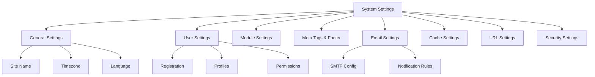

# XOOPSシステム設定

XOOPS管理パネルで利用可能な完全なシステム設定ガイド (カテゴリー別に整理)。

## システム設定アーキテクチャ



## システム設定へアクセス

### 場所

**管理パネル > システム > 設定**

または直接移動:

```
http://your-domain.com/xoops/admin/index.php?fct=preferences
```

### 権限要件

- 管理者 (ウェブマスター) のみがシステム設定にアクセス可能
- 変更はサイト全体に影響
- ほとんどの変更は即座に有効

## 一般設定

XOOPSインストールの基本的な設定。

### 基本情報

```
サイト名: [サイト名]
デフォルト説明: [サイトの簡単説明]
サイトスローガン: [素晴らしいスローガン]
管理者メール: admin@your-domain.com
ウェブマスター名: 管理者名
ウェブマスターメール: admin@your-domain.com
```

### 表示設定

```
デフォルトテーマ: [テーマを選択]
デフォルト言語: English (または優先言語)
ページあたりのアイテム: 15 (通常10-25)
スニペットの単語数: 25 (検索結果用)
テーマアップロード権限: 無効化 (セキュリティ)
```

### 地域設定

```
デフォルトタイムゾーン: [タイムゾーン]
日付形式: %Y-%m-%d (YYYY-MM-DD形式)
時刻形式: %H:%M:%S (HH:MM:SS形式)
サマータイム: [自動/手動/なし]
```

**タイムゾーン形式表:**

| 地域 | タイムゾーン | UTC オフセット |
|---|---|---|
| US Eastern | America/New_York | -5 / -4 |
| US Central | America/Chicago | -6 / -5 |
| US Mountain | America/Denver | -7 / -6 |
| US Pacific | America/Los_Angeles | -8 / -7 |
| UK/London | Europe/London | 0 / +1 |
| France/Germany | Europe/Paris | +1 / +2 |
| Japan | Asia/Tokyo | +9 |
| China | Asia/Shanghai | +8 |
| Australia/Sydney | Australia/Sydney | +10 / +11 |

### 検索設定

```
検索を有効化: はい
管理ページを検索: はい/いいえ
アーカイブを検索: はい
デフォルト検索タイプ: すべて / ページのみ
検索から除外する単語: [カンマ区切りリスト]
```

**一般的な除外単語:** the, a, an, and, or, but, in, on, at, by, to, from

## ユーザー設定

ユーザーアカウントの動作と登録プロセスを制御します。

### ユーザー登録

```
ユーザー登録を許可: はい/いいえ
登録タイプ:
  ☐ 自動有効化 (即座にアクセス)
  ☐ 管理者承認 (管理者が承認必要)
  ☐ メール確認 (ユーザーがメール確認必要)

ユーザーへの通知: はい/いいえ
ユーザーメール確認: 必須/オプション
```

### 新規ユーザー設定

```
新規ユーザーを自動ログイン: はい/いいえ
デフォルトユーザーグループを割り当て: はい
デフォルトユーザーグループ: [グループを選択]
ユーザーアバターを作成: はい/いいえ
初期ユーザーアバター: [デフォルトを選択]
```

### ユーザープロフィール設定

```
ユーザープロフィールを許可: はい
メンバーリストを表示: はい
ユーザー統計を表示: はい
最後のオンライン時刻を表示: はい
ユーザーアバターを許可: はい
アバターファイルの最大サイズ: 100KB
アバター寸法: 100x100 ピクセル
```

### ユーザーメール設定

```
ユーザーメールを非表示にする: はい
プロフィールにメールを表示: はい
通知メール間隔: 即座/日次/週次/なし
```

### ユーザーアクティビティ追跡

```
ユーザーアクティビティを追跡: はい
ユーザーログインをログ: はい
失敗したログインをログ: はい
IPアドレスを追跡: はい
以前のアクティビティログをクリア: 90日
```

### アカウント制限

```
重複したメールを許可: いいえ
最小ユーザー名長: 3文字
最大ユーザー名長: 15文字
最小パスワード長: 6文字
特殊文字を必須: はい
数字を必須: はい
パスワード有効期限: 90日 (またはなし)
無活動アカウント削除日数: 365日
```

## モジュール設定

個別のモジュール動作を設定します。

### 一般的なモジュールオプション

インストール済みモジュールごとに設定可能:

```
モジュール状態: アクティブ/無効化
メニューに表示: はい/いいえ
モジュールウェイト: [1-999] (高いほど下に表示)
ホームページのデフォルト: このモジュールがホームページに表示
管理アクセス: [許可されるユーザーグループ]
ユーザーアクセス: [許可されるユーザーグループ]
```

### システムモジュール設定

```
ホームページとして表示: ポータル / モジュール / 静的ページ
デフォルトホームページモジュール: [モジュールを選択]
フッターメニューを表示: はい
フッターカラー: [カラーセレクタ]
システム統計を表示: はい
メモリ使用量を表示: はい
```

### モジュールごとの設定

各モジュールにはモジュール固有の設定があります:

**例 - ページモジュール:**
```
コメントを有効化: はい/いいえ
コメントを確認: はい/いいえ
ページあたりのコメント: 10
評価を有効化: はい
匿名による評価を許可: はい
```

**例 - ユーザーモジュール:**
```
アバターアップロードフォルダ: ./uploads/
アップロード最大サイズ: 100KB
ファイルアップロードを許可: はい
許可されるファイルタイプ: jpg, gif, png
```

モジュール固有の設定にアクセス:
- **管理 > モジュール > [モジュール名] > 設定**

## メタタグ & SEO設定

検索エンジン最適化用のメタタグを設定します。

### グローバルメタタグ

```
メタキーワード: xoops, cms, content management system
メタ説明: 動的なウェブサイトを構築するための強力で柔軟なオープンソースCMS
メタ著者: あなたの名前
メタ著作権: Copyright 2025, あなたの会社
メタロボット: index, follow
メタ再訪問: 30日
```

### メタタグベストプラクティス

| タグ | 目的 | 推奨 |
|---|---|---|
| キーワード | 検索用語 | 5-10個の関連キーワード (カンマ区切り) |
| 説明 | 検索リスト | 150-160文字 |
| 著者 | ページ作成者 | 名前または会社 |
| 著作権 | 法的事項 | 著作権表示 |
| ロボット | クローラー指示 | index, follow (インデックス化を許可) |

### フッター設定

```
フッターを表示: はい
フッターカラー: ダーク/ライト
フッター背景: [カラーコード]
フッターテキスト: [HTMLが許可]
追加フッターリンク: [URLとテキストペア]
```

**サンプルフッターHTML:**
```html
<p>Copyright &copy; 2025 あなたの会社。著作権所有。</p>
<p><a href="/privacy">プライバシーポリシー</a> | <a href="/terms">利用規約</a></p>
```

### ソーシャルメタタグ (Open Graph)

```
Open Graphを有効化: はい
Facebook App ID: [App ID]
Twitterカードタイプ: summary / summary_large_image / player
デフォルト共有画像: [画像URL]
```

## メール設定

メール配信と通知システムを設定します。

### メール配信方法

```
SMTPを使用: はい/いいえ

SMTP を使用する場合:
  SMTPホスト: smtp.gmail.com
  SMTPポート: 587 (TLS) または 465 (SSL)
  SMTPセキュリティ: TLS / SSL / なし
  SMTPユーザー名: [email@example.com]
  SMTPパスワード: [パスワード]
  SMTP認証: はい/いいえ
  SMTPタイムアウト: 10秒

PHP mail() を使用する場合:
  Sendmailパス: /usr/sbin/sendmail -t -i
```

### メール設定

```
差出人アドレス: noreply@your-domain.com
差出人名: サイト名
返信先アドレス: support@your-domain.com
管理メールをBCC: はい/いいえ
```

### 通知設定

```
ウェルカムメールを送信: はい/いいえ
ウェルカムメール件名: [サイト名]へようこそ
ウェルカムメール本文: [カスタムメッセージ]

パスワードリセットメールを送信: はい/いいえ
ランダムパスワードを含める: はい/いいえ
トークン有効期限: 24時間
```

### 管理者通知

```
登録時に管理者に通知: はい
コメント時に管理者に通知: はい
提出時に管理者に通知: はい
エラー時に管理者に通知: はい
```

### ユーザー通知

```
登録時にユーザーに通知: はい
コメント時にユーザーに通知: はい
プライベートメッセージ時にユーザーに通知: はい
ユーザーが通知を無効化可能: はい
デフォルト通知頻度: 即座
```

### メールテンプレート

管理パネルで通知メールをカスタマイズ:

**パス:** システム > メールテンプレート

利用可能なテンプレート:
- ユーザー登録
- パスワードリセット
- コメント通知
- プライベートメッセージ
- システムアラート
- モジュール固有メール

## キャッシュ設定

キャッシングによるパフォーマンス最適化。

### キャッシュ設定

```
キャッシングを有効化: はい/いいえ
キャッシュタイプ:
  ☐ ファイルキャッシュ
  ☐ APCu (代替PHPキャッシュ)
  ☐ Memcache (分散キャッシング)
  ☐ Redis (高度なキャッシング)

キャッシュ有効期限: 3600秒 (1時間)
```

### キャッシュタイプ別オプション

**ファイルキャッシュ:**
```
キャッシュディレクトリ: /var/www/html/xoops/cache/
クリア間隔: 日次
最大キャッシュファイル数: 1000
```

**APCuキャッシュ:**
```
メモリ割り当て: 128MB
フラグメンテーションレベル: 低
```

**Memcache/Redis:**
```
サーバーホスト: localhost
サーバーポート: 11211 (Memcache) / 6379 (Redis)
永続接続: はい
```

### キャッシュされるもの

```
モジュールリストをキャッシュ: はい
設定データをキャッシュ: はい
テンプレートデータをキャッシュ: はい
ユーザーセッションデータをキャッシュ: はい
検索結果をキャッシュ: はい
データベースクエリをキャッシュ: はい
RSSフィードをキャッシュ: はい
画像をキャッシュ: はい
```

## URL設定

URLリライティングとフォーマットを設定します。

### フレンドリーURL設定

```
フレンドリーURLを有効化: はい/いいえ
フレンドリーURLタイプ:
  ☐ パスInfo: /page/about
  ☐ クエリ文字列: /index.php?p=about

トレーリングスラッシュ: 含める / 省略
URLの大文字小文字: 小文字 / 区別する
```

### URLリライトルール

```
.htaccess ルール: [現在のルールを表示]
Nginx ルール: [Nginxの場合は現在のルールを表示]
IIS ルール: [IISの場合は現在のルールを表示]
```

## セキュリティ設定

セキュリティ関連の設定を制御します。

### パスワードセキュリティ

```
パスワードポリシー:
  ☐ 大文字を必須
  ☐ 小文字を必須
  ☐ 数字を必須
  ☐ 特殊文字を必須

最小パスワード長: 8文字
パスワード有効期限: 90日
パスワード履歴: 最後の5つのパスワードを記憶
パスワード変更を強制: 次回ログイン時
```

### ログインセキュリティ

```
失敗試行後にロック: 5回試行
ロック期間: 15分
すべてのログイン試行をログ: はい
失敗したログインをログ: はい
管理者ログイン時にアラート: 管理者にメール送信
二要素認証: 無効化/有効化
```

### ファイルアップロードセキュリティ

```
ファイルアップロードを許可: はい/いいえ
最大ファイルサイズ: 128MB
許可されるファイルタイプ: jpg, gif, png, pdf, zip, doc, docx
アップロードをマルウェア スキャン: はい (利用可能の場合)
疑わしいファイルを隔離: はい
```

### セッションセキュリティ

```
セッション管理: データベース/ファイル
セッションタイムアウト: 1800秒 (30分)
セッションクッキー有効期限: 0 (ブラウザを閉じるまで)
セキュアなクッキー: はい (HTTPSのみ)
HTTPのみクッキー: はい (JavaScript アクセスを防止)
```

### CORS設定

```
クロスオリジンリクエストを許可: いいえ
許可されたオリジン: [ドメインリスト]
認証情報を許可: いいえ
許可されたメソッド: GET, POST
```

## 高度な設定

高度なユーザー向けの追加設定オプション。

### デバッグモード

```
デバッグモード: 無効化/有効化
ログレベル: エラー / 警告 / 情報 / デバッグ
デバッグログファイル: /var/log/xoops_debug.log
エラーを表示: 無効化 (本番環境)
```

### パフォーマンス調整

```
データベースクエリを最適化: はい
クエリキャッシュを使用: はい
出力を圧縮: はい
CSS/JavaScriptを最小化: はい
画像を遅延ロード: はい
```

### コンテンツ設定

```
投稿でHTMLを許可: はい/いいえ
許可されるHTMLタグ: [設定]
有害なコードを削除: はい
埋め込みを許可: はい/いいえ
コンテンツモデレーション: 自動/手動
スパム検出: はい
```

## 設定のエクスポート/インポート

### 設定をバックアップ

現在の設定をエクスポート:

**管理パネル > システム > ツール > 設定をエクスポート**

```bash
# 設定がJSONファイルとしてエクスポート
# ダウンロードして安全に保存
```

### 設定を復元

以前にエクスポートした設定をインポート:

**管理パネル > システム > ツール > 設定をインポート**

```bash
# JSONファイルをアップロード
# 変更を確認してから確認
```

## 設定階層

XOOPS設定階層 (上から下へ - 最初にマッチしたものが優先):

```
1. mainfile.php (定数)
2. モジュール固有の設定
3. 管理システム設定
4. テーマ設定
5. ユーザー設定 (ユーザー固有の設定の場合)
```

## 設定バックアップスクリプト

現在の設定のバックアップを作成:

```php
<?php
// バックアップスクリプト: /var/www/html/xoops/backup-settings.php
require_once __DIR__ . '/mainfile.php';

$config_handler = xoops_getHandler('config');
$configs = $config_handler->getConfigs();

$backup = [
    'exported_date' => date('Y-m-d H:i:s'),
    'xoops_version' => XOOPS_VERSION,
    'php_version' => PHP_VERSION,
    'settings' => []
];

foreach ($configs as $config) {
    $backup['settings'][$config->getVar('conf_name')] = [
        'value' => $config->getVar('conf_value'),
        'description' => $config->getVar('conf_desc'),
        'type' => $config->getVar('conf_type'),
    ];
}

// JSONファイルに保存
file_put_contents(
    '/backups/xoops_settings_' . date('YmdHis') . '.json',
    json_encode($backup, JSON_PRETTY_PRINT)
);

echo "設定が正常にバックアップされました!";
?>
```

## 一般的な設定の変更

### サイト名を変更

1. 管理 > システム > 設定 > 一般設定
2. 「サイト名」を修正
3. 「保存」をクリック

### 登録を有効化/無効化

1. 管理 > システム > 設定 > ユーザー設定
2. 「ユーザー登録を許可」を切り替え
3. 登録タイプを選択
4. 「保存」をクリック

### デフォルトテーマを変更

1. 管理 > システム > 設定 > 一般設定
2. 「デフォルトテーマ」を選択
3. 「保存」をクリック
4. 変更を反映させるためキャッシュをクリア

### 連絡先メールを更新

1. 管理 > システム > 設定 > 一般設定
2. 「管理者メール」を修正
3. 「ウェブマスターメール」を修正
4. 「保存」をクリック

## 確認チェックリスト

システム設定後に確認:

- [ ] サイト名が正しく表示
- [ ] タイムゾーンが正しい時刻を表示
- [ ] メール通知が正しく送信
- [ ] ユーザー登録が設定通りに動作
- [ ] ホームページが選択したデフォルトを表示
- [ ] 検索機能が動作
- [ ] キャッシュでページロード時間が向上
- [ ] フレンドリーURLが動作 (有効化した場合)
- [ ] メタタグがページソースに表示
- [ ] 管理者が通知を受け取る
- [ ] セキュリティ設定が強制

## 設定のトラブルシューティング

### 設定が保存されない

**解決策:**
```bash
# configディレクトリのファイルのパーミッションを確認
chmod 755 /var/www/html/xoops/var/

# データベースが書き込み可能であることを確認
# 管理パネルで再び保存を試す
```

### 変更が有効にならない

**解決策:**
```bash
# キャッシュをクリア
rm -rf /var/www/html/xoops/cache/*
rm -rf /var/www/html/xoops/templates_c/*

# それでも動作しない場合、Webサーバーを再起動
systemctl restart apache2
```

### メールが送信されない

**解決策:**
1. メール設定でSMTP認証情報を確認
2. 「テストメール送信」ボタンでテスト
3. エラーログを確認
4. PHP mail()の代わりにSMTPを試す

## 次のステップ

システム設定設定後:

1. セキュリティ設定を設定
2. パフォーマンスを最適化
3. 管理パネル機能を探索
4. ユーザー管理をセットアップ

---

**タグ:** #system-settings #configuration #preferences #admin-panel

**関連記事:**
- ../../06-Publisher-Module/User-Guide/Basic-Configuration
- Security-Configuration
- Performance-Optimization
- ../First-Steps/Admin-Panel-Overview
