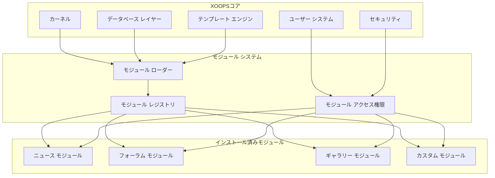
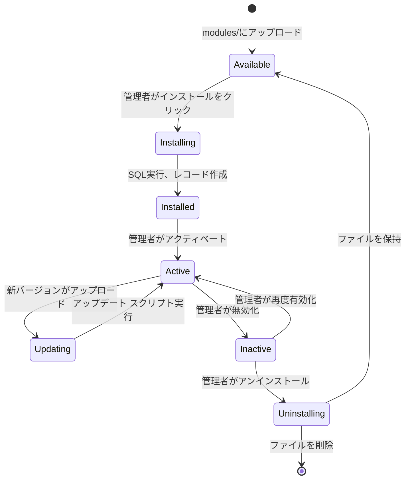

# ADR-001: モジュール式アーキテクチャ

> XOOPSのコアモジュール式設計哲学のためのアーキテクチャ決定記録

---

## ステータス

**承認** - XOOPS開始以来の基本的な決定

---

## コンテクスト

XOOPS (eXtensible Object-Oriented Portal System) は以下を可能にするアーキテクチャが必要でした:

1. サードパーティ開発者が機能を拡張
2. サイト管理者がコーディングなしでカスタマイズ
3. 独立開発とアップデート
4. 異なる機能間の分離
5. 小さなブログから複雑なポータルまでスケール

2000年代初期のCMS環境はカスタマイズと拡張が難しいモノリシックシステムを提供しました

---

## 決定図



---

## 決定

**モジュール式アーキテクチャ**を実装します。ここで:

### 1. コアがインフラストラクチャを提供
- データベース抽象化
- ユーザー認証とアクセス権限
- テンプレートレンダリング(Smarty)
- セキュリティユーティリティ
- フォーム生成
- 共通ユーティリティ

### 2. モジュールは自己完結型
各モジュール:
- 独自のディレクトリ構造を持つ
- 独自のクラス、テンプレート、SQLを含む
- 独自の構成を定義
- 独立してインストール/アンインストール可能
- バージョン追跡

### 3. 標準モジュール構造
```
modules/modulename/
├── admin/                  # 管理インターフェース
│   ├── index.php
│   └── menu.php
├── class/                  # PHPクラス
├── include/                # インクルード ファイル
├── language/               # 翻訳
├── sql/                    # データベース スキーマ
├── templates/              # Smarty テンプレート
├── blocks/                 # ブロック定義
├── xoops_version.php       # モジュール マニフェスト
├── index.php               # エントリ ポイント
└── header.php              # モジュール ブートストラップ
```

### 4. モジュール マニフェスト (xoops_version.php)
```php
<?php
$modversion['name']        = 'Module Name';
$modversion['version']     = '1.0.0';
$modversion['description'] = 'Module description';
$modversion['dirname']     = basename(__DIR__);
$modversion['hasMain']     = 1;
$modversion['hasAdmin']    = 1;
$modversion['sqlfile']['mysql'] = 'sql/mysql.sql';
$modversion['tables']      = ['modulename_table1'];
$modversion['templates']   = [...];
$modversion['config']      = [...];
$modversion['blocks']      = [...];
```

### 5. モジュール通信
- コアAPI経由(ハンドラー、イベント)
- データベース関係
- プリロード フック
- 共有サービス

---

## モジュール ライフサイクル



---

## 結果

### ポジティブ

1. **拡張性**: コミュニティによって作成された何千ものモジュール
2. **独立性**: モジュールは個別に開発可能
3. **柔軟性**: サイトは機能をミックスマッチ可能
4. **保守性**: アップデートは他のモジュールに影響しない
5. **マーケットプレース**: モジュール エコシステムが出現
6. **学習曲線**: 開発者は1つのパターンを学習

### ネガティブ

1. **オーバーヘッド**: 各モジュールはブートストラップ コストを持つ
2. **重複**: 共通コードが繰り返される可能性
3. **統合**: クロスモジュール機能は慎重な設計が必要
4. **バージョニング**: モジュール互換性管理が必要
5. **品質差**: サードパーティ モジュール品質が異なる

### ニュートラル

1. **データベース**: 各モジュールは独自のテーブルを管理
2. **テンプレート**: テーマは様々なモジュールに対応する必要
3. **アップデート**: コアとモジュールは独立してアップデート

---

## 代替案の検討

### 1. モノリシック アーキテクチャ
**却下** - 厳格すぎて、カスタマイズが難しい

### 2. プラグイン アーキテクチャ (WordPress スタイル)
**部分的に採用** - ブロックとプリロードはモジュール内でプラグインのようなフックを提供

### 3. コンポーネント アーキテクチャ (Joomla スタイル)
**却下** - より複雑で、開発者フレンドリーではない

### 4. マイクロサービス
**該当なし** - 共有ホスティング時代には複雑すぎる

---

## 関連する決定

- ADR-002: オブジェクト指向データベース アクセス
- ADR-003: Smartyテンプレート エンジン
- ADR-005: アクセス権限 システム

---

## 参照

- XOOPSプロジェクト履歴
- PHPアプリケーション アーキテクチャ パターン
- CMSの比較研究 (2001-2005)

---

#xoops #architecture #adr #modules #design-decision
