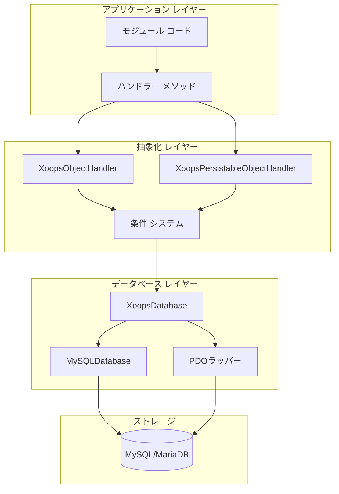
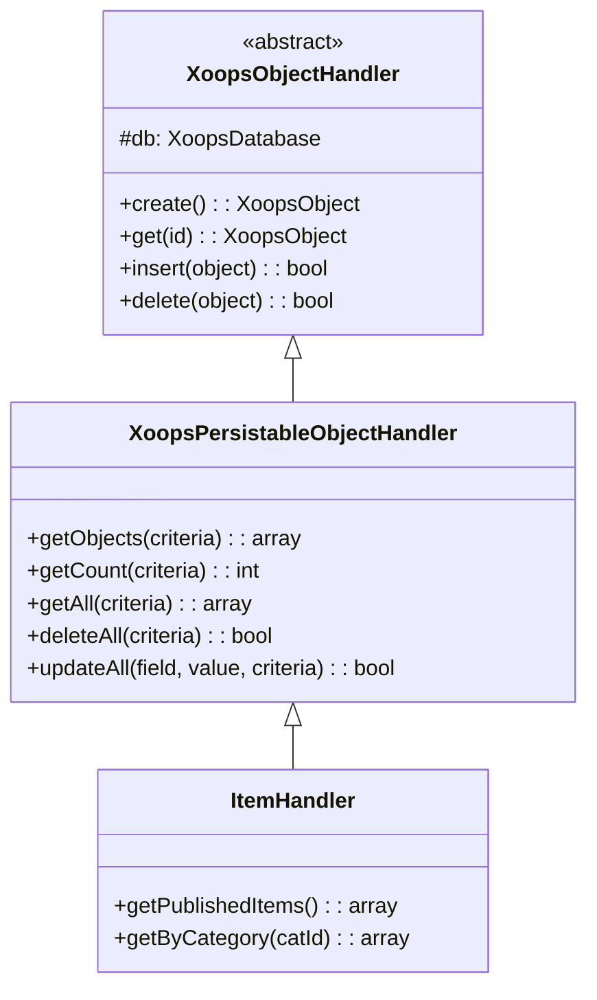
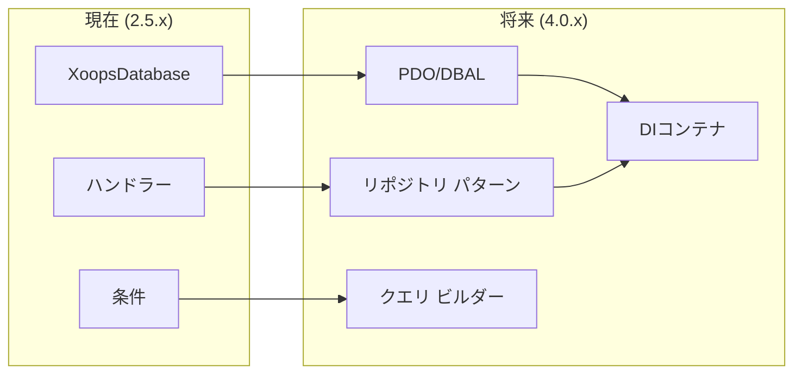

# ADR-002: データベース抽象化

> XOOPSのオブジェクト指向データベース アクセス パターンのアーキテクチャ決定記録

---

## ステータス

**承認** - XOOPS 2.0以来のコア パターン

---

## コンテクスト

XOOPSはデータベース操作戦略が必要でした:

1. データベース固有SQL構文の抽象化
2. すべてのモジュール全体で一貫したCRUD操作を提供
3. 自動的なデータサニタイゼーションとエスケーピング
4. 将来のデータベース エンジン変更をサポート
5. 開発者の共通操作を簡素化

代替案:
- コード全体を通じたSQL
- フル ORM(Doctrine、Eloquent)
- カスタム軽量抽象化

---

## 決定図



---

## 決定

**ハンドラー パターン**を実装します。以下を含む:

### 1. XoopsObject - データ コンテナ

各データ エンティティはXoopsObjectを拡張:

```php
class Item extends XoopsObject
{
    public function __construct()
    {
        $this->initVar('id', XOBJ_DTYPE_INT, null, false);
        $this->initVar('title', XOBJ_DTYPE_TXTBOX, '', true, 255);
        $this->initVar('content', XOBJ_DTYPE_TXTAREA, '', false);
        $this->initVar('status', XOBJ_DTYPE_INT, 0, false);
    }
}
```

### 2. ハンドラー - 操作マネージャー

各オブジェクトは対応するハンドラーを持つ:

```php
class ItemHandler extends XoopsPersistableObjectHandler
{
    public function __construct($db)
    {
        parent::__construct($db, 'mymodule_items', Item::class, 'id', 'title');
    }

    // 継承されたCRUDメソッド:
    // - create(), get(), insert(), delete()
    // - getObjects(), getCount(), getAll()
}
```

### 3. 条件 - クエリ ビルダー

オブジェクト指向クエリ条件:

```php
$criteria = new CriteriaCompo();
$criteria->add(new Criteria('status', 1));
$criteria->add(new Criteria('created', time() - 86400, '>='));
$criteria->setSort('created');
$criteria->setOrder('DESC');
$criteria->setLimit(10);

$items = $handler->getObjects($criteria);
```

---

## データ型定数

```php
// 自動サニタイゼーション付きの変数タイプ
XOBJ_DTYPE_INT       // 整数
XOBJ_DTYPE_TXTBOX    // 単一行テキスト(エスケープ)
XOBJ_DTYPE_TXTAREA   // 複数行テキスト(エスケープ)
XOBJ_DTYPE_EMAIL     // メール検証
XOBJ_DTYPE_URL       // URL検証
XOBJ_DTYPE_ARRAY     // シリアライズ配列
XOBJ_DTYPE_OTHER     // 処理なし
XOBJ_DTYPE_FLOAT     // 浮動小数点
```

---

## ハンドラー 継承



---

## 結果

### ポジティブ

1. **一貫性**: すべてのモジュールが同じパターンを使用
2. **セキュリティ**: 自動エスケーピングはSQL注入を防止
3. **シンプルさ**: 共通操作は最小限のコードを必要
4. **保守性**: データベース レイヤーへの変更はモジュールに影響しない
5. **テスト可能性**: ハンドラーはテスト用にモック可能

### ネガティブ

1. **パフォーマンス**: 追加の抽象化オーバーヘッド
2. **複雑さ**: 新しい開発者の学習曲線
3. **制限**: 複雑なクエリは生SQLが必要
4. **N+1問題**: ビルトイン即時ロードなし

### 軽減策

- **パフォーマンス**: よくアクセスされるオブジェクトをキャッシュ
- **複雑なクエリ**: 必要に応じて生SQLを許可
- **N+1**: 適切な条件でgetAll()を使用

---

## XOOPS 4.0への進化



XOOPS 4.0計画:
- データベース抽象化用Doctrine DBAL
- ハンドラーを置き換えるリポジトリ パターン
- 複雑なクエリ用のクエリ ビルダー
- フル PSR-11コンテナ統合

---

## 関連する決定

- ADR-001: モジュール式アーキテクチャ
- ADR-003: Smartyテンプレート エンジン

---

## 参照

- Martin Fowler - エンタープライズ アプリケーション アーキテクチャ パターン
- ドメイン駆動設計コンセプト
- Active RecordおよびData Mapperパターン

---

#xoops #architecture #adr #database #handler #design-decision
