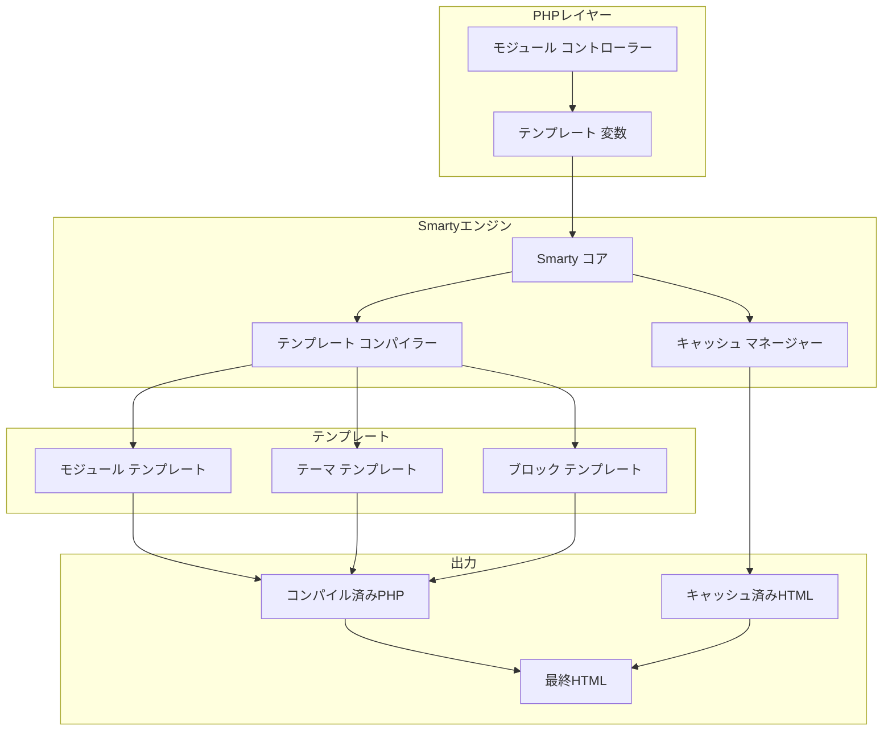
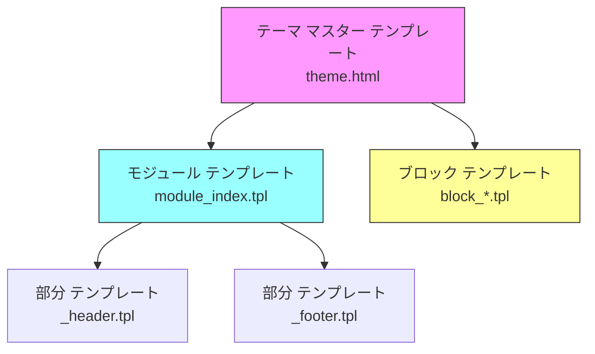

# ADR-003: テンプレート エンジン (Smarty)

> XOOPSのSmartyテンプレート エンジン採用のアーキテクチャ決定記録

---

## ステータス

**承認** - XOOPS 2.0以来のコア決定

**進化中** - XOOPS 4.0向けSmarty 4/5への移行計画

---

## コンテクスト

XOOPSはテンプレート化ソリューションが必要でした:

1. プレゼンテーションをビジネス ロジックから分離
2. テーマ設計者がPHP知識なしで作業
3. テンプレート継承とインクルードをサポート
4. パフォーマンスのためのキャッシング
5. ユーザー カスタマイズ可能なテンプレート
6. 国際化をサポート

---

## 決定図



---

## 決定

**Smarty**をテンプレート エンジンとして使用します。理由:

### 1. 関心の分離

```php
// PHP (コントローラー) - ビジネス ロジック
$items = $itemHandler->getPublishedItems();
$xoopsTpl->assign('items', $items);

// Smarty (ビュー) - プレゼンテーション
// templates/items.tpl
```

```smarty
{* Smartyテンプレート - PHPロジックなし *}
<{foreach item=item from=$items}>
    <article>
        <h2><{$item.title}></h2>
        <p><{$item.summary}></p>
    </article>
<{/foreach}>
```

### 2. XOOPSデリミター

XOOPSは標準ではなく`<{`と`}>`を使用:

```smarty
{* 標準Smarty *}
{$variable}

{* XOOPS Smarty - JavaScriptコンフリクトを回避 *}
<{$variable}>
```

### 3. テンプレート 階層



---

## 結果

### ポジティブ

1. **デザイナー フレンドリー**: HTMLのような構文
2. **キャッシング**: ビルトイン テンプレート キャッシング
3. **セキュリティ**: PHPコード分離
4. **柔軟性**: モディファイアー、関数、プラグイン
5. **カスタマイズ**: ユーザーがテンプレートを変更可能
6. **コミュニティ**: 大型Smartyエコシステム

### ネガティブ

1. **学習曲線**: Smarty固有の構文
2. **オーバーヘッド**: コンパイル ステップが必要
3. **デバッギング**: テンプレート エラーが不明確の場合がある
4. **バージョン問題**: バージョン間の破壊的な変更

---

## 関連する決定

- ADR-001: モジュール式アーキテクチャ
- ADR-002: データベース抽象化

---

## 参照

- Smarty文書: https://www.smarty.net/docs/en/
- XOOPSテンプレート システム ガイド
- ウェブ アプリケーションのMVCパターン

---

#xoops #architecture #adr #smarty #templates #design-decision
