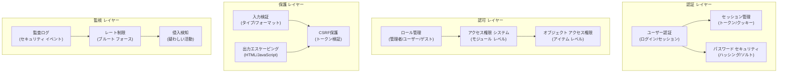

# ADR-004: セキュリティ システム アーキテクチャ

> 最新の脅威からXOOPS CMSを保護する包括的なセキュリティ アーキテクチャ

---

## ステータス

**承認** - XOOPS 2.5以来のコア セキュリティ レイヤー

---

## コンテクスト

### 問題ステートメント

XOOPSは以下を行うロバストなセキュリティ システムが必要:

1. **一般的なウェブ脆弱性から保護** (OWASP Top 10)
2. **きめ細かいアクセス権限制御**をモジュール間で提供
3. **セキュアなユーザー認証**で最新基準を有効化
4. **データ侵害を防止**して不正アクセスを阻止
5. **マルチレベル アクセス制御** (管理者、モデレーター、ユーザー、ゲスト)
6. **すべてのモジュールとシームレスに統合**

### 現在の脅威

最新のウェブ攻撃:

- **SQL注入** - ユーザー入力内の悪質なSQL
- **XSS(クロスサイト スクリプティング)** - ページに注入されたJavaScript
- **CSRF(クロスサイト リクエスト フォージェリー)** - 不正なフォーム送信
- **認証バイパス** - 弱いセッション/パスワード処理
- **認可バイパス** - 特権昇格
- **データ公開** - URLs、ログ、キャッシュ内の機密データ

---

## 決定

### コア セキュリティ アーキテクチャ



---

## セキュリティ コンポーネント

### 1. 認証 システム

```php
<?php
// 1. 認証情報を検証
$user = $userHandler->findByLogin($username);
if (!$user || !password_verify($password, $user->getVar('pass'))) {
    throw new AuthenticationException('無効な認証情報');
}

// 2. アカウントがアクティブであることを確認
if (!$user->getVar('uactive')) {
    throw new AuthenticationException('アカウントが非アクティブ');
}

// 3. セキュアなセッションを作成
session_regenerate_id(true);
$_SESSION['uid'] = $user->getVar('uid');
$_SESSION['token'] = bin2hex(random_bytes(32));
$_SESSION['created'] = time();

// 4. ログインを記録
$this->auditLog('USER_LOGIN', $user->getVar('uid'));
```

### 2. パスワード セキュリティ

```php
<?php
// password_hash(MD5またはSHA1ではなく)を使用
$hashed = password_hash($password, PASSWORD_BCRYPT, [
    'cost' => 12, // 高コスト = ブルート フォースが遅い
]);

// パスワードを検証
if (!password_verify($inputPassword, $hashed)) {
    throw new Exception('パスワードが無効');
}

// アルゴリズムまたはコストが変更された場合は再ハッシュ
if (password_needs_rehash($hashed, PASSWORD_BCRYPT, ['cost' => 12])) {
    $newHash = password_hash($password, PASSWORD_BCRYPT, ['cost' => 12]);
    $user->setVar('pass', $newHash);
    $userHandler->insert($user);
}
```

### 3. セッション管理

```php
<?php
// セッション構成
ini_set('session.cookie_httponly', true);  // JSアクセスなし
ini_set('session.cookie_secure', true);     // HTTPSのみ
ini_set('session.cookie_samesite', 'Strict'); // CSRF保護
ini_set('session.gc_maxlifetime', 3600);   // 1時間のタイムアウト
ini_set('session.sid_length', 64);         // 64文字セッションID
```

### 4. 入力検証

```php
<?php
// 常にプリペアド ステートメントを使用
$sql = 'SELECT * FROM users WHERE id = ?';
$result = $db->query($sql, [$userId]); // ✅ セキュア

// 入力検証
function validateUserInput(array $data): array
{
    return [
        'email' => filter_var($data['email'] ?? '', FILTER_VALIDATE_EMAIL),
        'age' => filter_var($data['age'] ?? 0, FILTER_VALIDATE_INT),
        'website' => filter_var($data['website'] ?? '', FILTER_VALIDATE_URL),
        'title' => substr(trim($data['title'] ?? ''), 0, 255),
    ];
}
```

### 5. 出力エスケーピング

```php
<?php
// PHPテンプレートで
echo htmlspecialchars($userInput, ENT_QUOTES, 'UTF-8');

// Smartyテンプレートで(自動エスケーピング)
<{$user_input}>  {* デフォルトでエスケープ *}
<{$html|escape:false}>  {* 必要な場合のみ *}
```

---

## 結果

### ポジティブな影響

1. **包括的な保護** - 主要な脆弱性クラスをカバー
2. **重層防御** - 防御の複数レイヤー
3. **柔軟なRBAC** - きめ細かいアクセス権限制御
4. **監査証跡** - セキュリティ イベントを追跡
5. **業界基準** - OWASP推奨事項に準拠
6. **モジュール統合** - モジュールがセキュリティAPIを簡単に使用

### ネガティブな影響

1. **複雑さ** - より多くのコードと構成が必要
2. **パフォーマンス** - ハッシング検証がオーバーヘッドを追加
3. **ユーザー体験** - セキュリティは時々不便
4. **メンテナンス** - 継続的なセキュリティ アップデートが必要
5. **トレーニング** - 開発者はベストプラクティスに従う必要

---

## ベストプラクティス

### モジュール開発者向け

```php
<?php
// ✅ DO: プリペアド ステートメントを使用
$result = $db->prepare('SELECT * FROM table WHERE id = ?')->execute([$id]);

// ❌ DON'T: クエリを連結
$result = $db->query("SELECT * FROM table WHERE id = $id");

// ✅ DO: 出力をエスケープ
echo htmlspecialchars($user_input, ENT_QUOTES, 'UTF-8');

// ❌ DON'T: 生のユーザー データを出力
echo $user_input;

// ✅ DO: アクセス権限を確認
if (!$user->hasPermission('edit_content')) {
    throw new PermissionException();
}

// ❌ DON'T: ユーザー ロールを直接信頼
if ($_POST['is_admin']) {
    // ユーザーを管理者にする - セキュリティ ホール!
}
```

---

## 代替案の検討

### OAuth/OpenID Connect

**初期段階で選択されなかった理由**: 共有ホスティング環境には複雑すぎますが、外部認証システムとの統合に適しています

### 二要素認証(2FA)

**ステータス**: コア要件としてではなく拡張として承認、ADR-006を参照

---

## 関連する決定

- ADR-001: モジュール式アーキテクチャ - モジュールがセキュリティを実装
- ADR-005: モジュール アクセス権限 システム
- ADR-006: 二要素認証(将来)

---

## 参照

- [OWASP Top 10](https://owasp.org/www-project-top-ten/)
- [PHP セキュリティ マニュアル](https://www.php.net/manual/en/security.php)
- [password_hash() ドキュメント](https://www.php.net/manual/en/function.password-hash.php)

---

#xoops #adr #security #architecture #authentication #authorization #rbac
