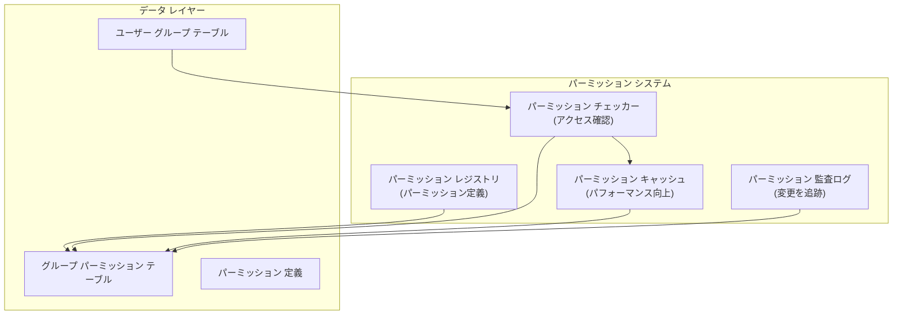

# ADR-006: モジュール パーミッション システム

> XOOPS モジュール向けのきめ細かい階層型パーミッション システムで粒度の高いアクセス制御を実現

---

## ステータス

**承認** - XOOPS 2.5.xで実装、XOOPS 4.0で拡張

---

## コンテクスト

### 問題ステートメント

XOOPS モジュールは以下を可能にする柔軟なパーミッション制御が必要:

1. **モジュール レベルのパーミッション** - ユーザーはこのモジュールにアクセスできるか
2. **オブジェクト レベルのパーミッション** - ユーザーはこの特定のアイテムにアクセスできるか
3. **アクション レベルのパーミッション** - ユーザーはこのアクションを実行できるか
4. **カスタム パーミッション** - モジュールは独自のパーミッションを定義できるか

### 現在の状態

XOOPS 2.5は XoopsGroupPermission システムを使用:

```php
<?php
$perm_handler = xoops_getHandler('groupperm');
$isAllowed = $perm_handler->checkRight(
    'modulename',
    'action',
    $itemId,
    $groupId
);
```

### 課題

1. **複雑なクエリ** - パーミッション チェックにはデータベース結合が必要
2. **制限された階層** - パーミッション グループの作成が難しい
3. **キャッシングが弱い** - ビルトイン パーミッション キャッシングなし
4. **モジュール別実装** - 各モジュールは異なる方法で実装
5. **パフォーマンス** - パーミッション チェックに複数のDB クエリが必要

---

## 決定

### 階層型パーミッション システムを実装

以下をサポートする標準化されたキャッシュ機能付きパーミッション システムを作成:

1. **階層型パーミッション** - 親グループからの継承
2. **ロール ベース アクセス** - パーミッションをロール(管理者、モデレーター、ユーザー、ゲスト)にマップ
3. **オブジェクト パーミッション** - アイテムごとのきめ細かい制御
4. **キャッシング** - クエリを減らすためにパーミッションをキャッシュ
5. **カスタム パーミッション** - モジュールが独自のパーミッションを定義
6. **監査証跡** - パーミッション変更をログ

### パーミッション 階層

```
ユーザー
  └── グループ 1 (管理者)
      └── パーミッション: admin_module
      └── パーミッション: edit_all_items
      └── パーミッション: delete_all_items
  └── グループ 2 (モデレーター)
      └── パーミッション: moderate_comments
      └── パーミッション: edit_own_items
  └── グループ 3 (ユーザー)
      └── パーミッション: view_published_items
      └── パーミッション: edit_own_items
  └── グループ 4 (ゲスト)
      └── パーミッション: view_published_items
```

### アーキテクチャ



---

## コア コンポーネント

### 1. パーミッション 定義

```php
<?php
// モジュールが xoops_version.php でパーミッションを定義

$modversion['permissions'] = [
    [
        'name' => 'module_view',
        'description' => 'Can view module',
        'level' => 'module',
    ],
    [
        'name' => 'item_view',
        'description' => 'Can view items',
        'level' => 'item',
    ],
    [
        'name' => 'item_create',
        'description' => 'Can create items',
        'level' => 'item',
    ],
    [
        'name' => 'item_edit',
        'description' => 'Can edit items',
        'level' => 'item',
    ],
    [
        'name' => 'item_delete',
        'description' => 'Can delete items',
        'level' => 'item',
    ],
    [
        'name' => 'admin_manage',
        'description' => 'Can manage module',
        'level' => 'admin',
    ],
];

// グループごとのデフォルト パーミッション
$modversion['group_permissions'] = [
    // 管理者グループはすべてのパーミッションを取得
    '1' => [
        'module_view' => 1,
        'item_view' => 1,
        'item_create' => 1,
        'item_edit' => 1,
        'item_delete' => 1,
        'admin_manage' => 1,
    ],
    // ユーザー グループ
    '3' => [
        'module_view' => 1,
        'item_view' => 1,
        'item_create' => 1,
        'item_edit' => 0,
        'item_delete' => 0,
        'admin_manage' => 0,
    ],
    // ゲスト グループ
    '4' => [
        'module_view' => 1,
        'item_view' => 1,
        'item_create' => 0,
        'item_edit' => 0,
        'item_delete' => 0,
        'admin_manage' => 0,
    ],
];
```

### 2. パーミッション チェッカー

```php
<?php
declare(strict_types=1);

namespace XoopsCore\Permission;

class PermissionChecker
{
    private PermissionCache $cache;
    private PermissionRepository $repository;

    public function hasPermission(
        User $user,
        string $permissionName,
        ?int $itemId = null
    ): bool {
        // キャッシュをまず確認
        $cacheKey = "perm_{$user->getId()}_{$permissionName}_{$itemId}";
        if ($this->cache->has($cacheKey)) {
            return $this->cache->get($cacheKey);
        }

        $hasPermission = false;

        // すべてのユーザー グループをチェック
        foreach ($user->getGroups() as $group) {
            if ($this->checkGroupPermission($group, $permissionName, $itemId)) {
                $hasPermission = true;
                break;
            }
        }

        // 結果をキャッシュ
        $this->cache->set($cacheKey, $hasPermission, 3600);

        // 高レベル アクセス チェックをログ
        if ($hasPermission && $this->shouldAuditLog($permissionName)) {
            $this->auditLog('PERMISSION_CHECKED', [
                'user_id' => $user->getId(),
                'permission' => $permissionName,
                'item_id' => $itemId,
                'result' => 'ALLOWED',
            ]);
        }

        return $hasPermission;
    }

    private function checkGroupPermission(
        Group $group,
        string $permissionName,
        ?int $itemId = null
    ): bool {
        $sql = 'SELECT COUNT(*) FROM ' . $this->table . '
                WHERE groupid = ?
                AND permission = ?
                AND itemid = ?
                AND granted = 1';

        $stmt = $this->db->prepare($sql);
        $stmt->execute([$group->getId(), $permissionName, $itemId ?? 0]);

        return $stmt->fetchColumn() > 0;
    }
}
```

### 3. パーミッション レベル

```php
<?php
// 異なるスコープを持つ異なるパーミッション レベル

class PermissionLevel
{
    // モジュール レベル: モジュール全体に影響
    public const LEVEL_MODULE = 'module';

    // 管理者 レベル: 管理パネル アクセス
    public const LEVEL_ADMIN = 'admin';

    // アイテム レベル: 特定のオブジェクト/アイテム
    public const LEVEL_ITEM = 'item';

    // フィールド レベル: 特定のオブジェクト フィールド
    public const LEVEL_FIELD = 'field';

    // アクション レベル: 特定のアクション/操作
    public const LEVEL_ACTION = 'action';
}
```

### 4. オブジェクト レベルのパーミッション

```php
<?php
// 特定のアイテムに対するきめ細かい制御

class Item extends XoopsObject
{
    /**
     * ユーザーがこのアイテムを表示できるかをチェック
     */
    public function canView(User $user): bool
    {
        // 公開アイテムは誰でも表示可能
        if ($this->getVar('status') === 'published') {
            return true;
        }

        // オーナーはいつでも自分のアイテムを表示可能
        if ($this->getVar('user_id') === $user->getId()) {
            return true;
        }

        // グループ パーミッションをチェック
        $permChecker = xoops_getActiveModule()->getPermissionChecker();
        return $permChecker->hasPermission(
            $user,
            'item_view',
            $this->getVar('id')
        );
    }

    public function canEdit(User $user): bool
    {
        // オーナーは自分のアイテムを編集可能
        if ($this->getVar('user_id') === $user->getId()) {
            return $permChecker->hasPermission($user, 'item_edit', $this->getVar('id'));
        }

        // ユーザーがすべてのアイテムを編集できるかをチェック
        return $permChecker->hasPermission($user, 'item_edit_all', $this->getVar('id'));
    }

    public function canDelete(User $user): bool
    {
        return $permChecker->hasPermission($user, 'item_delete', $this->getVar('id'));
    }
}
```

### 5. コントローラーでの使用

```php
<?php
// 例: 記事コントローラー

class ArticleController
{
    private PermissionChecker $permChecker;

    public function view(int $id, User $user): Response
    {
        $article = $this->repository->find($id);

        // パーミッションをチェック
        if (!$article->canView($user)) {
            throw new AccessDeniedException('Cannot view this article');
        }

        return new HtmlResponse($this->renderArticle($article));
    }

    public function edit(int $id, User $user): Response
    {
        $article = $this->repository->find($id);

        // パーミッションをチェック
        if (!$article->canEdit($user)) {
            throw new AccessDeniedException('Cannot edit this article');
        }

        // フォーム送信を処理
        if ($this->request->isMethod('POST')) {
            $article->setVar('title', $this->request->getPost('title'));
            $article->setVar('content', $this->request->getPost('content'));
            $this->repository->insert($article);

            $this->auditLog('ARTICLE_EDITED', ['id' => $id, 'user_id' => $user->getId()]);

            // パーミッション キャッシュを無効化
            $this->permChecker->clearCache($user->getId());

            return new RedirectResponse('/article/' . $id);
        }

        return new HtmlResponse($this->renderForm($article));
    }

    public function delete(int $id, User $user): Response
    {
        $article = $this->repository->find($id);

        if (!$article->canDelete($user)) {
            throw new AccessDeniedException('Cannot delete this article');
        }

        $this->repository->delete($article);

        $this->auditLog('ARTICLE_DELETED', ['id' => $id, 'user_id' => $user->getId()]);

        // キャッシュを無効化
        $this->permChecker->clearCache($user->getId());

        return new JsonResponse(['success' => true]);
    }
}
```

---

## 結果

### ポジティブな影響

1. **粒度の高い制御** - 細かく調整されたパーミッション管理
2. **標準化** - モジュール全体で一貫性
3. **キャッシュされている** - キャッシングによるパフォーマンス向上
4. **監査可能** - 誰が何を変更したかを追跡
5. **柔軟性** - カスタム パーミッションをサポート
6. **スケーラビリティ** - 複雑なパーミッション階層に対応
7. **テスト可能性** - ユニット テストが簡単

### ネガティブな影響

1. **複雑性** - より多くのコード管理
2. **データベース オーバーヘッド** - より多くのテーブルと結合
3. **キャッシュ無効化** - 変更時にキャッシュをクリア
4. **学習曲線** - 開発者がシステムを理解する必要
5. **パフォーマンス** - キャッシュが適切に構成されていない場合の回帰

### リスクと軽減策

| リスク | 重度 | 軽減策 |
|------|------|--------|
| パーミッションが複雑すぎる | 中 | 適切なデフォルト、ドキュメント |
| キャッシュが古いデータを保持 | 高 | TTL、スマートな無効化 |
| パフォーマンス回帰 | 中 | ベンチマーク、クエリ最適化 |
| パーミッション バイパス | 高 | セキュリティ監査、テスト |

---

## パーミッション 設計パターン

### パターン 1: オーナー ベースのパーミッション

```php
<?php
// ユーザーは自分のアイテムは編集できるが他のアイテムはできない

public function canEdit(User $user): bool
{
    // オーナーは常に編集可能
    if ($this->isOwner($user)) {
        return true;
    }

    // 他のアイテムを編集するためのグループ パーミッションをチェック
    return $this->permChecker->hasPermission($user, 'edit_all_items');
}

private function isOwner(User $user): bool
{
    return $this->getVar('user_id') === $user->getId();
}
```

### パターン 2: ステータス ベースのパーミッション

```php
<?php
// ステータスに基づいて異なるパーミッション

public function canView(User $user): bool
{
    switch ($this->getVar('status')) {
        case 'published':
            // モジュール パーミッションを持つすべてのユーザーが表示可能
            return $this->permChecker->hasPermission($user, 'item_view');

        case 'draft':
            // オーナーと管理者のみが表示可能
            return $this->isOwner($user) ||
                   $this->permChecker->hasPermission($user, 'admin_manage');

        case 'archived':
            // 管理者のみが表示可能
            return $this->permChecker->hasPermission($user, 'admin_manage');

        default:
            return false;
    }
}
```

### パターン 3: ロール ベースのパーミッション

```php
<?php
// 特定のロールに対してチェック

public function hasAdminRole(User $user): bool
{
    return $user->getGroups()->contains('admin_group');
}

public function hasModeratorRole(User $user): bool
{
    return $user->getGroups()->contains('moderator_group') ||
           $this->hasAdminRole($user);
}

public function canModerate(User $user): bool
{
    return $this->hasModeratorRole($user);
}
```

---

## 関連する決定

- ADR-001: モジュール式アーキテクチャ - モジュールがパーミッションを定義
- ADR-004: セキュリティ システム - セキュリティの基盤
- ADR-005: ミドルウェア - パーミッションを強制可能

---

## 参照

### パーミッション モデル

- [RBAC (Role-Based Access Control)](https://en.wikipedia.org/wiki/Role-based_access_control)
- [ABAC (Attribute-Based Access Control)](https://en.wikipedia.org/wiki/Attribute-based_access_control)
- [ACL (Access Control List)](https://en.wikipedia.org/wiki/Access-control_list)

### 実装

- [Symfony Security](https://symfony.com/doc/current/security.html)
- [Laravel Authorization](https://laravel.com/docs/authorization)

---

## 実装チェックリスト

- [ ] 標準パーミッション レベルを定義
- [ ] PermissionChecker クラスを作成
- [ ] キャッシング戦略を実装
- [ ] 監査ログを追加
- [ ] ヘルパー関数を作成
- [ ] 包括的なテストを作成
- [ ] 開発者向けドキュメントを作成
- [ ] すべてのモジュールを更新
- [ ] パフォーマンス最適化
- [ ] セキュリティ レビュー

---

## バージョン 履歴

| バージョン | 日付 | 変更 |
|---------|------|------|
| 1.0.0 | 2024-01-28 | 初期ドキュメント |

---

#xoops #adr #permissions #authorization #rbac #security
