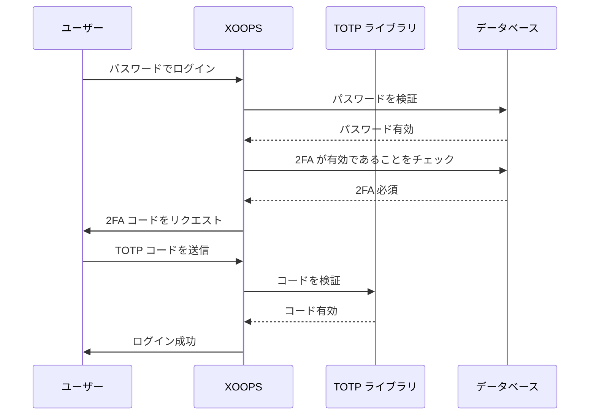

## ステータス

提案中

## コンテクスト

XOOPS はユーザー認証のセキュリティを強化する必要があります。二要素認証 (2FA) はパスワード以外の追加のセキュリティ レイヤーを提供し、パスワードが侵害されても アカウントを保護します。

主な検討事項:
- 既存認証との後方互換性
- 複数の2FA方式のサポート
- セットアップとログイン時のユーザー体験
- 紛失デバイスの回復メカニズム
- 既存のパーミッション システムとの統合

## 決定

バックアップコードのサポートを備えた主要な2FA方式として TOTP (Time-based One-Time Password) を実装します。

### 実装アプローチ



### データベース スキーマ

```sql
CREATE TABLE `{PREFIX}_users_2fa` (
    `user_id` INT(11) NOT NULL,
    `secret` VARCHAR(32) NOT NULL,
    `enabled` TINYINT(1) DEFAULT 0,
    `backup_codes` TEXT,
    `last_used` INT(11),
    `created` INT(11) NOT NULL,
    PRIMARY KEY (`user_id`),
    FOREIGN KEY (`user_id`) REFERENCES `{PREFIX}_users`(`uid`)
);
```

### サービス インターフェース

```php
interface TwoFactorAuthInterface
{
    public function enable(int $userId): TwoFactorSetup;
    public function disable(int $userId): void;
    public function verify(int $userId, string $code): bool;
    public function generateBackupCodes(int $userId): array;
    public function isEnabled(int $userId): bool;
}
```

### ミドルウェア 統合

```php
class TwoFactorMiddleware implements MiddlewareInterface
{
    public function process(
        ServerRequestInterface $request,
        RequestHandlerInterface $handler
    ): ResponseInterface {
        $session = $request->getAttribute('session');

        if ($session->has('pending_2fa_user_id')) {
            // ユーザーが2FA を完了する必要があります
            if ($this->isVerificationRequest($request)) {
                return $handler->handle($request);
            }
            return new RedirectResponse('/2fa/verify');
        }

        return $handler->handle($request);
    }
}
```

## 結果

### ポジティブな影響

- アカウント セキュリティが大幅に向上
- 業界標準の TOTP 互換性 (Google Authenticator、Authy など)
- バックアップコードはアカウント ロックアウトを防止
- ユーザーごとのオプション - 採用を強制しない
- PSR-15ミドルウェアでクリーンな統合が可能

### ネガティブな影響

- 追加のログイン ステップはユーザー体験に影響
- ユーザーは認証アプリを管理する必要
- 紛失デバイスはリカバリー プロセスが必要
- 追加のデータベース ストレージとクエリ
- 暗号化ライブラリ依存が必要

### マイグレーション パス

1. 2FA データ用のデータベース テーブルを追加
2. ライブラリ依存を備えた TOTP サービスを実装
3. 認証チェーンにミドルウェアを追加
4. セットアップおよび検証 UI を作成
5. 特定のグループに対して2FA を必須にする管理者オプション

## 検討された代替案

### SMS ベースの OTP

却下理由:
- SIM スワップ脆弱性
- SMS ゲートウェイのコスト
- 電話番号確認の複雑さ
- プライバシー懸念

### ハードウェア セキュリティ キー (WebAuthn)

将来の ADR に延期:
- より複雑な実装
- 過去のブラウザ サポート制限
- ユーザーのコスト上昇
- 後で TOTP と並行して追加可能

### メール ベースの OTP

却下理由:
- メール アカウント侵害は目的を無効化
- 配信遅延が UX に影響
- スパム フィルター問題

## 参照

- [RFC 6238 - TOTP](https://tools.ietf.org/html/rfc6238)
- [Google Authenticator Key Format](https://github.com/google/google-authenticator/wiki/Key-Uri-Format)
- ../../02-Core-Concepts/Security/Security-Best-Practices - セキュリティ ガイドライン
- ../../02-Core-Concepts/Users-Permissions/Authentication - 認証システム ドキュメント
