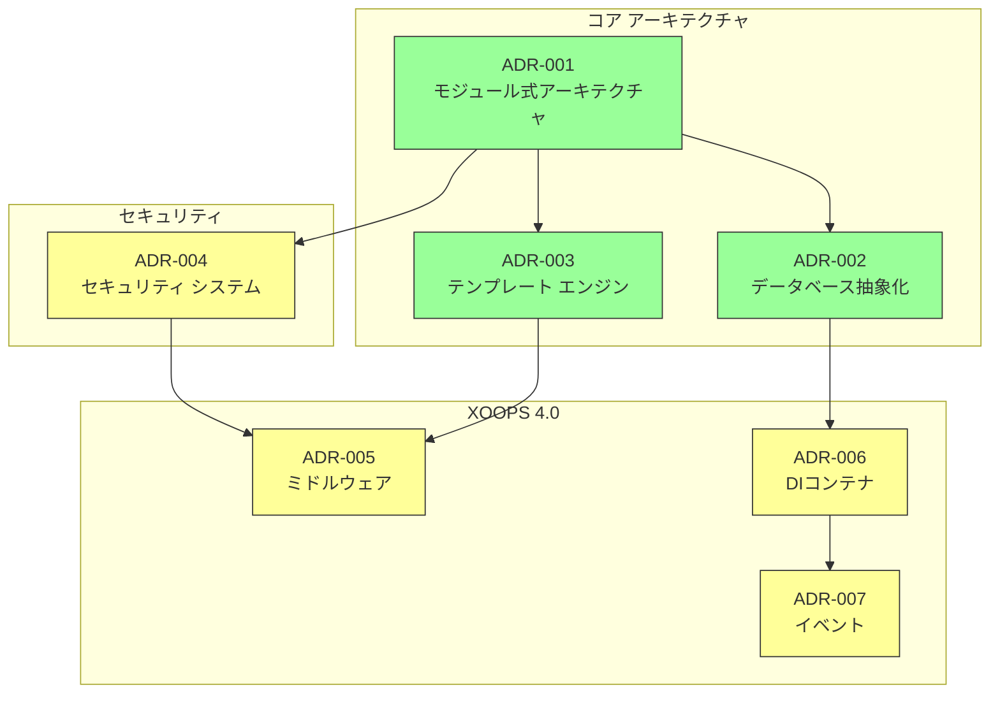
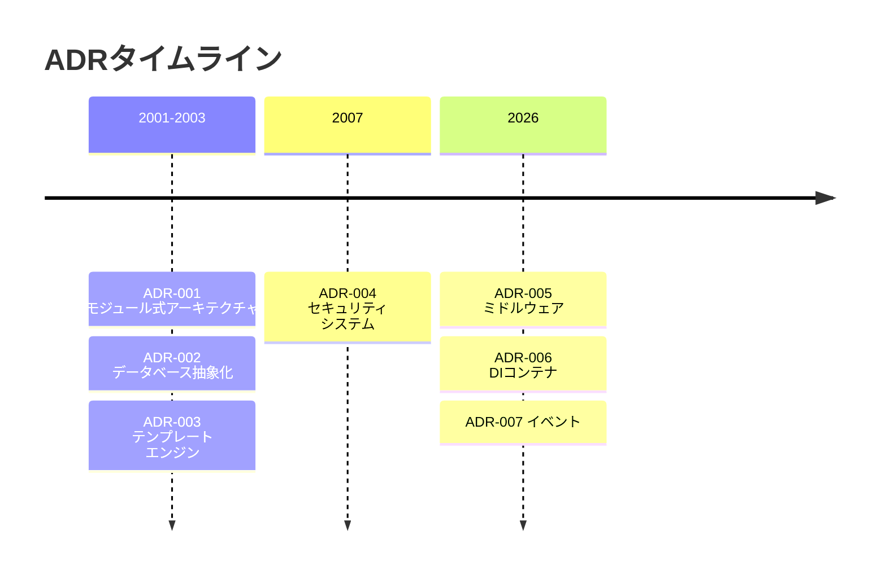

# 📋 アーキテクチャ決定記録インデックス

> XOOPSCMSを形成した建築の決定の包括的なインデックス

---

## ADRs とは

アーキテクチャ決定記録(ADRs)はXOOPS開発中に行われた重要なアーキテクチャの決定を記録します。各選択肢のコンテクスト、決定、および結果をキャプチャして、メンテナーと貢献者に価値のある履歴コンテクストを提供します

---

## ADR ステータス凡例

| ステータス | 意味 |
|--------|---------|
| **提案** | 議論中。まだ承認されていません |
| **承認** | 決定が採択されています |
| **廃止予定** | もう推奨されません |
| **後継** | 別のADRに置き換えられています |

---

## 現在のADRs

### 基礎的な決定

| ADR | タイトル | ステータス | 影響 |
|-----|-------|--------|--------|
| ADR-001 | モジュール式アーキテクチャ | 承認 | コア |
| ADR-002 | オブジェクト指向データベース アクセス | 承認 | コア |
| ADR-003 | Smartyテンプレート エンジン | 承認 | コア |

### 予定されているADRs (XOOPS 4.0)

| ADR | タイトル | ステータス | 影響 |
|-----|-------|--------|--------|
| ADR-004 | セキュリティ システム設計 | 提案 | セキュリティ |
| ADR-005 | PSR-15ミドルウェア | 提案 | アーキテクチャ |
| ADR-006 | 依存性注入コンテナ | 提案 | アーキテクチャ |
| ADR-007 | イベント システム再設計 | 提案 | アーキテクチャ |

---

## ADR関係



---

## タイムライン



---

## 新しいADRsを作成

新しいアーキテクチャの決定を提案する場合:

1. ADRテンプレートをコピー
2. すべてのセクションを記入
3. プルリクエストとして送信
4. GitHubの問題で議論
5. 決定後にステータスを更新

### ADRテンプレート構造

```markdown
# ADR-XXX: タイトル

## ステータス
提案 | 承認 | 廃止予定 | 後継

## コンテクスト
どのような問題がこの決定を動機付けているのか？

## 決定
提案される変更は何か？

## 結果
結果として何が簡単または難しくなるか？

## 代替案の検討
他にどのようなオプションが評価されたか？
```

---

## 🔗 関連ドキュメント

- コアコンセプト
- 貢献ガイドラインズ
- XOOPS 4.0ロードマップ

---

#xoops #adr #architecture #index #decisions
