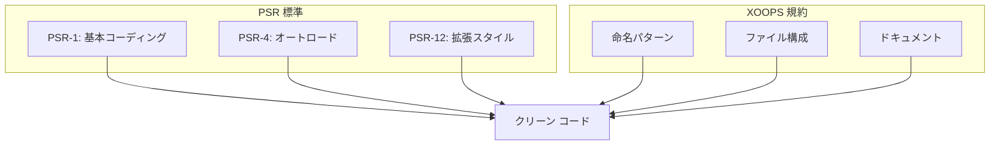

# PHP-標準

> XOOPS は PSR-1、PSR-4、PSR-12 コーディング標準と XOOPS 固有の規約に従います。

---

## 標準の概要



---

## ファイル構造

### PHP タグ

```php
<?php
// 常に完全な PHP タグを使用、短いタグは使用しない
// 純粋な PHP ファイルでは閉じタグ ?> を省略

declare(strict_types=1);

namespace XoopsModules\MyModule;

// コードはここに...
```

### ファイル ヘッダー

```php
<?php

declare(strict_types=1);

/**
 * XOOPS - PHP コンテンツ マネジメント システム
 *
 * @package    XoopsModules\MyModule
 * @subpackage Class
 * @author     Your Name <email@example.com>
 * @copyright  2026 XOOPS Project
 * @license    GPL-2.0-or-later
 * @link       https://xoops.org
 */

namespace XoopsModules\MyModule;

use XoopsObject;
use XoopsPersistableObjectHandler;
```

---

## 命名規則

### クラス

```php
// クラス名は PascalCase
class ItemHandler extends XoopsPersistableObjectHandler
{
    // ...
}

// インターフェースは "Interface" で終わる
interface RepositoryInterface
{
    public function find(int $id): ?object;
}

// トレイトは "Trait" で終わる
trait TimestampTrait
{
    public function getCreatedAt(): \DateTimeInterface
    {
        // ...
    }
}

// 抽象クラスは "Abstract" で始まる
abstract class AbstractEntity
{
    // ...
}
```

### メソッドと関数

```php
// メソッドは camelCase
public function getActiveItems(): array
{
    // ...
}

// アクション メソッドには動詞を使用
public function createItem(array $data): Item
public function updateItem(int $id, array $data): bool
public function deleteItem(int $id): bool
public function findById(int $id): ?Item
public function hasPermission(string $permission): bool
public function isActive(): bool
public function canEdit(): bool
```

### 変数とプロパティ

```php
class Item
{
    // プロパティは camelCase
    private int $itemId;
    private string $itemTitle;
    private bool $isPublished;
    private array $categoryIds;

    // 変数は camelCase
    public function process(): void
    {
        $itemCount = 0;
        $activeItems = [];
        $isValid = true;
    }
}
```

### 定数

```php
// 定数は UPPER_SNAKE_CASE
class Config
{
    public const DEFAULT_ITEMS_PER_PAGE = 10;
    public const MAX_UPLOAD_SIZE = 10485760;
    public const CACHE_LIFETIME = 3600;
}

// または define() 呼び出しで
define('XOOPS_ROOT_PATH', '/path/to/xoops');
define('MYMODULE_VERSION', '1.0.0');
```

---

## クラス構造

```php
<?php

declare(strict_types=1);

namespace XoopsModules\MyModule;

use XoopsDatabase;
use XoopsPersistableObjectHandler;

/**
 * Item オブジェクトのハンドラー
 *
 * @package XoopsModules\MyModule
 */
class ItemHandler extends XoopsPersistableObjectHandler
{
    // 1. 定数
    public const TABLE_NAME = 'mymodule_items';

    // 2. プロパティ (可視性の順序: public、protected、private)
    public int $defaultLimit = 10;

    protected string $table;

    private XoopsDatabase $db;

    // 3. コンストラクター
    public function __construct(?XoopsDatabase $db = null)
    {
        $this->db = $db ?? \XoopsDatabaseFactory::getDatabaseConnection();
        parent::__construct($this->db, self::TABLE_NAME, Item::class, 'id', 'title');
    }

    // 4. パブリック メソッド
    public function getPublishedItems(int $limit = 10): array
    {
        $criteria = new \CriteriaCompo();
        $criteria->add(new \Criteria('status', 'published'));
        $criteria->setLimit($limit);

        return $this->getObjects($criteria);
    }

    public function findBySlug(string $slug): ?Item
    {
        $criteria = new \Criteria('slug', $slug);
        $items = $this->getObjects($criteria);

        return $items[0] ?? null;
    }

    // 5. プロテクト メソッド
    protected function validateItem(Item $item): bool
    {
        // バリデーション ロジック
        return true;
    }

    // 6. プライベート メソッド
    private function sanitizeInput(string $input): string
    {
        return htmlspecialchars($input, ENT_QUOTES, 'UTF-8');
    }
}
```

---

## フォーマット ルール

### インデントとスペーシング

```php
// インデントには 4 スペースを使用 (タブではない)
class Example
{
    public function method(): void
    {
        if ($condition) {
            // 4 スペース
            foreach ($items as $item) {
                // 8 スペース
                $this->process($item);
            }
        }
    }
}

// メソッド間に 1 行の空行
public function methodOne(): void
{
    // ...
}

public function methodTwo(): void
{
    // ...
}

// 末尾の空白なし
// ファイルは 1 行の改行で終わる
```

### 行の長さ

```php
// 1 行の最大 120 文字
// 長い行は論理的に分割

// 長いメソッド呼び出し
$result = $this->someHandler->processComplexOperation(
    $parameter1,
    $parameter2,
    $parameter3,
    $parameter4
);

// 長い配列
$config = [
    'option1' => 'value1',
    'option2' => 'value2',
    'option3' => 'value3',
];

// 長い条件
if ($condition1
    && $condition2
    && $condition3
) {
    // ...
}
```

### 制御構造

```php
// if/elseif/else
if ($condition) {
    // code
} elseif ($otherCondition) {
    // code
} else {
    // code
}

// switch
switch ($value) {
    case 1:
        doSomething();
        break;

    case 2:
        doSomethingElse();
        break;

    default:
        doDefault();
        break;
}

// try/catch
try {
    $result = $this->riskyOperation();
} catch (SpecificException $e) {
    $this->handleSpecific($e);
} catch (\Exception $e) {
    $this->handleGeneral($e);
} finally {
    $this->cleanup();
}

// foreach
foreach ($items as $key => $value) {
    // code
}

// for
for ($i = 0; $i < $count; $i++) {
    // code
}
```

---

## 型宣言

```php
<?php

declare(strict_types=1);

class TypeExample
{
    // プロパティ型 (PHP 7.4+)
    private int $id;
    private string $title;
    private ?string $description = null;
    private array $tags = [];
    private bool $isActive = false;

    // 型付きパラメータのコンストラクター
    public function __construct(
        int $id,
        string $title,
        ?string $description = null
    ) {
        $this->id = $id;
        $this->title = $title;
        $this->description = $description;
    }

    // 戻り値の型宣言
    public function getId(): int
    {
        return $this->id;
    }

    public function getTitle(): string
    {
        return $this->title;
    }

    // Nullable 戻り値型
    public function getDescription(): ?string
    {
        return $this->description;
    }

    // Union 型 (PHP 8.0+)
    public function getValue(): int|string
    {
        return $this->value;
    }

    // Void 戻り値型
    public function setTitle(string $title): void
    {
        $this->title = $title;
    }

    // ドックブロックで内容を指定した配列戻り値
    /**
     * @return Item[]
     */
    public function getItems(): array
    {
        return $this->items;
    }
}
```

---

## ドキュメント

### クラス DocBlock

```php
/**
 * Article エンティティの CRUD 操作を処理
 *
 * このハンドラーはデータベースでの記事の作成、読み込み、
 * 更新、削除メソッドを提供します。
 *
 * @package    XoopsModules\Publisher
 * @subpackage Handler
 * @author     XOOPS Development Team
 * @since      1.0.0
 */
class ArticleHandler extends XoopsPersistableObjectHandler
{
```

### メソッド DocBlock

```php
/**
 * カテゴリ別に記事を取得
 *
 * 特定のカテゴリに属する公開記事を取得し、
 * 作成日時で降順に並べ替えます。
 *
 * @param int  $categoryId カテゴリ識別子
 * @param int  $limit      返す記事の最大数
 * @param int  $offset     ページネーションの開始オフセット
 * @param bool $published  公開済み記事のみ返す
 *
 * @return Article[] Article オブジェクトの配列
 *
 * @throws \InvalidArgumentException カテゴリ ID が無効な場合
 *
 * @since 1.0.0
 */
public function getByCategory(
    int $categoryId,
    int $limit = 10,
    int $offset = 0,
    bool $published = true
): array {
```

---

## ツール構成

### PHP CS Fixer

```php
// .php-cs-fixer.php
<?php

$finder = PhpCsFixer\Finder::create()
    ->in(__DIR__ . '/class')
    ->in(__DIR__ . '/src');

return (new PhpCsFixer\Config())
    ->setRules([
        '@PSR12' => true,
        'array_syntax' => ['syntax' => 'short'],
        'ordered_imports' => ['sort_algorithm' => 'alpha'],
        'no_unused_imports' => true,
        'declare_strict_types' => true,
    ])
    ->setFinder($finder);
```

### PHPStan

```yaml
# phpstan.neon
parameters:
    level: 6
    paths:
        - class/
        - src/
    ignoreErrors:
        - '#Call to an undefined method XoopsObject::#'
```

---

## 関連ドキュメント

- JavaScript 標準
- コード構成
- プルリクエスト ガイドライン

---

#xoops #php #coding-standards #psr #best-practices
