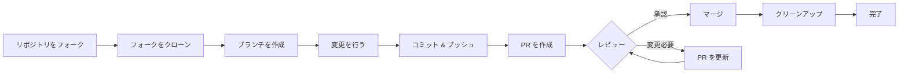

> このガイドは初期セットアップからマージされたプルリクエストまで、XOOPS への貢献のプロセス全体を説明します。

---

## 前提条件

貢献を始める前に、以下があることを確認:

- **Git** がインストールと設定されている
- **GitHub アカウント** (無料)
- **PHP 7.4+** XOOPS 開発用
- **Composer** 依存関係管理用
- Git ワークフローの基本的な知識
- 行動規範の熟知

---

## ステップ 1: リポジトリをフォーク

### GitHub ウェブ インターフェイスで

1. リポジトリに移動 (例: `XOOPS/XoopsCore27`)
2. 右上の **Fork** ボタンをクリック
3. フォーク先を選択 (個人アカウント)
4. フォークの完了を待つ

### フォークする理由

- 独自のコピーを取得
- メンテナーは多くのブランチを管理する必要がない
- フォークを完全に制御
- プルリクエストはフォークと公式リポジトリを参照

---

## ステップ 2: フォークをローカルにクローン

```bash
# フォークをクローン (YOUR_USERNAME を置き換え)
git clone https://github.com/YOUR_USERNAME/XoopsCore27.git
cd XoopsCore27

# アップストリーム リモートを追加して元のリポジトリを追跡
git remote add upstream https://github.com/XOOPS/XoopsCore27.git

# リモートが正しく設定されていることを確認
git remote -v
# origin    https://github.com/YOUR_USERNAME/XoopsCore27.git (fetch)
# origin    https://github.com/YOUR_USERNAME/XoopsCore27.git (push)
# upstream  https://github.com/XOOPS/XoopsCore27.git (fetch)
# upstream  https://github.com/XOOPS/XoopsCore27.git (nofetch)
```

---

## ステップ 3: 開発環境をセットアップ

### 依存関係をインストール

```bash
# Composer 依存関係をインストール
composer install

# 開発依存関係をインストール
composer install --dev

# モジュール開発用
cd modules/mymodule
composer install
```

### Git を設定

```bash
# Git アイデンティティを設定
git config user.name "Your Name"
git config user.email "your.email@example.com"

# オプション: グローバル Git 設定を設定
git config --global user.name "Your Name"
git config --global user.email "your.email@example.com"
```

### テストを実行

```bash
# クリーンな状態でテストがパスすることを確認
./vendor/bin/phpunit

# 特定のテスト スイートを実行
./vendor/bin/phpunit --testsuite unit
```

---

## ステップ 4: フィーチャー ブランチを作成

### ブランチ命名規則

パターン `<type>/<description>` に従う

**タイプ:**
- `feature/` - 新機能
- `fix/` - バグ修正
- `docs/` - ドキュメント のみ
- `refactor/` - コード リファクタリング
- `test/` - テスト追加
- `chore/` - メンテナンス、ツーリング

**例:**
```bash
# フィーチャー ブランチ
git checkout -b feature/add-two-factor-auth

# バグ修正 ブランチ
git checkout -b fix/prevent-xss-in-forms

# ドキュメント ブランチ
git checkout -b docs/update-api-guide

# 常に upstream/main からブランチ
git checkout -b feature/my-feature upstream/main
```

### ブランチを最新に保つ

```bash
# 作業を始める前に、アップストリームと同期
git fetch upstream
git merge upstream/main

# 後で、アップストリームが変更した場合
git fetch upstream
git rebase upstream/main
```

---

## ステップ 5: 変更を行う

### 開発慣行

1. **コードを作成** PHP 標準に従う
2. **テストを作成** 新機能用
3. **ドキュメントを更新** 必要な場合
4. **リンターを実行** とコード フォーマッター

### コード品質チェック

```bash
# すべてのテストを実行
./vendor/bin/phpunit

# カバレッジで実行
./vendor/bin/phpunit --coverage-html coverage/

# PHP CS Fixer を実行
./vendor/bin/php-cs-fixer fix --dry-run

# PHPStan 静的分析を実行
./vendor/bin/phpstan analyse class/ src/
```

### 良い変更をコミット

```bash
# 何を変更したかをチェック
git status
git diff

# 特定のファイルをステージ
git add class/MyClass.php
git add tests/MyClassTest.php

# または すべての変更をステージ
git add .

# 説明的なメッセージでコミット
git commit -m "feat(auth): add two-factor authentication support"
```

---

## ステップ 6: ブランチを同期に保つ

作業中、メイン ブランチが進む可能性があります:

```bash
# アップストリームから最新変更を取得
git fetch upstream

# オプション A: リベース (クリーン履歴に優先)
git rebase upstream/main

# オプション B: マージ (より簡単だがマージ コミットを追加)
git merge upstream/main

# 紛争が発生した場合、解決してから:
git add .
git rebase --continue  # または git merge --continue
```

---

## ステップ 7: フォークにプッシュ

```bash
# ブランチをフォークにプッシュ
git push origin feature/my-feature

# その後のプッシュで
git push

# リベースした場合、強制プッシュが必要 (注意!)
git push --force-with-lease origin feature/my-feature
```

---

## ステップ 8: プルリクエストを作成

### GitHub ウェブ インターフェイスで

1. GitHub 上のフォークに進む
2. ブランチから PR を作成する通知が表示される
3. **"Compare & pull request"** をクリック
4. またはマニュアルで **"New pull request"** をクリックしブランチを選択

### PR タイトルと説明

**タイトル フォーマット:**
```
<type>(<scope>): <subject>
```

**例:**
```
feat(auth): add two-factor authentication
fix(forms): prevent XSS in text input
docs: update installation guide
refactor(core): improve performance
```

**説明テンプレート:**

```markdown
## 説明
この PR が何をするかの簡潔な説明。

## 変更
- X を A から B に変更
- 機能 Y を追加
- バグ Z を修正

## 変更タイプ
- [ ] 新機能 (新機能を追加)
- [ ] バグ修正 (問題を修正)
- [ ] 破壊的な変更 (API/動作変更)
- [ ] ドキュメント更新

## テスト
- [ ] 新機能にテストを追加
- [ ] すべての既存テストがパス
- [ ] マニュアル テストを実行

## スクリーンショット (該当する場合)
UI 変更のビフォア/アフター スクリーンショットを含める。

## 関連する問題
Closes #123
関連: #456

## チェックリスト
- [ ] コードはスタイル ガイドラインに従う
- [ ] 独自のコードをレビュー
- [ ] 複雑なコードをコメント
- [ ] ドキュメントを更新
- [ ] 新しい警告は生成されない
- [ ] テストがローカルでパス
```

---

## ステップ 9: フィードバックに対応

### コード レビュー中

1. **コメントを注意深く読む** - フィードバックを理解
2. **質問する** - 不明確な場合、質問
3. **代替案を議論** - 尊重を持って方法を議論
4. **リクエストされた変更を行う** - ブランチを更新
5. **更新されたコミットを強制プッシュ** - 履歴を書き直す場合

```bash
# 変更を行う
git add .
git commit --amend  # 最後のコミットを変更
git push --force-with-lease origin feature/my-feature

# または新しいコミットを追加
git commit -m "Address feedback on PR review"
git push origin feature/my-feature
```

### 反復を期待

- ほとんどの PR は複数のレビュー ラウンドが必要
- 患者であり建設的である
- フィードバックを学習機会として表示
- メンテナーはリファクターを提案可能

---

## ステップ 10: マージとクリーンアップ

### 承認後

メンテナーが承認およびマージしたら:

1. **GitHub は自動的にマージ** または メンテナーがクリック
2. **ブランチが削除される** (通常は自動)
3. **変更は upstream にある**

### ローカル クリーンアップ

```bash
# メイン ブランチに切り替え
git checkout main

# マージされた変更でメインを更新
git fetch upstream
git merge upstream/main

# ローカル フィーチャー ブランチを削除
git branch -d feature/my-feature

# フォークから削除 (自動削除されていない場合)
git push origin --delete feature/my-feature
```

---

## ワークフロー ダイアグラム



---

## 共通シナリオ

### 開始前に同期

```bash
# 常に新鮮に開始
git fetch upstream
git checkout -b feature/new-thing upstream/main
```

### さらにコミットを追加

```bash
# もう一度プッシュするだけ
git add .
git commit -m "feat: additional changes"
git push origin feature/new-thing
```

### 誤りを修正

```bash
# 最後のコミットが間違ったメッセージ
git commit --amend -m "正しいメッセージ"
git push --force-with-lease

# 前の状態に戻す (注意!)
git reset --soft HEAD~1  # 変更を保持
git reset --hard HEAD~1  # 変更を破棄
```

---

## ベストプラクティス

### すべき こと

- ブランチを単一の問題に焦点を当てる
- 小さく、論理的なコミットを行う
- 説明的なコミット メッセージを書く
- ブランチを頻繁に更新
- プッシュ前にテスト
- 変更をドキュメント化
- フィードバックに反応的であること

### しないこと

- main/master ブランチで直接作業
- 無関連な変更を 1 つの PR で混在
- 生成されたファイルまたは node_modules をコミット
- PR がパブリック後に強制プッシュ (--force-with-lease を使用)
- コード レビュー フィードバックを無視
- 巨大な PR を作成 (より小さなものに分割)
- 機密データをコミット (API キー、パスワード)

---

## 成功のためのヒント

### コミュニケーション

- 作業を開始する前に問題で質問
- 複雑な変更についてガイダンスを求める
- PR 説明でアプローチを議論
- フィードバックに迅速に対応

### 標準に従う

- PHP 標準を確認
- 問題レポート ガイドラインを確認
- 貢献概要を読む
- プルリクエスト ガイドラインに従う

---

## 関連ドキュメント

- 行動規範
- プルリクエスト ガイドライン
- 問題レポート
- PHP コーディング標準
- 貢献概要

---

#xoops #git #github #contributing #workflow #pull-request
