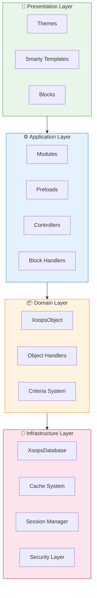
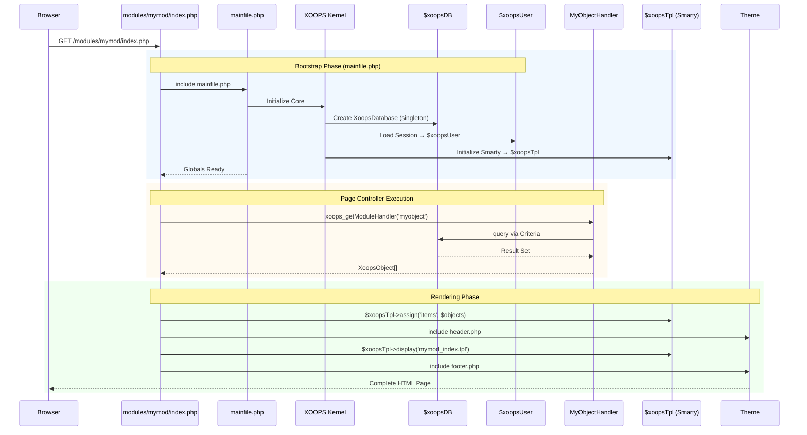

:::note[このドキュメントについて]
このページは、現在（2.5.x）および将来（4.0.x）のバージョンの両方に適用される**XOOPSの概念的アーキテクチャ**について説明しています。いくつかの図は階層設計のビジョンを示しています。

**バージョン固有の詳細について:**
- **XOOPS 2.5.x 現在:** `mainfile.php`、グローバル（`$xoopsDB`、`$xoopsUser`）、プリロード、ハンドラパターンを使用
- **XOOPS 4.0 目標:** PSR-15ミドルウェア、DIコンテナ、ルーター - [ロードマップ](../../07-XOOPS-4.0/XOOPS-4.0-Roadmap.md)を参照
:::

このドキュメントはXOOPSシステムアーキテクチャの包括的な概要を提供し、さまざまなコンポーネントがどのように連携して柔軟で拡張可能なコンテンツ管理システムを作成するかを説明しています。

## 概要

XOOPSはモジュラーアーキテクチャに従い、懸念事項を異なるレイヤーに分離します。システムはいくつかのコア原則を中心に構築されています:

- **モジュール性**: 機能は独立した、インストール可能なモジュールに編成されています
- **拡張性**: コアコードを変更せずにシステムを拡張できます
- **抽象化**: データベースとプレゼンテーションレイヤーはビジネスロジックから抽象化されています
- **セキュリティ**: 一般的な脆弱性から保護する組み込みセキュリティメカニズム

## システムレイヤー



### 1. プレゼンテーションレイヤー

プレゼンテーションレイヤーはSmartyテンプレートエンジンを使用したユーザーインターフェイスレンダリングを処理します。

**主要コンポーネント:**
- **Themes**: ビジュアルスタイルとレイアウト
- **Smarty Templates**: 動的なコンテンツレンダリング
- **Blocks**: 再利用可能なコンテンツウィジェット

### 2. アプリケーションレイヤー

アプリケーションレイヤーは、ビジネスロジック、コントローラー、モジュール機能を含みます。

**主要コンポーネント:**
- **Modules**: 自己完結した機能パッケージ
- **Handlers**: データ操作クラス
- **Preloads**: イベントリスナーとフック

### 3. ドメインレイヤー

ドメインレイヤーはコアビジネスオブジェクトと規則を含みます。

**主要コンポーネント:**
- **XoopsObject**: すべてのドメインオブジェクトの基本クラス
- **Handlers**: ドメインオブジェクトのCRUD操作

### 4. インフラストラクチャレイヤー

インフラストラクチャレイヤーはデータベースアクセスやキャッシングなどのコアサービスを提供します。

## リクエストライフサイクル

リクエストライフサイクルを理解することは、XOOPS開発を効果的に行うために重要です。

### XOOPS 2.5.x ページコントローラーフロー

現在のXOOPS 2.5.xは**ページコントローラー**パターンを使用します。このパターンでは、各PHPファイルが自身のリクエストを処理します。グローバル（`$xoopsDB`、`$xoopsUser`、`$xoopsTpl`など）はブートストラップ中に初期化され、実行全体で利用可能です。



### 2.5.x のキーグローバル変数

| グローバル | 型 | 初期化 | 目的 |
|--------|------|-------------|---------|
| `$xoopsDB` | `XoopsDatabase` | ブートストラップ | データベース接続（シングルトン） |
| `$xoopsUser` | `XoopsUser\|null` | セッション読み込み | 現在ログインしているユーザー |
| `$xoopsTpl` | `XoopsTpl` | テンプレート初期化 | Smartyテンプレートエンジン |
| `$xoopsModule` | `XoopsModule` | モジュール読み込み | 現在のモジュールコンテキスト |
| `$xoopsConfig` | `array` | 設定読み込み | システム設定 |

:::note[XOOPS 4.0 比較]
XOOPS 4.0では、ページコントローラーパターンは**PSR-15ミドルウェアパイプライン**とルーターベースのディスパッチに置き換えられます。グローバルは依存性注入で置き換えられます。移行時の互換性保証については、[ハイブリッドモード契約](../../07-XOOPS-4.0/Specifications/Hybrid-Mode-Contract.md)を参照してください。
:::

### 1. ブートストラップフェーズ

```php
// mainfile.phpはエントリーポイントです
include_once XOOPS_ROOT_PATH . '/mainfile.php';

// コア初期化
$xoops = Xoops::getInstance();
$xoops->boot();
```

**ステップ:**
1. 設定を読み込む（`mainfile.php`）
2. オートローダーを初期化
3. エラーハンドリングを設定
4. データベース接続を確立
5. ユーザーセッションを読み込む
6. Smartyテンプレートエンジンを初期化

### 2. ルーティングフェーズ

```php
// 適切なモジュールへのリクエストルーティング
$module = $GLOBALS['xoopsModule'];
$controller = $module->getController();
$controller->dispatch($request);
```

**ステップ:**
1. リクエストURLを解析
2. ターゲットモジュールを特定
3. モジュール設定を読み込む
4. パーミッションをチェック
5. 適切なハンドラーにルート

### 3. 実行フェーズ

```php
// コントローラー実行
$data = $handler->getObjects($criteria);
$xoopsTpl->assign('items', $data);
```

**ステップ:**
1. コントローラーロジックを実行
2. データレイヤーと相互作用
3. ビジネスルールを処理
4. ビューデータを準備

### 4. レンダリングフェーズ

```php
// テンプレートレンダリング
include XOOPS_ROOT_PATH . '/header.php';
$xoopsTpl->display('db:module_template.tpl');
include XOOPS_ROOT_PATH . '/footer.php';
```

**ステップ:**
1. テーマレイアウトを適用
2. モジュールテンプレートをレンダリング
3. ブロックを処理
4. レスポンスを出力

## コアコンポーネント

### XoopsObject

XOOPSのすべてのデータオブジェクトの基本クラスです。

```php
<?php
class MyModuleItem extends XoopsObject
{
    public function __construct()
    {
        $this->initVar('id', XOBJ_DTYPE_INT, null, false);
        $this->initVar('title', XOBJ_DTYPE_TXTBOX, '', true, 255);
        $this->initVar('content', XOBJ_DTYPE_TXTAREA, '', false);
        $this->initVar('created', XOBJ_DTYPE_INT, time(), false);
    }
}
```

**主要メソッド:**
- `initVar()` - オブジェクトプロパティを定義
- `getVar()` - プロパティ値を取得
- `setVar()` - プロパティ値を設定
- `assignVars()` - 配列から一括割り当て

### XoopsPersistableObjectHandler

XoopsObjectインスタンスのCRUD操作を処理します。

```php
<?php
class MyModuleItemHandler extends XoopsPersistableObjectHandler
{
    public function __construct(\XoopsDatabase $db)
    {
        parent::__construct($db, 'mymodule_items', 'MyModuleItem', 'id', 'title');
    }

    public function getActiveItems($limit = 10)
    {
        $criteria = new CriteriaCompo();
        $criteria->add(new Criteria('status', 1));
        $criteria->setSort('created');
        $criteria->setOrder('DESC');
        $criteria->setLimit($limit);

        return $this->getObjects($criteria);
    }
}
```

**主要メソッド:**
- `create()` - 新しいオブジェクトインスタンスを作成
- `get()` - IDでオブジェクトを取得
- `insert()` - オブジェクトをデータベースに保存
- `delete()` - データベースからオブジェクトを削除
- `getObjects()` - 複数のオブジェクトを取得
- `getCount()` - マッチするオブジェクトの数をカウント

### モジュール構造

すべてのXOOPSモジュールは標準的なディレクトリ構造に従います:

```
modules/mymodule/
├── class/                  # PHPクラス
│   ├── MyModuleItem.php
│   └── MyModuleItemHandler.php
├── include/                # インクルードファイル
│   ├── common.php
│   └── functions.php
├── templates/              # Smartyテンプレート
│   ├── mymodule_index.tpl
│   └── mymodule_item.tpl
├── admin/                  # 管理者エリア
│   ├── index.php
│   └── menu.php
├── language/               # 翻訳
│   └── english/
│       ├── main.php
│       └── modinfo.php
├── sql/                    # データベーススキーマ
│   └── mysql.sql
├── xoops_version.php       # モジュール情報
├── index.php               # モジュールエントリー
└── header.php              # モジュールヘッダー
```

## 依存性注入コンテナ

最新のXOOPS開発では、より良いテスト性のために依存性注入を活用できます。

### 基本的なコンテナ実装

```php
<?php
class XoopsDependencyContainer
{
    private array $services = [];

    public function register(string $name, callable $factory): void
    {
        $this->services[$name] = $factory;
    }

    public function resolve(string $name): mixed
    {
        if (!isset($this->services[$name])) {
            throw new \InvalidArgumentException("Service not found: $name");
        }

        $factory = $this->services[$name];

        if (is_callable($factory)) {
            return $factory($this);
        }

        return $factory;
    }

    public function has(string $name): bool
    {
        return isset($this->services[$name]);
    }
}
```

### PSR-11 互換コンテナ

```php
<?php
namespace Xmf\Di;

use Psr\Container\ContainerInterface;

class BasicContainer implements ContainerInterface
{
    protected array $definitions = [];

    public function set(string $id, mixed $value): void
    {
        $this->definitions[$id] = $value;
    }

    public function get(string $id): mixed
    {
        if (!$this->has($id)) {
            throw new \InvalidArgumentException("Service not found: $id");
        }

        $entry = $this->definitions[$id];

        if (is_callable($entry)) {
            return $entry($this);
        }

        return $entry;
    }

    public function has(string $id): bool
    {
        return isset($this->definitions[$id]);
    }
}
```

### 使用例

```php
<?php
// サービス登録
$container = new XoopsDependencyContainer();

$container->register('database', function () {
    return XoopsDatabaseFactory::getDatabaseConnection();
});

$container->register('userHandler', function ($c) {
    return new XoopsUserHandler($c->resolve('database'));
});

// サービス解決
$userHandler = $container->resolve('userHandler');
$user = $userHandler->get($userId);
```

## 拡張ポイント

XOOPSは複数の拡張メカニズムを提供しています:

### 1. プリロード

プリロードはモジュールがコアイベントをフックすることを許可します。

```php
<?php
// modules/mymodule/preloads/core.php
class MymoduleCorePreload extends XoopsPreloadItem
{
    public static function eventCoreHeaderEnd($args)
    {
        // ヘッダー処理が終了したときに実行
    }

    public static function eventCoreFooterStart($args)
    {
        // フッター処理が開始したときに実行
    }
}
```

### 2. プラグイン

プラグインはモジュール内の特定の機能を拡張します。

```php
<?php
// modules/mymodule/plugins/notify.php
class MymoduleNotifyPlugin
{
    public function onItemCreate($item)
    {
        // アイテムが作成されたときに通知を送信
    }
}
```

### 3. フィルター

フィルターはシステムを通過するデータを変更します。

```php
<?php
// コンテンツフィルターの例
$myts = MyTextSanitizer::getInstance();
$content = $myts->displayTarea($rawContent, 1, 1, 1);
```

## ベストプラクティス

### コード編成

1. **新しいコードにはネームスペースを使用:**
   ```php
   namespace XoopsModules\MyModule;

   class Item extends \XoopsObject
   {
       // 実装
   }
   ```

2. **PSR-4オートローディングに従う:**
   ```json
   {
       "autoload": {
           "psr-4": {
               "XoopsModules\\MyModule\\": "class/"
           }
       }
   }
   ```

3. **関心事を分離:**
   - `class/`内のドメインロジック
   - `templates/`内のプレゼンテーション
   - モジュールルート内のコントローラー

### パフォーマンス

1. **高コストな操作にはキャッシングを使用**
2. **可能な限りリソースを遅延読み込み**
3. **クライテリアバッチ処理を使用してデータベースクエリを最小化**
4. **複雑なロジックを避けてテンプレートを最適化**

### セキュリティ

1. **`Xmf\Request`を使用してすべての入力を検証**
2. **テンプレートで出力をエスケープ**
3. **データベースクエリにプリペアドステートメントを使用**
4. **機密操作の前にパーミッションをチェック**

## 関連ドキュメント

- [Design-Patterns](Design-Patterns.md) - XOOPSで使用される設計パターン
- [Database Layer](../Database/Database-Layer.md) - データベース抽象化の詳細
- [Smarty Basics](../Templates/Smarty-Basics.md) - テンプレートシステムドキュメント
- [Security Best Practices](../Security/Security-Best-Practices.md) - セキュリティガイドライン

---

#xoops #architecture #core #design #system-design
