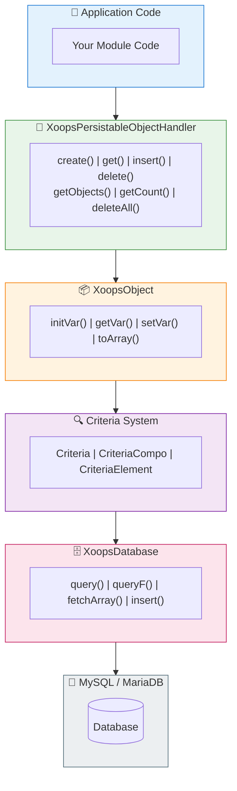

# 🗄️ データベースレイヤー

<span class="version-badge version-25x">2.5.x ✅</span> <span class="version-badge version-40x">4.0.x ✅</span>

> XOOPSデータベース抽象化、オブジェクト永続化、クエリ構築の理解。

:::tip[将来プルーフなデータアクセス]
ハンドラー/Criteriaパターンは両方のバージョンで動作します。XOOPS 4.0に向けて準備するため、ハンドラーを[Repositoryクラス](../../03-Module-Development/Patterns/Repository-Pattern.md)でラップすることを検討してください。テスト性を向上させます。[データアクセスパターン選択](../../03-Module-Development/Choosing-Data-Access-Pattern.md)を参照してください。
:::

---

## 概要

XOOPSデータベースレイヤーはMySQL/MariaDB上に堅牢な抽象化を提供します。機能は以下の通りです:

- **Factory Pattern** - 集中的なデータベース接続管理
- **Object-Relational Mapping** - XoopsObjectとハンドラー
- **Query Building** - 複雑なクエリ用のCriteriaシステム
- **Connection Reuse** - シングルトンファクトリーを経由した単一接続（プーリングなし）

---

## 🏗️ アーキテクチャ



---

## 🔌 データベース接続

### 接続を取得

```php
// 推奨: グローバルデータベースインスタンスを使用
$db = \XoopsDatabaseFactory::getDatabaseConnection();

// レガシー: グローバル変数（まだ動作）
global $xoopsDB;
```

### XoopsDatabaseFactory

ファクトリーパターンにより、単一のデータベース接続が再利用されます:

```php
<?php

class XoopsDatabaseFactory
{
    private static ?XoopsDatabase $instance = null;

    public static function getDatabaseConnection(): XoopsDatabase
    {
        if (self::$instance === null) {
            self::$instance = new XoopsMySQLDatabase();
        }
        return self::$instance;
    }
}
```

---

## 📦 XoopsObject

XOOPSのすべてのデータオブジェクトの基本クラスです。

### オブジェクトを定義

```php
<?php

namespace XoopsModules\MyModule;

class Article extends \XoopsObject
{
    public function __construct()
    {
        $this->initVar('article_id', \XOBJ_DTYPE_INT, null, false);
        $this->initVar('category_id', \XOBJ_DTYPE_INT, 0, true);
        $this->initVar('title', \XOBJ_DTYPE_TXTBOX, '', true, 255);
        $this->initVar('content', \XOBJ_DTYPE_TXTAREA, '', false);
        $this->initVar('author_id', \XOBJ_DTYPE_INT, 0, true);
        $this->initVar('status', \XOBJ_DTYPE_TXTBOX, 'draft', true, 20);
        $this->initVar('views', \XOBJ_DTYPE_INT, 0, false);
        $this->initVar('created', \XOBJ_DTYPE_INT, time(), false);
        $this->initVar('updated', \XOBJ_DTYPE_INT, 0, false);
    }
}
```

### データ型

| 定数 | 型 | 説明 |
|----------|------|-------------|
| `XOBJ_DTYPE_INT` | 整数 | 数値 |
| `XOBJ_DTYPE_TXTBOX` | 文字列 | 短いテキスト（255文字未満） |
| `XOBJ_DTYPE_TXTAREA` | テキスト | 長いテキストコンテンツ |
| `XOBJ_DTYPE_EMAIL` | メール | メールアドレス |
| `XOBJ_DTYPE_URL` | URL | ウェブアドレス |
| `XOBJ_DTYPE_FLOAT` | フロート | 小数 |
| `XOBJ_DTYPE_ARRAY` | 配列 | シリアル化された配列 |
| `XOBJ_DTYPE_OTHER` | その他 | 生データ |

### オブジェクトを操作

```php
// 新しいオブジェクトを作成
$article = new Article();

// 値を設定
$article->setVar('title', 'My Article');
$article->setVar('content', 'Article content here...');
$article->setVar('category_id', 5);
$article->setVar('author_id', $xoopsUser->getVar('uid'));

// 値を取得
$title = $article->getVar('title');           // 生値
$titleDisplay = $article->getVar('title', 'e'); // 編集用（HTMLエンティティ）
$titleShow = $article->getVar('title', 's');    // 表示用（サニタイズ）

// 配列から一括割り当て
$article->assignVars([
    'title' => 'New Title',
    'status' => 'published'
]);

// 配列に変換
$data = $article->toArray();
```

---

## 🔧 オブジェクトハンドラー

### XoopsPersistableObjectHandler

ハンドラークラスはXoopsObjectインスタンスのCRUD操作を管理します。

```php
<?php

namespace XoopsModules\MyModule;

class ArticleHandler extends \XoopsPersistableObjectHandler
{
    public function __construct(\XoopsDatabase $db = null)
    {
        parent::__construct(
            $db,
            'mymodule_articles',  // テーブル名
            Article::class,       // オブジェクトクラス
            'article_id',         // 主キー
            'title'               // 識別子フィールド
        );
    }
}
```

### ハンドラーメソッド

```php
// ハンドラーインスタンスを取得
$articleHandler = xoops_getModuleHandler('article', 'mymodule');

// 新しいオブジェクトを作成
$article = $articleHandler->create();

// IDで取得
$article = $articleHandler->get(123);

// 挿入（作成または更新）
$success = $articleHandler->insert($article);

// 削除
$success = $articleHandler->delete($article);

// 複数のオブジェクトを取得
$articles = $articleHandler->getObjects($criteria);

// カウントを取得
$count = $articleHandler->getCount($criteria);

// 配列として取得（キー => 値）
$list = $articleHandler->getList($criteria);

// 複数削除
$deleted = $articleHandler->deleteAll($criteria);
```

### カスタムハンドラーメソッド

```php
<?php

namespace XoopsModules\MyModule;

class ArticleHandler extends \XoopsPersistableObjectHandler
{
    // ... コンストラクタ

    /**
     * 公開記事を取得
     */
    public function getPublished(int $limit = 10, int $start = 0): array
    {
        $criteria = new \CriteriaCompo();
        $criteria->add(new \Criteria('status', 'published'));
        $criteria->setSort('created');
        $criteria->setOrder('DESC');
        $criteria->setLimit($limit);
        $criteria->setStart($start);

        return $this->getObjects($criteria);
    }

    /**
     * カテゴリー別に記事を取得
     */
    public function getByCategory(int $categoryId, int $limit = 10): array
    {
        $criteria = new \CriteriaCompo();
        $criteria->add(new \Criteria('category_id', $categoryId));
        $criteria->add(new \Criteria('status', 'published'));
        $criteria->setSort('created');
        $criteria->setOrder('DESC');
        $criteria->setLimit($limit);

        return $this->getObjects($criteria);
    }

    /**
     * 著者別に記事を取得
     */
    public function getByAuthor(int $authorId): array
    {
        $criteria = new \Criteria('author_id', $authorId);
        return $this->getObjects($criteria);
    }

    /**
     * ビュー数をインクリメント
     */
    public function incrementViews(int $articleId): bool
    {
        $sql = sprintf(
            'UPDATE %s SET views = views + 1 WHERE article_id = %d',
            $this->table,
            $articleId
        );
        return $this->db->queryF($sql) !== false;
    }

    /**
     * 人気記事を取得
     */
    public function getPopular(int $limit = 5): array
    {
        $criteria = new \CriteriaCompo();
        $criteria->add(new \Criteria('status', 'published'));
        $criteria->setSort('views');
        $criteria->setOrder('DESC');
        $criteria->setLimit($limit);

        return $this->getObjects($criteria);
    }
}
```

---

## 🔍 Criteriaシステム

Criteriaシステムはオブジェクト指向でSQL WHERE句を構築する強力な方法を提供します。

### 基本的なCriteria

```php
// シンプルな等価条件
$criteria = new \Criteria('status', 'published');

// オペレーター付き
$criteria = new \Criteria('views', 100, '>=');

// カラム比較
$criteria = new \Criteria('updated', 'created', '>');
```

### CriteriaCompo（Criteriaを組み合わせる）

```php
$criteria = new \CriteriaCompo();

// AND条件（デフォルト）
$criteria->add(new \Criteria('status', 'published'));
$criteria->add(new \Criteria('category_id', 5));

// OR条件
$criteria->add(new \Criteria('featured', 1), 'OR');

// ネストされた条件
$subCriteria = new \CriteriaCompo();
$subCriteria->add(new \Criteria('author_id', 1));
$subCriteria->add(new \Criteria('author_id', 2), 'OR');
$criteria->add($subCriteria);
```

### ソートとページネーション

```php
$criteria = new \CriteriaCompo();
$criteria->add(new \Criteria('status', 'published'));

// ソート
$criteria->setSort('created');
$criteria->setOrder('DESC');

// 複数のソートフィールド
$criteria->setSort('category_id, created');
$criteria->setOrder('ASC, DESC');

// ページネーション
$criteria->setLimit(10);    // ページあたりのアイテム
$criteria->setStart(20);    // オフセット

// グループ化
$criteria->setGroupby('category_id');
```

### オペレーター

| オペレーター | 例 | SQL出力 |
|----------|---------|------------|
| `=` | `new Criteria('status', 'published')` | `status = 'published'` |
| `!=` | `new Criteria('status', 'draft', '!=')` | `status != 'draft'` |
| `>` | `new Criteria('views', 100, '>')` | `views > 100` |
| `>=` | `new Criteria('views', 100, '>=')` | `views >= 100` |
| `<` | `new Criteria('views', 100, '<')` | `views < 100` |
| `<=` | `new Criteria('views', 100, '<=')` | `views <= 100` |
| `LIKE` | `new Criteria('title', '%php%', 'LIKE')` | `title LIKE '%php%'` |
| `NOT LIKE` | `new Criteria('title', '%test%', 'NOT LIKE')` | `title NOT LIKE '%test%'` |
| `IN` | `new Criteria('id', '(1,2,3)', 'IN')` | `id IN (1,2,3)` |
| `NOT IN` | `new Criteria('id', '(1,2,3)', 'NOT IN')` | `id NOT IN (1,2,3)` |

### 複雑な例

```php
// 特定のカテゴリーで公開されている記事を検索
// 検索語がタイトルに含まれている、ビュー数でソート
$criteria = new \CriteriaCompo();

// ステータスは公開である必要があります
$criteria->add(new \Criteria('status', 'published'));

// カテゴリー1、2、3のいずれかに属する
$criteria->add(new \Criteria('category_id', '(1, 2, 3)', 'IN'));

// タイトルに検索語を含む
$searchTerm = '%' . $db->escape($searchQuery) . '%';
$criteria->add(new \Criteria('title', $searchTerm, 'LIKE'));

// 過去30日に作成
$thirtyDaysAgo = time() - (30 * 24 * 60 * 60);
$criteria->add(new \Criteria('created', $thirtyDaysAgo, '>='));

// ビュー数の降順でソート
$criteria->setSort('views');
$criteria->setOrder('DESC');

// ページネーション
$criteria->setLimit(10);
$criteria->setStart($page * 10);

$articles = $articleHandler->getObjects($criteria);
$totalCount = $articleHandler->getCount($criteria);
```

---

## 📝 直接クエリ

Criteriaで不可能な複雑なクエリの場合、直接SQLを使用します。

### 安全なクエリ（読み取り）

```php
$db = \XoopsDatabaseFactory::getDatabaseConnection();

$sql = sprintf(
    'SELECT a.*, c.category_name
     FROM %s a
     LEFT JOIN %s c ON a.category_id = c.category_id
     WHERE a.status = %s
     ORDER BY a.created DESC
     LIMIT %d',
    $db->prefix('mymodule_articles'),
    $db->prefix('mymodule_categories'),
    $db->quoteString('published'),
    10
);

$result = $db->query($sql);

while ($row = $db->fetchArray($result)) {
    // 行を処理
    echo $row['title'];
}
```

### クエリを書き込み

```php
// 挿入
$sql = sprintf(
    "INSERT INTO %s (title, content, created) VALUES (%s, %s, %d)",
    $db->prefix('mymodule_articles'),
    $db->quoteString($title),
    $db->quoteString($content),
    time()
);
$db->queryF($sql);
$newId = $db->getInsertId();

// 更新
$sql = sprintf(
    "UPDATE %s SET views = views + 1 WHERE article_id = %d",
    $db->prefix('mymodule_articles'),
    $articleId
);
$db->queryF($sql);
$affectedRows = $db->getAffectedRows();

// 削除
$sql = sprintf(
    "DELETE FROM %s WHERE article_id = %d",
    $db->prefix('mymodule_articles'),
    $articleId
);
$db->queryF($sql);
```

### 値をエスケープ

```php
// 文字列のエスケープ
$safeString = $db->quoteString($userInput);
// または
$safeString = $db->escape($userInput);

// 整数（エスケープは不要、キャストするだけ）
$safeInt = (int) $userInput;
```

---

## ⚠️ セキュリティベストプラクティス

### 常にユーザー入力をエスケープ

```php
// これはしないでください
$sql = "SELECT * FROM articles WHERE title = '$_GET[title]'"; // SQLインジェクション!

// これをしてください
$title = $db->escape($_GET['title']);
$sql = "SELECT * FROM articles WHERE title = '$title'";

// またはより良い方法として、Criteriaを使用
$criteria = new \Criteria('title', $db->escape($_GET['title']));
```

### パラメーター化されたクエリを使用（XMF）

```php
use Xmf\Database\TableLoad;

// 安全な一括挿入
$tableLoad = new TableLoad('mymodule_articles');
$tableLoad->insert([
    ['title' => 'Article 1', 'content' => 'Content 1'],
    ['title' => 'Article 2', 'content' => 'Content 2'],
]);
```

### 入力型を検証

```php
use Xmf\Request;

$id = Request::getInt('id', 0, 'GET');
$title = Request::getString('title', '', 'POST');
```

---

## 📊 データベーススキーマ例

```sql
-- sql/mysql.sql

CREATE TABLE `{PREFIX}_mymodule_articles` (
    `article_id` INT(11) UNSIGNED NOT NULL AUTO_INCREMENT,
    `category_id` INT(11) UNSIGNED NOT NULL DEFAULT 0,
    `title` VARCHAR(255) NOT NULL DEFAULT '',
    `content` TEXT,
    `author_id` INT(11) UNSIGNED NOT NULL DEFAULT 0,
    `status` VARCHAR(20) NOT NULL DEFAULT 'draft',
    `views` INT(11) UNSIGNED NOT NULL DEFAULT 0,
    `created` INT(11) UNSIGNED NOT NULL DEFAULT 0,
    `updated` INT(11) UNSIGNED NOT NULL DEFAULT 0,
    PRIMARY KEY (`article_id`),
    KEY `category_id` (`category_id`),
    KEY `author_id` (`author_id`),
    KEY `status` (`status`),
    KEY `created` (`created`)
) ENGINE=InnoDB DEFAULT CHARSET=utf8mb4;
```

---

## 🔗 関連ドキュメント

- [Criteria System Deep Dive](../../04-API-Reference/Kernel/Criteria.md)
- [Design Patterns - Factory](../Architecture/Design-Patterns.md)
- [SQL Injection Prevention](../Security/SQL-Injection-Prevention.md)
- [XoopsDatabase API Reference](../../04-API-Reference/Database/XoopsDatabase.md)

---

#xoops #database #orm #criteria #handlers #mysql
