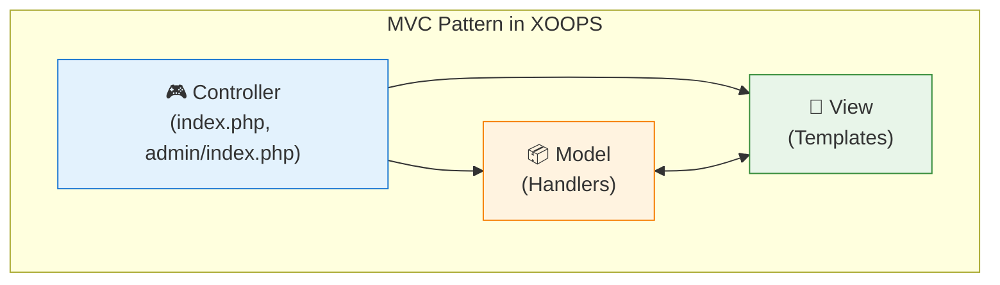

<span class="version-badge version-25x">2.5.x ✅</span> <span class="version-badge version-40x">4.0.x ✅</span>

設計パターンは一般的なソフトウェア設計問題への再利用可能なソリューションです。XOOPSはコード品質を維持し、テスト性を改善し、システム柔軟性を向上させるのに役立つ確立されたパターンをいくつか採用しています。

:::note[クイックパターン選択]
どのパターンを使うかわかりませんか？参照してください:
- [データアクセスパターン選択](../../03-Module-Development/Choosing-Data-Access-Pattern.md) — ハンドラー対リポジトリ対サービス対CQRS
- [イベントシステム選択](../Choosing-Event-System.md) — プリロード対PSR-14イベント
:::

## 概要

設計パターンを理解し、適切に実装することはメンテナンスしやすいXOOPSモジュールを作成するために重要です。このガイドはXOOPS開発で最も一般的に使用されるパターンをカバーしています。

| パターン | 目的 | 一般的な用途 |
|---------|---------|------------------|
| MVC | 関心事の分離 | モジュール構造 |
| Singleton | 単一インスタンス保証 | データベース接続 |
| Factory | オブジェクト作成抽象化 | ハンドラー、データベース |
| Observer | イベント通知 | プリロード、通知 |
| Decorator | 動的動作拡張 | フォーム要素、フィルター |
| Strategy | アルゴリズム交換 | 認証、検証 |
| Adapter | インターフェース互換性 | レガシーコード統合 |
| Repository | データアクセス抽象化 | データ永続化 |

## Model-View-Controller (MVC)

MVCパターンはアプリケーションを3つの相互接続されたコンポーネントに分離し、コードベースをより整理され、テスト可能にします。

### アーキテクチャ



### Model（データレイヤー）

```php
<?php
namespace XoopsModules\MyModule;

class Article extends \XoopsObject
{
    public function __construct()
    {
        $this->initVar('article_id', XOBJ_DTYPE_INT, null, false);
        $this->initVar('title', XOBJ_DTYPE_TXTBOX, '', true, 255);
        $this->initVar('content', XOBJ_DTYPE_TXTAREA, '', true);
        $this->initVar('author_id', XOBJ_DTYPE_INT, 0, true);
        $this->initVar('status', XOBJ_DTYPE_INT, 1, false);
        $this->initVar('created', XOBJ_DTYPE_INT, time(), false);
        $this->initVar('modified', XOBJ_DTYPE_INT, time(), false);
    }

    public function isPublished(): bool
    {
        return $this->getVar('status') === 1;
    }

    public function getFormattedDate(): string
    {
        return formatTimestamp($this->getVar('created'));
    }
}

class ArticleHandler extends \XoopsPersistableObjectHandler
{
    public function __construct(\XoopsDatabase $db)
    {
        parent::__construct($db, 'mymodule_articles', Article::class, 'article_id', 'title');
    }

    public function getPublishedArticles(int $limit = 10): array
    {
        $criteria = new \CriteriaCompo();
        $criteria->add(new \Criteria('status', 1));
        $criteria->setSort('created');
        $criteria->setOrder('DESC');
        $criteria->setLimit($limit);

        return $this->getObjects($criteria);
    }
}
```

### View（プレゼンテーションレイヤー）

```smarty
{* templates/article_list.tpl *}
<div class="article-list">
    <h2>{$smarty.const._MD_MYMODULE_ARTICLES}</h2>

    {foreach from=$articles item=article}
        <article class="article-item">
            <h3>
                <a href="{$xoops_url}/modules/mymodule/article.php?id={$article.article_id}">
                    {$article.title|escape}
                </a>
            </h3>
            <p class="meta">
                {$smarty.const._MD_MYMODULE_POSTED}: {$article.formatted_date}
            </p>
            <div class="content">
                {$article.content|truncate:200}
            </div>
        </article>
    {/foreach}
</div>
```

### Controller（ロジックレイヤー）

```php
<?php
// index.php
require_once dirname(__DIR__, 2) . '/mainfile.php';

use XoopsModules\MyModule\Helper;

$helper = Helper::getInstance();
$articleHandler = $helper->getHandler('Article');

// リクエストからアクションを取得
$op = \Xmf\Request::getString('op', 'list');

switch ($op) {
    case 'view':
        $articleId = \Xmf\Request::getInt('id', 0);
        $article = $articleHandler->get($articleId);

        if (!$article) {
            redirect_header(XOOPS_URL, 3, _MD_MYMODULE_NOT_FOUND);
        }

        $GLOBALS['xoopsOption']['template_main'] = 'mymodule_article_view.tpl';
        require_once XOOPS_ROOT_PATH . '/header.php';

        $xoopsTpl->assign('article', $article->toArray());
        break;

    case 'list':
    default:
        $articles = $articleHandler->getPublishedArticles(10);

        $GLOBALS['xoopsOption']['template_main'] = 'mymodule_article_list.tpl';
        require_once XOOPS_ROOT_PATH . '/header.php';

        $xoopsTpl->assign('articles', array_map(fn($a) => $a->toArray(), $articles));
        break;
}

require_once XOOPS_ROOT_PATH . '/footer.php';
```

## Singleton パターン

Singletonパターンはクラスが1つのインスタンスのみを持つことを保証し、グローバルなアクセスを提供します。

### いつ使うか

- データベース接続
- 設定マネージャー
- ロガーインスタンス
- キャッシュマネージャー

### 実装

```php
<?php
namespace XoopsModules\MyModule;

class ConfigurationManager
{
    private static ?self $instance = null;
    private array $config = [];

    private function __construct()
    {
        // 設定を読み込む
        $this->loadConfiguration();
    }

    // クローニングを防ぐ
    private function __clone() {}

    // 逆シリアル化を防ぐ
    public function __wakeup()
    {
        throw new \Exception("Cannot unserialize singleton");
    }

    public static function getInstance(): self
    {
        if (self::$instance === null) {
            self::$instance = new self();
        }

        return self::$instance;
    }

    private function loadConfiguration(): void
    {
        $helper = Helper::getInstance();
        $this->config = [
            'items_per_page' => $helper->getConfig('items_per_page', 10),
            'allow_comments' => $helper->getConfig('allow_comments', true),
            'date_format' => $helper->getConfig('date_format', 'Y-m-d'),
        ];
    }

    public function get(string $key, mixed $default = null): mixed
    {
        return $this->config[$key] ?? $default;
    }
}

// 使用方法
$config = ConfigurationManager::getInstance();
$itemsPerPage = $config->get('items_per_page');
```

### XOOPS コアの例

```php
<?php
// XoopsDatabaseFactory はSingletonパターンを使用
$db = XoopsDatabaseFactory::getDatabaseConnection();

// XMF モジュールヘルパーはSingletonを使用
$helper = \Xmf\Module\Helper::getHelper('mymodule');

// Xoops メインインスタンス
$xoops = \Xoops::getInstance();
```

## Factory パターン

Factoryパターンは正確なクラスを指定せずにオブジェクトを作成し、柔軟なオブジェクト作成を許可します。

### いつ使うか

- ハンドラーを動的に作成
- 異なるデータベースのデータベース接続
- 認証プロバイダー
- フォーム要素作成

### 実装

```php
<?php
namespace XoopsModules\MyModule;

interface ContentInterface
{
    public function render(): string;
}

class ArticleContent implements ContentInterface
{
    private array $data;

    public function __construct(array $data)
    {
        $this->data = $data;
    }

    public function render(): string
    {
        return "<article><h2>{$this->data['title']}</h2><p>{$this->data['body']}</p></article>";
    }
}

class NewsContent implements ContentInterface
{
    private array $data;

    public function __construct(array $data)
    {
        $this->data = $data;
    }

    public function render(): string
    {
        return "<div class='news'><h3>{$this->data['headline']}</h3><p>{$this->data['summary']}</p></div>";
    }
}

class ContentFactory
{
    public static function create(string $type, array $data): ContentInterface
    {
        return match ($type) {
            'article' => new ArticleContent($data),
            'news' => new NewsContent($data),
            default => throw new \InvalidArgumentException("Unknown content type: $type"),
        };
    }
}

// 使用方法
$article = ContentFactory::create('article', ['title' => 'Hello', 'body' => 'World']);
echo $article->render();
```

### XOOPS データベース Factory

```php
<?php
class XoopsDatabaseFactory
{
    public static function getDatabaseConnection()
    {
        static $instance;

        if (!isset($instance)) {
            $dbType = XOOPS_DB_TYPE ?? 'mysql';
            $className = 'XoopsDatabase' . ucfirst($dbType);

            if (!class_exists($className)) {
                $file = XOOPS_ROOT_PATH . '/class/database/' . strtolower($dbType) . '.php';
                if (file_exists($file)) {
                    require_once $file;
                }
            }

            $instance = new $className();

            if (!$instance->connect()) {
                trigger_error('Unable to connect to database', E_USER_ERROR);
            }
        }

        return $instance;
    }
}
```

## Observer パターン

Observerパターンはオブジェクトがサブジェクトの状態変化を通知されることを許可し、イベント駆動動作を有効にします。

### いつ使うか

- イベント処理
- 通知システム
- プラグインアーキテクチャ
- ロギングと監査

### 実装

```php
<?php
namespace XoopsModules\MyModule;

interface ObserverInterface
{
    public function update(string $event, array $data): void;
}

class EventDispatcher
{
    private array $observers = [];

    public function attach(string $event, ObserverInterface $observer): void
    {
        if (!isset($this->observers[$event])) {
            $this->observers[$event] = [];
        }

        $this->observers[$event][] = $observer;
    }

    public function detach(string $event, ObserverInterface $observer): void
    {
        if (isset($this->observers[$event])) {
            $key = array_search($observer, $this->observers[$event], true);
            if ($key !== false) {
                unset($this->observers[$event][$key]);
            }
        }
    }

    public function notify(string $event, array $data = []): void
    {
        if (isset($this->observers[$event])) {
            foreach ($this->observers[$event] as $observer) {
                $observer->update($event, $data);
            }
        }
    }
}

class EmailNotifier implements ObserverInterface
{
    public function update(string $event, array $data): void
    {
        if ($event === 'article.published') {
            // 通知メールを送信
            $this->sendEmail($data['article']);
        }
    }

    private function sendEmail($article): void
    {
        $xoopsMailer = xoops_getMailer();
        $xoopsMailer->setSubject('New Article Published: ' . $article->getVar('title'));
        $xoopsMailer->setBody('A new article has been published.');
        $xoopsMailer->send();
    }
}

// 使用方法
$dispatcher = new EventDispatcher();
$dispatcher->attach('article.published', new EmailNotifier());

// 記事が公開されたとき
$dispatcher->notify('article.published', ['article' => $article]);
```

### XOOPS プリロード（Observerの実装）

```php
<?php
// modules/mymodule/preloads/core.php
class MymoduleCorePreload extends XoopsPreloadItem
{
    public static function eventCoreIncludeCommonEnd($args)
    {
        // コア共通インクルード完了に対応
        $GLOBALS['xoopsLogger']->addExtra('MyModule', 'Initialized');
    }

    public static function eventCoreHeaderEnd($args)
    {
        // カスタムヘッダーを追加
        $GLOBALS['xoTheme']->addStylesheet('modules/mymodule/assets/css/custom.css');
    }

    public static function eventCoreFooterStart($args)
    {
        // フッター描画前に実行
    }
}
```

## Decorator パターン

Decoratorパターンは同じクラスの他のオブジェクトに影響を与えずに、動的にオブジェクトに動作を追加します。

### いつ使うか

- フォーム要素カスタマイズ
- 出力フォーマット
- パーミッションチェック
- キャッシングレイヤー

### 実装

```php
<?php
namespace XoopsModules\MyModule;

interface FormElementInterface
{
    public function render(): string;
}

class TextInput implements FormElementInterface
{
    private string $name;
    private string $value;

    public function __construct(string $name, string $value = '')
    {
        $this->name = $name;
        $this->value = $value;
    }

    public function render(): string
    {
        return sprintf(
            '<input type="text" name="%s" value="%s">',
            htmlspecialchars($this->name),
            htmlspecialchars($this->value)
        );
    }
}

abstract class FormElementDecorator implements FormElementInterface
{
    protected FormElementInterface $element;

    public function __construct(FormElementInterface $element)
    {
        $this->element = $element;
    }

    public function render(): string
    {
        return $this->element->render();
    }
}

class RequiredDecorator extends FormElementDecorator
{
    public function render(): string
    {
        return $this->element->render() . '<span class="required">*</span>';
    }
}

class LabelDecorator extends FormElementDecorator
{
    private string $label;

    public function __construct(FormElementInterface $element, string $label)
    {
        parent::__construct($element);
        $this->label = $label;
    }

    public function render(): string
    {
        return sprintf(
            '<label>%s</label>%s',
            htmlspecialchars($this->label),
            $this->element->render()
        );
    }
}

class HelpTextDecorator extends FormElementDecorator
{
    private string $helpText;

    public function __construct(FormElementInterface $element, string $helpText)
    {
        parent::__construct($element);
        $this->helpText = $helpText;
    }

    public function render(): string
    {
        return $this->element->render() . sprintf(
            '<small class="help-text">%s</small>',
            htmlspecialchars($this->helpText)
        );
    }
}

// 使用方法 - デコレーターはスタックできます
$input = new TextInput('username');
$input = new RequiredDecorator($input);
$input = new LabelDecorator($input, 'Username');
$input = new HelpTextDecorator($input, 'Enter your username');

echo $input->render();
// 出力: <label>Username</label><input type="text" name="username" value=""><span class="required">*</span><small class="help-text">Enter your username</small>
```

## Strategy パターン

Strategyパターンはアルゴリズムのファミリーを定義し、各 1 つをカプセル化し、相互に交換可能にします。

### いつ使うか

- 複数の認証方法
- さまざまなソートアルゴリズム
- 異なるエクスポート形式
- 柔軟な検証ルール

### 実装

```php
<?php
namespace XoopsModules\MyModule;

interface AuthStrategyInterface
{
    public function authenticate(string $username, string $password): bool;
}

class DatabaseAuthStrategy implements AuthStrategyInterface
{
    public function authenticate(string $username, string $password): bool
    {
        $memberHandler = xoops_getHandler('member');
        $user = $memberHandler->loginUser($username, $password);

        return $user !== false;
    }
}

class LdapAuthStrategy implements AuthStrategyInterface
{
    private string $ldapHost;
    private int $ldapPort;

    public function __construct(string $host, int $port = 389)
    {
        $this->ldapHost = $host;
        $this->ldapPort = $port;
    }

    public function authenticate(string $username, string $password): bool
    {
        $ldap = ldap_connect($this->ldapHost, $this->ldapPort);

        if (!$ldap) {
            return false;
        }

        $bind = @ldap_bind($ldap, "uid=$username,ou=users,dc=example,dc=com", $password);

        ldap_close($ldap);

        return $bind;
    }
}

class AuthService
{
    private AuthStrategyInterface $strategy;

    public function __construct(AuthStrategyInterface $strategy)
    {
        $this->strategy = $strategy;
    }

    public function setStrategy(AuthStrategyInterface $strategy): void
    {
        $this->strategy = $strategy;
    }

    public function login(string $username, string $password): bool
    {
        return $this->strategy->authenticate($username, $password);
    }
}

// 使用方法
$authService = new AuthService(new DatabaseAuthStrategy());

// 実行時に戦略を切り替えられます
if ($useLdap) {
    $authService->setStrategy(new LdapAuthStrategy('ldap.example.com'));
}

$authenticated = $authService->login($username, $password);
```

## Repository パターン

Repositoryパターンはデータアクセスロジックとビジネスロジック間の抽象化レイヤーを提供します。

### いつ使うか

- 複雑なデータアクセス要件
- 複数のデータソース
- テスト可能なデータレイヤー
- ドメイン駆動設計

### 実装

```php
<?php
namespace XoopsModules\MyModule\Repository;

use XoopsModules\MyModule\Entity\Article;

interface ArticleRepositoryInterface
{
    public function find(int $id): ?Article;
    public function findBySlug(string $slug): ?Article;
    public function findPublished(int $limit = 10, int $offset = 0): array;
    public function save(Article $article): bool;
    public function delete(Article $article): bool;
}

class ArticleRepository implements ArticleRepositoryInterface
{
    private \XoopsPersistableObjectHandler $handler;

    public function __construct(\XoopsPersistableObjectHandler $handler)
    {
        $this->handler = $handler;
    }

    public function find(int $id): ?Article
    {
        $obj = $this->handler->get($id);
        return $obj ?: null;
    }

    public function findBySlug(string $slug): ?Article
    {
        $criteria = new \Criteria('slug', $slug);
        $objects = $this->handler->getObjects($criteria);

        return !empty($objects) ? $objects[0] : null;
    }

    public function findPublished(int $limit = 10, int $offset = 0): array
    {
        $criteria = new \CriteriaCompo();
        $criteria->add(new \Criteria('status', 'published'));
        $criteria->setSort('published_at');
        $criteria->setOrder('DESC');
        $criteria->setLimit($limit);
        $criteria->setStart($offset);

        return $this->handler->getObjects($criteria);
    }

    public function save(Article $article): bool
    {
        return $this->handler->insert($article);
    }

    public function delete(Article $article): bool
    {
        return $this->handler->delete($article);
    }
}
```

## 依存性注入

依存性注入（DI）はオブジェクトを内部で作成する代わりに、その依存関係と共に構築できます。

### 利点

- テスト性の向上
- 疎結合
- 柔軟な設定
- より良いコード編成

### 実装

```php
<?php
namespace XoopsModules\MyModule;

class ArticleService
{
    private Repository\ArticleRepositoryInterface $repository;
    private CacheInterface $cache;
    private LoggerInterface $logger;

    public function __construct(
        Repository\ArticleRepositoryInterface $repository,
        CacheInterface $cache,
        LoggerInterface $logger
    ) {
        $this->repository = $repository;
        $this->cache = $cache;
        $this->logger = $logger;
    }

    public function getArticle(int $id): ?Entity\Article
    {
        $cacheKey = "article_{$id}";

        // キャッシュを試す
        if ($this->cache->has($cacheKey)) {
            $this->logger->debug("Article {$id} loaded from cache");
            return $this->cache->get($cacheKey);
        }

        // リポジトリーから読み込む
        $article = $this->repository->find($id);

        if ($article) {
            $this->cache->set($cacheKey, $article, 3600);
            $this->logger->debug("Article {$id} loaded from database");
        }

        return $article;
    }
}

// サービスコンテナー設定
$container = new DependencyContainer();

$container->register('db', fn() => XoopsDatabaseFactory::getDatabaseConnection());

$container->register('articleHandler', fn($c) =>
    new ArticleHandler($c->resolve('db'))
);

$container->register('articleRepository', fn($c) =>
    new Repository\ArticleRepository($c->resolve('articleHandler'))
);

$container->register('cache', fn() => new FileCache(XOOPS_VAR_PATH . '/caches'));

$container->register('logger', fn() => new XoopsLogger());

$container->register('articleService', fn($c) =>
    new ArticleService(
        $c->resolve('articleRepository'),
        $c->resolve('cache'),
        $c->resolve('logger')
    )
);

// 使用方法
$articleService = $container->resolve('articleService');
$article = $articleService->getArticle(1);
```

## ベストプラクティス

### パターン選択ガイドライン

1. **実際の必要性に基づいてパターンを選択** - 予測されたものではなく
2. **実装をシンプルに保つ** - 過度にエンジニアリングしない
3. **パターン使用を文書化** - チーム理解のため
4. **適切なときにパターンを組み合わせ** （例: Factory + Singleton）
5. **パターン選択時に テスト性を考慮**

### 避けるべき一般的なアンチパターン

| アンチパターン | 問題 | ソリューション |
|--------------|---------|----------|
| God Object | クラスがやることが多すぎる | 単一責任 |
| Spaghetti Code | 明確な構造がない | MVCパターンを使用 |
| Copy-Paste | コード重複 | 一般的なコードを抽出 |
| Magic Numbers | 不明確な定数 | 名前付き定数を使用 |
| Tight Coupling | テスト/保守が困難 | 依存性注入を使用 |

### テストパターン

```php
<?php
// 依存性注入でのユニットテスト
class ArticleServiceTest extends \PHPUnit\Framework\TestCase
{
    private $repository;
    private $cache;
    private $logger;
    private $service;

    protected function setUp(): void
    {
        $this->repository = $this->createMock(ArticleRepositoryInterface::class);
        $this->cache = $this->createMock(CacheInterface::class);
        $this->logger = $this->createMock(LoggerInterface::class);

        $this->service = new ArticleService(
            $this->repository,
            $this->cache,
            $this->logger
        );
    }

    public function testGetArticleFromCache(): void
    {
        $article = new Article();
        $article->setVar('article_id', 1);

        $this->cache->expects($this->once())
            ->method('has')
            ->with('article_1')
            ->willReturn(true);

        $this->cache->expects($this->once())
            ->method('get')
            ->with('article_1')
            ->willReturn($article);

        $result = $this->service->getArticle(1);

        $this->assertSame($article, $result);
    }
}
```

## 関連ドキュメント

- [XOOPS-Architecture](XOOPS-Architecture.md) - 全体的なシステムアーキテクチャ
- [Database Layer](../Database/Database-Layer.md) - データ永続化パターン
- [Security Best Practices](../Security/Security-Best-Practices.md) - セキュアなパターン実装

---

#xoops #design-patterns #architecture #mvc #singleton #factory #observer
