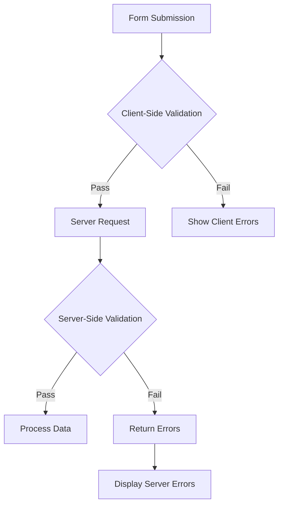

## 概要

XOOPSはフォーム入力に対してクライアント側とサーバー側の両方の検証を提供します。このガイドは検証テクニック、組み込みバリデータ、カスタム検証実装をカバーしています。

## 検証アーキテクチャ



## サーバー側検証

### XoopsFormValidator を使用

```php
use Xoops\Core\Form\Validator;

$validator = new Validator();

$validator->addRule('username', 'required', 'Username is required');
$validator->addRule('username', 'minLength:3', 'Username must be at least 3 characters');
$validator->addRule('username', 'maxLength:50', 'Username cannot exceed 50 characters');
$validator->addRule('email', 'email', 'Please enter a valid email address');
$validator->addRule('password', 'minLength:8', 'Password must be at least 8 characters');

if (!$validator->validate($_POST)) {
    $errors = $validator->getErrors();
    // エラーを処理
}
```

### 組み込み検証ルール

| ルール | 説明 | 例 |
|------|-------------|---------|
| `required` | フィールドは空にできない | `required` |
| `email` | 有効なメール形式 | `email` |
| `url` | 有効なURL形式 | `url` |
| `numeric` | 数値のみ | `numeric` |
| `integer` | 整数値のみ | `integer` |
| `minLength` | 最小文字列長 | `minLength:3` |
| `maxLength` | 最大文字列長 | `maxLength:100` |
| `min` | 最小数値 | `min:1` |
| `max` | 最大数値 | `max:100` |
| `regex` | カスタム正規表現パターン | `regex:/^[a-z]+$/` |
| `in` | リストの値 | `in:draft,published,archived` |
| `date` | 有効な日付形式 | `date` |
| `alpha` | 文字のみ | `alpha` |
| `alphanumeric` | 文字と数字 | `alphanumeric` |

### カスタム検証ルール

```php
$validator->addCustomRule('unique_username', function($value) {
    $memberHandler = xoops_getHandler('member');
    $criteria = new \CriteriaCompo();
    $criteria->add(new \Criteria('uname', $value));
    return $memberHandler->getUserCount($criteria) === 0;
}, 'Username already exists');

$validator->addRule('username', 'unique_username');
```

## リクエスト検証

### 入力をサニタイズ

```php
use Xoops\Core\Request;

// サニタイズされた値を取得
$username = Request::getString('username', '', 'POST');
$email = Request::getEmail('email', '', 'POST');
$age = Request::getInt('age', 0, 'POST');
$price = Request::getFloat('price', 0.0, 'POST');
$tags = Request::getArray('tags', [], 'POST');

// 検証付き
$username = Request::getString('username', '', 'POST', [
    'minLength' => 3,
    'maxLength' => 50
]);
```

### XSS 防止

```php
use Xoops\Core\Text\Sanitizer;

$sanitizer = Sanitizer::getInstance();

// HTMLコンテンツをサニタイズ
$cleanContent = $sanitizer->sanitizeForDisplay($userContent);

// すべてのHTMLを削除
$plainText = $sanitizer->stripHtml($userContent);

// 特定のタグを許可
$content = $sanitizer->sanitizeForDisplay($userContent, [
    'allowedTags' => '<p><br><strong><em><a>'
]);
```

## クライアント側検証

### HTML5検証属性

```php
// 必須フィールド
$element->setExtra('required');

// パターン検証
$element->setExtra('pattern="[a-zA-Z0-9]+" title="Alphanumeric only"');

// 長さ制約
$element->setExtra('minlength="3" maxlength="50"');

// 数値制約
$element->setExtra('min="1" max="100"');
```

### JavaScript検証

```javascript
document.getElementById('myForm').addEventListener('submit', function(e) {
    const username = document.getElementById('username').value;
    const errors = [];

    if (username.length < 3) {
        errors.push('Username must be at least 3 characters');
    }

    if (!/^[a-zA-Z0-9_]+$/.test(username)) {
        errors.push('Username can only contain letters, numbers, and underscores');
    }

    if (errors.length > 0) {
        e.preventDefault();
        displayErrors(errors);
    }
});
```

## CSRF 保護

### トークンを生成

```php
// フォームにトークンを生成
$form->addElement(new \XoopsFormHiddenToken());

// これはセキュリティトークンを持つ隠しフィールドを追加します
```

### トークンを検証

```php
use Xoops\Core\Security;

if (!Security::checkReferer()) {
    die('Invalid request origin');
}

if (!Security::checkToken()) {
    die('Invalid security token');
}
```

## ファイルアップロード検証

```php
use Xoops\Core\Uploader;

$uploader = new Uploader(
    uploadDir: XOOPS_UPLOAD_PATH . '/images/',
    allowedMimeTypes: ['image/jpeg', 'image/png', 'image/gif'],
    maxFileSize: 2 * 1024 * 1024, // 2MB
    maxWidth: 1920,
    maxHeight: 1080
);

if ($uploader->fetchMedia('image_upload')) {
    if ($uploader->upload()) {
        $savedFile = $uploader->getSavedFileName();
    } else {
        $errors[] = $uploader->getErrors();
    }
}
```

## エラー表示

### エラーを集める

```php
$errors = [];

if (empty($username)) {
    $errors['username'] = 'Username is required';
}

if (!filter_var($email, FILTER_VALIDATE_EMAIL)) {
    $errors['email'] = 'Invalid email format';
}

if (!empty($errors)) {
    // リダイレクト後に表示するためセッションに保存
    $_SESSION['form_errors'] = $errors;
    $_SESSION['form_data'] = $_POST;
    header('Location: ' . $_SERVER['HTTP_REFERER']);
    exit;
}
```

### エラーを表示

```smarty
{if $errors}
<div class="alert alert-danger">
    <ul>
        {foreach $errors as $field => $message}
        <li>{$message}</li>
        {/foreach}
    </ul>
</div>
{/if}
```

## ベストプラクティス

1. **常にサーバー側で検証** - クライアント側検証はバイパスできます
2. **パラメーター化されたクエリを使用** - SQLインジェクションを防止
3. **出力をサニタイズ** - XSS攻撃を防止
4. **ファイルアップロードを検証** - MIMEタイプとサイズをチェック
5. **CSRFトークンを使用** - クロスサイトリクエスト偽造を防止
6. **送信をレート制限** - 悪用を防止

## 関連ドキュメント

- Form Elements Reference
- Forms Overview
- Security Best Practices
