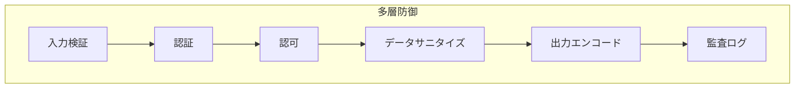

## 概要

このドキュメントはXOOPS開発のセキュリティベストプラクティスの概要を示し、入力検証、出力エンコード、認証、認可、および一般的なWebの脆弱性に対する保護をカバーしています。

## セキュリティの原則



## 入力検証

### リクエストのサニタイズ

```php
use Xoops\Core\Request;

// 常に型指定されたゲッターを使用
$id = Request::getInt('id', 0, 'GET');
$name = Request::getString('name', '', 'POST');
$email = Request::getEmail('email', '', 'POST');
$url = Request::getUrl('website', '', 'POST');

// $_GET/$_POST/$_REQUESTを直接使用しない
// 悪い: $id = $_GET['id'];
// 良い: $id = Request::getInt('id', 0, 'GET');
```

### 検証ルール

```php
// 使用する前に検証
if ($id <= 0) {
    throw new InvalidArgumentException('無効なID');
}

if (!preg_match('/^[a-zA-Z0-9_]{3,50}$/', $username)) {
    throw new InvalidArgumentException('無効なユーザー名形式');
}

// 列挙型にはホワイトリスト検証を使用
$allowedStatuses = ['draft', 'published', 'archived'];
if (!in_array($status, $allowedStatuses, true)) {
    throw new InvalidArgumentException('無効なステータス');
}
```

## SQLインジェクション防止

### パラメータ化クエリを使用

```php
// 良い: パラメータ化クエリ
$sql = "SELECT * FROM {$xoopsDB->prefix('users')} WHERE uid = ?";
$result = $xoopsDB->query($sql, [$userId]);

// 悪い: 文字列連結（脆弱性あり）
// $sql = "SELECT * FROM users WHERE uid = " . $userId;
```

### Criteriaオブジェクトを使用

```php
use Criteria;
use CriteriaCompo;

$criteria = new CriteriaCompo();
$criteria->add(new Criteria('status', 'published'));
$criteria->add(new Criteria('uid', $userId, '='));
$criteria->add(new Criteria('created', time() - 86400, '>'));

$articles = $articleHandler->getObjects($criteria);
```

## XSS防止

### 出力エンコード

```php
use Xoops\Core\Text\Sanitizer;

// HTMLコンテキスト
$safeName = htmlspecialchars($userName, ENT_QUOTES, 'UTF-8');

// テンプレート内（自動エスケープ）
{$userName|escape}

// リッチコンテンツ用
$sanitizer = Sanitizer::getInstance();
$safeContent = $sanitizer->sanitizeForDisplay($content);
```

### コンテンツセキュリティポリシー

```php
// CSPヘッダーを設定
header("Content-Security-Policy: default-src 'self'; script-src 'self'; style-src 'self' 'unsafe-inline'");
```

## CSRF保護

### トークン実装

```php
// トークンを生成
use Xoops\Core\Security;

$token = Security::createToken();

// フォームに含める
echo '<input type="hidden" name="XOOPS_TOKEN_REQUEST" value="' . $token . '">';

// 送信時に検証
if (!Security::checkToken()) {
    die('セキュリティトークンが一致しません');
}
```

### XoopsFormを使用

```php
// 自動的にCSRFトークンを追加
$form = new XoopsThemeForm('記事を編集', 'articleform', 'save.php');
$form->addElement(new XoopsFormHiddenToken());
```

## 認証

### パスワード処理

```php
// パスワードをハッシュ化 (PHP 5.5+)
$hashedPassword = password_hash($plainPassword, PASSWORD_ARGON2ID);

// パスワードを検証
if (password_verify($plainPassword, $storedHash)) {
    // パスワードが正しい
}

// 再ハッシュが必要かを確認
if (password_needs_rehash($storedHash, PASSWORD_ARGON2ID)) {
    $newHash = password_hash($plainPassword, PASSWORD_ARGON2ID);
    // 保存されたハッシュを更新
}
```

### セッションセキュリティ

```php
// ログイン後にセッションIDを再生成
session_regenerate_id(true);

// セッションクッキーオプションを設定
ini_set('session.cookie_httponly', 1);
ini_set('session.cookie_secure', 1);
ini_set('session.cookie_samesite', 'Lax');
```

## 認可

### 権限チェック

```php
// モジュール管理者を確認
if (!$xoopsUser || !$xoopsUser->isAdmin($xoopsModule->mid())) {
    redirect_header('index.php', 3, 'アクセスが拒否されました');
}

// グループ権限を確認
$grouppermHandler = xoops_getHandler('groupperm');
$groups = $xoopsUser ? $xoopsUser->getGroups() : [XOOPS_GROUP_ANONYMOUS];

if (!$grouppermHandler->checkRight('view_item', $itemId, $groups, $moduleId)) {
    throw new AccessDeniedException('権限が拒否されました');
}
```

### ロールベースアクセス

```php
class PermissionChecker
{
    public function canEdit(Article $article, ?XoopsUser $user): bool
    {
        if (!$user) {
            return false;
        }

        // 管理者はすべてを編集できます
        if ($user->isAdmin()) {
            return true;
        }

        // 著者は自分のものを編集できます
        if ($article->getAuthorId() === $user->uid()) {
            return true;
        }

        // エディター権限を確認
        return $this->hasPermission($user, 'article_edit');
    }
}
```

## ファイルアップロードセキュリティ

```php
class SecureUploader
{
    private array $allowedMimeTypes = [
        'image/jpeg',
        'image/png',
        'image/gif'
    ];

    private array $allowedExtensions = ['jpg', 'jpeg', 'png', 'gif'];

    public function validate(array $file): bool
    {
        // ファイルサイズを確認
        if ($file['size'] > 2 * 1024 * 1024) {
            throw new FileTooLargeException();
        }

        // MIMEタイプを検証
        $finfo = new finfo(FILEINFO_MIME_TYPE);
        $mimeType = $finfo->file($file['tmp_name']);

        if (!in_array($mimeType, $this->allowedMimeTypes, true)) {
            throw new InvalidFileTypeException();
        }

        // 拡張子を確認
        $extension = strtolower(pathinfo($file['name'], PATHINFO_EXTENSION));
        if (!in_array($extension, $this->allowedExtensions, true)) {
            throw new InvalidFileTypeException();
        }

        // 安全なファイル名を生成
        return true;
    }

    public function generateSafeFilename(string $original): string
    {
        $extension = strtolower(pathinfo($original, PATHINFO_EXTENSION));
        return bin2hex(random_bytes(16)) . '.' . $extension;
    }
}
```

## 監査ログ

```php
class SecurityLogger
{
    public function logAuthAttempt(string $username, bool $success, string $ip): void
    {
        $data = [
            'username' => $username,
            'success' => $success,
            'ip' => $ip,
            'user_agent' => $_SERVER['HTTP_USER_AGENT'] ?? '',
            'timestamp' => time()
        ];

        // データベースまたはファイルにログを記録
        $this->log('auth', $data);
    }

    public function logSensitiveAction(int $userId, string $action, array $context): void
    {
        $data = [
            'user_id' => $userId,
            'action' => $action,
            'context' => json_encode($context),
            'ip' => $_SERVER['REMOTE_ADDR'],
            'timestamp' => time()
        ];

        $this->log('audit', $data);
    }
}
```

## セキュリティヘッダー

```php
// 推奨されるセキュリティヘッダー
header('X-Content-Type-Options: nosniff');
header('X-Frame-Options: SAMEORIGIN');
header('X-XSS-Protection: 1; mode=block');
header('Referrer-Policy: strict-origin-when-cross-origin');
header('Permissions-Policy: geolocation=(), microphone=(), camera=()');

// HSTS (HTTPSサイトのみ)
if (isset($_SERVER['HTTPS']) && $_SERVER['HTTPS'] === 'on') {
    header('Strict-Transport-Security: max-age=31536000; includeSubDomains');
}
```

## レート制限

```php
class RateLimiter
{
    public function check(string $key, int $maxAttempts, int $windowSeconds): bool
    {
        $cacheKey = 'rate_limit:' . $key;
        $attempts = (int) $this->cache->get($cacheKey, 0);

        if ($attempts >= $maxAttempts) {
            return false; // レート制限
        }

        $this->cache->increment($cacheKey, 1, $windowSeconds);
        return true;
    }
}

// 使用法
$limiter = new RateLimiter();
if (!$limiter->check('login:' . $ip, 5, 300)) {
    throw new TooManyRequestsException('ログイン試行が多すぎます');
}
```

## セキュリティチェックリスト

- [ ] すべてのユーザー入力が検証およびサニタイズされている
- [ ] すべてのデータベース操作がパラメータ化クエリを使用している
- [ ] ユーザー生成コンテンツはすべて出力エンコードされている
- [ ] 状態変更フォームはすべてCSRFトークンを持つ
- [ ] セキュアパスワードハッシュ (Argon2id) を使用
- [ ] セッションセキュリティが設定されている
- [ ] ファイルアップロード検証が実装されている
- [ ] セキュリティヘッダーが設定されている
- [ ] レート制限が実装されている
- [ ] 監査ログが有効になっている
- [ ] エラーメッセージが機密情報を流出していない

## 関連ドキュメント

- 認証システム
- 権限システム
- 入力検証
