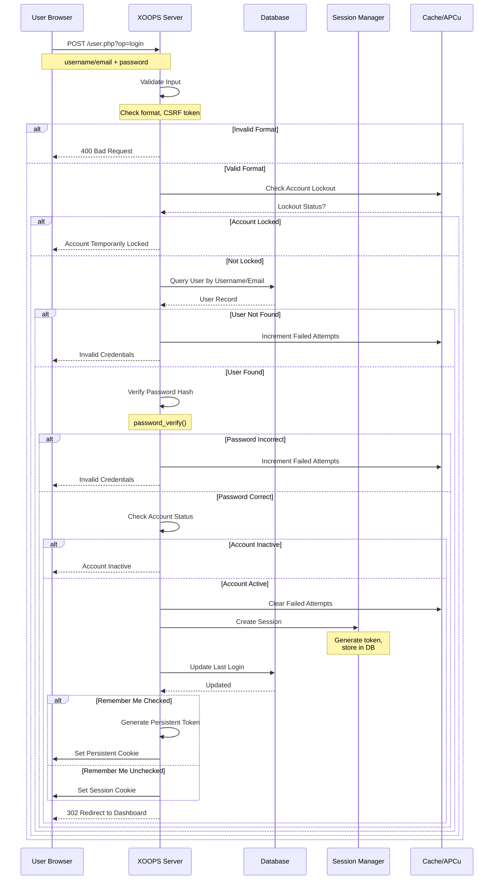
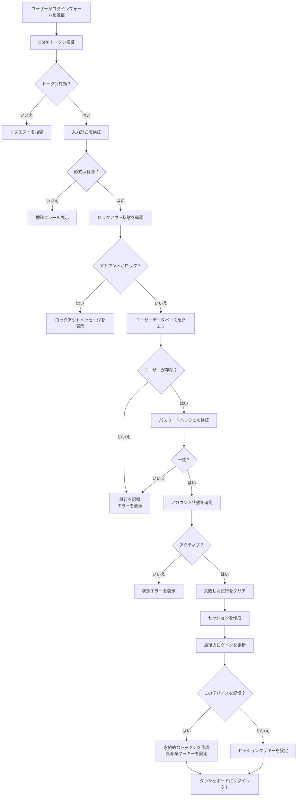

# XOOPSにおける認証

XOOPS認証システムは、二要素認証とOAuth統合を含む、セキュアなユーザー検証、セッション管理、および高度なセキュリティ機能を提供します。このドキュメントは認証フロー、実装、およびベストプラクティスをカバーしています。

## 認証フロー

### ログインシーケンス図



### ログインプロセス詳細



## セッション管理

### セッション設定

```php
<?php
/**
 * XOOPSセッション設定
 * 通常は/include/session.phpに含まれます
 */

// セキュリティ用のセッションクッキーパラメータ
session_set_cookie_params([
    'lifetime' => 0,           // セッションクッキー（ブラウザクローズ時に削除）
    'path' => '/',             // クッキーパス
    'domain' => '',            // クッキードメイン（空=現在のドメイン）
    'secure' => true,          // HTTPSのみ
    'httponly' => true,        // JavaScriptからアクセス不可
    'samesite' => 'Strict'     // CSRF保護
]);

// セッション設定を設定
ini_set('session.name', 'XOOPSPHPSESSID');
ini_set('session.use_strict_mode', 1);
ini_set('session.use_only_cookies', 1);
ini_set('session.cookie_httponly', 1);
ini_set('session.cookie_secure', 1);
ini_set('session.gc_maxlifetime', 28800);  // 8時間

// セッションを開始
session_start();

// セッション固定化保護を検証
if (!isset($_SESSION['initiated'])) {
    session_regenerate_id();
    $_SESSION['initiated'] = true;
}
```

### セッションハンドラー実装

```php
<?php
/**
 * XOOPSセッションハンドラー
 */
class XoopsSessionHandler
{
    private $sessionTimeout = 28800; // 8時間
    private $sessionTokenLength = 32;
    private $db;

    public function __construct()
    {
        $this->db = XoopsDatabaseFactory::getDatabaseConnection();
    }

    /**
     * 新しいセッションを作成
     *
     * @param XoopsUser $user ユーザーオブジェクト
     * @param bool $rememberMe 永続ログインフラグ
     * @return bool 成功状態
     */
    public function createSession(XoopsUser $user, bool $rememberMe = false): bool
    {
        try {
            // セキュアトークンを生成
            $token = bin2hex(random_bytes($this->sessionTokenLength));

            // セッションに保存
            $_SESSION['xoopsUserId'] = $user->getVar('uid');
            $_SESSION['xoopsUserName'] = $user->getVar('uname');
            $_SESSION['xoopsSessionToken'] = $token;
            $_SESSION['xoopsSessionCreated'] = time();
            $_SESSION['xoopsSessionIP'] = $this->getClientIP();
            $_SESSION['xoopsSessionUA'] = $_SERVER['HTTP_USER_AGENT'] ?? '';

            // トークンをデータベースに保存
            $this->storeSessionToken(
                $user->getVar('uid'),
                $token,
                $this->sessionTimeout
            );

            // 永続ログインを処理
            if ($rememberMe) {
                $this->createPersistentLogin($user->getVar('uid'));
            }

            return true;
        } catch (Exception $e) {
            error_log('セッション作成に失敗: ' . $e->getMessage());
            return false;
        }
    }

    /**
     * 現在のセッションを検証
     *
     * @return bool セッションが有効
     */
    public function validateSession(): bool
    {
        // セッション変数が存在するかを確認
        if (!isset($_SESSION['xoopsUserId'], $_SESSION['xoopsSessionToken'])) {
            return false;
        }

        // セッションタイムアウトを検証
        $created = $_SESSION['xoopsSessionCreated'] ?? 0;
        if (time() - $created > $this->sessionTimeout) {
            $this->destroySession();
            return false;
        }

        // IPアドレスの一貫性を検証
        if ($this->getClientIP() !== ($_SESSION['xoopsSessionIP'] ?? '')) {
            error_log('セッションIPの不一致 - セッションハイジャックの可能性');
            $this->destroySession();
            return false;
        }

        // ユーザーエージェントの一貫性を検証
        $currentUA = $_SERVER['HTTP_USER_AGENT'] ?? '';
        if ($currentUA !== ($_SESSION['xoopsSessionUA'] ?? '')) {
            error_log('セッションUAの不一致 - セッションハイジャックの可能性');
            $this->destroySession();
            return false;
        }

        // データベースでトークンを検証
        if (!$this->verifySessionToken(
            $_SESSION['xoopsUserId'],
            $_SESSION['xoopsSessionToken']
        )) {
            return false;
        }

        return true;
    }

    /**
     * セッションを破棄
     */
    public function destroySession(): void
    {
        if (isset($_SESSION['xoopsUserId'])) {
            $this->deleteSessionToken(
                $_SESSION['xoopsUserId'],
                $_SESSION['xoopsSessionToken'] ?? ''
            );
        }

        // セッションデータをクリア
        $_SESSION = [];

        // セッションクッキーを削除
        if (ini_get('session.use_cookies')) {
            $params = session_get_cookie_params();
            setcookie(
                session_name(),
                '',
                time() - 42000,
                $params['path'],
                $params['domain'],
                $params['secure'],
                $params['httponly']
            );
        }

        session_destroy();
    }

    /**
     * データベースにセッショントークンを保存
     *
     * @param int $uid ユーザーID
     * @param string $token セッショントークン
     * @param int $lifetime トークンライフタイム（秒）
     */
    private function storeSessionToken(int $uid, string $token, int $lifetime): void
    {
        $tokenHash = hash('sha256', $token);
        $expiresAt = time() + $lifetime;

        $this->db->query(
            "INSERT INTO xoops_sessions (uid, token, ip, user_agent, expires_at)
             VALUES (?, ?, ?, ?, ?)",
            array($uid, $tokenHash, $this->getClientIP(),
                  $_SERVER['HTTP_USER_AGENT'] ?? '', $expiresAt)
        );
    }

    /**
     * セッショントークンを検証
     *
     * @param int $uid ユーザーID
     * @param string $token セッショントークン
     * @return bool 有効なトークン
     */
    private function verifySessionToken(int $uid, string $token): bool
    {
        $tokenHash = hash('sha256', $token);

        $result = $this->db->query(
            "SELECT id FROM xoops_sessions
             WHERE uid = ? AND token = ? AND expires_at > ?",
            array($uid, $tokenHash, time())
        );

        return $this->db->getRowCount($result) > 0;
    }

    /**
     * セッショントークンを削除
     *
     * @param int $uid ユーザーID
     * @param string $token セッショントークン（オプション）
     */
    private function deleteSessionToken(int $uid, string $token = ''): void
    {
        if (!empty($token)) {
            $tokenHash = hash('sha256', $token);
            $this->db->query(
                "DELETE FROM xoops_sessions WHERE uid = ? AND token = ?",
                array($uid, $tokenHash)
            );
        } else {
            // ユーザーのすべてのセッションを削除
            $this->db->query(
                "DELETE FROM xoops_sessions WHERE uid = ?",
                array($uid)
            );
        }
    }

    /**
     * クライアントIPアドレスを取得
     *
     * @return string IPアドレス
     */
    private function getClientIP(): string
    {
        if (!empty($_SERVER['HTTP_CF_CONNECTING_IP'])) {
            return $_SERVER['HTTP_CF_CONNECTING_IP'];
        } elseif (!empty($_SERVER['HTTP_X_FORWARDED_FOR'])) {
            $ips = explode(',', $_SERVER['HTTP_X_FORWARDED_FOR']);
            return trim($ips[0]);
        } elseif (!empty($_SERVER['HTTP_X_FORWARDED'])) {
            return $_SERVER['HTTP_X_FORWARDED'];
        } elseif (!empty($_SERVER['HTTP_FORWARDED_FOR'])) {
            return $_SERVER['HTTP_FORWARDED_FOR'];
        } elseif (!empty($_SERVER['HTTP_FORWARDED'])) {
            return $_SERVER['HTTP_FORWARDED'];
        } elseif (!empty($_SERVER['REMOTE_ADDR'])) {
            return $_SERVER['REMOTE_ADDR'];
        }
        return '';
    }
}
```

## 「このデバイスを記憶」機能

### 永続ログイン実装

```php
<?php
/**
 * 「このデバイスを記憶」（永続ログイン）ハンドラー
 */
class PersistentLoginHandler
{
    private $cookieName = 'xoops_persistent_login';
    private $cookieLifetime = 1209600; // 14日
    private $db;

    public function __construct()
    {
        $this->db = XoopsDatabaseFactory::getDatabaseConnection();
    }

    /**
     * 永続ログイントークンを作成
     *
     * @param int $uid ユーザーID
     * @return string クッキートークン
     */
    public function createPersistentToken(int $uid): string
    {
        // ランダムトークンを生成
        $token = bin2hex(random_bytes(32));
        $tokenHash = hash('sha256', $token);

        // データベースに保存
        $expiresAt = time() + $this->cookieLifetime;

        $this->db->query(
            "INSERT INTO xoops_persistent_tokens (uid, token_hash, expires_at)
             VALUES (?, ?, ?)",
            array($uid, $tokenHash, $expiresAt)
        );

        // クッキーを設定
        setcookie(
            $this->cookieName,
            $token,
            time() + $this->cookieLifetime,
            '/',
            '',
            true,  // HTTPSのみ
            true   // HttpOnly
        );

        return $token;
    }

    /**
     * 永続ログインクッキーを検証
     *
     * @return XoopsUser|false 認証されたユーザーまたはfalse
     */
    public function validatePersistentToken()
    {
        if (!isset($_COOKIE[$this->cookieName])) {
            return false;
        }

        $token = $_COOKIE[$this->cookieName];
        $tokenHash = hash('sha256', $token);

        // データベースをクエリ
        $result = $this->db->query(
            "SELECT uid FROM xoops_persistent_tokens
             WHERE token_hash = ? AND expires_at > ?",
            array($tokenHash, time())
        );

        if ($this->db->getRowCount($result) === 0) {
            return false;
        }

        $row = $this->db->fetchArray($result);
        $uid = $row['uid'];

        // ユーザーを取得
        $userHandler = xoops_getHandler('user');
        $user = $userHandler->getUser($uid);

        if (!$user) {
            return false;
        }

        // トークンをリフレッシュ（スライディングウィンドウ）
        $this->refreshPersistentToken($uid, $token);

        return $user;
    }

    /**
     * 永続トークンをリフレッシュ（スライディングウィンドウ）
     *
     * @param int $uid ユーザーID
     * @param string $oldToken 古いトークン
     */
    private function refreshPersistentToken(int $uid, string $oldToken): void
    {
        // 古いトークンを削除
        $oldTokenHash = hash('sha256', $oldToken);
        $this->db->query(
            "DELETE FROM xoops_persistent_tokens WHERE token_hash = ?",
            array($oldTokenHash)
        );

        // 新しいトークンを作成
        $this->createPersistentToken($uid);
    }

    /**
     * 永続ログインをクリア
     *
     * @param int $uid ユーザーID
     */
    public function clearPersistentLogin(int $uid): void
    {
        // ユーザーのすべてのトークンを削除
        $this->db->query(
            "DELETE FROM xoops_persistent_tokens WHERE uid = ?",
            array($uid)
        );

        // クッキーを削除
        setcookie(
            $this->cookieName,
            '',
            time() - 3600,
            '/',
            '',
            true,
            true
        );
    }
}
```

## パスワードハッシング

### セキュアなパスワード処理

```php
<?php
/**
 * パスワードハッシングと検証
 */
class PasswordManager
{
    /**
     * bcryptを使用してパスワードをハッシュ化
     *
     * @param string $password プレーンテキストパスワード
     * @return string ハッシュ化されたパスワード
     */
    public static function hash(string $password): string
    {
        return password_hash($password, PASSWORD_BCRYPT, ['cost' => 12]);
    }

    /**
     * パスワードハッシュに対してパスワードを検証
     *
     * @param string $password プレーンテキストパスワード
     * @param string $hash パスワードハッシュ
     * @return bool 一致状態
     */
    public static function verify(string $password, string $hash): bool
    {
        return password_verify($password, $hash);
    }

    /**
     * パスワードが再ハッシュが必要かを確認（より強力なアルゴリズムが利用可能）
     *
     * @param string $hash パスワードハッシュ
     * @return bool 再ハッシュが必要
     */
    public static function needsRehash(string $hash): bool
    {
        return password_needs_rehash($hash, PASSWORD_BCRYPT, ['cost' => 12]);
    }

    /**
     * パスワード強度を検証
     *
     * @param string $password 検証するパスワード
     * @return array 検証結果
     */
    public static function validateStrength(string $password): array
    {
        $errors = [];

        // 最小長
        if (strlen($password) < 8) {
            $errors[] = 'パスワードは最低8文字である必要があります';
        }

        // 大文字を要求
        if (!preg_match('/[A-Z]/', $password)) {
            $errors[] = 'パスワードは大文字を含む必要があります';
        }

        // 小文字を要求
        if (!preg_match('/[a-z]/', $password)) {
            $errors[] = 'パスワードは小文字を含む必要があります';
        }

        // 数字を要求
        if (!preg_match('/[0-9]/', $password)) {
            $errors[] = 'パスワードは数字を含む必要があります';
        }

        // 特殊文字を要求
        if (!preg_match('/[!@#$%^&*(),.?":{}|<>]/', $password)) {
            $errors[] = 'パスワードは特殊文字を含む必要があります';
        }

        return [
            'valid' => empty($errors),
            'errors' => $errors
        ];
    }

    /**
     * ランダムパスワードを生成
     *
     * @param int $length パスワード長
     * @return string ランダムパスワード
     */
    public static function generateRandom(int $length = 12): string
    {
        $charset = 'ABCDEFGHIJKLMNOPQRSTUVWXYZabcdefghijklmnopqrstuvwxyz0123456789!@#$%^&*';
        $password = '';

        for ($i = 0; $i < $length; $i++) {
            $password .= $charset[random_int(0, strlen($charset) - 1)];
        }

        return $password;
    }
}
```

## 二要素認証

### 2FAの実装概要

```php
<?php
/**
 * 二要素認証ハンドラー
 */
class TwoFactorAuthHandler
{
    private $db;
    private $qrCodeGenerator;
    private $totpTimeout = 30;

    public function __construct()
    {
        $this->db = XoopsDatabaseFactory::getDatabaseConnection();
    }

    /**
     * ユーザーの2FAを有効化
     *
     * @param int $uid ユーザーID
     * @return array シークレットとQRコードを含むセットアップデータ
     */
    public function enable2FA(int $uid): array
    {
        // シークレットを生成
        $secret = $this->generateSecret();

        // QRコードを生成
        $qrCode = $this->generateQRCode($uid, $secret);

        // シークレットを一時的に保存（未確認）
        $this->storeTempSecret($uid, $secret);

        return [
            'secret' => $secret,
            'qrCode' => $qrCode
        ];
    }

    /**
     * TOTPコードで2FAセットアップを確認
     *
     * @param int $uid ユーザーID
     * @param string $code TOTPコード
     * @return bool 確認成功
     */
    public function confirm2FA(int $uid, string $code): bool
    {
        // 一時シークレットを取得
        $tempSecret = $this->getTempSecret($uid);
        if (!$tempSecret) {
            return false;
        }

        // TOTPコードを検証
        if (!$this->verifyTOTP($code, $tempSecret)) {
            return false;
        }

        // 2FAをアクティブにする
        $this->db->query(
            "UPDATE xoops_user_2fa SET status = 'active' WHERE uid = ?",
            array($uid)
        );

        return true;
    }

    /**
     * ログイン中にTOTPコードを検証
     *
     * @param int $uid ユーザーID
     * @param string $code TOTPコード
     * @return bool 有効なコード
     */
    public function verifyTOTP(int $uid, string $code): bool
    {
        // アクティブなシークレットを取得
        $result = $this->db->query(
            "SELECT secret FROM xoops_user_2fa WHERE uid = ? AND status = 'active'",
            array($uid)
        );

        if ($this->db->getRowCount($result) === 0) {
            return false;
        }

        $row = $this->db->fetchArray($result);
        $secret = $row['secret'];

        // TOTPを検証
        return $this->verifyTOTPCode($code, $secret);
    }

    /**
     * TOTPコードをシークレットに対して検証
     *
     * @param string $code TOTPコード
     * @param string $secret 共有シークレット
     * @return bool 有効
     */
    private function verifyTOTPCode(string $code, string $secret): bool
    {
        // 時間のずれを許容（現在、-1、+1）
        $timeSlice = floor(time() / 30);

        for ($i = -1; $i <= 1; $i++) {
            $timestamp = ($timeSlice + $i) * 30;
            $generated = $this->generateTOTP($secret, $timestamp);

            if ($generated === $code) {
                return true;
            }
        }

        return false;
    }

    /**
     * TOTPコードを生成
     *
     * @param string $secret 共有シークレット
     * @param int $timestamp Unixタイムスタンプ
     * @return string TOTPコード
     */
    private function generateTOTP(string $secret, int $timestamp): string
    {
        $secretBinary = $this->base32Decode($secret);
        $time = pack('N', $timestamp);
        $hmac = hash_hmac('SHA1', $time, $secretBinary, true);

        $offset = ord($hmac[strlen($hmac) - 1]) & 0x0F;
        $code = (ord($hmac[$offset]) & 0x7F) << 24 |
                (ord($hmac[$offset + 1]) & 0xFF) << 16 |
                (ord($hmac[$offset + 2]) & 0xFF) << 8 |
                (ord($hmac[$offset + 3]) & 0xFF);

        return str_pad($code % 1000000, 6, '0', STR_PAD_LEFT);
    }

    /**
     * 2FAs用のランダムシークレットを生成
     *
     * @return string Base32エンコードされたシークレット
     */
    private function generateSecret(): string
    {
        $bytes = random_bytes(20);
        return $this->base32Encode($bytes);
    }

    /**
     * Base32エンコード
     *
     * @param string $data エンコードするデータ
     * @return string Base32エンコードされた文字列
     */
    private function base32Encode(string $data): string
    {
        $alphabet = 'ABCDEFGHIJKLMNOPQRSTUVWXYZ234567';
        $encoded = '';
        $len = strlen($data);
        $bits = 0;
        $value = 0;

        for ($i = 0; $i < $len; $i++) {
            $value = ($value << 8) | ord($data[$i]);
            $bits += 8;

            while ($bits >= 5) {
                $bits -= 5;
                $encoded .= $alphabet[($value >> $bits) & 31];
            }
        }

        if ($bits > 0) {
            $encoded .= $alphabet[($value << (5 - $bits)) & 31];
        }

        return $encoded;
    }

    /**
     * Base32デコード
     *
     * @param string $encoded Base32エンコードされた文字列
     * @return string デコードされたバイナリデータ
     */
    private function base32Decode(string $encoded): string
    {
        $alphabet = 'ABCDEFGHIJKLMNOPQRSTUVWXYZ234567';
        $decoded = '';
        $len = strlen($encoded);
        $bits = 0;
        $value = 0;

        for ($i = 0; $i < $len; $i++) {
            $pos = strpos($alphabet, $encoded[$i]);
            if ($pos === false) continue;

            $value = ($value << 5) | $pos;
            $bits += 5;

            if ($bits >= 8) {
                $bits -= 8;
                $decoded .= chr(($value >> $bits) & 255);
            }
        }

        return $decoded;
    }

    /**
     * 2FAセットアップ用のQRコードを生成
     *
     * @param int $uid ユーザーID
     * @param string $secret TOTPシークレット
     * @return string QRコードデータURL
     */
    private function generateQRCode(int $uid, string $secret): string
    {
        global $xoopsConfig;

        $user = xoops_getHandler('user')->getUser($uid);
        $label = $user->getVar('uname') . '@' . $_SERVER['HTTP_HOST'];
        $otpauthUrl = "otpauth://totp/" . urlencode($label) .
                      "?secret=" . urlencode($secret) .
                      "&issuer=" . urlencode($xoopsConfig['sitename']);

        // 外部ライブラリを使用してQRコードを生成
        // この例ではプレースホルダーを使用 - 実際のQRコードライブラリを使用
        return "data:image/svg+xml,%3Csvg%3E...%3C/svg%3E";
    }
}
```

## OAuth統合

### OAuth2ログインフロー

```php
<?php
/**
 * OAuth2統合
 */
class OAuth2Handler
{
    private $providers = [
        'google' => [
            'client_id' => '',
            'client_secret' => '',
            'auth_url' => 'https://accounts.google.com/o/oauth2/v2/auth',
            'token_url' => 'https://www.googleapis.com/oauth2/v4/token',
            'userinfo_url' => 'https://www.googleapis.com/oauth2/v1/userinfo'
        ],
        'github' => [
            'client_id' => '',
            'client_secret' => '',
            'auth_url' => 'https://github.com/login/oauth/authorize',
            'token_url' => 'https://github.com/login/oauth/access_token',
            'userinfo_url' => 'https://api.github.com/user'
        ]
    ];

    private $db;
    private $userHandler;

    public function __construct()
    {
        $this->db = XoopsDatabaseFactory::getDatabaseConnection();
        $this->userHandler = xoops_getHandler('user');
    }

    /**
     * OAuth認可URLを取得
     *
     * @param string $provider OAuthプロバイダー
     * @return string 認可URL
     */
    public function getAuthorizationUrl(string $provider): string
    {
        if (!isset($this->providers[$provider])) {
            throw new Exception('Unknown provider: ' . $provider);
        }

        $config = $this->providers[$provider];
        $state = bin2hex(random_bytes(16));

        // 検証のためにstateを保存
        $_SESSION['oauth_state'] = $state;
        $_SESSION['oauth_provider'] = $provider;

        $params = [
            'client_id' => $config['client_id'],
            'redirect_uri' => $this->getCallbackUrl($provider),
            'response_type' => 'code',
            'scope' => 'openid email profile',
            'state' => $state
        ];

        return $config['auth_url'] . '?' . http_build_query($params);
    }

    /**
     * OAuthコールバックを処理
     *
     * @param string $provider OAuthプロバイダー
     * @param string $code 認可コード
     * @return XoopsUser|false 認証されたユーザーまたはfalse
     */
    public function handleCallback(string $provider, string $code)
    {
        // stateを検証
        if ($_SESSION['oauth_state'] !== ($_GET['state'] ?? '')) {
            throw new Exception('Invalid state parameter');
        }

        if (!isset($this->providers[$provider])) {
            throw new Exception('Unknown provider: ' . $provider);
        }

        $config = $this->providers[$provider];

        // トークンのコードを交換
        $token = $this->exchangeCodeForToken(
            $provider,
            $code,
            $config
        );

        if (!$token) {
            return false;
        }

        // ユーザー情報を取得
        $userInfo = $this->getUserInfo(
            $provider,
            $token,
            $config
        );

        if (!$userInfo) {
            return false;
        }

        // ユーザーを検索または作成
        return $this->findOrCreateUser($provider, $userInfo);
    }

    /**
     * 認可コードをアクセストークンと交換
     *
     * @param string $provider プロバイダー名
     * @param string $code 認可コード
     * @param array $config プロバイダー設定
     * @return array|false トークンデータ
     */
    private function exchangeCodeForToken(
        string $provider,
        string $code,
        array $config
    )
    {
        $params = [
            'code' => $code,
            'client_id' => $config['client_id'],
            'client_secret' => $config['client_secret'],
            'redirect_uri' => $this->getCallbackUrl($provider),
            'grant_type' => 'authorization_code'
        ];

        $ch = curl_init($config['token_url']);
        curl_setopt($ch, CURLOPT_RETURNTRANSFER, true);
        curl_setopt($ch, CURLOPT_POST, true);
        curl_setopt($ch, CURLOPT_POSTFIELDS, http_build_query($params));
        curl_setopt($ch, CURLOPT_HEADER, ['Accept: application/json']);

        $response = curl_exec($ch);
        curl_close($ch);

        return json_decode($response, true);
    }

    /**
     * プロバイダーからユーザー情報を取得
     *
     * @param string $provider プロバイダー名
     * @param array $token アクセストークン
     * @param array $config プロバイダー設定
     * @return array|false ユーザー情報
     */
    private function getUserInfo(
        string $provider,
        array $token,
        array $config
    )
    {
        $ch = curl_init($config['userinfo_url']);
        curl_setopt($ch, CURLOPT_RETURNTRANSFER, true);
        curl_setopt($ch, CURLOPT_HTTPHEADER, [
            'Authorization: Bearer ' . $token['access_token'],
            'Accept: application/json'
        ]);

        $response = curl_exec($ch);
        curl_close($ch);

        return json_decode($response, true);
    }

    /**
     * OAuth情報からユーザーを検索または作成
     *
     * @param string $provider プロバイダー名
     * @param array $userInfo プロバイダーからのユーザー情報
     * @return XoopsUser|false
     */
    private function findOrCreateUser(string $provider, array $userInfo)
    {
        // ユーザーが既にリンクされているかを確認
        $result = $this->db->query(
            "SELECT uid FROM xoops_oauth_users
             WHERE provider = ? AND provider_id = ?",
            array($provider, $userInfo['id'])
        );

        if ($this->db->getRowCount($result) > 0) {
            $row = $this->db->fetchArray($result);
            return $this->userHandler->getUser($row['uid']);
        }

        // メールで既存ユーザーを検索
        if (isset($userInfo['email'])) {
            $user = $this->userHandler->getUserByEmail($userInfo['email']);
            if ($user) {
                // 既存ユーザーをOAuthアカウントにリンク
                $this->linkOAuthAccount(
                    $user->getVar('uid'),
                    $provider,
                    $userInfo['id']
                );
                return $user;
            }
        }

        // 新しいユーザーを作成
        $newUser = $this->createOAuthUser($provider, $userInfo);
        return $newUser;
    }

    /**
     * OAuth情報から新しいユーザーを作成
     *
     * @param string $provider プロバイダー名
     * @param array $userInfo ユーザー情報
     * @return XoopsUser|false
     */
    private function createOAuthUser(string $provider, array $userInfo)
    {
        // プロバイダーデータから一意のユーザー名を生成
        $baseUsername = preg_replace('/[^a-zA-Z0-9_-]/', '', $userInfo['name'] ?? '');
        $username = $baseUsername ?: 'oauth_' . substr($userInfo['id'], 0, 8);

        // 一意にする
        $counter = 1;
        $originalUsername = $username;
        while ($this->userHandler->getUserByName($username)) {
            $username = $originalUsername . $counter;
            $counter++;
        }

        // ユーザーを作成
        $user = $this->userHandler->create();
        $user->setVar('uname', $username);
        $user->setVar('email', $userInfo['email'] ?? '');
        $user->setVar('pass', password_hash(bin2hex(random_bytes(32)), PASSWORD_BCRYPT));
        $user->setVar('user_regdate', time());

        if (!$this->userHandler->insertUser($user)) {
            return false;
        }

        // OAuthアカウントをリンク
        $this->linkOAuthAccount(
            $user->getVar('uid'),
            $provider,
            $userInfo['id']
        );

        return $user;
    }

    /**
     * OAuthアカウントをユーザーにリンク
     *
     * @param int $uid ユーザーID
     * @param string $provider プロバイダー名
     * @param string $providerId プロバイダーユーザーID
     */
    private function linkOAuthAccount(int $uid, string $provider, string $providerId): void
    {
        $this->db->query(
            "INSERT INTO xoops_oauth_users (uid, provider, provider_id)
             VALUES (?, ?, ?)",
            array($uid, $provider, $providerId)
        );
    }

    /**
     * OAuthコールバックURLを取得
     *
     * @param string $provider プロバイダー名
     * @return string コールバックURL
     */
    private function getCallbackUrl(string $provider): string
    {
        global $xoopsConfig;
        return $xoopsConfig['siteurl'] . '/user.php?op=oauth_callback&provider=' . $provider;
    }
}
```

## セキュリティベストプラクティス

### 認証セキュリティチェックリスト

```php
<?php
/**
 * セキュリティベストプラクティス
 */

// 1. HTTPSを強制
if (empty($_SERVER['HTTPS']) || $_SERVER['HTTPS'] === 'off') {
    die('HTTPS required for authentication');
}

// 2. CSRF保護
function generateCSRFToken() {
    if (empty($_SESSION['csrf_token'])) {
        $_SESSION['csrf_token'] = bin2hex(random_bytes(32));
    }
    return $_SESSION['csrf_token'];
}

function verifyCSRFToken($token) {
    return hash_equals($_SESSION['csrf_token'] ?? '', $token);
}

// 3. ログイン試行のレート制限
class RateLimiter {
    public static function checkLoginLimit($identifier) {
        $key = 'login_attempt_' . md5($identifier);
        $attempts = apcu_fetch($key) ?: 0;

        if ($attempts > 5) {
            throw new Exception('Too many login attempts');
        }

        apcu_store($key, $attempts + 1, 900); // 15分間
    }
}

// 4. セキュアなパスワード要件
$passwordValidation = PasswordManager::validateStrength($password);
if (!$passwordValidation['valid']) {
    throw new Exception(implode(', ', $passwordValidation['errors']));
}

// 5. セキュアなセッションクッキー
header('Strict-Transport-Security: max-age=31536000; includeSubDomains');
header('X-Content-Type-Options: nosniff');
header('X-Frame-Options: DENY');
header('X-XSS-Protection: 1; mode=block');
header('Content-Security-Policy: default-src \'self\'');
```

## 関連リンク

- ユーザー管理.md
- グループシステム.md
- 権限システム.md
- ../../Security/Security-Guidelines.md

## タグ

#認証 #ログイン #セッション #セキュリティ #パスワードハッシング #2fa #oauth #セッション管理
