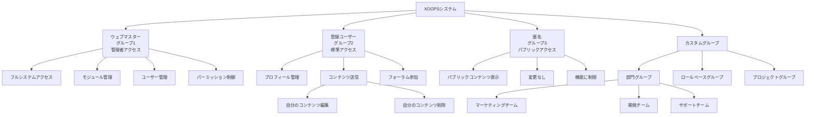
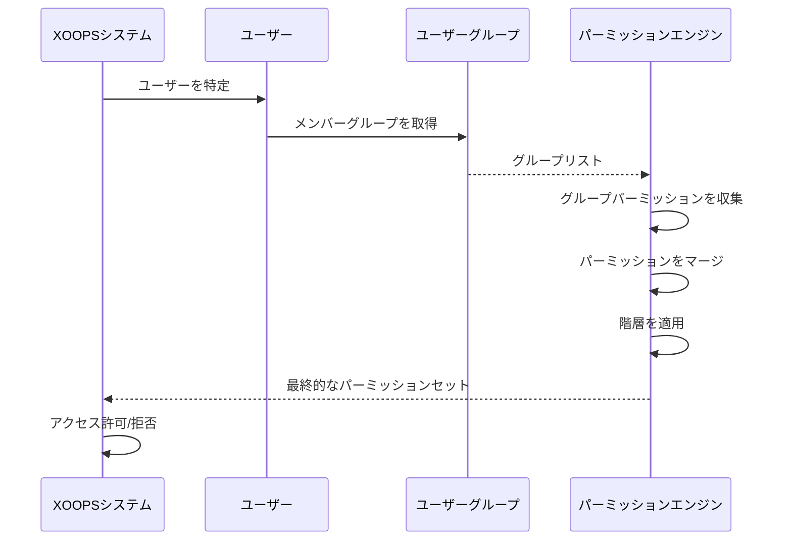

# XOOPSのグループシステム

XOOPSグループシステムは、ユーザーを組織化し、集団的なパーミッションを管理するための階層的フレームワークを提供します。このドキュメントはデフォルトグループ、カスタムグループ作成、階層、実装例をカバーしています。

## デフォルトグループ

XOOPSはシステムインストール時に作成される3つの基本的なグループを含みます:

### ウェブマスターグループ（ID: 1）

ウェブマスターグループはフルシステムアクセス権を持つサイト管理者を表します。

**特性:**
- グループID: 1
- 最高レベルの特権
- 削除不可
- すべてのモジュールと機能へのフルアクセス
- 管理パネルへのアクセス

```php
<?php
/**
 * ユーザーがウェブマスターかどうかをチェック
 */
$groupHandler = xoops_getHandler('group');
$group = $groupHandler->getGroup(1);
$webmasterUsers = $groupHandler->getUsersByGroup(1);

if ($xoopsUser instanceof XoopsUser) {
    $groups = $xoopsUser->getGroups();
    if (in_array(1, $groups)) {
        // ユーザーはウェブマスター
        echo "Welcome, Site Administrator!";
    }
}
```

### 登録ユーザーグループ（ID: 2）

登録ユーザーグループは、匿名でないすべての認証ユーザーを含みます。

**特性:**
- グループID: 2
- 新規登録のデフォルトグループ
- ユーザー固有の機能にアクセス可能
- グループベースのパーミッションの対象
- 標準的なユーザー機能にカスタマイズ可能

```php
<?php
/**
 * ユーザーが登録済み（匿名でない）かどうかをチェック
 */
if ($xoopsUser instanceof XoopsUser) {
    // ユーザーはログイン済み
    $groups = $xoopsUser->getGroups();
    if (in_array(2, $groups)) {
        // ユーザーは登録グループに属している
        echo "Welcome, registered user!";
    }
}
```

### 匿名グループ（ID: 3）

匿名グループはサイトの非認証訪問者を表します。

**特性:**
- グループID: 3
- ログインしていないユーザーのデフォルトグループ
- 通常、読み取り専用アクセスに限定
- コンテンツを変更できない
- パブリック表示パーミッション

```php
<?php
/**
 * ユーザーが匿名かどうかをチェック
 */
if (!$xoopsUser instanceof XoopsUser) {
    // ユーザーはログインしていない
    echo "Public content only";
}

// グループチェックを使用した別の方法
$anonymousUsers = xoops_getHandler('group')->getUsersByGroup(3);
```

## グループ構造

### データベーススキーマ

```sql
CREATE TABLE xoops_groups (
  group_id INT(11) NOT NULL AUTO_INCREMENT PRIMARY KEY,
  group_name VARCHAR(255) NOT NULL UNIQUE,
  group_description TEXT,
  group_type TINYINT(1) NOT NULL DEFAULT 0,
  group_active TINYINT(1) NOT NULL DEFAULT 1,
  created_at TIMESTAMP DEFAULT CURRENT_TIMESTAMP,
  updated_at TIMESTAMP DEFAULT CURRENT_TIMESTAMP ON UPDATE CURRENT_TIMESTAMP
);

CREATE TABLE xoops_group_users (
  group_id INT(11) NOT NULL,
  uid INT(11) NOT NULL,
  PRIMARY KEY (group_id, uid),
  FOREIGN KEY (group_id) REFERENCES xoops_groups(group_id) ON DELETE CASCADE,
  FOREIGN KEY (uid) REFERENCES xoops_users(uid) ON DELETE CASCADE
);
```

### XoopsGroupクラスプロパティ

```php
class XoopsGroup
{
    protected $group_id;
    protected $group_name;
    protected $group_description;
    protected $group_type;
    protected $group_active;
    protected $created_at;
    protected $updated_at;
}
```

## グループ階層

### 階層図



### パーミッション継承



## カスタムグループの作成

### グループ作成ハンドラー

```php
<?php
/**
 * カスタムグループ管理
 */
class GroupManager
{
    private $groupHandler;
    private $permissionHandler;

    public function __construct()
    {
        $this->groupHandler = xoops_getHandler('group');
        $this->permissionHandler = xoops_getHandler('permission');
    }

    /**
     * 新しいグループを作成
     *
     * @param array $data グループデータ
     * @return XoopsGroup|false 新しいグループまたはfalse
     */
    public function createGroup(array $data)
    {
        // 入力を検証
        if (empty($data['group_name'])) {
            throw new Exception('Group name is required');
        }

        if (strlen($data['group_name']) < 3 || strlen($data['group_name']) > 255) {
            throw new Exception('Group name must be between 3 and 255 characters');
        }

        // グループが既に存在するかをチェック
        $existing = $this->groupHandler->getByName($data['group_name']);
        if ($existing) {
            throw new Exception('Group already exists');
        }

        // グループオブジェクトを作成
        $group = $this->groupHandler->create();
        $group->setVar('group_name', $data['group_name']);
        $group->setVar('group_description', $data['group_description'] ?? '');
        $group->setVar('group_type', $data['group_type'] ?? 0);
        $group->setVar('group_active', $data['group_active'] ?? 1);

        // グループを保存
        if ($this->groupHandler->insert($group)) {
            return $group;
        }

        return false;
    }

    /**
     * グループを更新
     *
     * @param int $groupId グループID
     * @param array $data 更新データ
     * @return bool 成功状況
     */
    public function updateGroup(int $groupId, array $data): bool
    {
        $group = $this->groupHandler->get($groupId);
        if (!$group) {
            return false;
        }

        // デフォルトグループの変更を防止
        if (in_array($groupId, [1, 2, 3])) {
            if (isset($data['group_name']) && $data['group_name'] !== $group->getVar('group_name')) {
                throw new Exception('Cannot rename default groups');
            }
        }

        if (isset($data['group_name'])) {
            $group->setVar('group_name', $data['group_name']);
        }

        if (isset($data['group_description'])) {
            $group->setVar('group_description', $data['group_description']);
        }

        if (isset($data['group_active']) && !in_array($groupId, [1, 2, 3])) {
            $group->setVar('group_active', (int)$data['group_active']);
        }

        if (isset($data['group_type'])) {
            $group->setVar('group_type', (int)$data['group_type']);
        }

        return $this->groupHandler->insert($group);
    }

    /**
     * ユーザーをグループに追加
     *
     * @param int $uid ユーザーID
     * @param int $groupId グループID
     * @return bool 成功状況
     */
    public function addUserToGroup(int $uid, int $groupId): bool
    {
        return $this->groupHandler->addUser($uid, $groupId);
    }

    /**
     * ユーザーをグループから削除
     *
     * @param int $uid ユーザーID
     * @param int $groupId グループID
     * @return bool 成功状況
     */
    public function removeUserFromGroup(int $uid, int $groupId): bool
    {
        return $this->groupHandler->removeUser($uid, $groupId);
    }

    /**
     * グループメンバーを取得
     *
     * @param int $groupId グループID
     * @return array ユーザーオブジェクトの配列
     */
    public function getGroupMembers(int $groupId): array
    {
        return $this->groupHandler->getUsersByGroup($groupId);
    }

    /**
     * ユーザーグループを取得
     *
     * @param int $uid ユーザーID
     * @return array グループオブジェクトの配列
     */
    public function getUserGroups(int $uid): array
    {
        return $this->groupHandler->getGroupsByUser($uid);
    }

    /**
     * グループを削除
     *
     * @param int $groupId グループID
     * @return bool 成功状況
     */
    public function deleteGroup(int $groupId): bool
    {
        // デフォルトグループの削除を防止
        if (in_array($groupId, [1, 2, 3])) {
            throw new Exception('Cannot delete default groups');
        }

        // すべてのグループユーザーを最初に削除
        $db = XoopsDatabaseFactory::getDatabaseConnection();
        $db->query("DELETE FROM xoops_group_users WHERE group_id = ?", array($groupId));

        // グループパーミッションを削除
        $db->query("DELETE FROM xoops_group_permission WHERE group_id = ?", array($groupId));

        // グループを削除
        return $this->groupHandler->delete($groupId);
    }
}
```

## グループパーミッション割り当て

### グループへのパーミッション割り当て

```php
<?php
/**
 * グループパーミッション割り当て
 */
class GroupPermissionAssignment
{
    private $permissionHandler;
    private $groupHandler;
    private $moduleHandler;

    public function __construct()
    {
        $this->permissionHandler = xoops_getHandler('groupperm');
        $this->groupHandler = xoops_getHandler('group');
        $this->moduleHandler = xoops_getHandler('module');
    }

    /**
     * グループにモジュールパーミッションを付与
     *
     * @param int $groupId グループID
     * @param string $permission パーミッション名
     * @param int $moduleId モジュールID
     * @param array $itemIds アイテムID（オプション）
     * @return bool 成功状況
     */
    public function grantModulePermission(
        int $groupId,
        string $permission,
        int $moduleId,
        array $itemIds = []
    ): bool
    {
        if (empty($itemIds)) {
            // モジュールレベルのパーミッションを付与
            return $this->permissionHandler->addRight(
                $permission,
                $groupId,
                $moduleId
            );
        } else {
            // アイテムレベルのパーミッションを付与
            foreach ($itemIds as $itemId) {
                $this->permissionHandler->addRight(
                    $permission,
                    $groupId,
                    $moduleId,
                    $itemId
                );
            }
            return true;
        }
    }

    /**
     * グループからモジュールパーミッションを取り消し
     *
     * @param int $groupId グループID
     * @param string $permission パーミッション名
     * @param int $moduleId モジュールID
     * @param array $itemIds アイテムID（オプション）
     * @return bool 成功状況
     */
    public function revokeModulePermission(
        int $groupId,
        string $permission,
        int $moduleId,
        array $itemIds = []
    ): bool
    {
        if (empty($itemIds)) {
            return $this->permissionHandler->deleteRight(
                $permission,
                $groupId,
                $moduleId
            );
        } else {
            foreach ($itemIds as $itemId) {
                $this->permissionHandler->deleteRight(
                    $permission,
                    $groupId,
                    $moduleId,
                    $itemId
                );
            }
            return true;
        }
    }

    /**
     * グループがパーミッションを持つかどうかをチェック
     *
     * @param int $groupId グループID
     * @param string $permission パーミッション名
     * @param int $moduleId モジュールID
     * @param int $itemId アイテムID（オプション）
     * @return bool パーミッション状況
     */
    public function hasPermission(
        int $groupId,
        string $permission,
        int $moduleId,
        int $itemId = 0
    ): bool
    {
        return $this->permissionHandler->checkRight(
            $permission,
            $groupId,
            $moduleId,
            $itemId
        );
    }

    /**
     * モジュール内のグループのすべてのパーミッションを取得
     *
     * @param int $groupId グループID
     * @param int $moduleId モジュールID
     * @return array パーミッションリスト
     */
    public function getGroupModulePermissions(
        int $groupId,
        int $moduleId
    ): array
    {
        return $this->permissionHandler->getGroupPermissions(
            $groupId,
            $moduleId
        );
    }

    /**
     * 複数のパーミッションを一度に割り当て
     *
     * @param int $groupId グループID
     * @param array $permissions パーミッションデータ
     * @return bool 成功状況
     */
    public function assignBulkPermissions(int $groupId, array $permissions): bool
    {
        try {
            foreach ($permissions as $perm) {
                $this->grantModulePermission(
                    $groupId,
                    $perm['permission'],
                    $perm['module_id'],
                    $perm['item_ids'] ?? []
                );
            }
            return true;
        } catch (Exception $e) {
            return false;
        }
    }
}
```

## 実用的な例

### 部門グループ設定

```php
<?php
/**
 * 例: 部門グループの設定
 */

$groupManager = new GroupManager();
$permissionAssigner = new GroupPermissionAssignment();

// マーケティング部門グループを作成
$marketingGroup = $groupManager->createGroup([
    'group_name' => 'Marketing Department',
    'group_description' => 'Marketing team members',
    'group_type' => 1,
    'group_active' => 1
]);

$marketingId = $marketingGroup->getVar('group_id');

// 開発部門グループを作成
$devGroup = $groupManager->createGroup([
    'group_name' => 'Development Department',
    'group_description' => 'Development team members',
    'group_type' => 1,
    'group_active' => 1
]);

$devId = $devGroup->getVar('group_id');

// ユーザーをグループに追加
$groupManager->addUserToGroup(5, $marketingId);
$groupManager->addUserToGroup(6, $marketingId);
$groupManager->addUserToGroup(7, $devId);
$groupManager->addUserToGroup(8, $devId);

// パーミッションを割り当て
// マーケティングはアーティクルを表示・送信可能
$permissionAssigner->grantModulePermission(
    $marketingId,
    'module_view',
    2  // Article module
);

$permissionAssigner->grantModulePermission(
    $marketingId,
    'module_submit',
    2
);

// 開発はすべての開発ツールにアクセス可能
$permissionAssigner->grantModulePermission(
    $devId,
    'module_view',
    4  // Developer module
);

$permissionAssigner->grantModulePermission(
    $devId,
    'module_admin',
    4
);
```

### ユーザーグループのチェック

```php
<?php
/**
 * 例: ユーザーグループメンバーシップのチェック
 */

$groupManager = new GroupManager();
$xoopsUser = $GLOBALS['xoopsUser'];

if ($xoopsUser instanceof XoopsUser) {
    $userGroups = $groupManager->getUserGroups($xoopsUser->getVar('uid'));

    // 特定のグループメンバーシップをチェック
    $isInMarketing = false;
    foreach ($userGroups as $group) {
        if ($group->getVar('group_name') === 'Marketing Department') {
            $isInMarketing = true;
            break;
        }
    }

    if ($isInMarketing) {
        echo "Welcome to Marketing!";
    }

    // グループ名を取得
    $groupNames = array_map(function($g) {
        return $g->getVar('group_name');
    }, $userGroups);

    echo "You are member of: " . implode(", ", $groupNames);
}
```

### 複数グループへの割り当て

```php
<?php
/**
 * 例: ユーザーを複数グループに割り当て
 */

$groupManager = new GroupManager();

// グループIDを取得
$groupHandler = xoops_getHandler('group');
$marketingGroup = $groupHandler->getByName('Marketing Department');
$writerGroup = $groupHandler->getByName('Writers');

// ユーザーを複数グループに追加
$userId = 12;
$groupManager->addUserToGroup($userId, $marketingGroup->getVar('group_id'));
$groupManager->addUserToGroup($userId, $writerGroup->getVar('group_id'));

// ユーザーは両方のグループから結合されたパーミッションを持つようになります
```

## ベストプラクティス

### グループ組織

1. **明確な命名**: 説明的で明確なグループ名を使用
2. **ドキュメント化**: グループの目的とパーミッションをドキュメント化
3. **最小権限の原則**: 最小限の必要なパーミッションを付与
4. **定期的な監査**: グループメンバーシップとパーミッションを定期的に確認
5. **デフォルトグループ**: デフォルトグループ（ウェブマスター、登録、匿名）を保持

### パーミッション管理

```php
<?php
/**
 * ベストプラクティス: パーミッション監査関数
 */
class GroupAudit
{
    /**
     * グループパーミッションを監査
     *
     * @param int $groupId グループID
     * @return array 監査レポート
     */
    public function auditGroupPermissions(int $groupId): array
    {
        $permissionHandler = xoops_getHandler('groupperm');
        $groupHandler = xoops_getHandler('group');
        $moduleHandler = xoops_getHandler('module');

        $group = $groupHandler->get($groupId);
        if (!$group) {
            return ['error' => 'Group not found'];
        }

        $modules = $moduleHandler->getList();
        $report = [
            'group_name' => $group->getVar('group_name'),
            'members_count' => count($groupHandler->getUsersByGroup($groupId)),
            'permissions_by_module' => []
        ];

        foreach ($modules as $moduleId => $moduleName) {
            $perms = $permissionHandler->getGroupPermissions($groupId, $moduleId);
            if (!empty($perms)) {
                $report['permissions_by_module'][$moduleName] = $perms;
            }
        }

        return $report;
    }
}
```

## 関連リンク

- User Management.md
- Permission System.md
- Authentication.md
- ../../Security/Security-Guidelines.md

## タグ

#groups #group-management #permissions #access-control #user-organization #hierarchy
