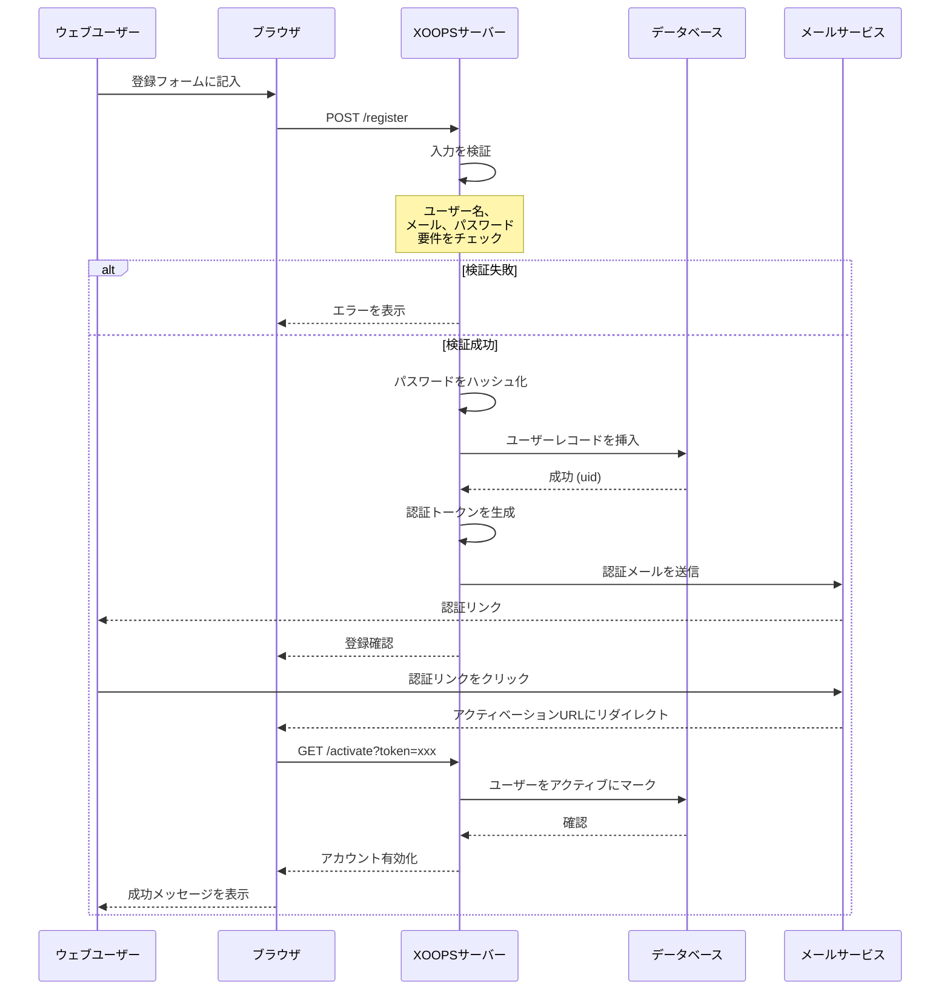
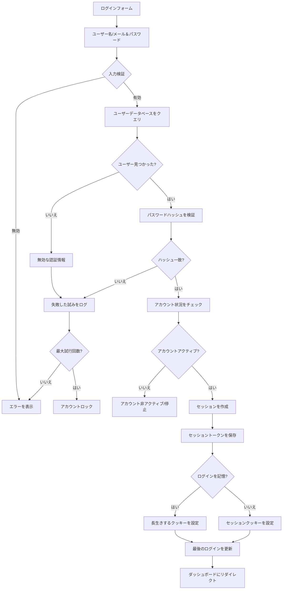

# XOOPSのユーザー管理

XOOPSユーザー管理システムは、ユーザー登録、認証、プロフィール管理、ユーザー設定を処理するための完全なフレームワークを提供します。このドキュメントはユーザーオブジェクト構造、登録フロー、実装例をカバーしています。

## ユーザーオブジェクト構造

XOOPSの中核となるユーザーオブジェクトは、すべてのユーザーデータとメソッドをカプセル化する`XoopsUser`クラスです。

### データベーススキーマ

```sql
CREATE TABLE xoops_users (
  uid INT(11) NOT NULL AUTO_INCREMENT PRIMARY KEY,
  uname VARCHAR(25) NOT NULL UNIQUE,
  email VARCHAR(60) NOT NULL,
  pass VARCHAR(255) NOT NULL,
  pass_expired DATETIME DEFAULT NULL,
  created_at TIMESTAMP DEFAULT CURRENT_TIMESTAMP,
  updated_at TIMESTAMP DEFAULT CURRENT_TIMESTAMP ON UPDATE CURRENT_TIMESTAMP,
  last_login DATETIME DEFAULT NULL,
  login_attempts INT(11) DEFAULT 0,
  user_avatar VARCHAR(255) NOT NULL DEFAULT 'blank.gif',
  user_regdate INT(11) NOT NULL DEFAULT 0,
  user_icq VARCHAR(15) NOT NULL DEFAULT '',
  user_from VARCHAR(100) NOT NULL DEFAULT '',
  user_sig TEXT,
  user_sig_smilies TINYINT(1) NOT NULL DEFAULT 1,
  user_viewemail TINYINT(1) NOT NULL DEFAULT 0,
  user_attachsig TINYINT(1) NOT NULL DEFAULT 0,
  user_theme VARCHAR(32) NOT NULL DEFAULT '',
  user_language VARCHAR(32) NOT NULL DEFAULT '',
  user_openid VARCHAR(255) NOT NULL DEFAULT '',
  user_notify_method TINYINT(1) NOT NULL DEFAULT 0,
  user_notify_interval INT(11) NOT NULL DEFAULT 0
);
```

### XoopsUserクラスプロパティ

```php
class XoopsUser
{
    protected $uid;
    protected $uname;
    protected $email;
    protected $pass;
    protected $pass_expired;
    protected $created_at;
    protected $updated_at;
    protected $last_login;
    protected $login_attempts;
    protected $user_avatar;
    protected $user_regdate;
    protected $user_icq;
    protected $user_from;
    protected $user_sig;
    protected $user_sig_smilies;
    protected $user_viewemail;
    protected $user_attachsig;
    protected $user_theme;
    protected $user_language;
    protected $user_openid;
    protected $user_notify_method;
    protected $user_notify_interval;
}
```

## ユーザー登録フロー

### 登録シーケンス図



### 登録実装

```php
<?php
/**
 * ユーザー登録ハンドラー
 */
class RegistrationHandler
{
    private $userHandler;
    private $configHandler;

    public function __construct()
    {
        $this->userHandler = xoops_getHandler('user');
        $this->configHandler = xoops_getHandler('config');
    }

    /**
     * 登録入力を検証
     *
     * @param array $data 登録フォームデータ
     * @return array 検証エラー、有効な場合は空
     */
    public function validateInput(array $data): array
    {
        $errors = [];

        // ユーザー名検証
        if (empty($data['uname'])) {
            $errors[] = 'Username is required';
        } elseif (strlen($data['uname']) < 3) {
            $errors[] = 'Username must be at least 3 characters';
        } elseif (!preg_match('/^[a-zA-Z0-9_-]+$/', $data['uname'])) {
            $errors[] = 'Username contains invalid characters';
        } elseif ($this->userHandler->getUserByName($data['uname'])) {
            $errors[] = 'Username already exists';
        }

        // メール検証
        if (empty($data['email'])) {
            $errors[] = 'Email is required';
        } elseif (!filter_var($data['email'], FILTER_VALIDATE_EMAIL)) {
            $errors[] = 'Invalid email format';
        } elseif ($this->userHandler->getUserByEmail($data['email'])) {
            $errors[] = 'Email already registered';
        }

        // パスワード検証
        if (empty($data['password'])) {
            $errors[] = 'Password is required';
        } elseif (strlen($data['password']) < 8) {
            $errors[] = 'Password must be at least 8 characters';
        } elseif ($data['password'] !== $data['password_confirm']) {
            $errors[] = 'Passwords do not match';
        }

        return $errors;
    }

    /**
     * 新しいユーザーを登録
     *
     * @param array $data 登録データ
     * @return XoopsUser|false ユーザーオブジェクトまたは失敗時はfalse
     */
    public function registerUser(array $data)
    {
        // 入力を検証
        $errors = $this->validateInput($data);
        if (!empty($errors)) {
            return false;
        }

        // ユーザーオブジェクトを作成
        $user = $this->userHandler->create();
        $user->setVar('uname', $data['uname']);
        $user->setVar('email', $data['email']);
        $user->setVar('user_regdate', time());

        // bcryptを使用してパスワードをハッシュ化
        $hashedPassword = password_hash(
            $data['password'],
            PASSWORD_BCRYPT,
            ['cost' => 12]
        );
        $user->setVar('pass', $hashedPassword);

        // デフォルト設定を設定
        $user->setVar('user_theme', $this->configHandler->getConfig('default_theme'));
        $user->setVar('user_language', $this->configHandler->getConfig('default_language'));

        // ユーザーを保存
        if ($this->userHandler->insertUser($user)) {
            $uid = $user->getVar('uid');

            // 認証トークンを生成
            $token = bin2hex(random_bytes(32));
            $this->saveVerificationToken($uid, $token);

            // 認証メールを送信
            $this->sendVerificationEmail($user, $token);

            return $user;
        }

        return false;
    }

    /**
     * 認証トークンを保存
     *
     * @param int $uid ユーザーID
     * @param string $token 認証トークン
     */
    private function saveVerificationToken(int $uid, string $token): void
    {
        $tokenHandler = xoops_getHandler('usertoken');
        $tokenHandler->saveToken($uid, $token, 'email_verification', 24); // 24時間
    }

    /**
     * 認証メールを送信
     *
     * @param XoopsUser $user ユーザーオブジェクト
     * @param string $token 認証トークン
     */
    private function sendVerificationEmail(XoopsUser $user, string $token): void
    {
        global $xoopsConfig;

        $siteUrl = $xoopsConfig['siteurl'];
        $activationUrl = $siteUrl . '/user.php?op=activate&token=' . $token;

        $subject = 'Email Verification - ' . $xoopsConfig['sitename'];
        $body = "Hello " . $user->getVar('uname') . ",\n\n";
        $body .= "Please click the link below to verify your email:\n";
        $body .= $activationUrl . "\n\n";
        $body .= "This link will expire in 24 hours.\n\n";
        $body .= "Regards,\n" . $xoopsConfig['sitename'];

        $mailHandler = xoops_getHandler('mail');
        $mailHandler->send($user->getVar('email'), $subject, $body);
    }
}
```

## ユーザー認証プロセス

### 認証フロー図



### 認証実装

```php
<?php
/**
 * 認証ハンドラー
 */
class AuthenticationHandler
{
    private $userHandler;
    private $maxLoginAttempts = 5;
    private $lockoutDuration = 900; // 15分

    public function __construct()
    {
        $this->userHandler = xoops_getHandler('user');
    }

    /**
     * ユーザーをユーザー名/メールとパスワードで認証
     *
     * @param string $username ユーザー名またはメール
     * @param string $password プレーンテキストパスワード
     * @param bool $rememberMe ログインを記憶
     * @return XoopsUser|false 認証ユーザーまたはfalse
     */
    public function authenticate(
        string $username,
        string $password,
        bool $rememberMe = false
    )
    {
        // アカウントロックアウトをチェック
        if ($this->isAccountLocked($username)) {
            throw new Exception('Account temporarily locked due to failed login attempts');
        }

        // ユーザー名またはメールでユーザーを検索
        $user = $this->userHandler->getUserByName($username);
        if (!$user) {
            $user = $this->userHandler->getUserByEmail($username);
        }

        if (!$user) {
            $this->recordFailedAttempt($username);
            return false;
        }

        // パスワードを検証
        if (!password_verify($password, $user->getVar('pass'))) {
            $this->recordFailedAttempt($username);
            return false;
        }

        // アカウント状況をチェック
        if ($user->getVar('level') == 0) {
            throw new Exception('Account is inactive');
        }

        // 失敗した試みをクリア
        $this->clearFailedAttempts($user->getVar('uid'));

        // 最後のログインを更新
        $user->setVar('last_login', date('Y-m-d H:i:s'));
        $this->userHandler->insertUser($user);

        // セッションを作成
        $this->createSession($user, $rememberMe);

        return $user;
    }

    /**
     * 認証されたセッションを作成
     *
     * @param XoopsUser $user ユーザーオブジェクト
     * @param bool $rememberMe 永続ログインを有効化
     */
    private function createSession(XoopsUser $user, bool $rememberMe = false): void
    {
        // セッショントークンを生成
        $token = bin2hex(random_bytes(32));

        $_SESSION['xoopsUserId'] = $user->getVar('uid');
        $_SESSION['xoopsUserName'] = $user->getVar('uname');
        $_SESSION['xoopsSessionToken'] = $token;
        $_SESSION['xoopsSessionCreated'] = time();

        // トークンをデータベースに保存して検証用に使用
        $this->storeSessionToken($user->getVar('uid'), $token);

        if ($rememberMe) {
            // 永続ログインクッキーを作成（14日間）
            $cookieToken = bin2hex(random_bytes(32));
            setcookie(
                'xoops_persistent_login',
                $cookieToken,
                time() + (14 * 24 * 60 * 60),
                '/',
                '',
                true,  // HTTPS only
                true   // HttpOnly
            );

            // クッキートークンハッシュを保存
            $this->storePersistentToken(
                $user->getVar('uid'),
                hash('sha256', $cookieToken)
            );
        }
    }

    /**
     * 失敗したログイン試行を記録
     *
     * @param string $username ユーザー名またはメール
     */
    private function recordFailedAttempt(string $username): void
    {
        $key = 'login_attempt_' . md5($username);
        $attempts = apcu_fetch($key) ?: 0;
        apcu_store($key, $attempts + 1, $this->lockoutDuration);
    }

    /**
     * アカウントがロックされているかをチェック
     *
     * @param string $username ユーザー名またはメール
     * @return bool ロックされている場合はtrue
     */
    private function isAccountLocked(string $username): bool
    {
        $key = 'login_attempt_' . md5($username);
        $attempts = apcu_fetch($key) ?: 0;
        return $attempts >= $this->maxLoginAttempts;
    }

    /**
     * 失敗した試みをクリア
     *
     * @param int $uid ユーザーID
     */
    private function clearFailedAttempts(int $uid): void
    {
        $user = $this->userHandler->getUser($uid);
        $user->setVar('login_attempts', 0);
        $this->userHandler->insertUser($user);
    }

    /**
     * セッショントークンを保存
     *
     * @param int $uid ユーザーID
     * @param string $token セッショントークン
     */
    private function storeSessionToken(int $uid, string $token): void
    {
        // データベースまたはキャッシュに保存
        $tokenData = [
            'uid' => $uid,
            'token' => hash('sha256', $token),
            'created' => time(),
            'expires' => time() + (8 * 60 * 60) // 8時間
        ];

        $db = XoopsDatabaseFactory::getDatabaseConnection();
        $db->query("INSERT INTO xoops_sessions (uid, token, created, expires)
                   VALUES (?, ?, ?, ?)",
                   array($uid, $tokenData['token'], $tokenData['created'], $tokenData['expires']));
    }
}
```

## プロフィール管理

### プロフィール更新実装

```php
<?php
/**
 * ユーザープロフィール管理
 */
class ProfileManager
{
    private $userHandler;
    private $avatarHandler;

    public function __construct()
    {
        $this->userHandler = xoops_getHandler('user');
        $this->avatarHandler = xoops_getHandler('avatar');
    }

    /**
     * ユーザープロフィールを更新
     *
     * @param int $uid ユーザーID
     * @param array $data プロフィールデータ
     * @return bool 成功状況
     */
    public function updateProfile(int $uid, array $data): bool
    {
        $user = $this->userHandler->getUser($uid);
        if (!$user) {
            return false;
        }

        // プロフィールフィールドを更新
        if (isset($data['email'])) {
            // メールが一意であることを確認（現在のユーザーを除く）
            $existingUser = $this->userHandler->getUserByEmail($data['email']);
            if ($existingUser && $existingUser->getVar('uid') !== $uid) {
                throw new Exception('Email already in use');
            }
            $user->setVar('email', $data['email']);
        }

        if (isset($data['user_icq'])) {
            $user->setVar('user_icq', sanitize_text_field($data['user_icq']));
        }

        if (isset($data['user_from'])) {
            $user->setVar('user_from', sanitize_text_field($data['user_from']));
        }

        if (isset($data['user_sig'])) {
            $sig = $data['user_sig'];
            if (strlen($sig) > 500) {
                throw new Exception('Signature too long');
            }
            $user->setVar('user_sig', $sig);
        }

        if (isset($data['user_sig_smilies'])) {
            $user->setVar('user_sig_smilies', (int)$data['user_sig_smilies']);
        }

        if (isset($data['user_viewemail'])) {
            $user->setVar('user_viewemail', (int)$data['user_viewemail']);
        }

        if (isset($data['user_attachsig'])) {
            $user->setVar('user_attachsig', (int)$data['user_attachsig']);
        }

        if (isset($data['user_theme'])) {
            $user->setVar('user_theme', $data['user_theme']);
        }

        if (isset($data['user_language'])) {
            $user->setVar('user_language', $data['user_language']);
        }

        return $this->userHandler->insertUser($user);
    }

    /**
     * ユーザーパスワードを変更
     *
     * @param int $uid ユーザーID
     * @param string $currentPassword 現在のパスワード
     * @param string $newPassword 新しいパスワード
     * @return bool 成功状況
     */
    public function changePassword(
        int $uid,
        string $currentPassword,
        string $newPassword
    ): bool
    {
        $user = $this->userHandler->getUser($uid);
        if (!$user) {
            return false;
        }

        // 現在のパスワードを検証
        if (!password_verify($currentPassword, $user->getVar('pass'))) {
            throw new Exception('Current password is incorrect');
        }

        // 新しいパスワードを検証
        if (strlen($newPassword) < 8) {
            throw new Exception('New password must be at least 8 characters');
        }

        // 新しいパスワードをハッシュ化
        $hashedPassword = password_hash($newPassword, PASSWORD_BCRYPT, ['cost' => 12]);
        $user->setVar('pass', $hashedPassword);

        return $this->userHandler->insertUser($user);
    }

    /**
     * ユーザープロフィールデータを取得
     *
     * @param int $uid ユーザーID
     * @return array プロフィールデータ
     */
    public function getProfile(int $uid): array
    {
        $user = $this->userHandler->getUser($uid);
        if (!$user) {
            return [];
        }

        return [
            'uid' => $user->getVar('uid'),
            'uname' => $user->getVar('uname'),
            'email' => $user->getVar('email'),
            'user_regdate' => $user->getVar('user_regdate'),
            'user_icq' => $user->getVar('user_icq'),
            'user_from' => $user->getVar('user_from'),
            'user_sig' => $user->getVar('user_sig'),
            'user_viewemail' => $user->getVar('user_viewemail'),
            'user_attachsig' => $user->getVar('user_attachsig'),
            'user_theme' => $user->getVar('user_theme'),
            'user_language' => $user->getVar('user_language'),
            'last_login' => $user->getVar('last_login'),
            'avatar' => $user->getVar('user_avatar')
        ];
    }
}
```

## アバター処理

### アバター管理

```php
<?php
/**
 * ユーザーアバターハンドラー
 */
class AvatarHandler
{
    private $avatarPath = '/uploads/avatars/';
    private $maxSize = 2097152; // 2MB
    private $allowedTypes = ['image/jpeg', 'image/png', 'image/gif'];

    /**
     * ユーザーアバターをアップロード
     *
     * @param int $uid ユーザーID
     * @param array $file $_FILES配列
     * @return string|false アバターファイル名またはfalse
     */
    public function uploadAvatar(int $uid, array $file)
    {
        // ファイルを検証
        if ($file['error'] !== UPLOAD_ERR_OK) {
            throw new Exception('File upload error: ' . $file['error']);
        }

        if ($file['size'] > $this->maxSize) {
            throw new Exception('File too large (max 2MB)');
        }

        if (!in_array($file['type'], $this->allowedTypes)) {
            throw new Exception('Invalid file type');
        }

        // MIMEタイプを検証
        $finfo = finfo_open(FILEINFO_MIME_TYPE);
        $mimeType = finfo_file($finfo, $file['tmp_name']);
        finfo_close($finfo);

        if (!in_array($mimeType, $this->allowedTypes)) {
            throw new Exception('Invalid file content');
        }

        // 一意のファイル名を生成
        $extension = pathinfo($file['name'], PATHINFO_EXTENSION);
        $filename = 'avatar_' . $uid . '_' . time() . '.' . $extension;

        // アップロードディレクトリを作成
        $uploadDir = XOOPS_ROOT_PATH . $this->avatarPath;
        if (!is_dir($uploadDir)) {
            mkdir($uploadDir, 0755, true);
        }

        $filepath = $uploadDir . $filename;

        // アップロードされたファイルを移動
        if (!move_uploaded_file($file['tmp_name'], $filepath)) {
            throw new Exception('Failed to move uploaded file');
        }

        // イメージを標準サイズにリサイズ（150x150）
        $this->resizeImage($filepath, 150, 150);

        // ユーザーアバターを更新
        $userHandler = xoops_getHandler('user');
        $user = $userHandler->getUser($uid);

        // 古いアバターが存在する場合は削除
        $oldAvatar = $user->getVar('user_avatar');
        if ($oldAvatar && $oldAvatar !== 'blank.gif') {
            $oldPath = $uploadDir . $oldAvatar;
            if (file_exists($oldPath)) {
                unlink($oldPath);
            }
        }

        // 新しいアバターを保存
        $user->setVar('user_avatar', $filename);
        $userHandler->insertUser($user);

        return $filename;
    }

    /**
     * イメージを指定された寸法にリサイズ
     *
     * @param string $filepath イメージファイルへのパス
     * @param int $width ターゲット幅
     * @param int $height ターゲット高さ
     */
    private function resizeImage(string $filepath, int $width, int $height): void
    {
        if (!extension_loaded('gd')) {
            return; // GDが利用できない、リサイズをスキップ
        }

        $image = imagecreatefromstring(file_get_contents($filepath));
        if (!$image) {
            return;
        }

        $resized = imagecreatetruecolor($width, $height);

        // PNGとGIFの透明性を保持
        $format = mime_content_type($filepath);
        if ($format === 'image/png' || $format === 'image/gif') {
            imagealphablending($resized, false);
            imagesavealpha($resized, true);
        }

        imagecopyresampled(
            $resized, $image,
            0, 0, 0, 0,
            $width, $height,
            imagesx($image), imagesy($image)
        );

        // リサイズされたイメージを保存
        $ext = pathinfo($filepath, PATHINFO_EXTENSION);
        if (strtolower($ext) === 'png') {
            imagepng($resized, $filepath, 9);
        } else {
            imagejpeg($resized, $filepath, 90);
        }

        imagedestroy($image);
        imagedestroy($resized);
    }

    /**
     * ユーザーアバターを削除
     *
     * @param int $uid ユーザーID
     * @return bool 成功状況
     */
    public function deleteAvatar(int $uid): bool
    {
        $userHandler = xoops_getHandler('user');
        $user = $userHandler->getUser($uid);

        if (!$user) {
            return false;
        }

        $avatar = $user->getVar('user_avatar');
        if ($avatar && $avatar !== 'blank.gif') {
            $filepath = XOOPS_ROOT_PATH . $this->avatarPath . $avatar;
            if (file_exists($filepath)) {
                unlink($filepath);
            }
        }

        $user->setVar('user_avatar', 'blank.gif');
        return $userHandler->insertUser($user);
    }
}
```

## ユーザー設定

### 設定システム

```php
<?php
/**
 * ユーザー設定ハンドラー
 */
class UserPreferencesHandler
{
    private $userHandler;
    private $prefixCache = 'user_pref_';

    public function __construct()
    {
        $this->userHandler = xoops_getHandler('user');
    }

    /**
     * ユーザー設定を取得
     *
     * @param int $uid ユーザーID
     * @param string $prefKey 設定キー
     * @param mixed $default デフォルト値
     * @return mixed 設定値
     */
    public function getPreference(int $uid, string $prefKey, $default = null)
    {
        // キャッシュを最初に試す
        $cacheKey = $this->prefixCache . $uid . '_' . $prefKey;
        $cached = apcu_fetch($cacheKey);
        if ($cached !== false) {
            return $cached;
        }

        // データベースから取得
        $db = XoopsDatabaseFactory::getDatabaseConnection();
        $result = $db->query(
            "SELECT pref_value FROM xoops_user_preferences
             WHERE uid = ? AND pref_key = ?",
            array($uid, $prefKey)
        );

        if ($result && $db->getRowCount($result) > 0) {
            $row = $db->fetchArray($result);
            $value = unserialize($row['pref_value']);
            apcu_store($cacheKey, $value, 3600); // 1時間キャッシュ
            return $value;
        }

        return $default;
    }

    /**
     * ユーザー設定を設定
     *
     * @param int $uid ユーザーID
     * @param string $prefKey 設定キー
     * @param mixed $prefValue 設定値
     * @return bool 成功状況
     */
    public function setPreference(int $uid, string $prefKey, $prefValue): bool
    {
        $db = XoopsDatabaseFactory::getDatabaseConnection();

        // 設定が存在するかをチェック
        $result = $db->query(
            "SELECT id FROM xoops_user_preferences
             WHERE uid = ? AND pref_key = ?",
            array($uid, $prefKey)
        );

        $serialized = serialize($prefValue);

        if ($db->getRowCount($result) > 0) {
            // 既存の設定を更新
            $success = $db->query(
                "UPDATE xoops_user_preferences
                 SET pref_value = ?
                 WHERE uid = ? AND pref_key = ?",
                array($serialized, $uid, $prefKey)
            );
        } else {
            // 新しい設定を挿入
            $success = $db->query(
                "INSERT INTO xoops_user_preferences (uid, pref_key, pref_value)
                 VALUES (?, ?, ?)",
                array($uid, $prefKey, $serialized)
            );
        }

        if ($success) {
            // キャッシュをクリア
            $cacheKey = $this->prefixCache . $uid . '_' . $prefKey;
            apcu_delete($cacheKey);
        }

        return (bool)$success;
    }

    /**
     * すべてのユーザー設定を取得
     *
     * @param int $uid ユーザーID
     * @return array すべての設定
     */
    public function getAllPreferences(int $uid): array
    {
        $db = XoopsDatabaseFactory::getDatabaseConnection();
        $result = $db->query(
            "SELECT pref_key, pref_value FROM xoops_user_preferences WHERE uid = ?",
            array($uid)
        );

        $prefs = [];
        while ($row = $db->fetchArray($result)) {
            $prefs[$row['pref_key']] = unserialize($row['pref_value']);
        }

        return $prefs;
    }

    /**
     * ユーザー設定を削除
     *
     * @param int $uid ユーザーID
     * @param string $prefKey 設定キー
     * @return bool 成功状況
     */
    public function deletePreference(int $uid, string $prefKey): bool
    {
        $db = XoopsDatabaseFactory::getDatabaseConnection();
        $success = $db->query(
            "DELETE FROM xoops_user_preferences WHERE uid = ? AND pref_key = ?",
            array($uid, $prefKey)
        );

        if ($success) {
            $cacheKey = $this->prefixCache . $uid . '_' . $prefKey;
            apcu_delete($cacheKey);
        }

        return (bool)$success;
    }
}
```

## ユーザー操作例

### 一般的なユーザー操作

```php
<?php
/**
 * 一般的なユーザー操作の例
 */

// 現在ログイン中のユーザーを取得
$xoopsUser = $GLOBALS['xoopsUser'];
if ($xoopsUser instanceof XoopsUser) {
    $userId = $xoopsUser->getVar('uid');
    $username = $xoopsUser->getVar('uname');
}

// IDでユーザーを取得
$userHandler = xoops_getHandler('user');
$user = $userHandler->getUser(1);
echo $user->getVar('uname');

// ユーザー名でユーザーを取得
$user = $userHandler->getUserByName('admin');
if ($user) {
    echo $user->getVar('email');
}

// メールでユーザーを取得
$user = $userHandler->getUserByEmail('user@example.com');

// グループ内のすべてのユーザーを取得
$users = $userHandler->getUsersByGroup(1);
foreach ($users as $user) {
    echo $user->getVar('uname') . "\n";
}

// 新しいユーザーを作成
$user = $userHandler->create();
$user->setVar('uname', 'newuser');
$user->setVar('email', 'newuser@example.com');
$user->setVar('pass', password_hash('password', PASSWORD_BCRYPT));
$user->setVar('user_regdate', time());

if ($userHandler->insertUser($user)) {
    echo "User created: " . $user->getVar('uid');
}

// ユーザーを削除
$userHandler->deleteUser(123);

// IDからユーザーオブジェクトを取得
$user = $userHandler->getUser(5);
$profile = [
    'username' => $user->getVar('uname'),
    'email' => $user->getVar('email'),
    'regdate' => date('Y-m-d', $user->getVar('user_regdate')),
    'avatar' => $user->getVar('user_avatar'),
];
```

## セキュリティベストプラクティス

### パスワードセキュリティ

- 常に`password_hash()`を`PASSWORD_BCRYPT`アルゴリズムで使用
- bcryptのコストパラメータに12を使用
- プレーンテキストパスワードは保存しない
- パスワード有効期限ポリシーを実装
- 侵害されたアカウントのパスワード変更を要求

### セッションセキュリティ

```php
<?php
// セッション設定
session_set_cookie_params([
    'lifetime' => 0,           // セッションクッキー（ブラウザを閉じたら削除）
    'path' => '/',
    'domain' => '',
    'secure' => true,          // HTTPSのみ
    'httponly' => true,        // JavaScriptからアクセス不可
    'samesite' => 'Strict'     // CSRF保護
]);

session_start();

// ログイン後にセッションIDを再生成
session_regenerate_id(true);

// セッショントークンを検証
if (!isset($_SESSION['xoopsSessionToken'])) {
    session_destroy();
    redirect('login');
}
```

## 関連リンク

- Group System.md
- Permission System.md
- Authentication.md
- ../../Security/Security-Guidelines.md

## タグ

#users #registration #authentication #profiles #password-security #sessions
