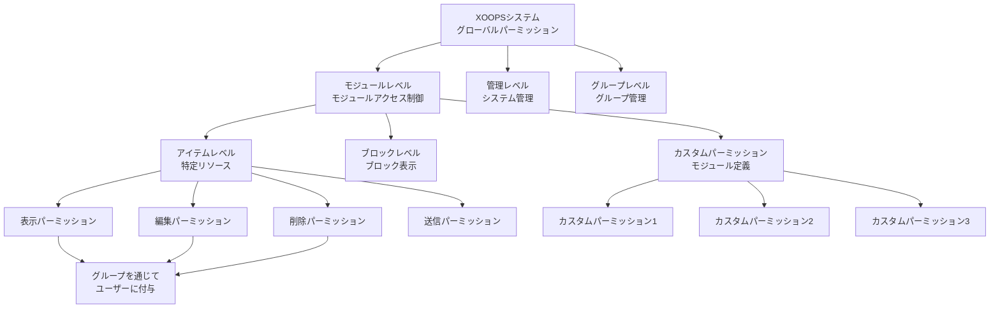
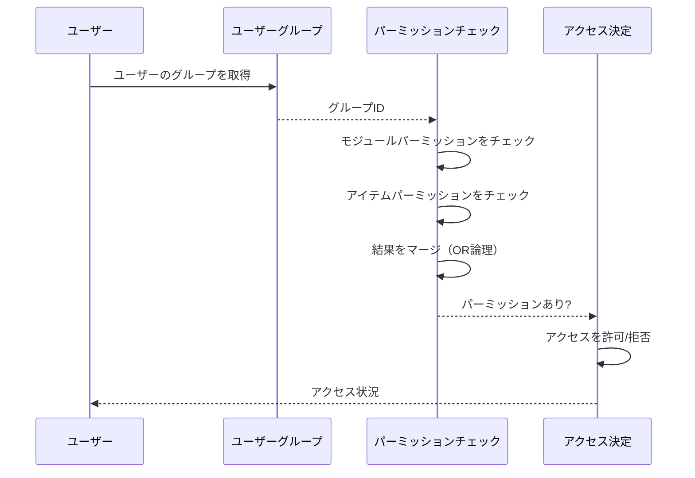

# XOOPSのパーミッションシステム

XOOPSパーミッションシステムは、誰がどのリソースに対してどのアクションを実行できるかを管理する粒度の細かいアクセス制御フレームワークです。このドキュメントはパーミッションタイプ、チェック機構、階層、実装例をカバーしています。

## パーミッションタイプ

### モジュールレベルパーミッション

モジュールレベルパーミッションはモジュール全体またはモジュール機能へのアクセスを制御します。

**一般的なパーミッション名:**
- `module_view` - モジュールコンテンツを表示
- `module_read` - モジュールリソースを読み取り
- `module_submit` - モジュールにコンテンツを送信
- `module_edit` - モジュールコンテンツを編集
- `module_admin` - モジュールを管理

```php
<?php
/**
 * モジュールパーミッション例
 */

$permissionHandler = xoops_getHandler('groupperm');
$userGroups = $xoopsUser->getGroups();
$moduleId = 2; // Article module

// ユーザーがモジュールを表示できるかをチェック
$canView = false;
foreach ($userGroups as $groupId) {
    if ($permissionHandler->checkRight('module_view', $groupId, $moduleId)) {
        $canView = true;
        break;
    }
}

if (!$canView) {
    redirect('index.php?error=no_access');
}
```

### アイテムレベルパーミッション

アイテムレベルパーミッションはモジュール内の特定のリソースへのアクセスを制御します。

**例:**
- アーティクルID: グループは特定のアーティクルを表示/編集できるか?
- カテゴリID: グループはカテゴリにアクセスできるか?
- ページID: グループは特定のページを表示/変更できるか?

```php
<?php
/**
 * アイテムパーミッション例
 */

$permissionHandler = xoops_getHandler('groupperm');
$userGroups = $xoopsUser->getGroups();
$moduleId = 2;      // Article module
$articleId = 42;    // 特定のアーティクル

// ユーザーが特定のアーティクルを編集できるかをチェック
$canEdit = false;
foreach ($userGroups as $groupId) {
    if ($permissionHandler->checkRight(
        'item_edit',
        $groupId,
        $moduleId,
        $articleId
    )) {
        $canEdit = true;
        break;
    }
}
```

### ブロックパーミッション

ブロックパーミッションはページに表示されるブロックの表示とインタラクションを制御します。

```php
<?php
/**
 * ブロックパーミッション例
 */

$permissionHandler = xoops_getHandler('groupperm');
$userGroups = $xoopsUser->getGroups();

// ユーザーがブロックを表示できるかをチェック
$blockId = 5;
$canViewBlock = false;

foreach ($userGroups as $groupId) {
    if ($permissionHandler->checkRight('block_view', $groupId, 1, $blockId)) {
        $canViewBlock = true;
        break;
    }
}
```

### グループパーミッション

グループ管理と管理を制御するパーミッション。

```php
<?php
/**
 * グループ管理パーミッション例
 */

$permissionHandler = xoops_getHandler('groupperm');
$userGroups = $xoopsUser->getGroups();

// ユーザーがグループを管理できるかをチェック
$canManageGroups = false;
foreach ($userGroups as $groupId) {
    if ($permissionHandler->checkRight('group_admin', $groupId, 1)) {
        $canManageGroups = true;
        break;
    }
}
```

## パーミッション階層

### パーミッション構造図



### パーミッション継承チェーン



## パーミッションチェック

### XoopsGroupPermHandler

`XoopsGroupPermHandler`クラスはパーミッションを確認および管理するメソッドを提供します。

```php
<?php
/**
 * XoopsGroupPermHandlerメソッド
 */

class XoopsGroupPermHandler
{
    /**
     * グループがパーミッションを持つかをチェック
     *
     * @param string $gperm_name パーミッション名
     * @param int $gperm_group_id グループID
     * @param int $gperm_modid モジュールID
     * @param int $gperm_itemid アイテムID（オプション）
     * @return bool パーミッション状況
     */
    public function checkRight(
        $gperm_name,
        $gperm_group_id,
        $gperm_modid,
        $gperm_itemid = 0
    ) { }

    /**
     * グループにパーミッションを追加
     *
     * @param string $gperm_name パーミッション名
     * @param int $gperm_group_id グループID
     * @param int $gperm_modid モジュールID
     * @param int $gperm_itemid アイテムID（オプション）
     * @return bool 成功状況
     */
    public function addRight(
        $gperm_name,
        $gperm_group_id,
        $gperm_modid,
        $gperm_itemid = 0
    ) { }

    /**
     * グループからパーミッションを削除
     *
     * @param string $gperm_name パーミッション名
     * @param int $gperm_group_id グループID
     * @param int $gperm_modid モジュールID
     * @param int $gperm_itemid アイテムID（オプション）
     * @return bool 成功状況
     */
    public function deleteRight(
        $gperm_name,
        $gperm_group_id,
        $gperm_modid,
        $gperm_itemid = 0
    ) { }

    /**
     * モジュール内のグループのすべてのパーミッションを取得
     *
     * @param int $groupId グループID
     * @param int $modId モジュールID
     * @return array パーミッションリスト
     */
    public function getGroupPermissions($groupId, $modId) { }

    /**
     * グループのために許可されたアイテムIDを取得
     *
     * @param string $permName パーミッション名
     * @param int $groupId グループID
     * @param int $modId モジュールID
     * @return array アイテムID
     */
    public function getPermittedItemIds(
        $permName,
        $groupId,
        $modId
    ) { }
}
```

## パーミッションチェック実装

### 単一ユーザーパーミッションチェック

```php
<?php
/**
 * パーミッションチェックユーティリティ
 */
class PermissionChecker
{
    private $permissionHandler;
    private $user;

    public function __construct(XoopsUser $user = null)
    {
        $this->permissionHandler = xoops_getHandler('groupperm');
        $this->user = $user ?? $GLOBALS['xoopsUser'] ?? null;
    }

    /**
     * ユーザーがパーミッションを持つかをチェック
     *
     * @param string $permissionName パーミッション名
     * @param int $moduleId モジュールID
     * @param int $itemId アイテムID（オプション）
     * @return bool パーミッション状況
     */
    public function hasPermission(
        string $permissionName,
        int $moduleId,
        int $itemId = 0
    ): bool
    {
        if (!$this->user instanceof XoopsUser) {
            return false;
        }

        $userGroups = $this->user->getGroups();

        foreach ($userGroups as $groupId) {
            if ($this->permissionHandler->checkRight(
                $permissionName,
                $groupId,
                $moduleId,
                $itemId
            )) {
                return true;
            }
        }

        return false;
    }

    /**
     * パーミッションを要求するか、アクセスを拒否
     *
     * @param string $permissionName パーミッション名
     * @param int $moduleId モジュールID
     * @param int $itemId アイテムID（オプション）
     * @throws Exception パーミッションが拒否された場合
     */
    public function requirePermission(
        string $permissionName,
        int $moduleId,
        int $itemId = 0
    ): void
    {
        if (!$this->hasPermission($permissionName, $moduleId, $itemId)) {
            throw new Exception('Permission denied');
        }
    }

    /**
     * 許可されたアイテムIDを取得
     *
     * @param string $permissionName パーミッション名
     * @param int $moduleId モジュールID
     * @return array ユーザーがアクセスできるアイテムID
     */
    public function getPermittedItems(
        string $permissionName,
        int $moduleId
    ): array
    {
        if (!$this->user instanceof XoopsUser) {
            return [];
        }

        $permitted = [];
        $userGroups = $this->user->getGroups();

        foreach ($userGroups as $groupId) {
            $items = $this->permissionHandler->getPermittedItemIds(
                $permissionName,
                $groupId,
                $moduleId
            );
            $permitted = array_merge($permitted, $items);
        }

        return array_unique($permitted);
    }

    /**
     * 複数のパーミッションをチェック（AND論理）
     *
     * @param array $permissions パーミッション名
     * @param int $moduleId モジュールID
     * @param int $itemId アイテムID（オプション）
     * @return bool すべてのパーミッションが付与されているか
     */
    public function hasAllPermissions(
        array $permissions,
        int $moduleId,
        int $itemId = 0
    ): bool
    {
        foreach ($permissions as $perm) {
            if (!$this->hasPermission($perm, $moduleId, $itemId)) {
                return false;
            }
        }
        return true;
    }

    /**
     * 複数のパーミッションをチェック（OR論理）
     *
     * @param array $permissions パーミッション名
     * @param int $moduleId モジュールID
     * @param int $itemId アイテムID（オプション）
     * @return bool いずれかのパーミッションが付与されているか
     */
    public function hasAnyPermission(
        array $permissions,
        int $moduleId,
        int $itemId = 0
    ): bool
    {
        foreach ($permissions as $perm) {
            if ($this->hasPermission($perm, $moduleId, $itemId)) {
                return true;
            }
        }
        return false;
    }
}
```

### パーミッションミドルウェア

```php
<?php
/**
 * リクエストフィルタリング用パーミッションミドルウェア
 */
class PermissionMiddleware
{
    private $permissionChecker;

    public function __construct(PermissionChecker $checker)
    {
        $this->permissionChecker = $checker;
    }

    /**
     * リクエストにパーミッションを強制
     *
     * @param string $permissionName チェックするパーミッション
     * @param int $moduleId モジュールID
     * @param int $itemId アイテムID（オプション）
     * @return void パーミッション拒否時に実行を停止
     */
    public function enforce(
        string $permissionName,
        int $moduleId,
        int $itemId = 0
    ): void
    {
        try {
            $this->permissionChecker->requirePermission(
                $permissionName,
                $moduleId,
                $itemId
            );
        } catch (Exception $e) {
            // パーミッション拒否をログ
            error_log(sprintf(
                'Permission denied: %s (User: %s, Module: %d, Item: %d)',
                $permissionName,
                $GLOBALS['xoopsUser']?->getVar('uname') ?? 'anonymous',
                $moduleId,
                $itemId
            ));

            // エラーレスポンスを送信
            header('HTTP/1.1 403 Forbidden');
            die('Access denied');
        }
    }

    /**
     * アイテムの配列をパーミッションでフィルタリング
     *
     * @param array $items フィルタリングするアイテム
     * @param string $permissionName パーミッション名
     * @param int $moduleId モジュールID
     * @param callable $idExtractor アイテムからIDを抽出するコールバック
     * @return array フィルタリング済みアイテム
     */
    public function filterByPermission(
        array $items,
        string $permissionName,
        int $moduleId,
        callable $idExtractor
    ): array
    {
        return array_filter($items, function($item) use (
            $permissionName,
            $moduleId,
            $idExtractor
        ) {
            $itemId = $idExtractor($item);
            return $this->permissionChecker->hasPermission(
                $permissionName,
                $moduleId,
                $itemId
            );
        });
    }
}
```

## 実装例

### モジュールアクセス制御

```php
<?php
/**
 * モジュールアクセス制御の例
 */

// 現在のモジュールを取得
$moduleId = $GLOBALS['xoopsModule']->getVar('mid');
$moduleDir = $GLOBALS['xoopsModule']->getVar('dirname');

// パーミッションチェッカーを作成
$checker = new PermissionChecker();

// モジュール表示パーミッションをチェック
if (!$checker->hasPermission('module_view', $moduleId)) {
    redirect('index.php?error=access_denied');
}

// ユーザーがアクセスできるアイテムを取得
$permittedItems = $checker->getPermittedItems('item_view', $moduleId);

// クエリをビルドして許可されたアイテムのみを表示
$sql = 'SELECT * FROM articles WHERE id IN (' . implode(',', $permittedItems) . ')';
```

### コンテンツ管理例

```php
<?php
/**
 * パーミッション付きアーティクル管理
 */

class ArticleManager
{
    private $permissionChecker;
    private $moduleId = 2;

    public function __construct(PermissionChecker $checker)
    {
        $this->permissionChecker = $checker;
    }

    /**
     * ユーザーが表示できるアーティクルを取得
     *
     * @return array アーティクルリスト
     */
    public function getViewableArticles(): array
    {
        $this->permissionChecker->requirePermission(
            'module_view',
            $this->moduleId
        );

        $permittedIds = $this->permissionChecker->getPermittedItems(
            'article_view',
            $this->moduleId
        );

        if (empty($permittedIds)) {
            return [];
        }

        $db = XoopsDatabaseFactory::getDatabaseConnection();
        $result = $db->query(
            'SELECT * FROM articles WHERE id IN (' .
            implode(',', $permittedIds) .
            ') AND published = 1'
        );

        $articles = [];
        while ($row = $db->fetchArray($result)) {
            $articles[] = $row;
        }

        return $articles;
    }

    /**
     * パーミッションチェック付きでアーティクルを作成
     *
     * @param array $data アーティクルデータ
     * @return int アーティクルID
     */
    public function createArticle(array $data): int
    {
        $this->permissionChecker->requirePermission(
            'article_create',
            $this->moduleId
        );

        $db = XoopsDatabaseFactory::getDatabaseConnection();
        $db->query(
            'INSERT INTO articles (title, content, author_id, created) VALUES (?, ?, ?, ?)',
            array($data['title'], $data['content'], $_SESSION['xoopsUserId'], time())
        );

        return $db->getInsertId();
    }

    /**
     * パーミッションチェック付きでアーティクルを更新
     *
     * @param int $articleId アーティクルID
     * @param array $data 更新データ
     * @return bool 成功
     */
    public function updateArticle(int $articleId, array $data): bool
    {
        $this->permissionChecker->requirePermission(
            'article_edit',
            $this->moduleId,
            $articleId
        );

        $db = XoopsDatabaseFactory::getDatabaseConnection();
        return (bool)$db->query(
            'UPDATE articles SET title = ?, content = ? WHERE id = ?',
            array($data['title'], $data['content'], $articleId)
        );
    }

    /**
     * パーミッションチェック付きでアーティクルを削除
     *
     * @param int $articleId アーティクルID
     * @return bool 成功
     */
    public function deleteArticle(int $articleId): bool
    {
        $this->permissionChecker->requirePermission(
            'article_delete',
            $this->moduleId,
            $articleId
        );

        $db = XoopsDatabaseFactory::getDatabaseConnection();
        return (bool)$db->query(
            'DELETE FROM articles WHERE id = ?',
            array($articleId)
        );
    }
}
```

### 管理パネルパーミッションチェック

```php
<?php
/**
 * 管理パネルアクセス制御
 */

// ユーザーがウェブマスターであることを確認
if (!in_array(1, $xoopsUser->getGroups())) {
    redirect('index.php');
    exit;
}

$checker = new PermissionChecker();
$moduleId = $GLOBALS['xoopsModule']->getVar('mid');

// 管理パーミッションをチェック
$checker->requirePermission('module_admin', $moduleId);

// 管理コンテンツを読み込み
?>
<h1>管理パネル</h1>
<p>ようこそ、管理者</p>
```

## パーミッションキャッシング

### 最適化されたパーミッションチェック

```php
<?php
/**
 * パフォーマンスのためのキャッシュされたパーミッションチェッカー
 */
class CachedPermissionChecker extends PermissionChecker
{
    private $cache = [];
    private $cachePrefix = 'xoops_perm_';

    /**
     * キャッシング付きでパーミッションをチェック
     *
     * @param string $permissionName パーミッション名
     * @param int $moduleId モジュールID
     * @param int $itemId アイテムID（オプション）
     * @return bool パーミッション状況
     */
    public function hasPermission(
        string $permissionName,
        int $moduleId,
        int $itemId = 0
    ): bool
    {
        $cacheKey = $this->getCacheKey(
            $permissionName,
            $moduleId,
            $itemId
        );

        // メモリキャッシュをチェック
        if (isset($this->cache[$cacheKey])) {
            return $this->cache[$cacheKey];
        }

        // APCuキャッシュをチェック
        $cacheKeyFull = $this->cachePrefix . $cacheKey;
        $cached = apcu_fetch($cacheKeyFull);
        if ($cached !== false) {
            $this->cache[$cacheKey] = $cached;
            return $cached;
        }

        // 実際のパーミッションをチェック
        $result = parent::hasPermission($permissionName, $moduleId, $itemId);

        // 結果をキャッシュ（1時間TTL）
        $this->cache[$cacheKey] = $result;
        apcu_store($cacheKeyFull, $result, 3600);

        return $result;
    }

    /**
     * キャッシュキーを生成
     *
     * @param string $permissionName パーミッション名
     * @param int $moduleId モジュールID
     * @param int $itemId アイテムID
     * @return string キャッシュキー
     */
    private function getCacheKey(
        string $permissionName,
        int $moduleId,
        int $itemId
    ): string
    {
        $uid = $this->user?->getVar('uid') ?? 0;
        return md5("{$uid}_{$permissionName}_{$moduleId}_{$itemId}");
    }

    /**
     * ユーザーのパーミッションキャッシュをクリア
     *
     * @param int $uid ユーザーID
     */
    public static function clearUserCache(int $uid): void
    {
        // 本番環境ではさらに洗練される必要があります
        apcu_clear_cache();
    }
}
```

## セキュリティベストプラクティス

### パーミッション割り当てルール

1. **最小権限の原則**: 必要なパーミッションのみを割り当て
2. **ロールベースアクセス**: ロールベースのパーミッションにグループを使用
3. **定期的な監査**: パーミッションを定期的に確認
4. **職務分離**: 管理者パーミッションをユーザーパーミッションから分離
5. **明示的な拒否**: デフォルト拒否、明示的許可のアプローチ

### パーミッション検証

```php
<?php
/**
 * パーミッション検証ベストプラクティス
 */

// アクション前に常にパーミッションをチェック
$moduleId = 2;
$articleId = 42;

try {
    $checker = new PermissionChecker();

    // 明示的なパーミッションチェック
    if (!$checker->hasPermission('article_edit', $moduleId, $articleId)) {
        throw new Exception('Insufficient permissions');
    }

    // パーミッションが検証された後のみアクションを実行
    updateArticle($articleId);

} catch (Exception $e) {
    // セキュリティイベントをログ
    error_log('Permission denied: ' . $e->getMessage());
    // ユーザーフレンドリーなエラーを表示
    die('You do not have permission to perform this action');
}
```

## 関連リンク

- User Management.md
- Group System.md
- Authentication.md
- ../../Security/Security-Guidelines.md

## タグ

#permissions #access-control #security #authorization #acl #permission-checking
